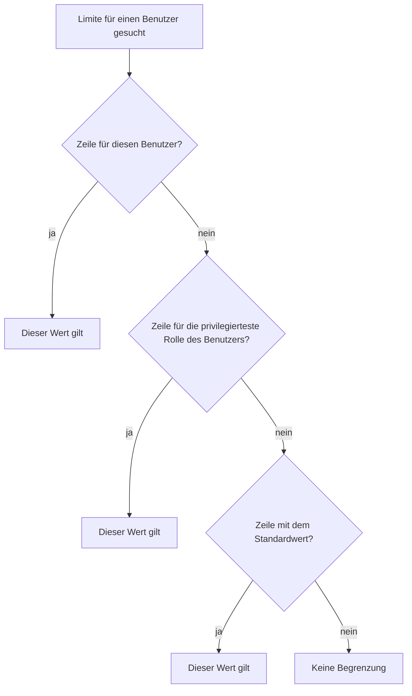

GT begrenzt an vielen Stellen, wie viele Daten entstehen dürfen. Diese Begrenzungen heissen **Limiten**. Eine einzelne Limite bezieht sich dabei immer auf eine [Informationsklasse]({}) — also beispielsweise auf Wertpapier, Watchlist, Konto oder Transaktion —, weshalb die Ansicht zu deren Verwaltung **Limite Informationsklasse** heisst. Sie erreichen sie im Navigationsbereich unter **Administrative Daten** auf dem gleichnamigen statischen Unterelement; das Einsehen und Bearbeiten ist ausschliesslich Benutzern mit den Rechten des Administrators vorbehalten.

Eine Limite beantwortet eine von zwei Fragen: wie viele Einträge einer Informationsklasse insgesamt bestehen dürfen, oder wie viele Operationen ein Benutzer an einem einzelnen Tag darauf ausführen darf. Der Sinn dieser Begrenzungen ist der Schutz vor einer Überflutung mit Daten, insbesondere durch einen Zugriff, der die Benutzeroberfläche umgeht und die Programmierschnittstelle direkt anspricht.

{}
Früher wurden diese Werte in den [globalen Einstellungen]({}) als einzelne Eigenschaften gepflegt. Sie sind dort nicht mehr enthalten, sondern werden vollständig in der hier beschriebenen Ansicht verwaltet. Bestehende Installationen haben ihre bisher eingestellten Werte dabei behalten.
{}

## Die drei Limitenarten
Jede Limite gehört zu genau einer **Limitenart**, und diese bestimmt, was überhaupt gezählt wird.

| Limitenart | Bedeutung |
|---|---|
| **Gesamtanzahl** | Die Höchstzahl an Einträgen, die dauerhaft bestehen dürfen. Gezählt wird immer der aktuelle Bestand, das Löschen von Einträgen schafft also wieder Platz. |
| **Änderungen pro Tag** | Die Höchstzahl an Erstellungs-, Änderungs- und Löschoperationen, die ein Benutzer an einem Kalendertag auf dieser Informationsklasse ausführen darf. |
| **Abfragen pro Tag** | Die Höchstzahl an Abrufen pro Kalendertag. Diese Limitenart wird zur Zeit ausschliesslich für den Abruf historischer Kursdaten verwendet, siehe [Kursdaten]({}). |

Bei einer Limite der Art **Gesamtanzahl** ist zusätzlich anzugeben, aus wessen Sicht gezählt wird. Die Spalte **Gezählt nach** kennt dafür drei Möglichkeiten: **Mandant** zählt nur die Einträge des jeweiligen Klienten, **Ersteller** zählt die Einträge, die ein bestimmter Benutzer angelegt hat, und **Systemweit** zählt alle Einträge unabhängig von deren Herkunft. Handelt es sich um eine Limite auf den Bestandteilen eines übergeordneten Eintrags — etwa auf den Instrumenten einer Watchlist —, so nennt die Spalte **Element** diesen Bestandteil, und die Spalte **Zählbereich** legt fest, ob **Pro einzelnes** übergeordnetes Element gezählt wird oder **Über alle** hinweg. Die beiden Limitenarten für den Tag kennen weder Zählbereich noch eine Angabe zum Zählen und lassen diese Spalten leer.

## Geltungsbereich einer Limite
Für dieselbe Limite können mehrere Zeilen bestehen, die sich in ihrem Geltungsbereich unterscheiden. Eine Zeile ohne **Rolle** und ohne **Benutzer** ist der **Standardwert** und gilt für alle. Eine Zeile mit einer Rolle gilt für alle Benutzer dieser Rolle, eine Zeile mit einem Benutzer nur für diesen einen Benutzer.

Welcher Wert für einen bestimmten Benutzer tatsächlich greift, ermittelt GT in fester Reihenfolge:

Zwei Eigenheiten dieser Reihenfolge sind wichtig. Erstens wird bei den Rollen ausschliesslich die **privilegierteste Rolle** des Benutzers berücksichtigt; die Rangfolge lautet Administrator, Privilegierter Benutzer, Benutzer ohne Limits, Benutzer mit Limits. Eine Zeile für eine niedrigere Rolle, die derselbe Benutzer ebenfalls besitzt, wird nicht herangezogen. Zweitens bedeutet eine fehlende Zeile keine Sperre, sondern **keine Begrenzung** — eine Informationsklasse, für die überhaupt keine Zeile besteht, ist unbeschränkt.

Ist die Spalte **Gültig bis** gesetzt und liegt dieses Datum in der Vergangenheit, so wird die Zeile übersprungen und die Suche mit dem nächsten Schritt fortgesetzt. Abgelaufene Zeilen werden nicht automatisch entfernt; sie bleiben in der Tabelle sichtbar und können vom Administrator gelöscht werden.

## Eigenschaften und Tabellenspalten
- **Entität**: Die Informationsklasse, für welche die Limite gilt, beispielsweise Wertpapier, Watchlist oder Transaktion.
- **Daten**: Ein Symbol, das anzeigt, ob die Informationsklasse **private Daten** eines einzelnen Klienten enthält oder **gemeinsame Daten**, die allen Klienten zur Verfügung stehen. Der zugehörige Text erscheint als Kurzhinweis, wenn Sie mit dem Mauszeiger auf dem Symbol verweilen.
- **Limitenart**: Gesamtanzahl, Änderungen pro Tag oder Abfragen pro Tag.
- **Element**: Der gezählte Bestandteil bei einer Limite auf einem übergeordneten Eintrag, beispielsweise Instrument, Split oder Historische Periode. Bleibt sonst leer.
- **Zählbereich**: Über alle oder Pro einzelnes. Nur bei einer Limite mit Element belegt.
- **Gezählt nach**: Mandant, Ersteller oder Systemweit. Nur bei der Limitenart Gesamtanzahl belegt.
- **Rolle**: Die Benutzerrolle, für welche diese Zeile gilt. Bleibt beim Standardwert und bei einer benutzerbezogenen Zeile leer.
- **Benutzer**: Die Kennung des Benutzers, für den diese Zeile gilt. Bleibt beim Standardwert und bei einer rollenbezogenen Zeile leer.
- **Limite**: Der Wert, der nicht überschritten werden darf.
- **Gültig bis**: Das Datum, bis zu dem diese Zeile angewendet wird. Bleibt das Feld leer, so gilt die Zeile unbefristet.

Die Tabelle vereint alle Limitenarten und wird dadurch lang. Aus diesem Grund ist die **Filterzeile** von Beginn weg eingeblendet und erlaubt es, die Tabelle nach Entität, Limitenart, Zählbereich, Gezählt nach oder Rolle einzugrenzen. Über das Kontextmenü lässt sich die Filterzeile mit **Filterzeile ein-/ausblenden** wieder ausblenden, wobei die eingegebenen Filter dabei zurückgesetzt werden.

## Limite erstellen, bearbeiten und löschen
- **Erstellen Limite Informationsklasse** über das Kontextmenü.
- **Bearbeiten Limite Informationsklasse** über das Kontextmenü bei selektierter Zeile.
- **Löschen Limite Informationsklasse** über das Kontextmenü bei selektierter Zeile.

Im Dialog wird die Limite über ein einziges Auswahlfeld bestimmt. Die angebotenen Einträge nennen die Informationsklasse und — sofern vorhanden — das Element, gefolgt von Limitenart, Zählbereich und der Angabe zum Zählen in Klammern. Diese Auswahl ist notwendig, weil einzelne Informationsklassen mehrere Limiten tragen: die Instrumente einer Watchlist sind einmal **Pro einzelnes** und einmal **Über alle** begrenzt, und beide Limiten betreffen dieselbe Informationsklasse.

Aus der getroffenen Auswahl ergeben sich die Felder **Limitenart** und **Bereich**. Diese werden lediglich angezeigt und können nicht bearbeitet werden. Beim Erstellen einer neuen Limite wird zudem der vorgesehene Standardwert als Vorschlag in das Feld **Limite** übernommen. Bearbeitbar sind:

- **Rolle**: Die Benutzerrolle, für welche die Limite gelten soll. Bleibt das Feld leer und wurde der Dialog nicht aus der Benutzerverwaltung geöffnet, so entsteht der Standardwert für alle. Eine Limite gilt entweder für eine Rolle oder für einen einzelnen Benutzer, niemals für beides zugleich.
- **Limite**: Der Höchstwert. Zulässig sind Werte von 1 bis 1'000'000; für einzelne Limiten gilt zusätzlich eine engere Einschränkung, beispielsweise 2 bis 24 bei den Instrumenten pro Korrelationsset. Diese engeren Regeln folgen derselben Syntax wie die [Eingaberegeln der globalen Einstellungen]({}).
- **Gültig bis**: Das Datum, bis zu dem die Limite angewendet wird. Bleibt das Feld leer, so ist die Limite unbefristet.

Die einmal gewählte Limite kann nachträglich nicht mehr geändert werden, denn sie identifiziert die Zeile; das Auswahlfeld ist beim Bearbeiten deshalb gesperrt. Ebenso wird pro Limite und Geltungsbereich nur eine einzige Zeile geführt, weshalb die Auswahl bereits vergebene Einträge nicht mehr anbietet.

{}
Der **Standardwert** einer fest vorgesehenen Limite der Art Gesamtanzahl lässt sich nicht löschen, sondern nur ändern. Ohne ihn wäre die betreffende Limite unbeschränkt, und genau das soll nicht unbeabsichtigt geschehen. Bei diesen Zeilen wird das Löschen im Kontextmenü nicht angeboten. Zeilen für eine Rolle oder einen Benutzer sowie sämtliche Zeilen der beiden Tagesarten lassen sich uneingeschränkt löschen.
{}

## Welche Limiten sind vorgegeben
Die folgenden Werte gelten für eine neu aufgesetzte Installation. Wurde ein Wert in einer bestehenden Installation je verändert, so blieb dieser veränderte Wert erhalten.

### Gesamtanzahl pro Klient
Transaktion 5000, Konto 30, Portfolio 20, Depot 20, Watchlist 30, Korrelationsset 10, Dauerauftrag 50 und Simulationsumgebung 5.

### Gesamtanzahl innerhalb eines übergeordneten Eintrags
Instrumente pro Watchlist 200 und Instrumente über alle Watchlisten eines Klienten 2000, Instrumente pro Korrelationsset 20, Splits pro Instrument 20 sowie historische Perioden pro Instrument 20. Die beiden letzten werden systemweit gezählt, weil ein Instrument gemeinsame Daten sind.

### Gesamtanzahl pro Ersteller
Diese Limiten auf gemeinsamen Daten sind neu; solche Daten waren bisher nur pro Tag begrenzt und konnten dadurch über die Zeit unbeschränkt anwachsen. Wertpapier 2000, Währungspaar 500, Anlageklasse 200, Handelsplatz 100 und GTNet-Instrumentenimport 20000. Der Import über [GTNet]({}) wird bewusst getrennt gezählt, damit der Abgleich mit anderen GT-Instanzen das Kontingent für manuell erfasste Wertpapiere nicht aufbraucht.

{}
Wird ein Benutzer gelöscht und werden dessen gemeinsame Daten einem anderen Benutzer übertragen, siehe [Besitzer von Entitäten wechseln]({}), so zählen diese Einträge fortan beim neuen Besitzer. Das ist beabsichtigt: die Limite begrenzt, wer für die Einträge verantwortlich ist, und nicht, wer sie ursprünglich erfasst hat.
{}

### Änderungen pro Tag
Diese Limiten sind ausschliesslich für die Rolle **Benutzer mit Limits** vorgegeben. Anlageklasse 10, Handelsplatz 10, Wertpapier 50, Währungspaar 15, Historische Kursdaten 15, Historische Altkursdaten 15, Importvorlage 10, Importplattform 3, Handelsplattform-Plan 3, Handelskalender-Regelsatz 4, Benutzerdefiniertes Feld für Wertpapiere 20, GTNet-Instrumentenimport 150, Generischer Konnektor 10, Zuordnung risikofreier Zinssatz 2, Nachricht 200, Weiterleitung von Nachrichten 12, Allgemeines benutzerdefiniertes Feld 20 und Änderungsantrag 10.

### Abfragen pro Tag
Abruf historischer Kursdaten 250 Instrumente, ebenfalls für die Rolle **Benutzer mit Limits**.

Die Auswahl im Dialog reicht bewusst weiter als diese Aufzählung: für **Änderungen pro Tag** werden praktisch alle Informationsklassen angeboten, auch solche ohne vorgegebenen Wert. Diese sind unbeschränkt, bis der Administrator eine Zeile dafür anlegt.

## Was passiert beim Überschreiten
Wird eine Limite der Art **Gesamtanzahl** erreicht, so lässt sich kein weiterer Eintrag erstellen, bis bestehende Einträge gelöscht werden oder der Administrator den Wert erhöht. Beim Import von Transaktionen wird dies bereits vor dem ersten Schreibvorgang geprüft: würde der Import die Limite des Klienten überschreiten, so wird er vollständig abgewiesen und es wird keine einzige Transaktion übernommen. Die Meldung nennt dabei die Limite, den bestehenden Bestand und die Anzahl der hinzukommenden Transaktionen.

Wird eine Limite der Art **Änderungen pro Tag** erreicht, so erhält der Benutzer einen entsprechenden Hinweis und kann eine Erhöhung beantragen. Der Ablauf dieses Antrags ist unter [Benutzer Einstellungen]({}) beschrieben. Das Erreichen dieser Limite ist gewöhnliche Nutzung und wird dem Benutzer nicht als Verstoss angerechnet.

Anders verhält es sich beim Erreichen der Limite **Abfragen pro Tag**: hier wird zusätzlich der Zähler **Verstoss Anfragelimit** des Benutzers erhöht. Überschreitet dieser Zähler den in den globalen Einstellungen hinterlegten Schwellenwert, so wird der Benutzer gesperrt und muss vom Administrator wieder freigegeben werden.

{}
Die Prüfung einer Limite und das Schreiben des neuen Eintrags erfolgen nicht in einem Zug. Treffen mehrere Anfragen desselben Benutzers gleichzeitig ein, so kann eine Limite deshalb um die Anzahl der gleichzeitigen Anfragen überschritten werden; die nächste Anfrage wird dann abgewiesen. Limiten sind als Schutz vor einer Überflutung gedacht und nicht als exakte Buchführung.
{}
