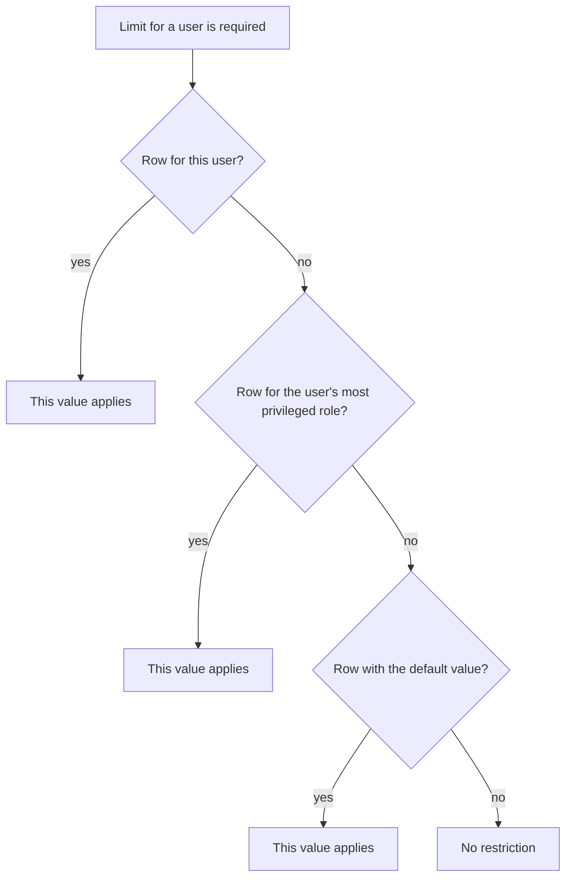

In many places GT restricts how much data may be created. These restrictions are called **limits**. A single limit always refers to an [information class]({}) — for example to security, watchlist, account or transaction — which is why the view for maintaining them is called **Limit information class**. You reach it in the navigation area under **Administrative data** on the sub-element of the same name; viewing and editing it is reserved exclusively for users with administrator rights.

A limit answers one of two questions: how many entries of an information class may exist in total, or how many operations a user may perform on it on a single day. The purpose of these restrictions is protection against a flood of data, in particular through access that bypasses the user interface and addresses the programming interface directly.

{}
These values used to be maintained as individual properties in the [global settings]({}). They are no longer contained there but are managed entirely in the view described here. Existing installations kept the values they had configured.
{}

## The three limit types
Every limit belongs to exactly one **limit type**, and that type determines what is counted at all.

| Limit type | Meaning |
|---|---|
| **Total number** | The maximum number of entries that may exist permanently. The current stock is always counted, so deleting entries frees up space again. |
| **Changes per day** | The maximum number of create, change and delete operations a user may perform on this information class on one calendar day. |
| **Retrievals per day** | The maximum number of retrievals per calendar day. This limit type is currently used exclusively for retrieving historical price data, see [Price data]({}). |

A limit of the type **Total number** additionally states from whose perspective the counting happens. The column **Counted by** offers three possibilities for this: **Client** counts only the entries of the respective client, **Creator** counts the entries a particular user has created, and **System-wide** counts all entries regardless of their origin. If the limit applies to the constituents of a superordinate entry — for instance to the instruments of a watchlist — then the column **Element** names that constituent, and the column **Counting scope** determines whether counting happens **Per single** superordinate element or **Over all** of them. The two daily limit types have neither a counting scope nor a statement about counting and leave those columns empty.

## Scope of a limit
Several rows may exist for the same limit, differing in their scope. A row without a **Role** and without a **User** is the **default value** and applies to everyone. A row with a role applies to all users of that role, a row with a user only to that single user.

GT determines which value actually applies to a particular user in a fixed order:

Two peculiarities of this order are important. Firstly, only the **most privileged role** of the user is taken into account; the ranking is administrator, privileged user, user without limits, user with limits. A row for a lower role that the same user also holds is not consulted. Secondly, a missing row does not mean a block but **no restriction** — an information class for which no row exists at all is unrestricted.

If the column **Valid until** is set and that date lies in the past, the row is skipped and the search continues with the next step. Expired rows are not removed automatically; they remain visible in the table and can be deleted by the administrator.

## Properties and table columns
- **Entity**: The information class the limit applies to, for example security, watchlist or transaction.
- **Data**: A symbol indicating whether the information class holds **private data** of a single client or **shared data** available to all clients. The corresponding text appears as a tooltip when you rest the mouse pointer on the symbol.
- **Limit type**: Total number, Changes per day or Retrievals per day.
- **Element**: The counted constituent of a limit on a superordinate entry, for example instrument, split or historical period. Otherwise empty.
- **Counting scope**: Over all or Per single. Only filled for a limit with an element.
- **Counted by**: Client, Creator or System-wide. Only filled for the limit type Total number.
- **Role**: The user role this row applies to. Remains empty for the default value and for a user-related row.
- **User**: The identifier of the user this row applies to. Remains empty for the default value and for a role-related row.
- **Limit**: The value that must not be exceeded.
- **Valid until**: The date up to which this row is applied. If the field is left empty, the row applies indefinitely.

The table combines all limit types and therefore becomes long. For that reason the **filter row** is shown from the outset and allows the table to be narrowed down by entity, limit type, counting scope, counted by or role. The context menu entry **Turn on/off filter row** hides the filter row again, whereby the entered filters are reset.

## Creating, editing and deleting a limit
- **Create Limit information class** via the context menu.
- **Edit Limit information class** via the context menu with a row selected.
- **Delete Limit information class** via the context menu with a row selected.

In the dialog the limit is determined through a single selection field. The offered entries name the information class and — where present — the element, followed by limit type, counting scope and the statement about counting in brackets. This selection is necessary because individual information classes carry several limits: the instruments of a watchlist are restricted once **Per single** and once **Over all**, and both limits concern the same information class.

The fields **Limit type** and **Scope** result from the selection made. They are merely displayed and cannot be edited. When a new limit is created, the intended default value is also proposed in the field **Limit**. Editable are:

- **Role**: The user role the limit shall apply to. If the field is left empty and the dialog was not opened from the user administration, the default value for everyone is created. A limit applies either to a role or to a single user, never to both at once.
- **Limit**: The maximum value. Values from 1 to 1'000'000 are permitted; for individual limits a narrower restriction applies in addition, for example 2 to 24 for the instruments per correlation set. These narrower rules follow the same syntax as the [input rules of the global settings]({}).
- **Valid until**: The date up to which the limit is applied. If the field is left empty, the limit is indefinite.

Once chosen, the limit can no longer be changed afterwards because it identifies the row; the selection field is therefore locked when editing. Likewise only a single row is kept per limit and scope, which is why the selection no longer offers entries that have already been assigned.

{}
The **default value** of a permanently intended limit of the type Total number cannot be deleted, only changed. Without it the limit in question would be unrestricted, and precisely that shall not happen unintentionally. For these rows deletion is not offered in the context menu. Rows for a role or a user, as well as all rows of the two daily types, can be deleted without restriction.
{}

## Which limits are predefined
The following values apply to a newly set up installation. If a value was ever changed in an existing installation, that changed value has been retained.

### Total number per client
Transaction 5000, account 30, portfolio 20, securities account 20, watchlist 30, correlation set 10, standing order 50 and simulation environment 5.

### Total number within a superordinate entry
Instruments per watchlist 200 and instruments over all watchlists of a client 2000, instruments per correlation set 20, splits per instrument 20 as well as historical periods per instrument 20. The last two are counted system-wide, because an instrument is shared data.

### Total number per creator
These limits on shared data are new; such data was previously restricted per day only and could therefore grow without bound over time. Security 2000, currency pair 500, asset class 200, trading place 100 and GTNet instrument import 20000. The import via [GTNet]({}) is deliberately counted separately, so that the synchronisation with other GT instances does not consume the budget for manually recorded securities.

{}
If a user is deleted and their shared data is transferred to another user, see [Change owner of entities]({}), those entries count towards the new owner from then on. This is intended: the limit restricts who is answerable for the entries, not who originally recorded them.
{}

### Changes per day
These limits are predefined exclusively for the role **User with limits**. Asset class 10, trading place 10, security 50, currency pair 15, historical price data 15, historical legacy price data 15, import template 10, import platform 3, trading platform plan 3, trading calendar rule set 4, user-defined field for securities 20, GTNet instrument import 150, generic connector 10, risk-free rate assignment 2, message 200, message forwarding 12, general user-defined field 20 and change request 10.

### Retrievals per day
Retrieval of historical price data 250 instruments, likewise for the role **User with limits**.

The selection in the dialog deliberately reaches further than this enumeration: for **Changes per day** practically all information classes are offered, including those without a predefined value. These are unrestricted until the administrator creates a row for them.

## What happens when a limit is exceeded
When a limit of the type **Total number** is reached, no further entry can be created until existing entries are deleted or the administrator raises the value. During a transaction import this is checked before the first write operation: if the import would exceed the client's limit, it is rejected as a whole and not a single transaction is taken over. The message names the limit, the existing stock and the number of transactions to be added.

When a limit of the type **Changes per day** is reached, the user receives a corresponding notice and can apply for an increase. The course of that application is described under [User settings]({}). Reaching this limit is ordinary usage and is not counted against the user as a violation.

The situation is different when the limit **Retrievals per day** is reached: here the user's counter **Violation of request limit** is increased in addition. If that counter exceeds the threshold stored in the global settings, the user is blocked and must be released again by the administrator.

{}
Checking a limit and writing the new entry do not happen in one go. If several requests from the same user arrive simultaneously, a limit can therefore be exceeded by the number of simultaneous requests; the next request is then rejected. Limits are meant as protection against a flood of data and not as exact bookkeeping.
{}
