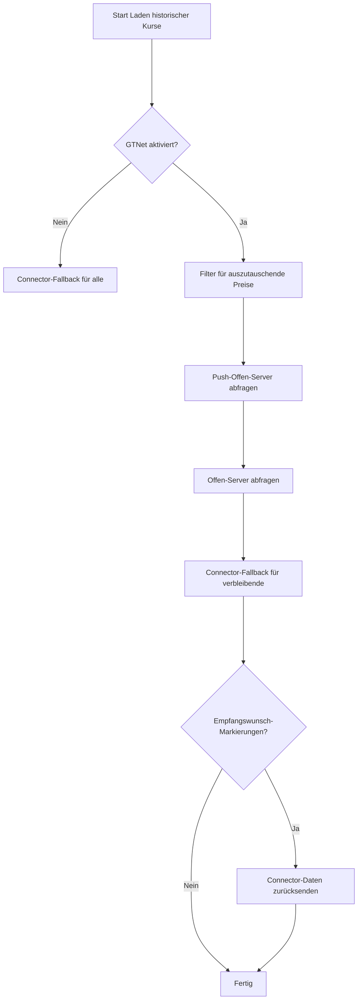

{}
Die Implementierung von GTNet ist noch nicht vollständig abgeschlossen. Diese Dokumentation beschreibt die geplante und teilweise bereits umgesetzte Funktionalität.
{}
Der Austausch von historischen Kursdaten ermöglicht es, Schlusskurse der Vergangenheit mit anderen GTNet-Instanzen zu teilen und zu empfangen. Dieser Austausch ist in den regulären Prozess zum Laden historischer Kurse integriert und funktioniert automatisch für Instrumente, bei denen das Flag **gtNetHistoricalRecv** aktiviert ist.

### GTNet für historische Kurse aktivieren
Um historische Kurse über GTNet für ein bestimmtes Wertpapier oder Währungspaar zu empfangen, muss das Flag **gtNetHistoricalRecv** für dieses Instrument aktiviert sein. Dies kann in den Instrumenteinstellungen konfiguriert werden.

### Anfrage-Struktur
Bei der Anfrage von historischen Kursen werden folgende Informationen übermittelt:
- **Instrumentidentifikation**: ISIN + Währung (Wertpapiere) oder Währungspaar
- **Datumsbereich**: Von-Datum (der letzte lokal vorhandene Kurs + 1 Tag) bis Bis-Datum

### Integration in das reguläre Historyquote-Laden
Der GTNet-Austausch historischer Kurse ist nahtlos in den regulären `catchAllUpSecuritycurrencyHistoryquote`-Workflow integriert:

### Detaillierter Ablauf

#### Schritt 1: Filter für auszutauschende Preise
Nur Instrumente mit aktiviertem **gtNetHistoricalRecv**-Flag sind Kandidaten für den GTNet-Austausch. Andere Instrumente springen direkt zum Connector-basierten Laden.

#### Schritt 2: Push-Offen-Server abfragen
Push-Offen-Server werden zuerst abgefragt. Sie werden nach Priorität sortiert, wobei Server mit gleicher Priorität zufällig ausgewählt werden. Alle GTNet-aktivierten Instrumente werden an diese Server gesendet:
- Die Anfrage enthält die komplette Instrumentliste mit gewünschtem Datumsbereich.
- Die Antwort enthält OHLCV-Daten (Eröffnung, Hoch, Tief, Schluss, Volumen) für jeden verfügbaren Tag.
- Instrumente, die Daten erhalten, werden als «gefüllt» markiert.
- Push-Offen-Server können sowohl lokale Daten als auch Daten aus dem GTNet-Pool liefern.

#### Schritt 3: Offen-Server abfragen
Für noch nicht gefüllte Instrumente werden anschliessend die Offen-Server abgefragt. Diese werden nach einem Score sortiert, der sich aus Abdeckung (Coverage) und Erfolgsrate berechnet. Bei gleichem Score wird nach Priorität und dann zufällig sortiert. Offen-Server:
- Liefern nur lokale Daten (keine Daten aus dem GTNet-Pool).
- Können «Empfangswunsch»-Markierungen zurücksenden, wenn sie keine Daten haben, aber welche empfangen möchten.
- Die Anfrage wird gefiltert: Es werden nur Instrumente gesendet, die der jeweilige Server unterstützt.

#### Schritt 4: Connector-Fallback
Instrumente, die nicht über GTNet gefüllt wurden, fallen auf das reguläre Connector-basierte Laden zurück (Yahoo, Finnhub, etc.). Dies umfasst:
- Instrumente ohne aktiviertes `gtNetHistoricalRecv`
- Instrumente, die von keinem GTNet-Server gefüllt wurden

#### Schritt 5: Connector-Daten zurücksenden
Nachdem die Connectors Daten geladen haben, werden diese Daten an GTNet-Server zurückgesendet, die «Empfangswunsch» für diese Instrumente signalisiert haben.

### Datenspeicherung
Die Speicherung der empfangenen historischen Kurse hängt davon ab, ob das Instrument lokal existiert:

| Instrumenttyp | Speicherort |
|---------------|-------------|
| Lokales Instrument (existiert in der eigenen Datenbank) | Historische Kurse |
| Fremdes Instrument (nur im GTNet-Pool) | GTNet historische Kurse |


flowchart LR
    A[Empfangene Kurse] --> B{Instrument lokal?}
    B -->|Ja| C[Historische Kurse]
    B -->|Nein| D[GTNet historische Kurse]


### Der «Empfangswunsch»-Mechanismus
Ein besonderes Merkmal des historischen Kursdatenaustauschs ist der bidirektionale Datenaustausch über den «Empfangswunsch»-Mechanismus. Dieser Mechanismus wird ausschliesslich von Offen-Servern verwendet, nicht von Push-Offen-Servern.

#### Funktionsweise
Wenn ein Offen-Server keine Daten für ein angefragtes Instrument bereitstellen kann, aber selbst Daten für dieses Instrument empfangen möchte (weil das Flag **gtNetHistoricalRecv** für das Instrument aktiviert ist), sendet er eine «Empfangswunsch»-Markierung zurück:
- Die Markierung enthält das Datum, ab dem Daten gewünscht werden.
- Der anfragende Server prüft, ob er lokale Daten für dieses Instrument hat (einschliesslich über Connectors geladener Daten).
- Falls ja, sendet er diese Daten proaktiv an den interessierten Server.


sequenceDiagram
    autonumber
    participant A as Anfragender Server
    participant P as Push-Offen-Server
    participant B as Offen-Server
    participant C as Connector

    A->>P: Anfrage: Historische Kurse für Instrument X, Y, Z
    Note over P: Hat Daten für X und Y
    P-->>A: Antwort: Kurse für X und Y
    Note over A: X und Y gefüllt, Z noch offen
    A->>B: Anfrage: Historische Kurse für Instrument Z
    Note over B: Hat keine Daten, möchte aber empfangen
    B-->>A: Antwort: Empfangswunsch ab Datum D
    Note over A: Z noch nicht gefüllt
    A->>C: Fallback: Vom Connector abrufen
    C-->>A: Historische Kurse für Z
    Note over A: Speichert Daten lokal
    A->>B: Push: Historische Kurse ab Datum D
    Note over B: Speichert empfangene Daten


#### Vorteile des Mechanismus
- **Bidirektionaler Austausch**: Beide Server profitieren vom Datenaustausch.
- **Connector-Daten teilen**: Über Connectors abgerufene Daten können mit der GTNet-Gemeinschaft geteilt werden.
- **Automatische Ergänzung**: Server können automatisch Datenlücken schliessen.
- **Effizienz**: Der Datenaustausch erfolgt gezielt für benötigte Zeiträume.

### Unterschiede zum Intraday-Austausch

| Aspekt | Historische Kurse | Intraday-Preise |
|--------|-------------------|-----------------|
| Integration | Teil des regulären Historyquote-Ladens | Teil der Watchlist-Aktualisierung |
| Aktivierungs-Flag | gtNetHistoricalRecv | gtNetLastpriceRecv |
| Datenumfang | OHLCV für jeden Tag | Aktueller Preis mit Zeitstempel |
| Speicherung (fremd) | gt_net_historyquote | gt_net_lastprice |
| Empfangswunsch | Ja | Nein |
| Connector-Daten Push-Back | Ja | Nein |
| Rückwirkende Daten | Ja | Nein |

### Datenqualität
Beim Speichern empfangener Daten werden Duplikate vermieden:
- Vor dem Speichern wird geprüft, ob für das Datum bereits ein Eintrag existiert.
- Nur neue Datensätze werden gespeichert.
- Bereits vorhandene Daten werden nicht überschrieben.

{}
Der historische Kursdatenaustausch ergänzt den Intraday-Austausch. Während der Intraday-Austausch für aktuelle Preise optimiert ist, ermöglicht der historische Austausch das Auffüllen von Datenlücken in der Vergangenheit - sowohl von GTNet-Servern als auch durch das Teilen von Connector-geladenen Daten mit anderen Instanzen.
{}
