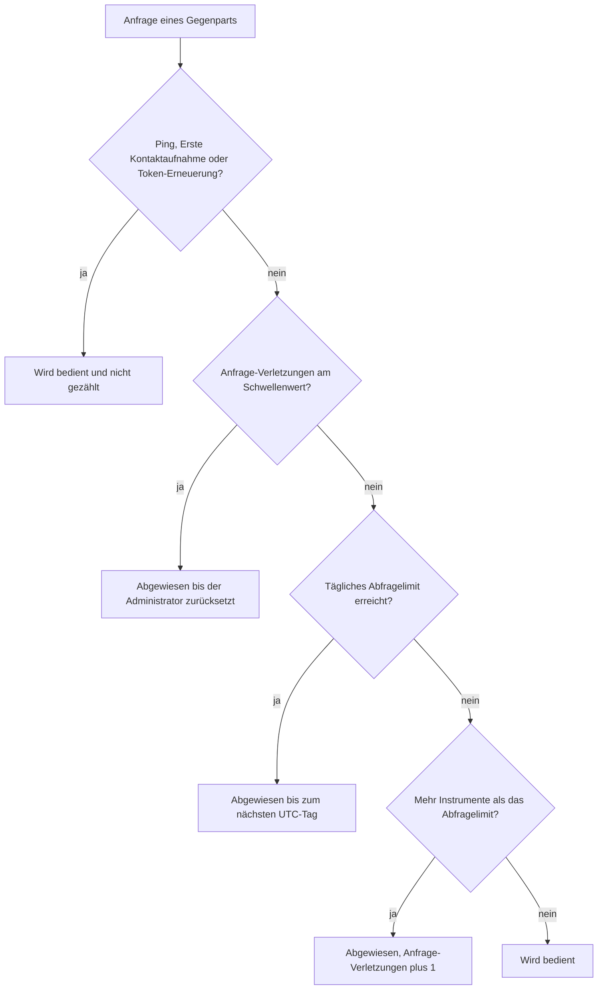

{}
Die Implementierung von GTNet ist noch nicht vollständig abgeschlossen. Diese Dokumentation beschreibt die geplante und teilweise bereits umgesetzte Funktionalität.
{}
Damit eine GT-Instanz nicht durch fremde Anfragen überlastet wird, begrenzt GTNet den Datenaustausch an zwei Stellen. Die beiden Begrenzungen tragen in der Benutzeroberfläche fast denselben Namen, zählen aber vollständig Verschiedenes und haben beim Erreichen auch völlig unterschiedliche Folgen. Diese Seite erklärt beide und hält sie auseinander.

## Die beiden Abfragelimits
Das **Tägliche Abfragelimit** begrenzt, *wie oft* ein einzelner Gegenpart Sie an einem Tag ansprechen darf. Das **Abfragelimit** begrenzt, *wie viel* er in einer einzelnen Anfrage verlangen darf, gemessen in der Anzahl Instrumente. Ein Gegenpart kann also das eine einhalten und das andere verletzen.

| | Tägliches Abfragelimit | Abfragelimit |
|---|---|---|
| Wo eingestellt | Beim eigenen Eintrag, ein Wert für alle Gegenparts | Je Austauschart, bei jedem Eintrag |
| Gezählt wird | Anfragen pro Gegenpart und UTC-Tag | Instrumente in einer einzelnen Anfrage |
| Leeres Feld bedeutet | Unbegrenzt | — (Vorgabe 300) |
| Beim Erreichen | Abweisung bis zum nächsten UTC-Tag | Nur diese eine Anfrage wird abgewiesen |
| Meldung an den Gegenpart | «Tägliches Anfragelimit für diesen Server erreicht» | «Anfrage überschreitet maximales Instrumentenlimit» beziehungsweise «Anfrage überschreitet maximales Limit für historische Daten» |
| Gilt als Verletzung | Nein | Ja, der Zähler **Anfrage-Verletzungen** wird erhöht |
| Aufgehoben durch | Den nächsten UTC-Tag, von selbst | Den Administrator, der **Anfrage-Verletzungen** zurücksetzt |

Beide Werte werden den Gegenparts mitgeteilt, sobald sich etwas daran ändert. Ein Gegenpart weiss also, womit er rechnen darf, und richtet seine eigenen Anfragen danach aus.

## Das tägliche Abfragelimit
Das **Tägliche Abfragelimit** stellen Sie beim Eintrag Ihres eigenen Servers in der Ansicht [GTNet und Nachrichten](../setup/) ein. Es gilt **pro Gegenpart und nicht gemeinsam**: Bei einem Wert von 1000 darf jede verbundene Instanz eintausend Anfragen pro Tag stellen, zehn Instanzen zusammen also zehntausend. Bleibt das Feld leer, so ist die Anzahl Anfragen unbegrenzt.

Gezählt werden ausschliesslich Anfragen, die eine Antwort erwarten, also der Abruf von Kursdaten, die Abfrage der Serverliste und die Anfrage für einen Datenaustausch. Nicht gezählt werden die Antworten auf Ihre eigenen Anfragen sowie einseitige Ankündigungen wie «Server ist jetzt offline», «Einstellungen aktualisiert» oder die Ankündigung eines Wartungsfensters.

{}
Drei Nachrichten sind immer kostenlos und werden nie abgewiesen: die Statusprüfung mit «Ping», die «Erste Kontaktaufnahme» und die «Token-Erneuerung». Damit kann sich ein Gegenpart niemals so weit verausgaben, dass er Sie für eine Statusabfrage oder für die Erneuerung eines abgelaufenen Tokens nicht mehr erreicht.
{}

Der Tag ist dabei ein **UTC-Tag** und nicht der Kalendertag Ihrer Zeitzone. In Mitteleuropa beginnt das neue Kontingent daher um ein oder zwei Uhr morgens Ortszeit.

Für den Wechsel auf den neuen Tag gibt es bewusst keine nächtliche Hintergrundaufgabe. Zu jedem Zähler ist vermerkt, zu welchem Tag er gehört; die erste gezählte Anfrage eines neuen UTC-Tages setzt ihn deshalb von selbst zurück. Eine Instanz, die über Mitternacht ausgeschaltet war, beginnt den neuen Tag somit trotzdem mit dem vollen Kontingent.

## Was beim Erreichen geschieht
Ist das Kontingent aufgebraucht, so erhält der Gegenpart die Meldung «Tägliches Anfragelimit für diesen Server erreicht». Seine Anfrage wird dabei **gar nicht erst bearbeitet**: Es wird keine [automatische Antwortregel](../autoanswer/) ausgewertet, und es bleibt auch nichts zur manuellen Genehmigung für den Administrator stehen. Mit dem nächsten UTC-Tag wird der Gegenpart wieder bedient, ohne dass jemand eingreifen muss.

Das Erreichen des täglichen Abfragelimits ist **kein Fehlverhalten**. Der Zähler **Anfrage-Verletzungen** wird dadurch nicht erhöht, und der Gegenpart bleibt über den Tag hinaus uneingeschränkt zugelassen.

{}
Die Meldung an den Gegenpart spricht von «Anfragelimit», während das Feld in der Server-Übersicht **Tägliches Abfragelimit** heisst. Gemeint ist dasselbe.
{}

Anders als bei den [Limiten der Informationsklassen](../../entitylimit/) kann dieses Kontingent nicht überschritten werden, wenn mehrere Anfragen gleichzeitig eintreffen. Das Zählen und der Entscheid, ob bedient wird, erfolgen in einem einzigen Schritt.

## Die eigene Instanz bremst sich zuerst
Das tägliche Abfragelimit wirkt in beide Richtungen. GT zählt auch, wie viele Anfragen es selbst an jeden Gegenpart gerichtet hat, und vergleicht diese Zahl mit dem Limit, das der Gegenpart veröffentlicht hat. Ist dessen Kontingent aufgebraucht, so wird an diesen Server nichts mehr gesendet; der Austausch überspringt ihn stillschweigend und fährt mit den übrigen Servern fort.

Deshalb bekommen Sie die Abweisung eines Gegenparts im Normalbetrieb kaum je zu sehen: Ihre Instanz hört von selbst auf zu fragen, bevor die Gegenseite ablehnen muss. Die Meldung erscheint vor allem dann, wenn ein Gegenpart sein Limit kürzlich gesenkt hat und Ihre Instanz den neuen Wert noch nicht kennt.

## Das Abfragelimit pro Anfrage
Jede Austauschart besitzt ein **Abfragelimit**, die grösste Anzahl Instrumente, die ein Gegenpart in einer einzelnen Anfrage verlangen darf. Eine Anfrage darüber wird nicht bedient: Der Gegenpart erhält die entsprechende Meldung über die Überschreitung des Maximallimits, und die Übertretung wird pro Gegenpart in dessen Verbindungskonfiguration im Zähler **Anfrage-Verletzungen** festgehalten.

Erreicht dieser Zähler den globalen Parameter `g.max.limit.request.exceeded.count` (Vorgabe 20), wird der Gegenpart grundsätzlich abgewiesen — auch eine Anfrage, die klar innerhalb des Limits läge, wird mit derselben Meldung beantwortet. Das ist beabsichtigt: Ein Gegenpart, der das veröffentlichte Limit dauerhaft missachtet, wird abgeschaltet und nicht gedrosselt.

Die Abweisung bleibt bestehen, bis ein Administrator sie aufhebt. Öffnen Sie dazu im Kontextmenü des Gegenparts in der Server-Übersicht die **Verbindungskonfiguration** und setzen Sie **Anfrage-Verletzungen** wieder auf 0; ab der nächsten Anfrage wird der Gegenpart wieder bedient. Der Zähler bleibt bei 99 stehen, ein dauerhafter Übertreter kann ihn also nicht überlaufen lassen.

## Reihenfolge der Prüfungen
Für eine eingehende Anfrage werden die Prüfungen in fester Reihenfolge vorgenommen:

## Was der Administrator sieht
Der laufende Verbrauch wird in der Benutzeroberfläche **nicht angezeigt**. Es gibt weder eine Spalte noch ein Feld, das die Anzahl der heute eingegangenen oder gesendeten Anfragen ausweist; sichtbar sind nur die eingestellten Limiten selbst.

Beobachten lässt sich das Erreichen eines Limits an zwei Stellen. In der Nachrichtenliste des betreffenden Gegenparts erscheint die versendete Abweisung, womit Sie erkennen, welcher Gegenpart wann angestanden ist. Und im [Austauschprotokoll](../exchangelog/) zeigt sich die andere Richtung: Ein Server, dessen Kontingent aufgebraucht ist, taucht in den Austauschläufen dieses Tages nicht mehr auf.

Fällt Ihnen auf, dass ein Gegenpart regelmässig an das tägliche Abfragelimit stösst, so erhöhen Sie den Wert beim Eintrag Ihres eigenen Servers. Die Änderung wird allen Gegenparts unmittelbar mitgeteilt und wirkt sofort.
