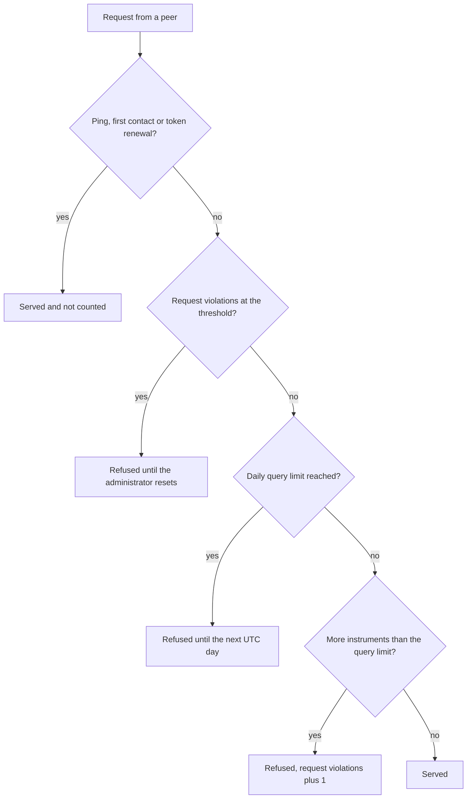

{}
The implementation of GTNet is not yet complete. This documentation describes the planned and partially implemented functionality.
{}
So that a GT instance is not overwhelmed by requests from others, GTNet limits the data exchange in two places. In the user interface the two limits carry almost the same name, yet they count entirely different things and reaching them has entirely different consequences. This page explains both and keeps them apart.

## The two query limits
The **Daily query limit** restricts *how often* a single peer may approach you on one day. The **Query limit** restricts *how much* it may ask for in a single request, measured in the number of instruments. A peer can therefore respect one of them and violate the other.

| | Daily query limit | Query limit |
|---|---|---|
| Configured | On your own entry, one value for all peers | Per exchange kind, on every entry |
| Counts | Requests per peer and UTC day | Instruments in a single request |
| An empty field means | Unlimited | — (300 by default) |
| On reaching it | Refused until the next UTC day | Only that one request is refused |
| Message to the peer | "Daily request limit for this server reached" | "Request exceeded maximum instrument limit" or "Request exceeded maximum historical data limit" |
| Counts as a violation | No | Yes, the **Request violations** counter is raised |
| Lifted by | The next UTC day, on its own | The administrator resetting **Request violations** |

Both values are communicated to the peers whenever they change. A peer therefore knows what it may expect and aligns its own requests accordingly.

## The daily query limit
You configure the **Daily query limit** on the entry of your own server in the [Setup GTNet](../setup/) view. It applies **per peer and is not shared**: with a value of 1000, every connected instance may send one thousand requests per day, so ten instances together may send ten thousand. If the field is left empty, the number of requests is unlimited.

Only requests that expect an answer are counted, that is the retrieval of price data, the query of the server list and the request for a data exchange. Neither the answers to your own requests nor one-way announcements such as "Server is now offline", "Settings updated" or the announcement of a maintenance window are counted.

{}
Three messages are always free of charge and are never refused: the status check with "Ping", the "First contact" and the "Token renewal". A peer can therefore never spend itself so far that it can no longer reach you for a status query or for the renewal of an expired token.
{}

The day is a **UTC day** and not the calendar day of your own time zone. In Central Europe the new allowance therefore starts at one or two o'clock in the morning local time.

There is deliberately no nightly background task for the change of day. Each counter records which day it belongs to, so the first counted request of a new UTC day resets it on its own. An instance that was switched off over midnight thus still begins the new day with the full allowance.

## What happens when the limit is reached
Once the allowance is used up, the peer receives the message "Daily request limit for this server reached". Its request is **not processed at all**: no [automatic answer](../autoanswer/) rule is evaluated, and nothing is left standing for the administrator to approve manually. From the next UTC day onwards the peer is served again without anyone having to intervene.

Reaching the daily query limit is **not misbehaviour**. It does not raise the **Request violations** counter, and the peer remains fully admitted beyond that day.

{}
The message to the peer speaks of "request limit", while the field in the server overview is called **Daily query limit**. The two mean the same thing.
{}

Unlike the [limit information class](../../entitylimit/), this allowance cannot be exceeded when several requests arrive at the same time. Counting and the decision whether to serve are a single step.

## Your own instance brakes first
The daily query limit works in both directions. GT also counts how many requests it has itself sent to each peer and compares that number with the limit the peer has published. Once that allowance is used up, nothing more is sent to that server; the exchange silently skips it and continues with the remaining servers.

For this reason you will hardly ever see a peer being refused in normal operation: your instance stops asking of its own accord before the other side has to decline. The message appears above all when a peer has recently lowered its limit and your instance does not yet know the new value.

## The query limit per request
Every exchange kind carries a **Query limit**, the largest number of instruments a peer may ask for in one request. A request above that limit is not served: the peer is answered with the corresponding message about exceeding the maximum limit, and the violation is recorded per peer in the **Request violations** counter of its connection configuration.

Once that counter reaches the global parameter `g.max.limit.request.exceeded.count` (20 by default), the peer is refused outright — even a request that would be well within the limit is answered with the same message. This is deliberate: a counterpart that keeps ignoring the published limit is switched off rather than throttled.

The refusal is permanent until an administrator lifts it. Open **Connection config** from the context menu of the peer in the server overview and set **Request violations** back to 0; the peer is served again from the next request onwards. The counter stops at 99, so a long-running offender cannot overflow it.

## Order of the checks
For an incoming request the checks are carried out in a fixed order:

## What the administrator sees
The running consumption is **not displayed** in the user interface. There is neither a column nor a field showing the number of requests received or sent today; only the configured limits themselves are visible.

Reaching a limit can be observed in two places. In the message list of the peer concerned, the refusal that was sent appears, which tells you which peer ran out and when. And the [Exchange Log](../exchangelog/) shows the other direction: a server whose allowance is used up no longer appears in that day's exchange runs.

If you notice that a peer regularly runs into the daily query limit, raise the value on the entry of your own server. The change is communicated to all peers immediately and takes effect at once.
