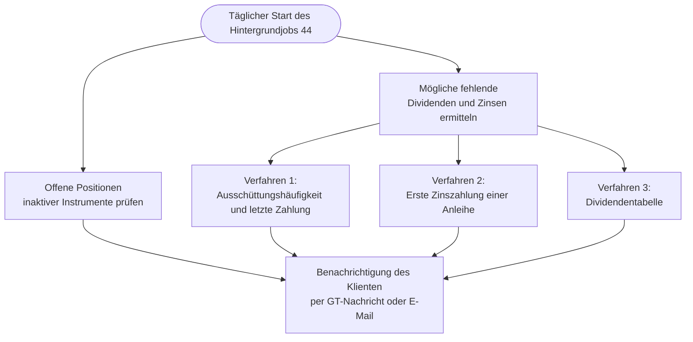
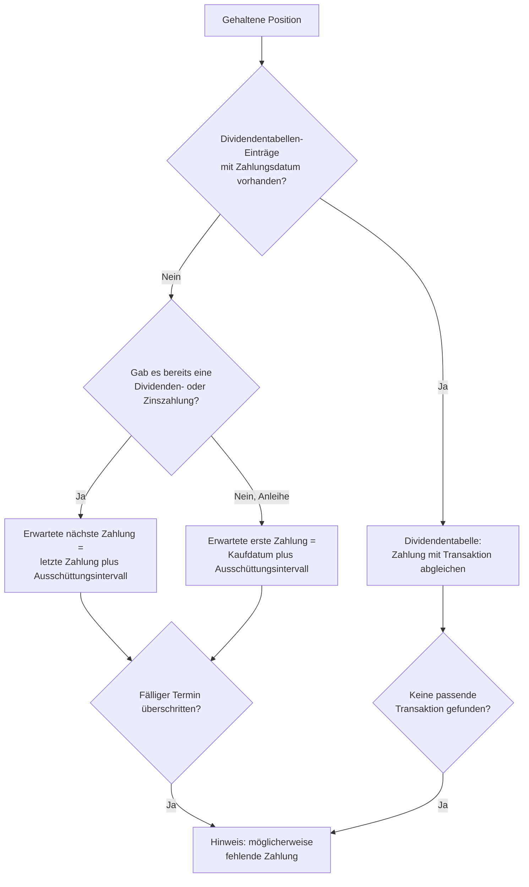
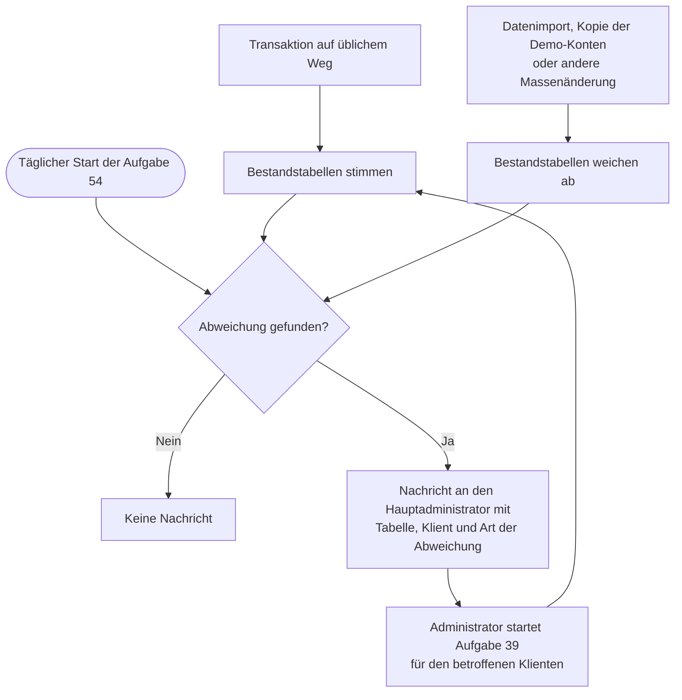

Hier werden die verschiedenen Aufgabentypen der Batchverarbeitung beschrieben. Gewisse Aufgabentypen können auch an anderen Orten dieser Bedienungsanleitung erläutert worden sein. Einige Aufgabentypen können nicht vom Administrator erstellt werden. Diese werden ausschliesslich vom System erstellt.

## 15 - Nicht abgeschlossene Benutzer-Registrierungen bereinigen
Bei der Benutzerregistrierung wird ein Verifizierungstoken erstellt. Dieses muss in einem weiteren Schritt vom zukünftigen Benutzer per E-Mail bestätigt werden. Wird diese Verifizierung nicht erfolgreich durchgeführt, wird der Benutzer und das Verifizierungstoken gelöscht.

## 20 - Online-Status Updates der GTNet Instanzen nachführen
Dieser Aufgabentyp prüft und aktualisiert den Online- und Beschäftigt-Status aller konfigurierten GTNet-Server. Für jeden Peer mit abgeschlossenem Handshake wird eine Ping-Nachricht gesendet und die Erreichbarkeit anhand der Antwort ermittelt. Anschliessend werden die Flags für Online- und Beschäftigt-Status sowie der Server-Status der einzelnen Austauschkategorien entsprechend aktualisiert. Übersprungen werden dabei Peers, die ausser Betrieb sind, sowie Peers, die sich gerade in einem angekündigten Wartungsfenster befinden: Erstere sollen durch einen zufällig erfolgreichen Ping nicht wieder in Betrieb genommen werden, bei Letzteren würde eine geplante Abschaltung sonst als Ausfall festgehalten. Die Aufgabe wird rund 30 Sekunden nach dem Start der Anwendung einmalig ausgeführt, damit der Server zuvor vollständig initialisiert und für HTTP-Anfragen bereit ist.

Damit der angezeigte Online-Status die tatsächliche Erreichbarkeit der GT-Applikation widerspiegelt, gelten folgende Regeln:
- **Online**: Der Ping wurde erfolgreich zugestellt und der Peer hat mit einer gültigen GTNet-Protokollantwort geantwortet. Eine offene TCP-Verbindung allein reicht nicht aus – HTTP-Fehlerantworten eines vorgeschalteten Reverse-Proxys (beispielsweise 502 oder 503) führen zu Offline.
- **Offline**: Der Peer ist nicht erreichbar oder antwortet nur mit einem HTTP-Fehler.
- **Unbekannt**: Der ausgehende Handshake mit dem Peer ist nicht abgeschlossen (Token für ausgehende Anfragen fehlt). Ohne dieses Token kann kein authentifizierter Ping gesendet werden; ein allenfalls noch gesetzter «Online»-Status aus einer eingehenden Handshake-Phase wird deshalb auf «Unbekannt» zurückgesetzt.

Zusätzlich kann eine administrative Person den Status einer einzelnen Instanz jederzeit über den Kontextmenüpunkt **«Status jetzt prüfen»** in der [GTNet-Server-Übersicht](../../gtnet/setup/) neu prüfen lassen, ohne auf einen Serverneustart warten zu müssen.

## 22 - GTNet-Austauschprotokolle aggregieren und alte Nachrichten löschen
Dieser Aufgabentyp führt zwei Wartungsaufgaben durch: die Aggregation von Protokolleinträgen und das Löschen alter Austauschnachrichten.

**Protokollaggregation**: Die GTNet-Austauschprotokolleinträge werden rollierend von kürzeren zu längeren Zeiträumen aggregiert. Die Aggregation erfolgt in mehreren Stufen: Einzelne Einträge werden zu täglichen Zusammenfassungen aggregiert, tägliche zu wöchentlichen, wöchentliche zu monatlichen und monatliche zu jährlichen. Der globale Parameter **g.gnet.log.aggregate.days** steuert die Schwellenwerte für jede Stufe im Format «D=1,W=7,M=30,Y=365».

**Nachrichtenlöschung**: Alte Austauschnachrichten werden automatisch gelöscht, um den Speicherbedarf zu reduzieren. Der globale Parameter **g.gnet.del.message.recv** steuert die Aufbewahrungsdauer im Format «LP=1,HP=5,SL=5»:
- **LP** (LastPrice): Anzahl Tage, bevor Letztpreis-Austauschnachrichten gelöscht werden
- **HP** (HistoryPrice): Anzahl Tage, bevor historische Preisaustauschnachrichten gelöscht werden
- **SL** (SecurityLookup): Anzahl Tage, bevor Wertpapiersuche-Nachrichten gelöscht werden

Der Standardzeitplan läuft täglich um 3:00 Uhr UTC. Die aggregierten Daten werden in der Ansicht [Austauschprotokoll](../../../admindata/gtnet/exchangelog/) angezeigt. Weitere Informationen zu den Konfigurationsparametern finden Sie unter [Globale Einstellungen GTNet](../../../admindata/gtnet/globalsettings/).

## 23 - GTNet-Austauschkonfigurationen synchronisieren
Dieser Aufgabentyp synchronisiert GTNetExchange-Konfigurationen mit verbundenen GTNet-Peers und aktualisiert die GTNetSupplierDetail-Einträge. Er arbeitet in zwei Modi: Der vollständige Neuerstellungsmodus erstellt alle Lieferantendetaileinträge für jeden Peer neu, während der inkrementelle Modus nur Änderungen seit der letzten Synchronisation synchronisiert. Der Standardzeitplan läuft täglich um 2:00 Uhr UTC im vollständigen Neuerstellungsmodus. Diese Aufgabe kann auch manuell über die [GTNet-Einrichtung](../../../admindata/gtnet/setup/) ausgelöst werden oder automatisch, nachdem eine Datenaustausch-Anforderung akzeptiert wurde.

## 24 - GTNet-Einstellungsänderungen übertragen
Dieser Aufgabentyp überträgt Einstellungsänderungen an alle konfigurierten GTNet-Peers. Wenn sich lokale GTNet-Entitätseinstellungen ändern (wie maxLimit, acceptRequest, serverState oder dailyRequestLimit), benachrichtigt diese Aufgabe alle verbundenen Peers durch Senden einer Einstellungsaktualisierungsnachricht. Diese Aufgabe ist nicht geplant, sondern wird automatisch ausgelöst, wenn GTNet-Einstellungen gespeichert werden. Die Ausführung als Hintergrundaufgabe verhindert, dass die Benutzeroberfläche bei Netzwerkoperationen während der Einstellungsänderung blockiert wird.

## 25 - Ausstehende GTNet-Zukunftsnachrichten zustellen
Dieser Aufgabentyp verarbeitet die Zustellung von Broadcast-Nachrichten, die ein geplantes Ausführungsdatum in der Zukunft haben. Dazu gehören Wartungsfenster-Ankündigungen, Hinweise zur Servereinstellung und deren entsprechende Stornierungsnachrichten. Die Aufgabe führt fünf Operationen aus: Erstellen von Zustellversuchen für neue Partner, deren Handshake nach Erstellung einer ausstehenden Nachricht abgeschlossen wurde, Verarbeiten von Stornierungsnachrichten, Zustellen ausstehender Nachrichten an ihre Ziele, Bereinigen abgelaufener Nachrichten und schliesslich das Setzen jener Instanzen auf «Ausser Betrieb», deren angekündigtes Datum der Betriebseinstellung erreicht ist. Der Standardzeitplan läuft alle 5 Stunden, aber die Aufgabe wird auch sofort ausgelöst, wenn einer dieser Nachrichtentypen gesendet wird; die Umstellung auf «Ausser Betrieb» erfolgt deshalb innerhalb weniger Stunden nach dem angekündigten Datum. Weitere Informationen zu GTNet-Nachrichtentypen finden Sie unter [GTNet-Einrichtung](../../../admindata/gtnet/setup/), zu den beiden Ankündigungen unter [Wartung und Betriebseinstellung](../../../admindata/gtnet/setup/availability/).

## 26 - GTNet-Admin-Nachrichten an Ziele zustellen {#JOB26}
Dieser Aufgabentyp stellt ausstehende Admin-Nachrichten an mehrere GTNet-Ziele zu. Die Aufgabe wird automatisch ausgelöst, wenn ein Administrator über die [Admin-Nachrichten](../../../admindata/gtnet/setup/msgadmin/)-Ansicht eine Nachricht an mehrere ausgewählte Domänen sendet. Durch die asynchrone Verarbeitung im Hintergrund reagiert die Benutzeroberfläche sofort, während die Zustellung separat erfolgt.

Die Aufgabe führt folgende Schritte aus:
- Abfrage aller ausstehenden Zustellversuche für Admin-Nachrichten
- Zustellung der Nachrichten an die jeweiligen Ziele über die M2M-Schnittstelle
- Aktualisierung des Zustellstatus nach erfolgreicher Übertragung
- Protokollierung von fehlgeschlagenen Zustellversuchen

{}
Diese Aufgabe kann nicht manuell erstellt werden. Sie wird ausschliesslich vom System erstellt, wenn Admin-Nachrichten an mehrere Empfänger gesendet werden.
{}

## 29 - Rollen-Nachrichten löschen, die von allen Empfängern gelöscht wurden {#JOB29}
Eine an eine Benutzerrolle gerichtete Nachricht wird nicht entfernt, wenn ein einzelnes Mitglied sie löscht; sie wird für dieses Mitglied lediglich ausgeblendet, bleibt aber für die übrigen Mitglieder der Benutzerrolle sichtbar. Diese Aufgabe entfernt ein solches Rollen-Nachrichtenthema endgültig, sobald jedes Mitglied der angesprochenen Benutzerrolle es gelöscht hat. Direkt zwischen zwei Benutzern ausgetauschte Nachrichten werden sofort entfernt und sind von dieser Aufgabe daher nicht betroffen. Die Aufgabe wird einmal täglich ausgeführt, standardmässig am späten Abend (UTC).

## 30 - Historische- und Innertag-Kursaktualisierung mit Nachführung der Vollständigkeit und Split Kalender update
Mit diesem Aufgagetyp werden verschiedene Aufgaben in der folgenden Reihenfolge abgearbeitet:
1. Historischen und intraday Kursdaten nachgeführt. 
2. Die Kurslücken der Währungspaare werden geschlossen, damit für jeden Kalendertag ein Wechselkurs vorliegt, siehe [Kurse für jeden Kalendertag](../../../watchlistinstrument/instrument/currencypair/#kurse-für-jeden-kalendertag)
3. [Vollständigkeit historischer Wertpapier-Kursdaten](../../../admindata/historyquotequality/)
4. Bestandstabelle über Bargeld, mehr dazu unter [Architektur von GT - Bestandstabelle](../../../reportportfolio/periodperformance/holdingtable/) 
5. Für Währungspaare ohne historische Kursdaten wird eine neue Aufgabe mit der ID 40 angelegt

## 31 - Dividende lesen, da Konnektor geändert wurde
Mehr zu diesem Thema, siehe [Dividende](../../../watchlistinstrument/externaldata/historyquote/).

## 32 - Splits neu einlesen, weil Konnektor geändert wurde oder das Instrument einen Split erfahren hat
Wird ausgelöst, wenn der Datenkonnektor des Splits geändert wurde oder wenn ein möglicher neuer Split im Splitkalender entdeckt wurde. Er lädt alle Splits für ein bestimmtes Wertpapier neu. Wenn die Splits des Instruments geändert wurden, werden auch die historischen Kursdaten komplett neu eingelesen.

{}
Die Splits werden teilweise anhand der Namen der Unternehmen ermittelt. Es ist möglich, dass es andere Finanzprodukte mit einem ähnlichen oder demselben Namen gibt. Beispielsweise wurde am 14.11.2025 im Split-Kalender von Yahoo Finance der Split PLTR.NE von Palantir Technologies Inc. erkannt. Dieser Split betraf jedoch nicht die originale Palantir-Aktie, sondern ein Zertifikat. In dieser Grafioschtrader-Instanz war dieses Zertifikat nicht vorhanden. Zudem stimmt das Kürzel PLTR mit der originalen Aktie überein. In der Folge wurde der Job mit der ID 32 für einige Tage immer wieder erstellt und durchgeführt. Sie können einen solchen Job, der noch den Status „Warten” hat, löschen. Damit wird auch die weitere Erstellung dieses Jobs unterbunden. Das System stellt die weitere Erstellung dieses Jobs allerdings auch automatisch nach fünf Tagen ein.
{}

## 33 - Mögliche Erstellung von Währungen und Wiederherstellung von Bestandstabellen
Wenn sich die Hauptwährung eines Klienten oder eines seiner Portfolios ändert, müssen eventuell fehlende Währungspaare für diese Hauptwährung erstellt werden. Ausserdem müssen die Bestandstabellen neu aufgebaut werden. Siehe mehr zu diesem Thema unter "[Bericht Periodenertrag und redundante Daten](../../../reportportfolio/periodperformance/holdingtable)".

## 34 - Währung des Klienten und der Portfolios geändert, daher Bestandstabellen neu erstellen
Wenn sich die Hauptwährung eines Klienten und seiner Portfolios ändert, müssen eventuell fehlende Währungspaare für diese Hauptwährung angelegt werden. Ausserdem müssen die Bestandstabellen neu aufgebaut werden.

## 35 - Laden oder erneutes Laden von historischen Preisdaten des Instruments
Beim Anlegen eines Wertpapiers werden die Intraday- und historischen Kursdaten gelesen. Wenn der Konnektor für die historischen Kursdaten geändert wird, müssen die Kurse ebenfalls neu eingelesen werden. Beim Anlegen des Wertpapiers kann dies synchron oder asynchron mit dieser Aufgabe erfolgen. Die historischen Kursdaten werden nur bei Unittests synchron oder gemäss den Einstellungen in `application.properties` geladen. Die Kursdaten für Währungspaare werden immer synchron geladen. Wird der Konnektor für die historischen Kursdaten geändert oder diese Aufgabe für ein Wertpapier ausgelöst, werden die bisherigen Kurse zuerst in das [Archiv der historischen Kursdaten]() kopiert, bevor die Tabelle aus dem neuen Datenanbieter neu aufgebaut wird.

## 36 - Bestandsmenge eines Wertpapiers hat durch ein Split geändert, alle abhängigen Wertpapierbestände der Klienten werden neu aufgebaut 
Die Veränderung von Splits kann sich auf die Bestandstabelle der Instrumente auswirken. Siehe mehr zu diesem Thema unter "[Bericht Periodenertrag und redundante Daten](../../../reportportfolio/periodperformance/holdingtable)".

## 37 - Möglicher Neuaufbau von Kontobestand, da sich die historischen Währungskurse geändert haben
Änderungen der historischen Kursdaten von Währungspaaren können sich auf die Bestandstabelle der Geldkonten auswirken. Siehe mehr zu diesem Thema unter "[Bericht Periodenertrag und redundante Daten](../../../reportportfolio/periodperformance/holdingtable)".

## 38 - Prüfe nach einem Split wiederholend ob die historischen Kursdaten dies widerspiegeln und geladen werden können
Wenn für ein Wertpapier ein Split hinzugefügt wird, kann es einige Tage dauern, bis die angepassten historischen Kursdaten beim Datenprovider vorliegen. Daher wird diese Aufgabe so lange wiederholt, bis die historischen Kursdaten des Wertpapiers erfolgreich eingelesen wurden.

## 39 - Bestände für einen oder alle Klienten wiederherstellen, normalerweise nach einem Import von einem Export {#JOB39}
Die Bestandstabellen werden nur dann aktualisiert, wenn die Transaktionen auf dem üblichen Weg verarbeitet werden. Beim Datenimport oder beim Kopieren von Demo-Benutzerkonten ist dies möglicherweise nicht der Fall. Daher können die Bestandstabellen mit dieser Aufgabe für einen oder alle Mandanten aktualisiert werden. 

Weicht eine Bestandstabelle trotzdem von den Transaktionen ab, wird dies durch die Aufgabe [54](#JOB54) festgestellt.

## 40 - Historische Kursdaten eines leeren Währungspaares laden
Dieser Aufgabentype wird in [Währungspaar und Kryptowährungen](../../../watchlistinstrument/instrument/currencypair/) erwähnt.

## 41 - Kopieren des Quellmandanten in die Demo-Konten
Kopiert die Daten eines Mandanten in andere Mandanten. Diese Funktion kann für Demo-Benutzerkonten verwendet werden. Da Besucher die Daten dieser Benutzerkonten ändern können, sollten diese täglich neu kopiert werden. Das Kopieren der Quellkonten in die Zielkonten erfolgt gemäss den Angaben in `application.properties` und den globalen Einstellungen. Zwei unterschiedliche Quellenkontos sind vorgesehen, damit können beispielsweise deutsch- und  englischsprachige Demo-Benutzerkonten bedient werden.
- **gt.demo.account.pattern.de und gt.demo.account.pattern.en in application.properties**: Mit diesem Muster werden die Zielkonten ausgedrückt. Dieses Muster wird für die Suche nach den Zielkonten verwendet. Wenn kein Demo-Benutzerkonto gewünscht wird, darf nur dieses Suchmuster in der E-Mail des Benutzers keinen Treffer ergeben.
- **gt.source.demo.idtenant.de und gt.source.demo.idtenant.de in globale Einstellungen**: Dies sind die IDs der Quellkonten. Wird das entsprechende Quellkonto nicht gefunden, erfolgt keine Kopierung.

## 42 - Erzeugt den Handelskalender für Börsen durch einen Hauptindex {#JOB42}
Für die Nachführung der freien Handelstage an einem Handelsplatz kann ein Index benutzt werden. Jeder mögliche Handelstag, an dem der Index keinen Kurs geliefert hat, wird zu einem geschlossenen Tag, womit sich eine manuelle Nachführung der Handelstage erübrigt. Diese Aufgabe sollte möglichst an einem Sonntag durchgeführt werden, damit werden vorübergehende falsche Eintragungen von Feiertagen vermieden.

Die Aufgabe läuft in einem von drei Modi:
- **Alle Börsen**: Der wöchentliche Lauf führt jeden Handelsplatz nach, dessen Kalender aus einem Index stammt. Dabei werden nur Tage nach dem jüngsten durch den Benutzer markierten Tag ergänzt.
- **Eine Börse**: Eine administrative Person kann den Kalender eines einzelnen Handelsplatzes vollständig neu aufbauen, beispielsweise nach der Korrektur seiner Index-Zuordnung.
- **Index neu geladen**: Wurden die historischen Daten eines Index neu geladen, wird der Kalender jedes mit diesem Index verknüpften Handelsplatzes automatisch neu aufgebaut.

Ein Index ist nur eine von zwei möglichen Kalenderquellen. Die Alternative ist ein [Handelskalender-Regelsatz](../../../basedata/instrumentbased/stockexchange/tradingcalendarruleset/), der von der Aufgabe 53 verarbeitet wird. Mehr zu beiden Quellen unter [Handelsplatz](../../../basedata/instrumentbased/stockexchange/).

## 43 - Führt mögliche neue Dividenden der Instrumente über die Konnektoren nach
Das Laden von Dividenden für die einzelnen Instrumente über Konnektoren wird derzeit mit zwei verschiedenen Algorithmen durchgeführt. Der eine Algorithmus überwacht einen oder mehrere Dividendenkalender, der andere arbeitet mit der erwarteten Periodizität der Dividendenzahlungen:
- **Dividendenkalender**: Der Dividendenkalender wird täglich an den Handelstagen über den entsprechenden Konnektor geladen. Die Dividenden werden hinzugefügt, wenn die in diesem Kalender aufgeführten Instrumente auch in dieser GT-Instanz enthalten sind.
- **Periodizität**: Damit werden Dividendenerträge in der Entität Dividende nachgetragen. Der folgende Algorithmus wird verwendet, um eventuell fehlende Dividendenerträge in der Entität Dividende für Wertpapiere zu ermitteln. Dies geschieht auf Basis des Datums der letzten Dividendenzahlung und der Periodizität der erwarteten Zahlungen. Zusätzlich wird auch die Dividendenzahlung in der Entität Transaktion berücksichtigt, wenn die Dividendenzahlung jünger ist als das Datum in der Entität Dividende.

## 44 - Prüft alle Klienten auf offene Positionen von inaktiven Instrumenten und ermittelt mögliche fehlende Dividenden oder Zinse
Dieser Hintergrundjob sollte täglich ausgeführt werden und erfüllt zwei Aufgaben. Zum einen prüft er, ob es offene Positionen für ein Instrument gibt, das nicht mehr gehandelt wird; halten Sie eine solche Position, werden Sie darauf hingewiesen. Zum anderen überprüft er, ob Dividenden oder Zinsen für gehaltene Positionen tatsächlich als Transaktion erfasst wurden, und meldet mögliche fehlende Einträge. Für die Ermittlung fehlender Dividenden- oder Zinszahlungen werden drei Verfahren angewendet.

Das erste Verfahren beruht auf der **Ausschüttungshäufigkeit und der letzten Zahlung**. Wann die nächste Dividenden- oder Zinszahlung zu erwarten ist, lässt sich aus der Ausschüttungshäufigkeit und der zuletzt erfassten Zahlung ableiten: Zum Datum der letzten Zahlung wird ein Ausschüttungsintervall hinzugezählt, ergänzt um eine kleine Toleranz von einigen Tagen, damit nicht bei jeder geringfügigen Verspätung ein Hinweis erfolgt. Ist dieser erwartete Termin bereits überschritten, ohne dass eine entsprechende Transaktion vorliegt, gilt die Zahlung als möglicherweise fehlend. Dieses Verfahren wird nur bei Instrumenten angewendet, bei denen die Daten der Dividendentabelle nicht verfügbar sind oder bei denen die einzelnen Einträge kein Zahlungsdatum haben.

Das zweite Verfahren betrifft die **erste Zinszahlung einer Anleihe**. Das erste Verfahren benötigt eine bereits erfasste Zahlung als Ausgangspunkt und kann deshalb bei einer neu gekauften Anleihe, die noch nie einen Zins ausgeschüttet hat, keine fehlende erste Zahlung erkennen. Damit auch diese Lücke abgedeckt ist, wird bei gehaltenen Anleihen und Wandelanleihen ohne bisherige Zinszahlung das Kaufdatum als Ausgangspunkt verwendet: Zum Kaufdatum wird ein Ausschüttungsintervall zuzüglich derselben Toleranz hinzugezählt. Ist dieser Termin überschritten, ohne dass ein Zins erfasst wurde, erhalten Sie einen Hinweis auf die möglicherweise fehlende erste Zinszahlung.

Das dritte Verfahren nutzt die **Dividendentabelle**. In GT wird eine Tabelle der Dividendenzahlungen über Konnektoren nachgeführt. Durch die Verknüpfung dieser Tabelle mit den Transaktionen kann geprüft werden, ob bei den Dividendengeschäften eventuell Einträge fehlen. Das Transaktionsdatum kann um einige Tage vom Zahlungsdatum der Dividendentabelle abweichen. Ausserdem prüft dieses Verfahren nur rund ein Jahr in die Vergangenheit.

Alle Feststellungen werden dem betroffenen Klienten als GT-Nachricht oder E-Mail zugestellt. Ein bestimmtes Instrument wird zum selben Termin nur einmal gemeldet, damit keine wiederholten Hinweise entstehen.

Der folgende Ablauf zeigt die Schritte dieses Hintergrundjobs im Überblick.

Die nächste Darstellung zeigt, wie für eine einzelne gehaltene Position entschieden wird, ob eine Zahlung möglicherweise fehlt.

## 45 - Laden der historischen Wechselkursdaten der ECB
Mehr dazu unter [European Central Bank](../../../watchlistinstrument/externaldata/)

## 46 - Überwachung der Konnektoren für historische Kursdaten
Dieser Aufgabentyp überprüft ob ein Konnector für **historische Kursdaten** möglicherweise nicht mehr funktioniert. Dabei können über die globalen Einstellungen gewisse Parameter der Überprüfung angepasst werden. Im Falle einer möglichen Fehlfunktion eines Konnektors bekommt der **Hautadministrator** eine Nachricht. Diese Aufgabe sollte täglich durchgeführt werden.
- **gt.history.observation.retry.minus** Übertragungsfehler bei maximaler Wiederholung (**gt.history.retry**) minus dieser Anzahl. Falls `gt.history.retry` den Wert 4 enthält, sollte dieser Wert 0 oder 1 sein. So würde ein Instrument bei 4 bzw. 3 Wiederholungen als nicht fuktionierend betrachtet.
- **gt.history.observation.days.back**: Instrument wird nur berücksichtigt, wenn eine erfolgreiche Übertragung innerhalb des aktuellen Datums minus dieser Anzahl von Tagen stattgefunden hat. Auf diese Weise verfälschen eventuell nicht mehr aktive, aber als aktiv geführte Instrumente die Berechnung nicht.
- **gt.history.observation.falling.percentage**: Meldung, wenn mindestens so viel Prozent eines Konnektors ausgefallen sind. Bei 100 % funktioniert der Konnektor wahrscheinlich gar nicht mehr.

## 47 - Überwachung der Konnektoren für Innertag Kursdaten
Dieser Aufgabentyp prüft, ob ein Konnektor für **Intra-day-Kursdaten** möglicherweise nicht mehr funktioniert. Wie bei der Überwachung der historischen Kursdaten erhält der **Hautadministrator** eine Meldung. Mittels globale Einstellungen können folgende Parameter verändert werden:
- **gt.intraday.observation.retry.minus**: Siehe **gt.history.observation.retry.minus** von Aufgabentype 46.
- **gt.intraday.observation.or.days.back**: Ein Konnektor eines Instruments wird als fehlerhaft eingestuft, wenn die Anzahl der Wiederholungen zu hoch ist oder wenn seit dem aktuellen Datum minus diesem Wert als Anzahl der Tage keine Aktualisierung erfolgt ist.
- **gt.intraday.observation.falling.percentage**: Siehe **gt.history.observation.falling.percentage** von Aufgabentype 46.

## 48 - Füllt und speichert die benutzerdefinierten Felder von Benutzer 0 {#JOB19}
Einige globale benutzerdefinierte Felder haben eine längere Gültigkeitsdauer. Dadurch kann der Inhalt persistent werden. Ausserdem ist der Aufwand für die Erstellung ihrer Inhalte manchmal zeitaufwendig, z.B. weil Datenlieferanten kontaktiert werden müssen. Daher ist eine tägliche Aktualisierung sinnvoll.

Die Erstellung der globalen benutzerdefinierten Felder kann mit dem globalen Parameter "gt.udf.general.recreate" beeinflusst werden. Wenn dieser Wert grösser als 0 gesetzt wird, werden die Werte aller globalen Felder neu erstellt. Nach einmaliger Ausführung dieser Hintergrundaufgabe wird der Wert automatisch wieder auf 0 gesetzt.

## 49 - Wiederholungszähler für Konnektor(en) bei aktiven Instrumenten zurücksetzen
Dieser Aufgabentyp setzt die Wiederholungszähler für historische und Intraday-Kursdaten bei aktiven Instrumenten zurück. Er wird verwendet, um Situationen zu beheben, in denen Konnektoren ihre Wiederholungslimits aufgrund vorübergehender Probleme wie Netzwerkausfällen überschritten haben. Die Aufgabe kann entweder für einen einzelnen Konnektor oder für alle Konnektoren ausgeführt werden.

## 52 - Ausführung fälliger Daueraufträge {#JOB28}
Dieser Aufgabentyp verarbeitet alle fälligen [Daueraufträge](../../../transaction/standingorder/) und erstellt die entsprechenden Transaktionen. Für jeden aktiven Dauerauftrag, dessen nächstes Ausführungsdatum erreicht oder überschritten ist, wird eine Transaktion erstellt. Falls mehrere Ausführungsdaten fällig sind (z.B. nach einem Serverunterbruch), werden alle versäumten Termine nachgeholt. Bei Wertpapier-Daueraufträgen wird der historische Schlusskurs am Ausführungsdatum benötigt; ist kein Kurs verfügbar, wird der entsprechende Termin übersprungen. Die Standardausführung erfolgt täglich um 06:15 UTC, also nach der täglichen Kursaktualisierung.

## 53 - Erzeugt den Handelskalender für Börsen durch einen Regelsatz {#JOB53}
Dies ist der zweite Weg, den Handelskalender eines Handelsplatzes zu füllen, neben dem Index der Aufgabe 42. Statt die Schliessungen aus einem Index zu lesen, löst diese Aufgabe einen [Handelskalender-Regelsatz](../../../basedata/instrumentbased/stockexchange/tradingcalendarruleset/) — samt der von einem übergeordneten Regelsatz geerbten Regeln — in konkrete geschlossene Tage auf und schreibt sie in den Kalender. Da die Schliessungen aus Regeln berechnet werden, funktioniert dies auch für zukünftige Jahre, für die noch keine Kursdaten vorliegen. Vom Benutzer manuell markierte Tage bleiben stets erhalten, und ein fehlerhafter Regelsatz überspringt nur seine eigene Börse, ohne die anderen zu beeinträchtigen.

Die Aufgabe läuft in einem dieser Modi, je nachdem, was beim Erstellen ausgewählt wird:
- **Alle Börsen, wöchentliche Verlängerung**: Der wöchentliche Lauf verlängert den Kalender jedes Handelsplatzes, der einen Regelsatz verwendet. Normalerweise geschieht dabei nichts, bis der Kalender in ein neues Jahr hineinreicht.
- **Alle Börsen, vollständige Neuerzeugung**: Erstellt eine administrative Person die Aufgabe ohne Auswahl einer Börse oder eines Regelsatzes, wird der Kalender jedes regelbasierten Handelsplatzes für den gesamten Zeitraum von Grund auf neu aufgebaut. Damit lassen sich alle regelbasierten Kalender auf einmal neu erzeugen, beispielsweise nach der Bearbeitung mehrerer Regelsätze.
- **Eine Börse**: Der Kalender eines einzelnen, über den Namen ausgewählten Handelsplatzes wird vollständig neu aufgebaut — beispielsweise wenn sich seine Kalenderquelle ändert.
- **Regelsatz**: Werden die Regeln eines Regelsatzes bearbeitet oder wählt eine administrative Person diesen Regelsatz über den Namen aus, wird der Kalender jedes Handelsplatzes neu aufgebaut, der diesen Regelsatz verwendet — oder einen Regelsatz, der ihn erweitert.

## 54 - Prüft, ob die Bestandstabellen noch mit den Transaktionen übereinstimmen, und meldet Abweichungen dem Administrator {#JOB54}
Die Bestandstabellen werden nur dann nachgeführt, wenn die Transaktionen auf dem üblichen Weg verarbeitet werden. Bei einem Datenimport, beim Kopieren der Demo-Benutzerkonten oder bei anderen Massenänderungen kann dies unterbleiben, und eine planmässige Abstimmung findet nicht statt. Eine Abweichung bliebe daher unbemerkt, bis ein Bericht falsche Zahlen zeigt. Diese Aufgabe vergleicht deshalb täglich die drei Bestandstabellen mit den Transaktionen, aus denen sie abgeleitet sind. Mehr zu diesen Tabellen unter "[Bericht Periodenertrag und redundante Daten](../../../reportportfolio/periodperformance/holdingtable)".

Die Aufgabe meldet nur, sie repariert nichts. Ein Neuaufbau ersetzt die Daten vollständig und ist aufwendig, weshalb die Entscheidung bei der administrativen Person bleibt. Zur Korrektur wird die Aufgabe [Bestände für einen oder alle Klienten wiederherstellen](#JOB39) für den betroffenen Klienten gestartet. Die Aufgabe läuft täglich um 06:45 UTC, also nach der täglichen Kursaktualisierung. Stimmt alles überein, wird keine Nachricht versendet.

Die Meldung geht an den [Hauptadministrator](../../../intro/userrights/#hauptadmin) und wird standardmässig als GT Nachricht zugestellt. Unter "Einstellung Nachrichten" lässt sich der Kanal für den Nachrichtentyp **Bestandstabellen weichen von den Transaktionen ab** ändern. Dieser Nachrichtentyp kann als einziger auch ganz abgeschaltet werden, damit eine bereits bekannte Abweichung nicht täglich erneut gemeldet wird.

Die Meldung nennt je Bestandstabelle und Klient die Anzahl der abweichenden Einträge und die Art der Abweichung. Betroffen sind der **Bestand der Geldkonten**, die **Ein- und Auszahlungen der Geldkonten** und die **Bestände der Wertpapiere**. Die Art der Abweichung bedeutet Folgendes:
- **Fehlender Bestandseintrag**: Für einen Tag mit Transaktionen fehlt der Bestandseintrag.
- **Überzähliger Bestandseintrag**: Es besteht ein Bestandseintrag, zu dem keine Transaktion vorliegt.
- **Falsche Beträge**: Die Beträge stimmen nicht mit der Summe der Transaktionen überein.
- **Falsche Bestandsmenge**: Die gehaltene Menge eines Wertpapiers stimmt nicht, wobei die Splits berücksichtigt sind.
- **Überlappende Zeiträume**: Die Gültigkeitszeiträume schliessen nicht korrekt aneinander an, sie überlappen sich.
- **Zeitraum ohne Transaktion oder Split**: Ein Zeitraum beginnt an einem Tag, an dem weder eine Transaktion noch ein Split vorliegt.
- **Falscher Klient oder falsches Portfolio**: Der Eintrag ist dem falschen Klienten oder Portfolio zugeordnet.

Der folgende Ablauf zeigt das Zusammenspiel dieser Aufgabe mit der Aufgabe 39.

## Splits
Für die **Erkennung (ID-30)** und **Nachführung (ID-32)** von **Splits** in GT aus externen Datenquellen, sind unterschiedliche **Hintergrundaufgaben** beteiligt. Es kann mehrere Tage dauern, bis der aus einem Split-Kalender gelesene Split auch beim entsprechenden Wertpapier der externen Datenquellen korrekt abgebildet ist. Im folgenden ist dieser Prozess in einem vereinfachten Flowchart dargestellt, wobei der Hexagon-Knoten für eine Hintergrundaufgabe steht:

graph TD;
    A{{Zeitgesteuert täglich}} --> B(Ein oder mehrere Split-Kalender lesen)
    B --> |Möglicher Split für ein Wertpapier gefunden| C{{+2 Minuten: Datenveränderung}}
    C --> D(Split des entsprechenden Wertpapiers einlesen)
    D --> |Problematik Name Wertpapiers im Kalender und bei GT| E{Split gefunden?}
    E --> |Nein| G{{+ 1 Tag: Datenveränderung}}
    G --> D
    E --> |Ja| H{{+ 1 Tag Datenveränderung}}
    H --> I(Historische Kursdaten des Wertpapiers einlesen)
    I --> |GT benötigt Split bereinigte Kursdaten| K{Enthalten historische Kursdaten diesen Split?}
    K --> |Nein| H
    K --> |Ja| L{{+0: Datenveränderung}}
    L --> M(Bestand des betreffenden Wertpapiers der betroffenen Klienten für diesen Split nachführen)

Es ist möglich das dieser Prozess den Namen des Wertpapiers aus dem Split-Kalender falsch erkennt, d.h. es wird versucht, einen Split auf ein in GT bestehendes Wertpapier anzuwenden. Damit wird erfolglos täglich das entsprechende Wertpapier nach diesem Split geprüft. In einem solchen Fall sollte die entsprechende wartende Hintergrundaufgabe mittels diesem Monitor gelöscht werden.
