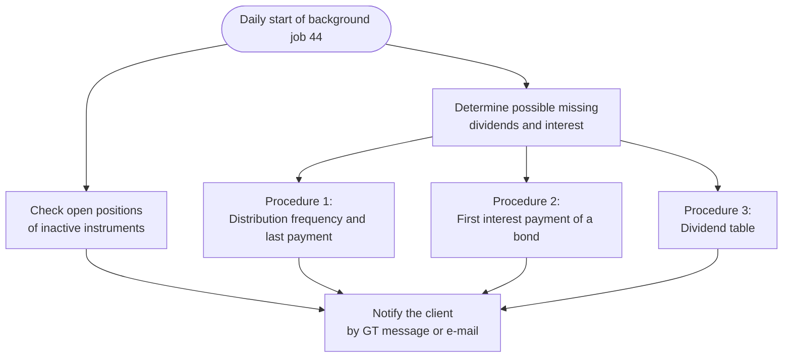
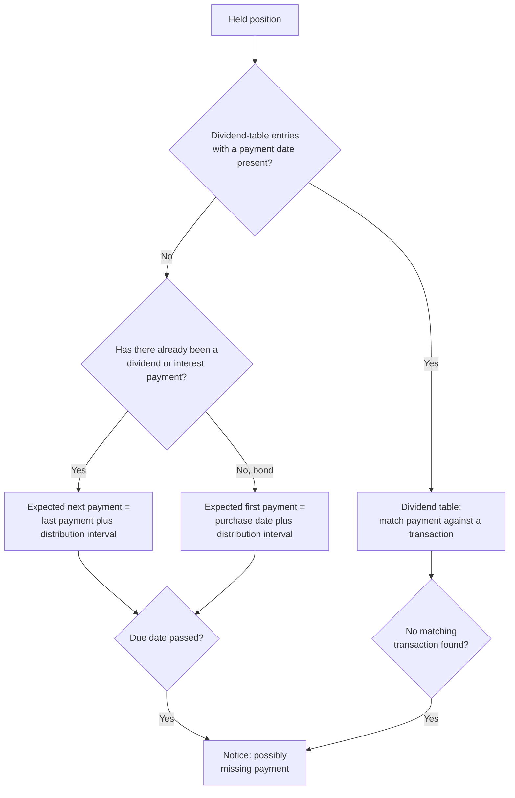
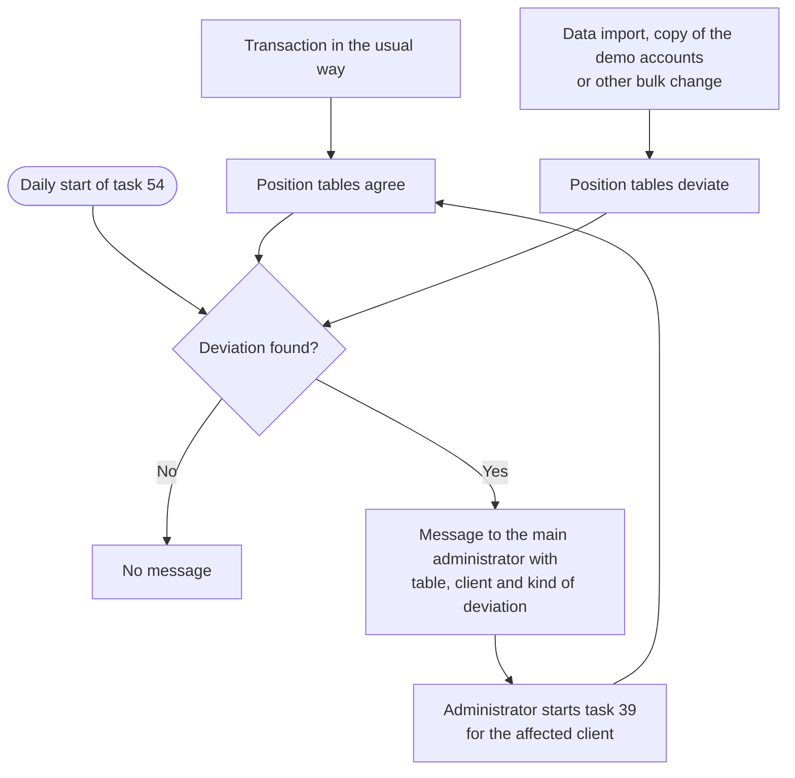

The various batch processing task types are described here. Certain task types may also have been explained elsewhere in this manual. Some task types cannot be created by the administrator. These are created exclusively by the system.

## 15 - Clean up incomplete user registrations
A verification token is created during user registration. In a further step, this must be confirmed by the future user by e-mail. If this verification is not successful, the user and the verification token are deleted.

## 20 - Track online status updates of GTNet instances
This task type checks and updates the online and busy status of all configured GTNet servers. For each peer whose handshake is complete, a ping message is sent and reachability is derived from the reply. The online and busy flags as well as the per-exchange-kind server state are updated accordingly. Peers that are out of service and peers currently inside an announced maintenance window are skipped: the former must not be put back into service by an accidentally successful ping, and for the latter a planned shutdown would otherwise be recorded as an outage. The task runs once, roughly 30 seconds after the application starts, so that the server is fully initialised and ready to accept HTTP requests before the check.

To make the displayed online status reflect the actual reachability of the GT application, the following rules apply:
- **Online**: The ping was delivered and the peer responded with a valid GTNet protocol reply. An open TCP connection alone is not sufficient — HTTP error responses from an upstream reverse proxy (for example 502 or 503) result in Offline.
- **Offline**: The peer is unreachable, or only replies with an HTTP error.
- **Unknown**: The outbound handshake with the peer is not complete (the token required for outbound requests is missing). Without that token no authenticated ping can be sent, so any stale "Online" flag left over from an inbound handshake phase is reset to "Unknown".

In addition, administrators can re-check the status of a single instance at any time via the **"Check status now"** context menu entry in the [GTNet server overview](../../gtnet/setup/), without having to wait for a server restart.

## 22 - Aggregate GTNet exchange logs and delete old messages
This task type performs two maintenance operations: log aggregation and deletion of old exchange messages.

**Log aggregation**: GTNet exchange log entries are aggregated from shorter to longer time periods in a rolling manner. The aggregation occurs in multiple levels: individual entries are aggregated into daily summaries, daily into weekly, weekly into monthly, and monthly into yearly. The global parameter **g.gnet.log.aggregate.days** controls the thresholds for each level in the format "D=1,W=7,M=30,Y=365".

**Message deletion**: Old exchange messages are automatically deleted to reduce storage requirements. The global parameter **g.gnet.del.message.recv** controls the retention period in the format "LP=1,HP=5,SL=5":
- **LP** (LastPrice): Number of days before last price exchange messages are deleted
- **HP** (HistoryPrice): Number of days before historical price exchange messages are deleted
- **SL** (SecurityLookup): Number of days before security lookup messages are deleted

The default schedule runs daily at 3:00 AM UTC. The aggregated data is displayed in the [Exchange Log](../../../admindata/gtnet/exchangelog/) view. For more information about the configuration parameters, see [Global Settings GTNet](../../../admindata/gtnet/globalsettings/).

## 23 - Synchronize GTNet exchange configurations
This task type synchronizes GTNetExchange configurations with connected GTNet peers and updates the GTNetSupplierDetail entries. It operates in two modes: full recreation mode recreates all supplier detail entries for each peer, while incremental mode only synchronizes changes since the last sync. The default schedule runs daily at 2:00 AM UTC in full recreation mode. This task can also be triggered manually from the [GTNet setup](../../../admindata/gtnet/setup/) interface or automatically after a data exchange request is accepted.

## 24 - Broadcast GTNet settings changes
This task type broadcasts settings changes to all configured GTNet peers. When local GTNet entity settings change (such as maxLimit, acceptRequest, serverState, or dailyRequestLimit), this task notifies all connected peers by sending a settings update message. This task is not scheduled but is triggered automatically whenever GTNet settings are saved. Running as a background task prevents the user interface from blocking during network operations when settings are changed.

## 25 - Deliver pending GTNet future messages
This task type handles the delivery of broadcast messages that have a scheduled execution date in the future. This includes maintenance window announcements, server discontinuation notices, and their corresponding cancellation messages. The task performs five operations: creating delivery attempts for new partners whose handshake completed after a pending message was created, processing cancellation messages, delivering pending messages to their targets, cleaning up expired messages, and finally setting those instances to "Out of service" whose announced discontinuation date has been reached. The default schedule runs every 5 hours, but the task is also triggered immediately when any of these message types is sent; the switch to "Out of service" therefore happens within a few hours of the announced date. For more information about GTNet message types, see [GTNet setup](../../../admindata/gtnet/setup/), and about the two announcements see [Maintenance and Discontinuation](../../../admindata/gtnet/setup/availability/).

## 26 - Deliver GTNet admin messages to targets {#JOB26}
This task type delivers pending admin messages to multiple GTNet targets. The task is automatically triggered when an administrator sends a message to multiple selected domains via the [Admin Messages](../../../admindata/gtnet/setup/msgadmin/) view. Asynchronous processing in the background ensures the user interface responds immediately while delivery occurs separately.

The task performs the following steps:
- Queries all pending delivery attempts for admin messages
- Delivers messages to the respective targets via the M2M interface
- Updates the delivery status after successful transmission
- Logs failed delivery attempts

{}
This task cannot be created manually. It is created exclusively by the system when admin messages are sent to multiple recipients.
{}

## 29 - Delete role messages that all recipients have deleted {#JOB29}
A message addressed to a user role is not removed when a single member deletes it; instead it is hidden for that member while it remains visible to the other members of the role. This task permanently removes such a role message topic once every member of the addressed role has deleted it. Messages exchanged directly between two users are removed immediately and are therefore not affected by this task. The task runs once a day, by default in the late evening (UTC).

## 30 - Historical and intraday course update with completeness tracking and split calendar update
This task type is used to process various tasks in the following order:
1. Historical and intraday price data update.
2. The price gaps of the currency pairs are closed, so that an exchange rate is available for every calendar day, see [Prices for every calendar day](../../../watchlistinstrument/instrument/currencypair/#prices-for-every-calendar-day)
3. [Completeness of historical securities price data](../../../admindata/historyquotequality/)
4. Cash holdings table, for more information see [Architecture of GT - Cash holdings table](../../../reportportfolio/periodperformance/holdingtable/)
5. A new task with ID 40 is created for currency pairs without historical price data

## 31 - Read dividend, as connector has been changed
For more on this topic, see [Dividend](../../../watchlistinstrument/externaldata/historyquote/).

## 32 - Read splits again because the connector has been changed or the instrument has undergone a split
Is triggered if the data connector of the split has been changed or if a possible new split has been detected in the split calendar. It reloads all splits for a specific security. If the instrument's splits have been changed, the historical price data is also completely reloaded.

{}
The splits are determined in part based on the names of the companies. It is possible that there are other financial products with a similar or identical name. For example, on November 14, 2025, the split PLTR.NE from Palantir Technologies Inc. was recognized in the split calendar of Yahoo Finance. However, this split did not affect the original Palantir share, but a certificate. This certificate was not available in this Grafioschtrader instance. In addition, the abbreviation PLTR matches the original share. As a result, the job with ID 32 was repeatedly created and executed for several days. You can delete such a job that still has the status “Waiting.” This will also prevent the job from being created again. However, the system will automatically stop creating this job after five days.
{}

## 33 - Possible creation of currencies and restoration of stock tables
If the main currency of a client or one of his portfolios changes, missing currency pairs may have to be created for this main currency. In addition, the position tables must be reconstructed. See more on this topic under"[Period income report and redundant data](../../../reportportfolio/periodperformance/holdingtable)".

## 34 - Currency of the client and portfolios changed, therefore recreate position tables
If the main currency of a client and its portfolios changes, any missing currency pairs must be created for this main currency. The position tables must also be rebuilt.

## 35 - Loading or reloading historical price data of the instrument
When a security is created, the intraday and historical price data is read. If the connector for the historical price data is changed, the prices must also be reloaded. When the security is created, this can be done synchronously or asynchronously with this task. The historical price data is only loaded synchronously for unit tests or according to the settings in `application.properties`. The price data for currency pairs is always loaded synchronously. If the connector for the historical price data is changed, or if this task is triggered for a security, the existing prices are first copied to the [archive of historical price data]() before the table is rebuilt from the new data provider.

## 36 - Position quantity of a security has changed due to a split, all dependent securities positions of the clients are rebuilt
The change of splits can affect the position table of the instruments. See more on this topic under"[Report on periodic income and redundant data](../../../reportportfolio/periodperformance/holdingtable)".

## 37 - Possible rebuilding of account holdings because the historical exchange rates have changed
Changes to the historical price data of currency pairs can have an impact on the cash accounts balance table. See more on this topic under"[Period yield and redundant data report](../../../reportportfolio/periodperformance/holdingtable)".

## 38 - Check repeatedly after a split whether the historical price data reflects this and can be loaded
When a split is added for a security, it can take a few days for the adjusted historical price data to be available from the data provider. This task is therefore repeated until the historical price data for the security has been successfully imported.

## 39 - Restore positions for one or all clients, usually after an import from an export {#JOB39}
The position tables are only updated if the transactions are processed in the usual way. This may not be the case when importing data or copying demo user accounts. This task can therefore be used to update the stock tables for one or all clients.

If a position table nevertheless deviates from the transactions, task [54](#JOB54) detects it.

## 40 - Load historical exchange rate data of an empty currency pair
This task type is mentioned in [Currency pair and cryptocurrencies](../../../watchlistinstrument/instrument/currencypair/).

## 41 - Copy the source client to the demo accounts
Copies the data of one client to other clients. This function can be used for demo user accounts. As visitors can change the data of these user accounts, they should be recopied daily. The source accounts are copied to the target accounts according to the specifications in `application.properties` and the global settings. Two different source accounts are provided so that, for example, German and English-speaking demo user accounts can be served.
- **gt.demo.account.pattern.de and gt.demo.account.pattern.en in application.properties**: This pattern is used to express the target accounts. This pattern is used to search for the target accounts. If no demo user account is desired, only this search pattern in the user's e-mail may not result in a hit.
- **gt.source.demo.idtenant.de and gt.source.demo.idtenant.de in global settings**: These are the IDs of the source accounts. If the corresponding source account is not found, no copying takes place.

## 42 - Creates the trading calendar for stock exchanges through a main index {#JOB42}
An index can be used to track the free trading days on a stock exchange. Every candidate trading day on which the index delivered no price becomes a closed day, which eliminates the need to track the trading days manually. If possible, this task should be carried out on a Sunday to avoid temporary incorrect entries of public holidays.

The task runs in one of three modes:
- **All exchanges**: The weekly run updates every exchange whose calendar comes from an index. It only appends days after the most recent day marked by the user.
- **One exchange**: An administrator can rebuild the calendar of a single exchange from scratch, for instance after correcting its index assignment.
- **Index reloaded**: When the historical data of an index has been reloaded, the calendar of every exchange linked to that index is rebuilt automatically.

An index is only one of two possible calendar sources. The alternative is a [trading calendar rule set](../../../basedata/instrumentbased/stockexchange/tradingcalendarruleset/), which is processed by task 53. More on both sources under [stock exchange](../../../basedata/instrumentbased/stockexchange/).

## 43 - Tracks possible new dividends of the instruments via the connectors
The loading of dividends for the individual instruments via connectors is currently carried out using two different algorithms. One algorithm monitors one or more dividend calendars, the other works with the expected periodicity of dividend payments:

- **Dividend calendar**: the dividend calendar is loaded daily on the trading days via the corresponding connector. The dividends are added if the instruments listed in this calendar are also contained in this GT instance.
- **Periodicity**: This is used to add dividend income to the dividend entity. The following algorithm is used to determine any missing dividend income in the Dividend entity for securities. This is done on the basis of the date of the last dividend payment and the periodicity of the expected payments. In addition, the dividend payment in the Transaction entity is also taken into account if the dividend payment is more recent than the date in the Dividend entity.

## 44 - Checks all clients for open positions of inactive instruments and determines possible missing dividends or interest payments.
This background job should be performed daily and serves two purposes. First, it checks whether there are open positions for an instrument that is no longer traded; if you hold such a position, you are notified. Second, it verifies whether dividends or interest for held positions have actually been recorded as transactions and reports possible missing entries. Three procedures are used to determine any missing dividend or interest payments.

The first procedure is based on the **distribution frequency and the last payment**. When the next dividend or interest payment can be expected is derived from the distribution frequency and the most recently recorded payment: one distribution interval is added to the date of the last payment, together with a small tolerance of a few days so that a minor delay does not immediately trigger a notice. If this expected date has already passed without a corresponding transaction, the payment is considered possibly missing. This procedure is only used for instruments for which the data in the dividend table is not available or for which the individual entries do not have a payment date.

The second procedure concerns the **first interest payment of a bond**. The first procedure needs an already-recorded payment as its starting point and therefore cannot detect a missing first payment for a newly purchased bond that has never paid interest. To close this gap, for held bonds and convertible bonds without any prior interest payment the purchase date is used as the starting point: one distribution interval plus the same tolerance is added to the purchase date. If this date has passed without any interest being recorded, you receive a notice about the possibly missing first interest payment.

The third procedure uses the **dividend table**. In GT, a table of dividend payments is maintained via connectors. By linking this table to the transactions, it is possible to check whether any entries are missing from the dividend transactions. The transaction date may differ by a few days from the payment date in the dividend table. In addition, this procedure only checks approximately one year into the past.

All findings are delivered to the affected client as a GT message or e-mail. A given instrument is reported only once for the same date, so that repeated notices are avoided.

The following flow shows the steps of this background job at a glance.

The next diagram shows how, for a single held position, it is decided whether a payment is possibly missing.

## 45 - Loading the ECB's historical exchange rate data
For more information, see [European Central Bank](../../../watchlistinstrument/externaldata/)

## 46 - Monitoring the connectors for historical exchange rate data
This task type checks whether a connector for **historical exchange rate data** may no longer be functioning. Certain parameters of the check can be adjusted via the global settings. In the event of a possible malfunction of a connector, the **main administrator** receives a message. This task should be performed daily.
- **gt.history.observation.retry.minus** transmission error at maximum retry**(gt.history.retry**) minus this number. If `gt.history.retry` contains the value 4, this value should be 0 or 1. Thus, an instrument with 4 or 3 repetitions would be considered non-functioning.
- **gt.history.observation.days.back**: Instrument is only taken into account if a successful transmission has taken place within the current date minus this number of days. In this way, instruments that are no longer active but are listed as active do not distort the calculation.
- **gt.history.observation.falling.percentage**: Message if at least this percentage of a connector has failed. At 100 %, the connector probably no longer works at all.

## 47 - Monitoring of connectors for intraday price data
This task type checks whether a connector for **intraday price data** may no longer be working. As with the monitoring of historical price data, the **main administrator** receives a message. The following parameters can be changed using global settings:
- **gt.intraday.observation.retry.minus**: See **gt.history.observation.retry.minus** of task type 46.
- **gt.intraday.observation.or.days.back**: A connector of an instrument is classified as faulty if the number of repetitions is too high or if no update has taken place since the current date minus this value as the number of days.
- **gt.intraday.observation.falling.percentage**: See **gt.history.observation.falling.percentage** of task type 46.

## 48 - Fills and saves the user-defined fields of user 0 {#JOB19}
Some global user-defined fields have a longer validity period. This can make the content persistent. In addition, the effort required to create their content is sometimes time-consuming, e.g. because data suppliers have to be contacted. It therefore makes sense to update them daily.

The creation of the global user-defined fields can be influenced with the global parameter "gt.udf.general.recreate". If this value is set greater than 0, the values of all global fields are recreated. After executing this background task once, the value is automatically reset to 0.

## 49 - Reset retry counters for connector(s) on active instruments
This task type resets the retry counters for historical and intraday price data on active instruments. It is used to recover from situations where connectors have exceeded their retry limits due to temporary issues such as network outages. The task can be executed either for a single connector or for all connectors.

## 52 - Execution of due standing orders {#JOB28}
This task type processes all due [standing orders](../../../transaction/standingorder/) and creates the corresponding transactions. For each active standing order whose next execution date has been reached or passed, a transaction is created. If multiple execution dates are due (e.g. after a server outage), all missed dates are caught up. For security standing orders, the historical closing price on the execution date is required; if no price is available, the corresponding date is skipped. The default execution is daily at 06:15 UTC, i.e. after the daily price update.

## 53 - Creates the trading calendar for stock exchanges through a rule set {#JOB53}
This is the second way to fill a stock exchange's trading calendar, next to the index of task 42. Instead of reading closures from an index, it resolves a [trading calendar rule set](../../../basedata/instrumentbased/stockexchange/tradingcalendarruleset/) — together with any rules it inherits from a parent rule set — into concrete closed days and writes them into the calendar. Because the closures are calculated from rules, this also works for future years for which no price data exists yet. Days that a user marked manually are always preserved, and a malformed rule set only skips its own exchange without affecting the others.

The task runs in one of these modes, depending on what you select when creating it:
- **All exchanges, weekly extension**: The weekly run extends the calendar of every exchange that uses a rule set. Normally this does nothing until the calendar reaches into a new year.
- **All exchanges, full recreation**: When an administrator creates the task without choosing a stock exchange or a rule set, the calendar of every rule-based exchange is rebuilt from scratch for the whole period. Use this to regenerate all rule-based calendars at once, for instance after editing several rule sets.
- **One exchange**: The calendar of a single exchange, selected by name, is rebuilt from scratch — for instance when its calendar source changes.
- **Rule set**: When the rules of a rule set are edited, or an administrator selects that rule set by name, the calendar of every exchange that uses that rule set — or a rule set extending it — is rebuilt.

## 54 - Checks whether the holdings tables still agree with the transactions and reports deviations to the administrator {#JOB54}
The position tables are only kept up to date when transactions are processed in the usual way. When data is imported, when the demo user accounts are copied or with other bulk changes this may not happen, and no scheduled reconciliation takes place. A deviation would therefore stay unnoticed until a report shows wrong figures. This task consequently compares the three position tables daily against the transactions they are derived from. More about these tables under "[Architecture of GT - Holding table](../../../reportportfolio/periodperformance/holdingtable)".

The task only reports, it repairs nothing. A rebuild replaces the data completely and is expensive, so the decision stays with the administrator. To correct an affected client, start the task [Restore positions for one or all clients](#JOB39) for that client. The task runs daily at 06:45 UTC, i.e. after the daily price update. When everything agrees, no message is sent.

The message goes to the [main administrator](../../../intro/userrights/#hauptadmin) and is delivered as a GT message by default. Under "Setting message" the channel for the message type **Holdings tables deviate from the transactions** can be changed. It is the only message type that can also be switched off entirely, so that a deviation that is already known is not reported again every day.

For each position table and client the message states the number of deviating entries and the kind of deviation. The tables concerned are the **balance of the cash accounts**, the **deposits and withdrawals of the cash accounts** and the **holdings of the securities**. The kind of deviation means the following:
- **Missing holdings entry**: For a day with transactions the position entry is missing.
- **Surplus holdings entry**: A position entry exists for which there is no transaction.
- **Wrong amounts**: The amounts do not match the sum of the transactions.
- **Wrong held quantity**: The held quantity of a security is wrong, with the splits taken into account.
- **Overlapping periods**: The validity periods do not join up correctly, they overlap.
- **Period without transaction or split**: A period starts on a day on which there is neither a transaction nor a split.
- **Wrong client or portfolio**: The entry is assigned to the wrong client or portfolio.

The following flow shows how this task interacts with task 39.

## Splits
Various **background tasks** are involved in **recognizing (ID-30)** and **updating (ID-32)** **splits** in GT from external data sources. It can take several days until the split read from a split calendar is also correctly mapped in the corresponding security of the external data sources. This process is shown below in a simplified flowchart, where the hexagon node stands for a background task: 
 
graph TD; 
    A{{Time-controlled daily}} --> B(Read one or more split calendars) 
    B --> |Possible split found for a security| C{{+2 min: Data change}} 
    C --> D(Read split of corresponding security) 
    D --> |Problem name security in calendar and at GT| E{Split found?} 
    E --> |No| G{{+ 1 day: data change}} 
    G --> D 
    E --> |Yes| H{{+ 1 day data change}} 
    H --> I(Read historical price data of security) 
    I --> |GT needs split adjusted price data| K{Does historical price data contain this split?} 
    K --> |No| H 
    K --> |Yes| L{{+0: data change}} 
    L --> M(update position of the relevant security of the affected clients for this split) 
 
It is possible that this process incorrectly recognizes the name of the security from the split calendar, i.e. an attempt is made to apply a split to an existing security in GT. As a result, the corresponding security is checked daily for this split without success. In such a case, the corresponding waiting background task should be deleted using this monitor.
