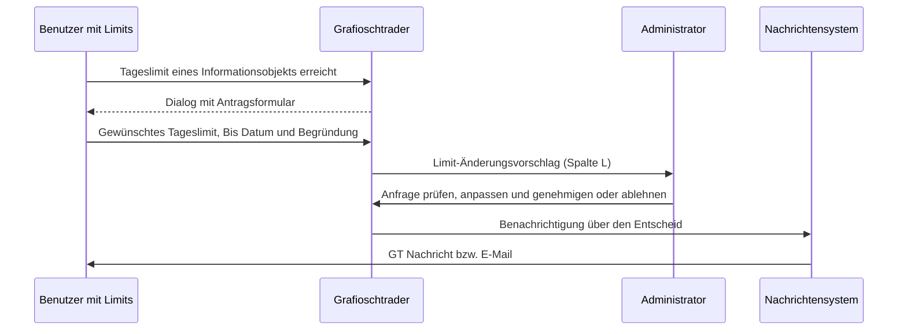

Für die Bearbeitung dieser Daten werden die Rechte des Administratoren benötigt. Die Benutzerverwaltung ermöglicht Administratoren die vollständige Kontrolle über alle Benutzerkonten. Neben der Vergabe der Rolle können hier auch Ausnahmen für die Limiten der Rolle "Benutzer mit Limits" für eine bestimmte Informationsklasse festgelegt werden. Siehe dazu "[Benutzer mit Limits](https://grafioschtrader.github.io/gt-user-manual/de/intro/userrights/index.html#benutzer-mit-limits)". Zudem kann das Problem "[Schutz der Fremddaten und das Anfragelimit](//grafioschtrader.github.io/gt-user-manual/de/intro/userrights/index.html#schutz-der-fremddaten-und-das-anfragelimit)" nur durch die hier angebotene Funktionalität gelöst werden.

{}
Normale Benutzer können ihre eigenen Einstellungen wie Spitzname, Sprache und Passwort über das Hauptmenü ändern. Diese Funktionen erfordern keine Administratorrechte. Die hier beschriebenen Funktionen sind ausschliesslich für Administratoren verfügbar.
{}

## Benutzertabelle
Die Benutzertabelle zeigt alle registrierten Benutzer mit ihren wichtigsten Eigenschaften. Die Tabelle kann nach allen Spalten sortiert werden und bietet eine übersichtliche Darstellung aller relevanten Benutzerinformationen.

### Eigenschaften und Tabellenspalten
- **ID**: Die eindeutige interne Benutzer-ID.
- **Spitzname**: Der vom Benutzer gewählte Spitzname. Dieser wird möglicherweise für die Kennung statt der internen Benutzer-ID zu anderen Benutzern genutzt.
- **E-Mail**: Die E-Mail-Adresse des Benutzers, die auch als Login-Name dient. Diese kann nach der Registrierung nicht mehr geändert werden.
- **U**: Ein Symbol, das anzeigt, ob für diesen Benutzer ein Änderungsvorschlag vorliegt. Siehe Abschnitt [Änderungsvorschläge](#änderungsvorschläge).
- **L**: Ein Symbol, das anzeigt, ob für diesen Benutzer Limit-Änderungsvorschläge vorliegen.
- **Privilegierteste Rolle**: Die höchste Rolle, die dem Benutzer zugewiesen wurde. Mögliche Werte sind:
  - **Administrator**: Vollständige Administratorrechte
  - **Alles bearbeiten**: Kann alle Entitäten bearbeiten
  - **Benutzer**: Standard-Benutzerrechte
  - **Benutzer mit Limits**: Eingeschränkte Rechte mit konfigurierbaren Limits
- **Aktiv**: Zeigt an, ob der Benutzer sich anmelden kann. Deaktivierte Benutzer können sich nicht mehr einloggen.
- **Sprache und Land**: Die Spracheinstellung des Benutzers. Diese bestimmt die Sprache der Applikation und die Darstellung des Datums- und Zahlenformats.
- **Lokalzeit +/- gleich UTC**: Die Zeitzonenabweichung zur UTC-Zeit in Minuten. Diese wird verwendet, um Zeitangaben korrekt für den Benutzer anzuzeigen.
- **Verstoss Fremddaten/Datenlimit**: Zähler für Verstösse gegen den Schutz von Fremddaten. Wenn dieser Zähler einen konfigurierten Schwellenwert überschreitet, wird der Benutzer automatisch gesperrt.
- **Verstoss Anfragelimit**: Zähler für Überschreitungen des täglichen Anfragelimits. Auch hier führt das Überschreiten eines Schwellenwerts zur automatischen Sperrung des Benutzers.

### Expandierbare Zeile
Für Benutzer mit der Rolle "Benutzer mit Limits" können die konfigurierten Bearbeitungslimits eingesehen werden. Durch das expandieren der Zeile wird eine Detailansicht mit allen konfigurierten Limits angezeigt. Diese Limits beschränken die Anzahl der Erstellungs-, Änderungs- und Löschoperationen für bestimmte Informationsobjekte.

Die Detailansicht zeigt eine Tabelle mit folgenden Spalten:
- **Informationsobjekt**: Der Name des Objekttyps, für den das Limit gilt (z.B. Wertpapier, Watchlist, Konto).
- **L**: Ein Symbol, das anzeigt, ob für dieses Limit ein Änderungsvorschlag vorliegt.
- **Tageslimit**: Die maximale Anzahl an Erstellungs-, Änderungs- und Löschoperationen pro Tag für dieses Informationsobjekt.
- **Bis Datum**: Das Ablaufdatum des Limits. Nach diesem Datum wird das Limit automatisch nicht mehr angewendet.

## Benutzer bearbeiten
Über das Kontextmenü kann ein Benutzer bearbeitet werden. Dabei können folgende Eigenschaften geändert werden:

- **Spitzname**: Der Spitzname des Benutzers. Dieser muss mindestens 2 und maximal 30 Zeichen lang sein und innerhalb von Grafioschtrader eindeutig sein.
- **Privilegierteste Rolle**: Die höchste Rolle des Benutzers kann geändert werden. Die Auswahl erfolgt aus den verfügbaren Rollen (Benutzer mit Limits, Benutzer, Alles bearbeiten, Administrator).
- **Aktiv**: Über diese Checkbox kann ein Benutzer aktiviert oder deaktiviert werden. Deaktivierte Benutzer können sich nicht mehr anmelden.
- **Lokalzeit +/- gleich UTC**: Die Zeitzoneneinstellung in Minuten zur UTC-Zeit kann manuell angepasst werden, falls die automatische Erkennung nicht korrekt funktioniert. Erlaubte Werte liegen zwischen -720 und +720 Minuten.
- **Verstoss Fremddaten/Datenlimit**: Dieser Zähler kann zurückgesetzt werden, um einen gesperrten Benutzer wieder freizugeben. Der Wert kann zwischen 0 und 99 liegen.
- **Verstoss Anfragelimit**: Auch dieser Zähler kann zurückgesetzt werden, um die Sperre aufzuheben. Der Wert kann zwischen 0 und 99 liegen.

{}
Die E-Mail-Adresse kann nach der Registrierung nicht mehr geändert werden, da sie als Login-Name dient und für die Identifikation des Benutzers verwendet wird.
{}

## Benutzer-Bearbeitungslimits verwalten
Für Benutzer mit der Rolle "Benutzer mit Limits" können individuelle Bearbeitungslimits definiert werden. Diese Limits beschränken die Anzahl der täglichen Erstellungs-, Änderungs- und Löschoperationen für bestimmte Informationsobjekte. Dies ermöglicht eine granulare Kontrolle über die Aktivitäten eines Benutzers und ist besonders nützlich für neue Benutzer oder Benutzer mit eingeschränktem Vertrauen.

### Limit erstellen oder bearbeiten
Über das Kontextmenü **Benutzer-Bearbeitungslimit erstellen/ändern** kann ein neues Limit erstellt oder ein bestehendes bearbeitet werden. Dabei können folgende Eigenschaften festgelegt werden:

- **Informationsobjekt**: Auswahl des Objekttyps, für den das Limit gelten soll. Die verfügbaren Informationsobjekte werden aus dem System geladen und umfassen typischerweise Entitäten wie Wertpapier, Watchlist, Konto, Portfolio, Transaktion und viele weitere. Nach der Erstellung kann das Informationsobjekt nicht mehr geändert werden.
- **Tageslimit**: Die maximale Anzahl an Erstellungs-, Änderungs- und Löschoperationen, die der Benutzer pro Tag für dieses Informationsobjekt durchführen kann. Der Wert muss zwischen 0 und 999 liegen.
- **Bis Datum**: Das Datum, bis zu dem dieses Limit gültig ist. Nach Ablauf dieses Datums wird das Limit automatisch nicht mehr angewendet. Dies ermöglicht zeitlich begrenzte Einschränkungen, beispielsweise während einer Testphase.

Die konfigurierten Limits werden in der expandierbaren Tabellenzeile unterhalb des jeweiligen Benutzers angezeigt. Über das Kontextmenü der Limit-Tabelle können einzelne Limits bearbeitet oder gelöscht werden.

{}
Limits sind besonders nützlich, um neuen Benutzern zunächst eingeschränkten Zugriff zu gewähren. Nach einer Bewährungsphase können die Limits erhöht oder ganz entfernt werden, indem die Rolle des Benutzers auf "Benutzer" oder höher geändert wird.
{}

## Besitzer von Entitäten wechseln
In bestimmten Fällen kann es notwendig sein, den Besitzer von Entitäten auf einen anderen Benutzer zu übertragen. Dies kann beispielsweise der Fall sein, wenn ein Benutzer das System verlässt, wenn Daten konsolidiert werden sollen oder wenn ein Administrator Testdaten von einem Benutzer übernehmen möchte.

Über das Kontextmenü kann die Funktion **Besitzer von Entitäten wechseln** ausgewählt werden. Dabei wird der aktuell in der Tabelle ausgewählte Benutzer als Quellbenutzer betrachtet, und es muss ein Zielbenutzer aus einer Liste ausgewählt werden. Alle Entitäten, die der Quellbenutzer erstellt hat, werden dann dem Zielbenutzer zugeordnet. Dies betrifft alle Arten von Entitäten wie Wertpapiere, Watchlists, Portfolios, Konten, Transaktionen und weitere.

{}
Diese Operation kann nicht rückgängig gemacht werden. Die Anzahl der übertragenen Entitäten wird nach Abschluss der Operation angezeigt.
{}

## Änderungsvorschläge
Grafioschtrader verfügt über ein System für Änderungsvorschläge, das automatisch aktiviert wird, wenn ein Benutzer gegen Daten- oder Anfragelimits verstösst. Jede Rolle kann gegen diese Limits gesperrt werden. Wenn ein Verstoss auftritt, wird dem betroffenen Benutzer automatisch ein Dialog angezeigt, über den er eine Anfrage an die Administratoren stellen kann. Mit dem Absenden dieses Dialogs wird der Änderungsvorschlag ausgelöst.

### Entstehung von Änderungsvorschlägen
Änderungsvorschläge entstehen nicht durch manuelle Anfragen, sondern automatisch aufgrund von Verstössen:

1. Ein Benutzer überschreitet ein konfiguriertes Limit (Daten- oder Anfragelimit)
2. Das System erkennt den Verstoss und erhöht den entsprechenden Verstoss-Zähler
3. Dem Benutzer wird automatisch ein Dialog angezeigt, der den Verstoss erklärt
4. Der Benutzer kann in diesem Dialog eine Begründung eingeben und um Entsperrung oder Limit-Erhöhung bitten
5. Durch Absenden des Dialogs wird der Änderungsvorschlag an die Administratoren übermittelt

### Arten von Änderungsvorschlägen

**Entsperrungsanfrage**: Wenn ein Benutzer aufgrund zu vieler Verstösse gegen Daten- oder Anfragelimits gesperrt wurde, wird ihm automatisch ein Dialog zur Entsperrungsanfrage angezeigt. Der Benutzer kann hier begründen, warum die Sperre aufgehoben werden soll. Der Administrator kann dann die Verstoss-Zähler zurücksetzen und den Benutzer wieder freigeben.

**Limit-Erhöhungsanfrage**: Wenn ein Benutzer mit Bearbeitungslimits das tägliche Limit für ein bestimmtes Informationsobjekt erreicht, wird automatisch ein Dialog angezeigt, über den der Benutzer eine Erhöhung seiner Limits beantragen kann. Der Administrator kann diese Anfrage prüfen und das Limit anpassen oder die Anfrage ablehnen.

### Ablauf einer Limit-Erhöhungsanfrage
Die Limit-Erhöhungsanfrage betrifft zwei Benutzerrollen sowie das Nachrichtensystem. Der folgende Ablauf zeigt das Zusammenspiel:

Erreicht ein Benutzer mit Limits das Tageslimit eines Informationsobjekts, erscheint automatisch ein Dialog. Das betroffene Informationsobjekt ist bereits vorgegeben und kann nicht geändert werden. Der Benutzer trägt das gewünschte Tageslimit, ein Bis Datum sowie eine Begründung ein und sendet den Antrag ab. Der Antrag erscheint beim Administrator als Limit-Änderungsvorschlag und wird in der Benutzertabelle mit dem Symbol in der Spalte **L** angezeigt. Der Administrator kann das beantragte Tageslimit und das Bis Datum vor der Genehmigung anpassen und entscheidet anschliessend über Genehmigung oder Ablehnung; in beiden Fällen wird der Benutzer über das [Nachrichtensystem]({}) informiert.

Pro Benutzer und Informationsobjekt gibt es höchstens ein Bearbeitungslimit. Eine Genehmigung erstellt entweder ein neues Limit oder erneuert das bestehende, indem Tageslimit und Bis Datum aktualisiert werden; auf diese Weise wird auch ein bereits abgelaufenes Limit wieder in Kraft gesetzt. Solange eine Anfrage für ein Informationsobjekt noch offen ist, kann der Benutzer für dasselbe Informationsobjekt keine zweite Anfrage stellen und erhält den Hinweis, dass bereits eine offene Anfrage besteht.

### Anzeige in der Benutzertabelle
Wenn für einen Benutzer Änderungsvorschläge vorliegen, werden diese in der Benutzertabelle durch Symbole angezeigt:
- **U** (Spalte): Zeigt an, dass ein Benutzer-Änderungsvorschlag (Entsperrungsanfrage) vorliegt
- **L** (Spalte): Zeigt an, dass ein Limit-Änderungsvorschlag vorliegt

Administratoren können diese Vorschläge über spezielle Funktionen bearbeiten und entscheiden, ob sie genehmigt oder abgelehnt werden. Bei Genehmigung werden die Verstoss-Zähler zurückgesetzt oder die Limits entsprechend angepasst.