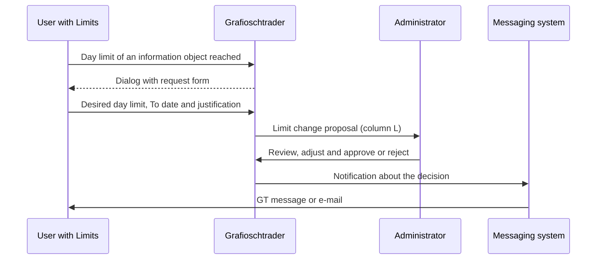

Administrator rights are required to edit this data. The user management allows administrators to have complete control over all user accounts. In addition to assigning roles, exceptions for the limits of a single user on a specific information class can also be defined here; the limits of the installation as a whole are managed in the [Limit information class]({}) view instead. See "[Users with Limits](https://grafioschtrader.github.io/gt-user-manual/intro/userrights/index.html#users-with-limits)". In addition, the problem "[Protection of external data and the request limit](//grafioschtrader.github.io/gt-user-manual/intro/userrights/index.html#protection-of-external-data-and-the-request-limit)" can only be solved through the functionality offered here.

{}
Normal users can change their own settings such as nickname, language and password via the main menu. These functions do not require administrator rights. The functions described here are exclusively available for administrators.
{}

## User Table
The user table shows all registered users with their most important properties. The table can be sorted by all columns and provides a clear overview of all relevant user information.

### Properties and Table Columns
- **ID**: The unique internal user ID.
- **Nickname**: The nickname chosen by the user. This may be used for your identifier instead of the internal user ID to other users.
- **Email**: The user's email address, which also serves as the login name. This cannot be changed after registration.
- **U**: A symbol that indicates whether there is a change proposal for this user. See section [Change Proposals](#change-proposals).
- **L**: A symbol that indicates whether there are limit change proposals for this user.
- **Most Privileged Role**: The highest role assigned to the user. Possible values are:
  - **Administrator**: Full administrator rights
  - **Edit All**: Can edit all entities
  - **User**: Standard user rights
  - **User with Limits**: Restricted rights with configurable limits
- **Enabled**: Indicates whether the user can log in. Disabled users can no longer log in.
- **Language and Country**: The user's language setting. This determines the language of the application and the display of the date and number format.
- **UTC Deviation in Minutes**: The time zone deviation from UTC time in minutes. This is used to display time information correctly for the user.
- **Violation of External Data/Data Limit**: Counter for violations of the protection of external data. If this counter exceeds a configured threshold, the user is automatically blocked.
- **Violation of Request Limit**: Counter for exceeding the daily request limit. Here too, exceeding a threshold leads to automatic blocking of the user.

### Expandable Row
The limits defined specifically for a user can be viewed. Expanding the row displays a detailed view with all limits recorded for this user. As a rule these are exceptions for users with the "User with Limits" role, restricting the number of create, update and delete operations per day on a specific information class.

The detailed view shows a table with the following columns:
- **Entity**: The information class for which the limit applies (e.g. security, watchlist, account).
- **Limit type**: What is being restricted, as a rule "Changes per day". See [Limit information class]({}).
- **L**: A symbol that indicates whether there is a change proposal for this limit.
- **Limit**: The value that must not be exceeded.
- **Valid until**: The expiration date of the limit. After this date, the limit will automatically no longer be applied. If the field is left empty, the limit applies indefinitely.

{}
This view shows the limits of the selected user only. The default value of a limit, as well as limits that apply to a whole user role, are managed in the [Limit information class]({}) view. There you also find every limit of this installation at a glance.
{}

## Edit User
A user can be edited via the context menu. The following properties can be changed:

- **Nickname**: The user's nickname. This must be at least 2 and at most 30 characters long and unique within Grafioschtrader.
- **Most Privileged Role**: The user's highest role can be changed. The selection is made from the available roles (User with Limits, User, Edit All, Administrator).
- **Enabled**: A user can be activated or deactivated via this checkbox. Disabled users can no longer log in.
- **UTC Deviation in Minutes**: The time zone setting in minutes to UTC time can be manually adjusted if automatic detection does not work correctly. Allowed values are between -720 and +720 minutes.
- **Violation of External Data/Data Limit**: This counter can be reset to unlock a blocked user. The value can be between 0 and 99.
- **Violation of Request Limit**: This counter can also be reset to remove the lock. The value can be between 0 and 99.

{}
The email address cannot be changed after registration because it serves as the login name and is used to identify the user.
{}

## Manage User-Related Limits
Individual limits can be defined for a single user, overriding the value that applies to their role. Mostly they restrict the number of daily create, update and delete operations on a specific information class. This enables granular control over a user's activities and is particularly useful for new users or users with limited trust.

### Create or Edit Limit
A new limit can be created or an existing one edited via the context menu. The same dialog is used as in the [Limit information class]({}) view, but without the selection of a role: here the limit always applies to the selected user. The following properties can be defined:

- **Entity**: Selection of the information class for which the limit should apply, together with the limit type. The selection is loaded from the system and comprises practically all information classes, that is security, watchlist, account, portfolio, transaction and many more. After creation this selection can no longer be changed, because it identifies the limit.
- **Limit type** and **Scope**: Result from the selection made, are merely displayed and cannot be edited.
- **Limit**: The maximum value, as a rule the number of create, update and delete operations the user can perform per day on this information class. Values from 1 to 1'000'000 are permitted, whereby a narrower restriction applies to individual limits.
- **Valid until**: The date until which this limit is valid. After this date expires, the limit will automatically no longer be applied. This enables time-limited exceptions, for example during a test phase. If the field is left empty, the limit is indefinite.

The recorded limits are displayed in the expandable table row below the respective user. Individual limits can be edited or deleted via the context menu of the limit table.

{}
Limits are particularly useful for initially granting new users restricted access. After a probationary period, the limits can be increased or removed entirely by changing the user's role to "User without limits" or higher.
{}

## Change Owner of Entities
In certain cases, it may be necessary to transfer the ownership of entities to another user. This may be the case, for example, when a user leaves the system, when data is to be consolidated, or when an administrator wants to take over test data from a user.

The function **Change Owner of Entities** can be selected via the context menu. The currently selected user in the table is considered the source user, and a target user must be selected from a list. All entities created by the source user are then assigned to the target user. This affects all types of entities such as securities, watchlists, portfolios, accounts, transactions and more.

{}
This operation cannot be undone. The number of transferred entities is displayed after the operation is completed.
{}

## Change Proposals
Grafioschtrader has a system for change proposals that is automatically activated when a user violates data or request limits. Any role can be blocked due to these limits. When a violation occurs, the affected user is automatically shown a dialog through which they can make a request to the administrators. Submitting this dialog triggers the change proposal.

### Creation of Change Proposals
Change proposals are not created through manual requests, but automatically due to violations:

1. A user exceeds a configured limit (data or request limit)
2. The system detects the violation and increases the corresponding violation counter
3. The user is automatically shown a dialog explaining the violation
4. The user can enter a justification in this dialog and request unlocking or limit increase
5. By submitting the dialog, the change proposal is transmitted to the administrators

### Types of Change Proposals

**Unlock Request**: When a user has been blocked due to too many violations of data or request limits, they are automatically shown a dialog for an unlock request. The user can justify here why the block should be lifted. The administrator can then reset the violation counters and release the user again.

**Limit Increase Request**: When a user with processing limits reaches the daily limit for a specific information object, a dialog is automatically displayed through which the user can request an increase in their limits. The administrator can review this request and adjust the limit or reject the request.

### Workflow of a Limit Increase Request
A limit increase request involves two user roles as well as the messaging system. The following sequence shows the interaction:

When a user with limits reaches the day limit of an information class, a dialog appears automatically. The information class concerned is already preset and cannot be changed. The user enters the desired day limit, a To date and a justification, then submits the request. The request appears to the administrator as a limit change proposal and is indicated in the user table by the symbol in column **L**. The administrator opens the request through the expanded row of the user, can adjust the requested value and the expiry date before approval, and then decides on approval or rejection; in both cases the user is notified via the [messaging system]({}).

There is at most one limit of this kind per user and information class. An approval either creates a new limit or renews the existing one by updating the value and the expiry date; this also reactivates a limit that has already expired. As long as a request for an information class is still open, the user cannot submit a second request for the same information class and is informed that a request is already pending.

### Display in the User Table
If there are change proposals for a user, these are indicated in the user table by symbols:
- **U** (column): Indicates that a user change proposal (unlock request) exists
- **L** (column): Indicates that a limit change proposal exists

Administrators can process these proposals via special functions and decide whether they are approved or rejected. Upon approval, the violation counters are reset or the limits are adjusted accordingly.
