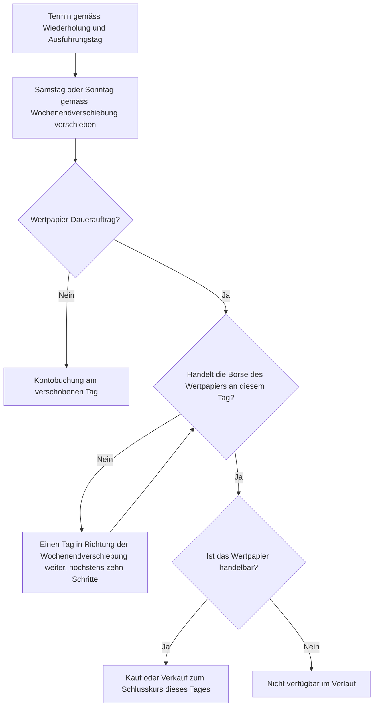

{}
Die Implementierung von Alarmen und regelbasiertem Handel ist noch nicht vollständig abgeschlossen. Diese Dokumentation beschreibt die geplante und teilweise bereits umgesetzte Funktionalität.
{}
Konto- und Wertpapier-Daueraufträge sind mit der historischen Wiederholung kompatibel. Mit einem Konto-Dauerauftrag lässt sich beispielsweise nachbilden, dass während der Wiederholung regelmässig neues Geld in die Simulationsumgebung fliesst. Ein Wertpapier-Dauerauftrag bildet einen Sparplan nach, der in festen Abständen ein bestimmtes Wertpapier kauft oder verkauft, unabhängig von den Strategien und Umschichtungen der Wiederholung.

## Dauerauftrag für eine Wiederholung einrichten

1. Erstellen Sie die Simulationsumgebung und wechseln Sie mit **Zur Simulation wechseln** in diese Umgebung.
2. Öffnen Sie **Daueraufträge**. Es stehen **Dauerauftrag Konto** und **Dauerauftrag Wertpapier** zur Verfügung.
3. Erstellen Sie den Dauerauftrag für Konten der Simulation. Ein Konto-Dauerauftrag unterstützt **Einzahlung**, **Auszahlung**, **Kontozins** und **Konto- und Depotkosten**, ein Wertpapier-Dauerauftrag **Kaufen** und **Verkaufen** mit einer festen **Anzahl** oder einem **Investitionsbetrag**.
4. Legen Sie Wiederholung, Ausführungstag, Wochenendverschiebung sowie **Gültig ab** und **Gültig bis** so fest, dass die gewünschten Termine nach dem Eröffnungsdatum und spätestens am Enddatum der Wiederholung liegen.
5. Wechseln Sie mit **Zum Hauptmandanten wechseln** zurück. Starten Sie dort über das Kontextmenü der Simulationsumgebung mit **Wiederholung starten...** die historische Wiederholung.

{}
Daueraufträge des Hauptmandanten werden beim Erstellen einer Simulationsumgebung nicht kopiert. Erfassen Sie die gewünschten Daueraufträge deshalb innerhalb der Simulation. So können Sie für verschiedene Simulationsumgebungen unterschiedliche Sparraten oder Laufzeiten vergleichen.
{}

Beim Start hält GT die Konfiguration der Daueraufträge zusammen mit den übrigen Eingaben des Laufs fest. Änderungen, die Sie danach an einem Dauerauftrag vornehmen, gelten erst für die nächste Wiederholung. Eine erneute Wiederholung stellt zuerst den Eröffnungszustand wieder her und erzeugt die Transaktionen der festgehaltenen Daueraufträge neu; es entstehen keine doppelten Buchungen.

## Ausführung innerhalb der Wiederholung

GT erzeugt einen Terminplan vom **Gültig ab**- bis zum **Gültig bis**-Datum. Termine am oder vor dem Eröffnungsdatum werden nicht gebucht. Daueraufträge werden vor den übrigen Vorgängen ihres Ausführungstages gebucht, zuerst die Konto- und danach die Wertpapier-Daueraufträge. Das eingezahlte Geld kann somit bei der anschliessenden Bewertung, Umschichtung und Strategieauswertung desselben Tages verwendet werden.

Bei Konto-Daueraufträgen verschiebt GT nur Samstage und Sonntage gemäss **Auf früheren Tag verschieben** oder **Auf späteren Tag verschieben**. Feiertage werden nicht übersprungen. Ein wirksamer Termin kann deshalb auch auf einen Tag fallen, an dem die Börsen geschlossen sind; die Kontobuchung wird trotzdem erzeugt.

Ein Wertpapier-Dauerauftrag wird dagegen wie im täglichen Betrieb auf einen Handelstag der Börse seines Wertpapiers gelegt. Fällt der Termin auf einen Feiertag dieser Börse, rückt GT ihn in Richtung der gewählten Wochenendverschiebung auf den nächsten Handelstag. Findet sich innerhalb von zehn Tagen keiner, wird der Termin nicht ausgeführt. Ebenso entfällt ein Termin, an dem das Wertpapier nicht mehr gehandelt werden kann, weil sein Enddatum erreicht ist oder der Handel nach einem Konkurs eingestellt wurde.

Für den Kurs des Wertpapiers und für einen Betrag in einer Fremdwährung verwendet GT ausschliesslich Kurse vom Ausführungstag oder aus den davorliegenden Tagen innerhalb der **Kurstoleranz (Tage)**. Ein zukünftiger Kurs darf in einer Simulation nicht verwendet werden. Deshalb kann die Kurstoleranz dort höchstens null sein; ihr Betrag bestimmt, wie viele Tage GT rückwärts suchen darf. Eine hinterlegte Betragsformel und feste Transaktionskosten werden wie beim gewöhnlichen Konto-Dauerauftrag angewendet.

## Kosten eines Wertpapier-Dauerauftrags

Ein Wertpapier-Dauerauftrag rechnet in der Wiederholung genau so wie im täglichen Betrieb. Die Stückzahl, die Steuer- und Transaktionskosten sowie der Betrag auf dem Konto ergeben sich aus den Angaben des Dauerauftrags: der festen **Anzahl** oder dem **Investitionsbetrag**, den Einstellungen **Betrag inkl. Kosten** und **Bruchstücke erlaubt** sowie den festen Kosten oder der **Steuerkosten-Formel** und der **Transaktionskosten-Formel**. Das Gebührenmodell des Depots wird für diese Buchungen nicht angewendet; es gilt nur für die Aufträge, welche die Wiederholung aus Strategien und Umschichtungen erzeugt. Reicht ein Investitionsbetrag nicht für ein ganzes Stück und sind keine Bruchstücke erlaubt, unterbleibt der Kauf.

## Einfluss auf Ergebnis und Verlauf

**Einzahlungen** und **Auszahlungen** gelten als externe Kapitalflüsse. Sie verändern das Kontoguthaben, zählen aber nicht als Gewinn oder Verlust. Gesamtrendite, annualisierte Rendite, maximaler Rückgang und Sharpe-Ratio werden daher um diese Kapitalflüsse bereinigt. Kontozinsen sowie **Konto- und Depotkosten** sind dagegen Ertrag beziehungsweise Aufwand und fliessen in die Rendite ein. Käufe und Verkäufe eines Wertpapier-Dauerauftrags tauschen nur Geld gegen Wertpapiere und sind deshalb keine Kapitalflüsse; ihre Kosten mindern die Rendite.

Ein Wertpapier, das allein ein Dauerauftrag kauft, wird wie jedes andere Wertpapier der Umgebung behandelt: Es wird täglich bewertet, erhält seine Ausschüttungen und wird am Ende seiner Laufzeit zurückbezahlt oder geschlossen.

Jede erfolgreiche Buchung erscheint im Verlauf als **Konto-Dauerauftrag** beziehungsweise **Wertpapier-Dauerauftrag** und als gewöhnliche Transaktion der Simulation. Schlägt ein Termin fehl, zeigt der Verlauf **Nicht verfügbar** mit dem betroffenen Dauerauftrag; die Wiederholung läuft mit den folgenden Terminen weiter. Mögliche Ursachen sind insbesondere:

- Es gibt keinen historischen Kurs oder Wechselkurs innerhalb der rückwärts gerichteten Toleranz.
- Das Konto ist nicht mehr vorhanden oder am Termin nicht mehr aktiv.
- Die Börse des Wertpapiers handelt innerhalb von zehn Tagen an keinem Tag, oder das Wertpapier ist nicht mehr handelbar.
- Ein Verkauf übersteigt den Bestand, oder ein Kauf übersteigt das verfügbare Guthaben des Kontos.
- Ein Ausdruck in einer Formel ist ungültig.

Erreicht eine Buchung das Transaktionslimit, wird die Wiederholung dagegen abgebrochen. Fehlgeschlagene Termine werden nicht zusätzlich in die allgemeine Fehlerliste der Daueraufträge eingetragen. Für eine historische Wiederholung ist deren Verlauf die massgebende Aufzeichnung.

## Zusammenspiel mit Strategien

Eine Buchung eines Wertpapier-Dauerauftrags gehört zu keiner Strategie. Kauft ein Dauerauftrag ein Wertpapier, das auch eine Mean-Reversion-Strategie verwaltet, gelten diese Stücke wie ein manueller Kauf als nicht zugeordnet. Die Strategie meldet dann «Bestehende Buchungen zuerst ihren Strategien zuordnen». Die Portfolio-Neugewichtung sieht die Stücke dagegen als gewöhnlichen Bestand: Kauft ein Sparplan ein Wertpapier der Zielallokation, gleicht die nächste Umschichtung den dadurch entstandenen Überhang wieder aus. Lassen Sie einen Wertpapier-Dauerauftrag deshalb vorzugsweise Wertpapiere kaufen, die keine Strategie der Wiederholung verwaltet.

## Einschränkungen

- Ein Dauerauftrag muss zu einem Konto und gegebenenfalls zu einem Depot derselben Simulationsumgebung gehören.
- Nur Termine nach dem Eröffnungsdatum und bis einschliesslich Enddatum werden gebucht.
- Die Wiederholung verwendet nie Kurse oder Wechselkurse nach dem jeweiligen Ausführungstag.
- Wertpapier-Daueraufträge verwenden ihre eigenen Kosten und nie das Gebührenmodell des Depots.
- Buchungen von Wertpapier-Daueraufträgen sind keiner Strategie zugeordnet.
- Während eines laufenden Laufs vorgenommene Änderungen gehören nicht mehr zu dessen festgehaltenen Eingaben.
- Die normalen Hintergrundausführungen für Daueraufträge verarbeiten ausschliesslich Hauptmandanten. Simulationsaufträge werden nur durch eine historische Wiederholung fortgeschrieben.
