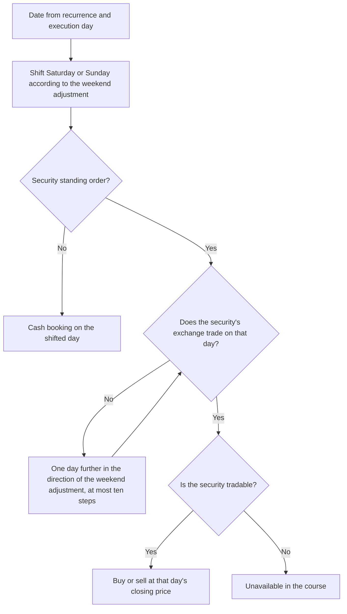

{}
The implementation of alerts and rule-based trading is not yet complete. This documentation describes the planned and partially implemented functionality.
{}
Cash and security standing orders are compatible with Historical Replay. A cash standing order lets a replay model, for example, new money regularly entering the simulation environment. A security standing order models a savings plan that buys or sells a particular security at fixed intervals, independently of the replay's strategies and rebalancing.

## Setting up a standing order for a replay

1. Create the simulation environment and enter it with **Switch to simulation**.
2. Open **Standing orders**. Both **Standing order cash** and **Standing order security** are available.
3. Create the standing order for accounts of the simulation. A cash standing order supports **Deposit**, **Withdrawal**, **Account interest**, and **Account/Depot cost**; a security standing order supports **Buy** and **Sell** with a fixed number of units or an **Invest amount**.
4. Set the recurrence, execution day, weekend adjustment, **Valid from**, and **Valid to** so that the required dates fall after the opening date and no later than the replay end date.
5. Return with **Switch to main tenant**. From there, use the simulation environment's context menu to start the historical replay with **Start replay...**.

{}
Standing orders from the main tenant are not copied when a simulation environment is created. Define the required standing orders inside the simulation. This lets different simulation environments compare different savings amounts or periods.
{}

When a run starts, GT records the standing-order configuration together with the other run inputs. Changes made to an order afterwards apply only to the next replay. A repeated replay first restores the opening state and then recreates the transactions from the recorded orders, so it does not append duplicate bookings.

## Execution during the replay

GT creates a schedule from **Valid from** through **Valid to**. Dates on or before the opening date are not booked. Standing orders are booked before the other events on their effective date, cash standing orders first and security standing orders after them. Deposited money can therefore be used by the valuation, rebalancing, and strategy evaluation that follow on the same day.

For cash standing orders, GT shifts only Saturdays and Sundays according to **Shift to earlier day** or **Shift to later day**. Public holidays are not skipped. An effective date can therefore fall on a day on which the exchanges are closed; the cash booking is still created.

A security standing order, by contrast, is placed on a trading day of its security's exchange, as in daily operation. If the date falls on a holiday of that exchange, GT moves it to the next trading day in the direction of the chosen weekend adjustment. If none is found within ten days, the occurrence is not executed. An occurrence is likewise skipped on a day on which the security can no longer be traded, because its end date has been reached or trading was stopped after a bankruptcy.

For the price of the security and for an amount in a foreign currency, GT uses only prices from the effective date or an earlier date within the **Quote tolerance (days)**. A simulation may not use a future price. Its quote tolerance can therefore be no greater than zero; its magnitude determines how many days GT may search backwards. A configured amount formula and fixed transaction cost are applied in the same way as for an ordinary cash standing order.

## Costs of a security standing order

A security standing order calculates in the replay exactly as in daily operation. The units, the tax and transaction costs and the amount booked on the account follow from the standing order itself: the fixed number of units or the **Invest amount**, the settings **Amount includes costs** and **Fractional units**, and the fixed costs or the **Tax cost formula** and **Transaction cost formula**. The fee model of the securities account is not applied to these bookings; it applies only to the orders the replay creates from strategies and rebalancing. If an invest amount does not buy a whole unit and fractional units are not allowed, the purchase is skipped.

## Effect on results and the course

**Deposits** and **withdrawals** are external capital flows. They change the cash balance but do not count as profit or loss. Total return, annualized return, maximum drawdown, and Sharpe ratio are therefore adjusted for those flows. Account interest and **Account/Depot cost**, on the other hand, are income or expense and affect return. Purchases and sales of a security standing order merely exchange cash for securities and are therefore not capital flows; their costs reduce the return.

A security bought only by a standing order is treated like every other security of the environment: it is valued daily, receives its distributions and is redeemed or closed at the end of its life.

Every successful booking appears in the course as **Cash standing order** or **Security standing order** and as an ordinary transaction of the simulation. If an occurrence fails, the course shows **Unavailable** with the affected order; the replay continues with later dates. Possible causes include:

- There is no historical price or exchange rate within the backward-looking tolerance.
- The account no longer exists or is no longer active on that date.
- The security's exchange does not trade on any day within ten days, or the security is no longer tradable.
- A sale exceeds the holding, or a purchase exceeds the available balance of the account.
- An expression in a formula is invalid.

If a booking reaches the transaction limit, however, the replay is stopped. Failed occurrences are not also written to the general standing-order failure list. For a Historical Replay, its course is the authoritative record.

## Interaction with strategies

A booking of a security standing order belongs to no strategy. If a standing order buys a security that a mean reversion strategy also manages, those units count as unassigned, like a manual purchase. The strategy then reports "Assign existing fills to their strategies first". Portfolio rebalancing, on the other hand, sees the units as an ordinary holding: if a savings plan buys a security of the target allocation, the next rebalancing evens out the resulting overweight again. It is therefore preferable to let a security standing order buy securities that no strategy of the replay manages.

## Limitations

- A standing order must refer to an account and, where applicable, a securities account of the same simulation environment.
- Only dates after the opening date and up to and including the end date are booked.
- The replay never uses prices or exchange rates later than the effective date.
- Security standing orders use their own costs and never the fee model of the securities account.
- Bookings of security standing orders are not assigned to any strategy.
- Changes made while a run is in progress are not part of its recorded inputs.
- The normal background execution of standing orders processes main tenants only. Simulation orders advance only through a Historical Replay.
