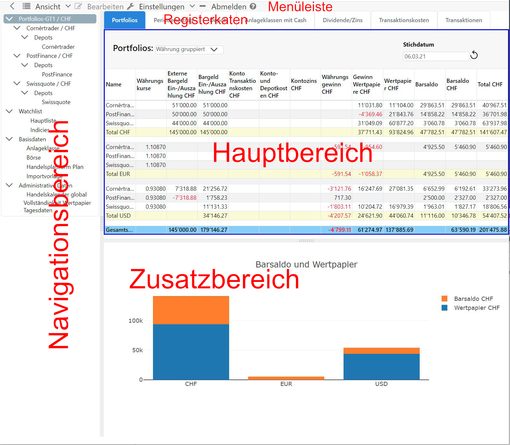

Die Anwendung findet in einem Webbrowser statt, daher ist GT eine **Client-Server-Anwendung**. Üblicherweise wird hierbei von einer **Client-Server-Anwendung** gesprochen, die ein **Front-End** und einen **Server** als **Back-End** beinhalten. Der **Client** ist eine **Einzelseiten-Webanwendung** die nach dem **Anmeldung** aus einem einzigen HTML-Dokument besteht. Es werden dynamisch einzelne Seitenbereiche aufgefrischt oder ausgetauscht. Der **Server** wird nach dem Aufruft der ersten Seiten von GT zu einem reinen Datenlieferanten für den Client. Die Benutzergerechte Aufbereitung der Daten wird durch den Webbrowser erledigt.


## Unterteilung Benutzeroberfläche
Nebst der **Menüleiste** unterteilt sich die Benutzeroberfläche in drei Teile, dem **Navigationsbereich**, **Hauptbereich** und dem **Zusatzbereich**. Mit dem Verschieben des **Trennbalken** zwischen diesen Bereichen, können Sie die Grösse der Bereiche gemäss Ihren Ansprüchen anpassen. Falls der aktuelle **Inhalt** einen **Befehl** implementiert, kann dieser Bereich aktiviert werden. Die Aktivierung wird durch einen **blauen Rahmen** dargestellt. Durch diese Aktivierung werden die Menüs **Ansicht** und **Bearbeiten** entsprechend dem aktiven Inhalt angepasst. Die **Menüpunkte** des Untermenüs **Bearbeiten** sind auch im **Kontextmenü** vorhanden, damit können häufig angewendete Befehle schneller erreicht werden. Sehr oft genutzte Funktionen des Untermenüs **Ansicht** können auch im **Kontextmenü** verfügbar sein. In einem **Desktop Webbrowser** erscheint das Kontextmenü mit dem **Maus-Rechtsklick**.

#### Menüleiste
Die Menüpunkte **Einstellung** und **Abmelden** und **Hilfe** sind statisch.
{}
**Warum die rechte Maustaste?**\
Bei bestimmten Entität kann eine Vielzahl von Befehlen angewendet werden. Die Umsetzung mit Schaltflächen würde sehr viel Raum beanspruchen.
{}

#### Navigationsbereich 
Der **Navigationsbereich** enthält den **Navigationsbaum**, über diesen wird der Inhalt des **Hauptbereiches** gesteuert. Die **Navigation** ist hierarchisch gegliedert und hat eine Durchmischung von **statischen Elementen** wie beispielsweise "Watchlist" und **dynamischen Elementen** die aus Ihren Daten abgeleitet werden. Die Elemente der obersten Ebene werden **Hauptelemente** genannt. Das erste Hauptelement ist **Dashboard**, sofern diese Funktion für die Installation eingeschaltet ist; siehe [Dashboard]({}). Hinter jedem **Element** gibt es Funktionalität, d.h. der Inhalt des **Hauptbreices** ändert sich mit der Wahl eines Elementes unabhängig davon, ob es sich um ein **Haupt-** oder **Unterelement** handelt.

#### Hauptbereich mit Daten
Der **Hauptbereich** reflektiert den Inhalt des gewählten Elementes im **Navigationsbbaum**. In diesem Bereich werden die Daten in Tabellen oder anderen Strukturen angezeigt. Oftmals ist der Hauptbereich in **Registerkaten** unterteilt. Durch Anklicken des entsprechenden **Reiters** wird eine andere Registerkarte in den Vordergrund geholt.

#### Zusatzbereich mit Grafiken und Daten
Der **Zusatzbereich** ist unterhalb des Hauptbereiches angeordnet. Dessen Inhalt wird weitgehend durch die Interaktionen im **Hauptbereich** gesteuert, beispielsweise durch die Anzeige einer Grafik zu den Daten im Hauptbereich. Dieser Bereich wird nicht automatisch gelöscht oder überschrieben, damit steht der Inhalt nicht zwangsläufig im Zusammenhang mit der Anzeige des **Hauptbereichs**.

{}
**Warum diese drei Bereiche?**\
Neue Funktionalität lässt sich einfache in diese drei Bereiche integrieren. Der Navigationsbereich kann in die Tiefe und Breite wachsten. Der Hauptbereich kann mit Reiter ergänzt werden und im Zusatzbereich lässt sich verschiedenes abbilden.
{}

## Dialoge
Die Erfassung von Daten durch den Benutzer findet ausschliesslich über **Modal-Dialoge** statt. Ein Modal-Dialog öffnet sich im Vordergrund und reduziert die Benutzerinteraktion auf diesen Dialog. Die Sichtbarkeit eines Modal-Dialog wird durch eine **Lightbox** erkennbar, dabei verdunkelt sich die Webseite im Hintergrund. Der Modal-Dialog ermöglicht eine Erfassung von **Entitäten** wie Transaktionen ohne gegen das Konzept einer **Einzelseiten-Webanwendung** zu verstossen, d.h. die aktuelle Seite wird nicht verlassen.

Die Bearbeitung einer **Entität** in einem Dialog ist sehr interaktiv gestaltet. Die Eingabe des Benutzers verändert die Sichtbarkeit der **Eingabeelemente**, d.h. Eingabefelder werden sichtbar oder unsichtbar andere wiederum verändern ihre Interaktionsfähigkeit.

## YAML bearbeiten und prüfen {#yaml-editor}
Einige Einstellungen werden als YAML-Text erfasst: Gebührenmodelle, Token-Konfigurationen, Handelskalenderregeln, Simulationssteuermodelle, komplexe Strategien und Eröffnungsbestände für Depotgebühren. Der Editor hilft Ihnen beim Eingeben mit farbiger Darstellung, Vorschlägen für passende Felder und Werte sowie Erläuterungen, wenn Sie den Mauszeiger über ein Feld halten. In unterstützten Berechnungsfeldern schlägt er zudem die dort verfügbaren Variablen und Funktionen vor. Einrückungen gehören zur YAML-Struktur und müssen beim Bearbeiten erhalten bleiben.

Während der Eingabe erkennt der Editor Syntaxfehler und markiert die betroffene Stelle. Soweit verfügbar, nennt die Fehlermeldung Zeile und Spalte. **Prüfen** untersucht zusätzlich, ob Felder, Werte und gegebenenfalls Ausdrücke zum jeweiligen Modell passen. Die Prüfung bezieht sich auf den aktuellen Text und speichert nichts. Nach einer Änderung muss der neue Text erneut geprüft werden.

Eine erfolgreiche Prüfung bestätigt nicht, dass ein Modell die gewünschten Kosten oder Ergebnisse liefert. Nutzen Sie dazu die Tests und Vorschauen des jeweiligen Dialogs. Bei Handelskalenderregeln und Eröffnungsbeständen für Depotgebühren bestätigt die Meldung zunächst die Dokumentstruktur; Zusammenhänge wie geerbte Regelsätze oder die zugehörigen Simulationskonten werden zusätzlich beim Absenden geprüft.

**Speichern**, **Übernehmen** beziehungsweise das Starten einer Wiederholung prüfen die Eingaben erneut. Syntaxfehler, mehrfach verwendete Schlüssel innerhalb derselben Zuordnung und mehrere YAML-Dokumente in einem Eingabefeld werden abgewiesen. Wird die Prüfung oder das Speichern abgewiesen, bleibt der eingegebene Text im geöffneten Dialog für eine Korrektur erhalten. Kann die Prüfung nicht abgeschlossen werden, versuchen Sie sie erneut; ohne erfolgreiche Prüfung wird die Eingabe nicht übernommen. Eine Prüfung oder Vorschau speichert keine Änderungen.

Bereits gespeicherte fehlerhafte Konfigurationen können weiterhin geöffnet werden. Korrigieren Sie das YAML vor dem nächsten Speichern, auch wenn Sie nur eine andere Einstellung ändern möchten. Wo das YAML optional ist, können Sie es stattdessen leeren oder die angebotene Entfernen-Funktion verwenden. Die Bedeutung eines leeren Feldes hängt von der Funktion ab und wird im jeweiligen Kapitel erläutert. Ein inaktiver Strategieentwurf darf unvollständig bleiben; auch sein eingegebener YAML-Text muss jedoch syntaktisch gültig sein.

## Datum, Uhrzeit und Zeitzone
Kalendertage bleiben so erhalten, wie Sie sie erfassen: Ein Datum für einen Transfer, eine Kapitalmassnahme oder einen historischen Kurs verschiebt sich nicht durch Ihre Zeitzone. Auch Datum und Uhrzeit einer Transaktion bleiben die Angaben Ihrer Abrechnung; GT rechnet diese nicht in eine andere Zeitzone um.

Für die Datumauswahl in Auswertungen und für Prüfungen abgeschlossener Tage verwendet GT die aktuelle Zeitzone Ihres Browsers. «Heute» bei Depot- und Kontoauswertungen sowie «gestern» bei historischen Bewertungen, Performance, Kursgewinnern und Kursverlierern beziehen sich damit auf Ihren lokalen Kalendertag. Auch nach einer Zeitumstellung ist keine erneute Anmeldung nötig. Verfügbare Kurse und Börsenkalender können den letzten auswertbaren Tag weiterhin begrenzen.

Zeitpunkte von Systemereignissen, etwa Nachrichten und Wartungsfenster, werden in Ihrer lokalen Zeit angezeigt. Automatische Hintergrundläufe und tägliche Nutzungslimits richten sich dagegen nach UTC. Ihre lokale Mitternacht ist deshalb nicht unbedingt der Beginn eines neuen Verarbeitungstages auf dem Server.
