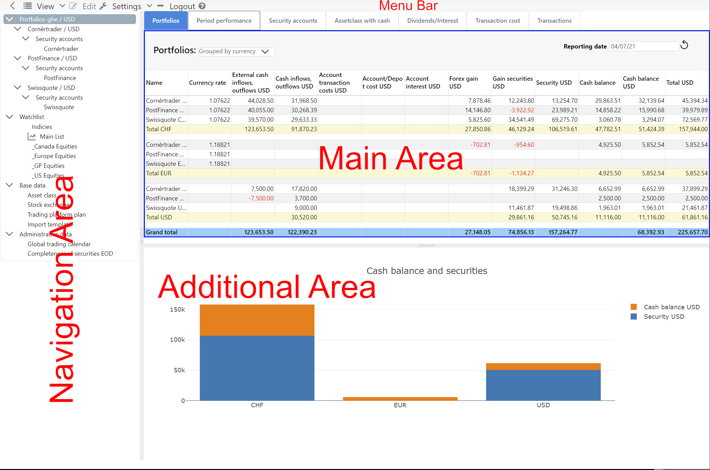

The application takes place in a web browser, therefore GT is a **client-serve application**. Usually, this is referred to as a **client-server application**, which includes a **front-end** and a **server** as **back-end**. The **client** is a **single page web application** that consists of a single HTML document after **login**. Individual page sections are dynamically refreshed or replaced. The **server** becomes a pure data provider for the client after the first pages of GT have been called. The user-friendly preparation of the data is done by the web browser.

## Subdivision user interface
Besides the **Menu bar**, the user interface is divided into three parts, the **Navigation Area**, **Main Area** and the **Additional Area**. By moving the **Divider** between these areas, you can adjust the size of the areas according to your needs. If the current **content** implements a **command**, this area can be activated. The activation is represented by a **blue frame**. This activation will adjust the **View** and **Edit** menus according to the active content. The **menu items** of the **Edit** submenu are also available in the **context menu**, so frequently used commands can be reached more quickly. In a **desktop web browser** the context menu appears with the **mouse right click**.

#### Menu bar
The **Setting** and **Logout** and **Help** menu items are static.
{}
**Why the right mouse button?**\
A large number of commands can be applied to certain entity. The implementation with buttons would take a lot of space.

{}

#### Navigation Area 
The **Navigation Area** contains the **Navigation tree**, via which the content of the **Main Area** is controlled. The **navigation** is hierarchically structured and has a mixture of **static elements** such as "Watchlist" and **dynamic elements** which are derived from your data. The first root element is **Dashboard** when that feature is enabled for the installation; see [Dashboard]({}).

#### Main Area with data
The **Main Area** reflects the content of the selected element in the **Navigation tree**. This area displays the data in tables or other structures. Often, the main area is divided into **tabs**. Clicking the corresponding **tab** brings another tab to the foreground.

#### Additional Area with graphics and data
The **Additional Area** is located below the main area. Its content is largely controlled by the interactions in the **Main Area**, for example, by displaying a graphic about the data in the **Main Area**.

{}
**Why these three areas?**\
New functionality can be easily integrated into these three areas. The navigation area can grow in depth and width. The main area can be supplemented with tabs and in the additional area various things can be mapped.
{}

## Dialog
The collection of data by the user takes place exclusively via **modal dialogs**. A model dialog opens in the foreground and reduces user interaction to this dialog. The visibility of a modal dialog is indicated by a **lightbox**, with the web page darkening in the background. The modal dialog allows **entities** like transactions to be captured without violating the concept of a **single page web application**, i.e. the current page is not left.

Editing an **entity** in a dialog is designed to be very interactive. The user's input changes the visibility of the **input elements**, i.e. input fields become visible or invisible others in turn change their interactivity.

## Editing and validating YAML {#yaml-editor}
Some settings are entered as YAML text: fee models, token configurations, trading calendar rules, simulation tax models, complex strategies, and opening custody balances. The editor helps you enter them with highlighting, suggestions for suitable fields and values, and explanations when you hover over a field. Supported calculation fields also suggest the variables and functions available in that context. Indentation is part of the YAML structure and must be preserved when editing.

As you type, the editor detects syntax errors and marks the affected location. Where available, the error message includes a line and column. **Validate** additionally checks whether fields, values and, where applicable, expressions fit the particular model. Validation checks the current text and saves nothing. After an edit, the revised text needs to be validated again.

Successful validation does not confirm that a model produces your intended costs or results. Use the tests and previews in the relevant dialog for that purpose. For trading calendar rules and opening custody balances, the success message initially confirms the document structure; relationships such as inherited rule sets or the simulation accounts involved are also checked on submission.

**Save**, **Apply**, or starting a replay checks the input again. Syntax errors, repeated keys within the same mapping, and multiple YAML documents in one field are rejected. If validation or saving is rejected, your entered text remains in the open dialog for correction. If validation cannot be completed, retry it; the input is not accepted without successful validation. Validation and previews do not save changes.

Previously saved invalid configurations can still be opened. Correct their YAML before saving again, even if you only want to change another setting. Where YAML is optional, you can instead clear it or use the removal action provided. The meaning of an empty field depends on the feature and is explained in its chapter. An inactive strategy draft may remain incomplete, but any YAML text entered must still be syntactically valid.

## Dates, times and time zones
Calendar dates stay as entered: the date of a transfer, corporate action or historical quote does not shift with your time zone. A transaction's date and time also retain the values from your statement; GT does not convert them into another time zone.

GT uses your browser's current time zone for report date selection and checks of completed days. “Today” in security and cash account reports, and “yesterday” in historical valuations, performance and holding movers, therefore refer to your local calendar day. You do not need to sign in again after a daylight-saving change. Available prices and exchange calendars can still limit the latest day that can be evaluated.

System events, such as messages and maintenance windows, display in your local time. Automatic background runs and daily usage limits follow UTC. Your local midnight therefore does not necessarily start a new processing day on the server.
