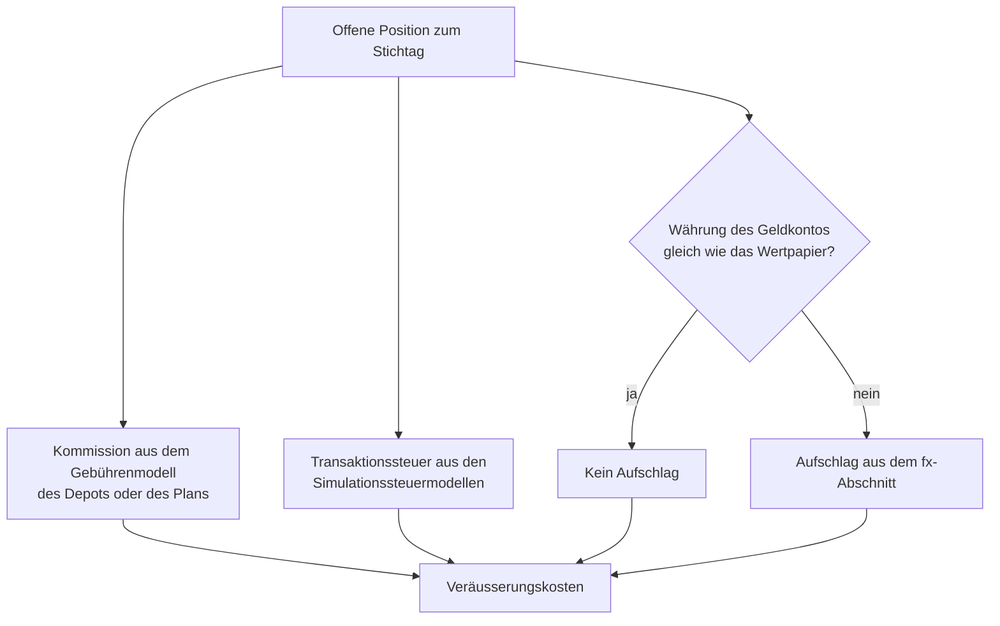

Auswertungen ist das, was der Benutzer von GT letztendlich interessiert. Die Auswertungen haben sehr unterschiedliche Schwerpunkte, daher gibt es unterschiedliche Reports.

## Performanceberechnung
Die Performance beantwortet die Frage, was das eingesetzte Geld eingebracht hat. Allgemein fliessen dabei fünf Grössen ein: die Kursveränderung der Anlagen, und zwar sowohl der bereits realisierte Gewinn aus Verkäufen als auch der noch nicht realisierte Gewinn der gehaltenen Bestände, die Erträge wie Dividenden und Zinsen, die Kosten wie Transaktionskosten, Steuern und Gebühren, bei Anlagen in einer Fremdwährung die Bewegung des Wechselkurses und schliesslich die Ein- und Auszahlungen. Diese letzte Grösse ist kein Ergebnis, sie verändert nur das eingesetzte Kapital und muss deshalb aus jeder Kennzahl der Performance herausgerechnet werden.

### Wie GT rechnet
GT berechnet jedes Ergebnis aus den erfassten Transaktionen und den historischen Kursen. Der **Gewinn Wertpapier** einer Position umfasst die realisierten und nicht realisierten Kursgewinne, die vereinnahmten Dividenden und Zinsen sowie die Transaktionskosten und Steuern der Käufe und Verkäufe. Der Einstandswert wird nach der Durchschnittskostenmethode geführt: Jeder Kauf erhöht ihn, ein Teilverkauf vermindert ihn anteilig zum durchschnittlichen Einstandspreis. Eine Zuordnung zu einzelnen Käufen, wie sie die Methoden FIFO oder LIFO vornehmen, gibt es nicht. Ist beim Klienten **Dividenden-Quellensteuer ausschliessen** gesetzt, zählen die Dividenden vor Abzug der Quellensteuer.

Den nicht realisierten Gewinn ermittelt GT mit einem hypothetischen Verkauf des ganzen Bestands zum letzten Kurs. Welche Kosten dabei vernachlässigt werden, beschreibt der Abschnitt [Abweichung zur Realität](#abweichung-zur-realität). Die Bewegung des Wechselkurses wird nicht mit dem Kursgewinn vermischt, sondern als [Währungsgewinn](#währungsgewinn) getrennt ausgewiesen.

Die Berichte beantworten dabei zwei verschiedene Fragen. [Portfolios und Portfolio]({}), [Depots]({}) und [Anlageklassen mit Cash]({}) sind Momentaufnahmen auf ein Stichdatum und zeigen Beträge, die seit der Eröffnung einer Position aufgelaufen sind. Der [Periodenertrag]({}) misst dagegen einen gewählten Zeitraum und rechnet die Ein- und Auszahlungen heraus, weshalb er auch Renditen in Prozent ausweist, siehe [Prozentangaben zur Vermögensänderung](#prozentangaben-zur-vermögensänderung).

Kosten, die nicht als Buchung erfasst werden, kennt GT nicht. Dazu gehören die Produktkosten innerhalb von Fonds (TER), Spreads und andere in den Kursen enthaltene Kosten. Aufgelaufene Zinsen einer Anleihe, die bis zum Stichtag noch nicht bezahlt wurden, schätzt GT ebenfalls nicht; die beim Kauf bezahlten und beim Verkauf erhaltenen Marchzinsen zählen dagegen mit.

### CFD und Forex
CFD und Forex sind [Margin basierte Transaktionen]({}). Eine Position wird eröffnet und mit einer oder mehreren Transaktionen ganz oder teilweise geschlossen, wobei GT jede Eröffnung einzeln mit ihrem eigenen Eröffnungskurs führt. Gebucht wird erst beim Schliessen, und zwar nur der Gewinn oder Verlust. Für die Performance hat das mehrere Folgen.

Zum Vermögen zählt bei einer offenen Position nur ihr noch nicht realisierter Gewinn oder Verlust und nicht ihr Marktwert, denn nur dieser Betrag würde beim Schliessen dem Konto gutgeschrieben oder belastet. Die Depots zeigen ihn in der Spalte **Konto relevant**, der Periodenertrag in der Zeile **Gewinn offene Margin Position**. Das Risiko der Position ist dagegen ihr voller Marktwert, das **Wertpapier Risiko**. Ein CFD mit einem Marktwert von 100'000 und einem offenen Gewinn von 100 trägt deshalb nur 100 zum Vermögen bei, bewegt dieses aber so, als ob 100'000 investiert wären. Aus demselben Grund hat er in der Spalte **Anteil %** nur einen kleinen Anteil.

Die **Finanzierungskosten** gehören zum Ergebnis der Position und nicht zu den Konto- und Depotkosten. Die Margin, also die Sicherheitsleistung beim Broker, bildet GT nicht ab, und offene Devisenpositionen werden nicht mit den Bargeldbeständen saldiert. Ein Verlust kann deshalb grösser werden als das vorhandene Bargeld, und das Vermögen kann auf null oder darunter fallen. Der Periodenertrag weist einen solchen Zeitraum als Totalverlust von −100 % aus, siehe [Grenzen der Kennzahlen]({}#grenzen-der-kennzahlen).

### Hebelfaktor und Wertpapier Risiko
Manche Instrumente bilden die Bewegung ihres Basiswerts mehrfach oder umgekehrt ab, etwa ein zweifach gehebelter oder ein inverser ETF. Diese Eigenschaft wird beim [Instrument]({}) im Feld **Gehebelt Inverse** erfasst. Der Faktor liegt zwischen −9.99 und 9.99, die Vorgabe ist 1, und ein negativer Wert kennzeichnet ein inverses Instrument. Erfassen lässt er sich nur bei den Finanzinstrumenten **ETF** und **Emittentenrisiko Produkt ETC/ETN usw.**

Der Hebelfaktor ändert weder den Wert noch den Gewinn einer Position, denn der Kurs eines gehebelten ETFs enthält den Hebel bereits. Er wirkt allein auf das **Wertpapier Risiko**, das GT als Marktwert multipliziert mit dem Hebelfaktor berechnet. Das Wertpapier Risiko zeigt, wie stark das Vermögen auf eine Bewegung des Basiswerts reagiert. Halten Sie beispielsweise 10 Stück eines zweifach inversen ETFs zum Kurs von 100, beträgt der Wert der Position 1'000, ihr Wertpapier Risiko aber −2'000. Ein negatives Vorzeichen bedeutet, dass die Position bei steigendem Basiswert verliert; dasselbe gilt für eine Short-Position. In einer Gruppensumme heben sich gegenläufige Positionen deshalb teilweise auf, etwa ein Aktien-ETF und ein inverser ETF auf denselben Index.

Bei CFD und Forex bleibt der Hebelfaktor 1. Ihr Hebel entsteht nicht durch das Instrument, sondern durch die Margin, und ihr Wertpapier Risiko ist der volle Marktwert der offenen Position, bei einem CFD unter Berücksichtigung des **Wert pro Punkt**. Die folgende Tabelle fasst zusammen, womit eine Position zum Vermögen und zum Risiko beiträgt.

| Instrument | Beitrag zum Vermögen | Wertpapier Risiko |
|---|---|---|
| Aktie, Anleihe, Fonds, ETF ohne Hebel | Marktwert | Marktwert |
| Gehebelter oder inverser ETF, ETC/ETN | Marktwert | Marktwert × Hebelfaktor |
| CFD und Forex | offener Gewinn oder Verlust | voller Marktwert |

Das Wertpapier Risiko erscheint als Spalte in den [Depots]({}) und in [Anlageklassen mit Cash]({}) sowie als Balken je Gruppe in deren Diagrammen. Beim Eröffnen einer Margin-Position wird es im gleichnamigen Feld der Transaktion berechnet, und der Periodenertrag führt es als eigene Zeile.

{}
In **GT** können viele **Zertifikate** auch als Instrument nachgebildet werden. **GT** kann aber die **Risiken** für die meisten **Strukturierten Produkte** (Zertifikate) nicht bestimmen, da diese oftmals ein **asymmetrisches Auszahlungsprofil** haben und GT die Eigenschaften der einzelnen Produkte nicht bekannt sind.
{}

## Prozentangaben zur Vermögensänderung
Eine prozentuale Vermögensänderung ist nur aussagekräftig, wenn sie die Ein- und Auszahlungen berücksichtigt. Wird der Gewinn einfach durch den Anfangsbestand geteilt, verfälscht jede Einzahlung während des Zeitraums das Ergebnis, und wer nicht dauernd voll investiert ist, erhält eine Zahl, die weder die Qualität der Anlagen noch die Verzinsung des Geldes beschreibt. GT weist Prozente deshalb nur dort aus, wo ein dafür geeignetes Verfahren angewendet wird:
- Der [Periodenertrag]({}#rendite-und-risiko) zeigt die zeitgewichtete Rendite, welche die Anlagen unabhängig vom Zeitpunkt der Geldflüsse beurteilt, und die geldgewichtete Rendite als internen Zinsfuss, welche die tatsächliche Verzinsung des eingesetzten Geldes beschreibt. Ab 360 Kalendertagen kommen die Werte p.a. dazu, ausserdem der maximale Rückgang, die Volatilität und in der Tabelle die zeitgewichtete Rendite jeder Woche bzw. jedes Jahres. Dort ist auch an einem Beispiel erklärt, weshalb die beiden Renditen verschieden sein können.
- Der [PDF-Bericht]({}) gibt dieselben Renditen in den Abschnitten **Vermögensentwicklung**, **Grafiken zur Wertentwicklung**, **Jährlicher Ertrag** und **Rendite, Risiko und Kosten** aus, beim jährlichen Ertrag je Kalenderjahr und für die Monate des letzten Jahres.
- Die Spalte **Gewinn %** der einzelnen Transaktionen, sichtbar beim Aufklappen einer Position in den Depots und in Anlageklassen mit Cash, setzt den Gewinn eines Verkaufs ins Verhältnis zum anteiligen Einstandswert und eine Dividende ins Verhältnis zum Einstandswert der Position. Sie ist in der Handelswährung gerechnet, berücksichtigt die Haltedauer nicht und ist keine Rendite des Vermögens.
- Die Spalte **Zeitrahmen %** der [Performanz Ansicht]({}) einer Watchlist misst die Kursentwicklung eines Instruments und nicht die Ihres Vermögens.
- Die [historische Wiederholung]({}) weist für eine simulierte Strategie eine **Gesamtrendite** und eine **Annualisierte Rendite** aus.

Die Stichtagsberichte **Portfolios**, **Depots** und **Anlageklassen mit Cash** zeigen keine Rendite. Ihre Spalte **Anteil %** ist der Anteil einer Position am Total und keine Wertveränderung.
{}
**Benchmarking zukünftige GT-Version**\
Ein Vergleich mit einem Benchmark fehlt bisher. Möglicherweise wird eine zukünftige GT-Version eine Simulation anbieten: Wie wäre die Performance, wenn dieselben Beträge zu denselben Zeitpunkten in den Benchmark investiert worden wären, im Vergleich zu den Investitionen, die real getätigt wurden.
{}

## Abweichung zur Realität
Für die Berechnung der Performance werden hypothetische Transaktionen durchgeführt. Beispielsweise müssten Wertpapiere verkauft und die Fremdwährungen gegen die Hauptwährung gekauft werden. Dazu werden hypothetische Verkäufe und Währungstransaktionen durchgeführt. Bei den Fremdwährungskursen wird der Mittelkurs genommen. In der Grundeinstellung werden dabei die Aufwendungen für Transaktionskosten und Steuern nicht berücksichtigt; Wert, Gewinn und Vermögen sind deshalb um die Kosten eines echten Verkaufs zu hoch. Diese Kosten kann GT schätzen, siehe den folgenden Abschnitt.

### Veräusserungskosten
Ist der Globalparameter **gt.disposal.cost.estimate** auf 1 gesetzt und hat der Klient die Schätzung nicht abgeschaltet, schätzt GT die [Veräusserungskosten]({}) des hypothetischen Verkaufs jeder offenen Position und weist sie getrennt aus. Die bestehenden Spalten für Wert und Gewinn bleiben unverändert, damit die Reports untereinander und mit den verbuchten Transaktionen abstimmbar bleiben. Der Parameter steht in der Grundeinstellung auf 0; nach einer Änderung muss sich der Benutzer neu anmelden, damit die zusätzlichen Spalten erscheinen. Steht er auf 1, kann jeder Klient die Schätzung für sich mit dem Auswahlkästchen **Veräusserungskosten schätzen** abschalten, siehe [Klient]({}); es ist in der Grundeinstellung gesetzt. Schätzung und Spalten gibt es nur, wenn beide Einstellungen eingeschaltet sind. Die Schätzung verwendet dieselben YAML-Regeln wie die [historische Wiederholung]({}) und besteht aus drei Teilen:
- Die **Kommission** stammt aus dem Gebührenmodell des [Depots]({}) oder, wenn dieses keine eigenen Kommissionsregeln hat, des [Handelsplattform Plans]({}). Freikontingente wie «ein Gratis-Trade pro Quartal» werden mit den bis zum Stichtag verbuchten Käufen und Verkäufen des Depots gezählt. Stuft das Modell nach dem Gesamtwert des Portfolios oder aller Portfolios ab, wird der gespeicherte [tägliche Gesamtwert]({}) des Tages vor dem Stichtag verwendet.
- Die **Transaktionssteuer** stammt aus den [Simulationssteuermodellen]({}), beispielsweise die Schweizer Umsatzabgabe. Dafür braucht es das **Händlerland** im Handelsplattform Plan und die Angabe **Steuerbefreiter Anleger** im Depot. Bei einer Anleihe zählt der Marchzins zum Geschäftswert.
- Der **Aufschlag bei der Währungsumrechnung** stammt aus dem fx-Abschnitt des Gebührenmodells, der unabhängig von den Kommissionsregeln vom Plan geerbt wird. Er fällt nur an, wenn das Geldkonto, auf das der Verkauf gebucht würde, eine andere Währung als das Wertpapier hat. Massgebend ist das Geldkonto des letzten Kaufs oder Verkaufs dieses Wertpapiers im Depot. Im Report [Portfolios](portfolios/) kommt für jedes Fremdwährungskonto der Aufschlag hinzu, den die Umrechnung seines Saldos samt dem Verkaufserlös der Wertpapiere in dieser Währung in die Hauptwährung kosten würde.

Liegt ein Wertpapier in mehreren Depots, wird der Bestand nach den Stücken jedes Depots aufgeteilt und jeder Anteil mit den Regeln seines Depots bewertet. CFD und Forex werden nicht geschätzt. Persönliche Einkommens- und Kapitalgewinnsteuern bleiben unberücksichtigt.

Die Reports [Depots](securityaccountreport/), [Anlageklassen mit Cash](securitycashaccountreport/) und [Portfolios](portfolios/) erhalten die Spalten **Veräusserungskosten** und **Wert nach Veräusserung** in der Hauptwährung, beide mit Gruppen- und Gesamtsumme. Die Zeile **Verkauf hypothetisch** in den aufgeklappten Transaktionen eines Wertpapiers enthält die geschätzten **Transaktionskosten** und **Steuer (jede Art)**; ihr Gewinn ist dann der Gewinn nach diesen Kosten. Der Aufschlag bei der Währungsumrechnung erscheint in dieser Zeile nicht, weil sie in der Währung des Wertpapiers abrechnet.

{}
Fehlt ein Gebühren- oder Steuermodell, trifft keine Regel zu oder fehlt eine benötigte Angabe, beispielsweise **Steuerbefreiter Anleger** = unbekannt bei einem Schweizer Händler, bricht der Report nicht ab. Der betroffene Teil gilt als unbekannt und wird nie als null gezählt. Die Zelle wird gelb hinterlegt, ebenso die Gruppen- und Gesamtsumme, in die sie einfliesst. Fährt man mit der Maus über einen Betrag in der Spalte **Veräusserungskosten**, nennt der Tooltip je Depot die angewendete Regel oder den Grund, weshalb ein Teil fehlt. Die Summe enthält dann nur die bekannten Teile.
{}

## Problematik Fremdwährung
Sobald eine Applikation Konten und Handel mit Fremdwährungen unterstützt, wird es Diskussionen über unterschiedliche Ansätze der Performance Berechnung geben. GT selbst is wissentlich nicht durchgehend konsistent was diese Berechnung betrifft. Beispielsweise werden im Report der **Portfolios** die Erträge und Aufwände für **Kontozins** bzw. **Konto- und Depotkosten** anders berechnet als im Report des Periodenertrags. Im ersteren werden die Erträge zum Transaktionsdatum in die Hauptwährung umgerechnet, beim Periodenertrag wird das Datum auf welche sich die Berechnung bezieht genommen. Die Umrechnung zum Transaktionsdatum ist die kaufmännisch übliche und deshalb die Voreinstellung. Wer diese Ungleichheit nicht will, hebt sie mit der Klienteneinstellung **Kosten und Zinsen zum Stichdatum umrechnen** auf; dann rechnet auch der Report der **Portfolios** diese beiden Grössen zum Stichdatum um, siehe [Klient](../tenantportfolio/client/). Vom **Währungsgewinn** gilt dies nicht, dieser wird im nächsten Abschnitt beschrieben und in allen Berichten gleich ermittelt; einzig die genannten Kosten- und Zinsbuchungen zählen nicht mehr zu ihm, wenn die Einstellung gesetzt ist.

## Währungsgewinn
Wer in einer Fremdwährung anlegt, erzielt sein Ergebnis aus zwei Quellen: aus dem Instrument selbst und aus der Bewegung des Wechselkurses. Der **Währungsgewinn** weist den zweiten Teil separat aus. Er beantwortet die Frage, wie viel des Ergebnisses allein daraus entstanden ist, dass sich der Kurs der Fremdwährung gegenüber Ihrer Hauptwährung verändert hat.

Das Prinzip ist einfach: Massgebend ist das Geld, das zum Stichdatum noch in der Fremdwährung steckt. Dieses wird zum Kurs des Stichdatums bewertet und mit dem Wert verglichen, den dasselbe Geld an den Tagen hatte, an denen es tatsächlich geflossen ist. Käufe, Verkäufe, Dividenden und Marchzinsen zählen dabei alle mit. Geld, das bereits wieder zurückgeflossen ist, etwa aus einem Verkauf oder einer Dividende, nimmt ab diesem Zeitpunkt nicht mehr an der Kursbewegung teil.

### Beispiel
Ein Beispiel macht den Zusammenhang deutlich. Die Hauptwährung ist CHF, gekauft werden 100 Einheiten eines Instruments zu USD 10.00 bei einem Kurs USD/CHF von 1.00. Bis zum Stichdatum steigt das Instrument auf USD 12.00, gleichzeitig fällt der Dollar auf einen Kurs von 0.80.

| | USD | CHF |
|---|---:|---:|
| Einsatz beim Kauf | 1'000.00 | 1'000.00 |
| Wert am Stichdatum | 1'200.00 | 960.00 |
| **Gewinn Wertpapier** | **+200.00** | **+160.00** |
| **Währungsgewinn** | | **-200.00** |
| **Total** | | **-40.00** |

Das Instrument hat um 20 Prozent zugelegt, und trotzdem steht die Position in CHF mit 40 Franken im Minus. Der Kursgewinn von USD 200.00 ist zum Stichdatum noch CHF 160.00 wert, dem steht ein Währungsverlust von CHF 200.00 auf dem eingesetzten Kapital gegenüber. Ein negativer Währungsgewinn bei steigendem Instrument ist also kein Widerspruch, sondern der Normalfall bei einer schwächer werdenden Fremdwährung.

{}
**Die beiden Spalten ergeben zusammen das Ergebnis**\
**Gewinn Wertpapier** in der Hauptwährung und **Währungsgewinn** ergeben zusammen immer genau das Ergebnis der Position in Ihrer Hauptwährung. Weichen die Zahlen von Ihrer Erwartung ab, fehlen in aller Regel Kursdaten des Instruments oder des Währungspaares.
{}

### Wo der Währungsgewinn erscheint
Der Währungsgewinn wird für Konten und für Wertpapiere nach demselben Verfahren berechnet, weshalb sich die Berichte gegenseitig als Kontrolle verwenden lassen. Er erscheint in [Portfolios und Portfolio]({}) für die Fremdwährungskonten, in [Depots]({}) und [Anlageklassen mit Cash]({}) für die einzelnen Wertpapiere sowie in der Transaktionsliste einer [Wertpapiertransaktion]({}) für jede einzelne Transaktion.

In der Spaltenüberschrift steht hinter der Bezeichnung die Hauptwährung, also beispielsweise «Währungsgewinn CHF».

## Allgemeine Darstellungen in Berichten
Bestimmte Darstellungformen in den Berichten werden allgemein angewandt und sind hier beschrieben.

### Farbliche Darstellung
Zur besseren Lesbarkeit und schnelleren Erfassung von Gewinnen und Verlusten verwendet der Report eine konsistente Farbcodierung:
- **Positive Werte** (Gewinne): Werden in der Standardtextfarbe oder in Grün dargestellt
- **Negative Werte** (Verluste): Werden in Rot dargestellt

Diese Farbcodierung gilt für die Gewinn-Spalten, wodurch auf einen Blick erkennbar ist, welche Anlageklassen und Wertpapiere positive Performance zeigen und welche Verluste aufweisen.

### Nachkommastellen je Währung
Beträge werden mit der für die jeweilige Währung sinnvollen Anzahl Nachkommastellen dargestellt. Für die meisten Währungen sind dies zwei Nachkommastellen. Eine Einheit des japanischen Yen (JPY) hat jedoch einen geringen Wert, daher werden Beträge in JPY ohne Nachkommastellen angezeigt. Umgekehrt hat eine Einheit der Kryptowährung Bitcoin (BTC) einen sehr hohen Wert, weshalb Beträge in BTC mit acht Nachkommastellen dargestellt werden. Diese Darstellung gilt für Geldbeträge wie Saldo, Kosten, Steuern oder Gewinn in den Berichten. Kurse und Wechselkurse sind davon ausgenommen, da diese eine feinere Auflösung mit bis zu acht Nachkommastellen benötigen.
Die Eingabe von Beträgen verhält sich entsprechend: In den Dialogen für Transaktionen und Daueraufträge ist die Anzahl der Nachkommastellen durch die Währung des jeweiligen Kontos bzw. Instruments begrenzt.
{}
**Globale Einstellung**\
Der Administrator legt die Nachkommastellen pro Währung über den globalen Parameter «gt.currency.precision» fest. Währungen ohne Eintrag verwenden zwei Nachkommastellen, ein Eintrag hat die Form «BTC=8,ETH=7,JPY=0». Eine Änderung wird für den Benutzer nach einer erneuten Anmeldung wirksam.
{}
### Diagramme
Die meisten Reports können ihre Zahlen zusätzlich als Diagramm darstellen. Das Diagramm wird über **Zeige Diagramm** im Menü **Ansicht** geöffnet und erscheint im [Zusatzbereich]({}), wo es stehen bleibt, während Sie im Hauptbereich weiterarbeiten. Die allgemeine Bedienung wie Legende, Tooltip und Zoom ist unter [Bedienelemente, Webspeicher und Eigenschaften]({}) beschrieben. Die folgende Tabelle zeigt, welcher Report welches Diagramm anbietet.

| Report | Diagramm |
|---|---|
| [Portfolios und Portfolio]({}#diagrammansicht) | Balken je Währung oder Portfolio mit Wertpapierwert und Barsaldo; nur bei **Portfolios** |
| [Periodenertrag]({}#4-diagrammansicht) | Linien mit dem täglichen Verlauf von Vermögen, Gewinn, Ein- und Auszahlungen |
| [Depots]({}#diagrammansicht) | Kreisdiagramm der Anteile, je nach Gruppierung mit Balken des Wertpapierrisikos |
| [Anlageklassen mit Cash]({}#diagrammansicht) | Balken des Wertpapierrisikos und Kreisdiagramm der Anteile je Anlageklasse |
| [Dividende und Zins]({}) | Sechs Diagramme der Erträge und Kosten, etwa die Verteilung auf die Monate; geöffnet über **Zeige Diagramme** |
| [Transaktionskosten]({}#diagrammansicht) | Streudiagramm der Transaktionskosten im Verhältnis zum Transaktionsbetrag |
| [Transaktionen]({}) | kein Diagramm |
