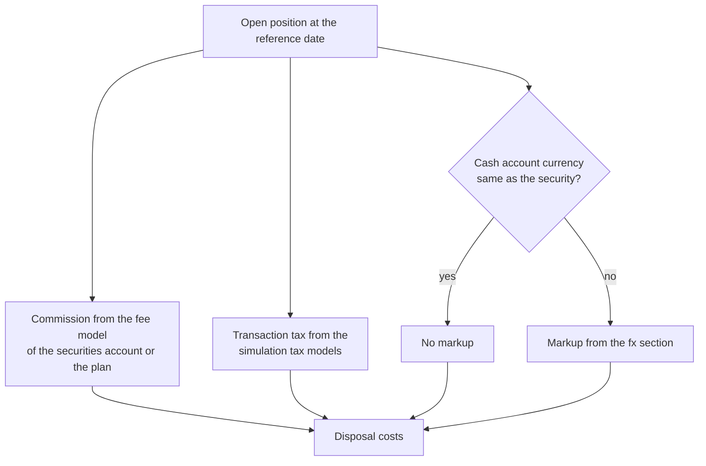

The analysis is what the user of GT is ultimately interested in. The evaluations have very different focuses, which is why there are different reports.

## Performance calculation
Performance answers the question of what the money invested has earned. In general, five quantities go into it: the price change of the investments, meaning both the gain already realised through sales and the not yet realised gain of the holdings, the income such as dividends and interest, the costs such as transaction costs, taxes and fees, for investments in a foreign currency the movement of the exchange rate, and finally the deposits and withdrawals. This last quantity is not a result; it only changes the capital invested and must therefore be removed from every performance figure.

### How GT calculates
GT calculates every result from the recorded transactions and the historical prices. The **Gain security** of a position comprises the realised and unrealised price gains, the dividends and interest received, and the transaction costs and taxes of the purchases and sales. The cost basis is kept using the average cost method: every purchase increases it, a partial sale reduces it proportionally at the average cost price. There is no assignment to individual purchases as the FIFO or LIFO methods make. If **Exclude dividend withholding tax** is set for the client, dividends count before deduction of the withholding tax.

GT determines the unrealised gain with a hypothetical sale of the entire holding at the last price. Which costs are neglected in doing so is described in the section [Deviation from reality](#deviation-from-reality). The movement of the exchange rate is not mixed with the price gain but shown separately as [Forex gain](#forex-gain).

The reports answer two different questions. [Portfolios and Portfolio]({}), [Security accounts]({}) and [Asset Classes with Cash]({}) are snapshots on a reference date and show amounts accumulated since a position was opened. The [Period performance]({}), on the other hand, measures a chosen period and removes the deposits and withdrawals, which is why it also shows returns in percent, see [Percentages for the change in assets](#percentages-for-the-change-in-assets).

GT does not know costs that are not recorded as a booking. These include product costs within funds (TER), spreads and other costs contained in the prices. GT also does not estimate interest accrued on a bond that has not yet been paid by the reference date; the accrued interest paid on purchase and received on sale does count, however.

### CFD and Forex
CFD and Forex are [margin-based transactions]({}). A position is opened and closed in full or in part with one or more transactions, and GT keeps every opening individually with its own opening price. Only closing produces a booking, and only of the gain or loss. This has several consequences for performance.

For an open position, only its unrealised gain or loss counts towards the assets, not its market value, because only this amount would be credited or debited to the account on closing. The security accounts show it in the column **Account relevant**, the period performance in the row **Profit open margin position**. The risk of the position, by contrast, is its full market value, the **Security risk**. A CFD with a market value of 100,000 and an open gain of 100 therefore contributes only 100 to the assets, but moves them as if 100,000 were invested. For the same reason it has only a small share in the column **Share %**.

The **Finance cost** belongs to the result of the position and not to the account and custody costs. GT does not model the margin, that is the collateral deposited with the broker, and open currency positions are not netted against the cash balances. A loss can therefore become larger than the available cash, and the assets can fall to zero or below. The period performance shows such a period as a total loss of −100%, see [Limitations of the figures]({}#limitations-of-the-figures).

### Leverage factor and security risk
Some instruments track the movement of their underlying several times over or in reverse, for example a two-times leveraged or an inverse ETF. This property is recorded on the [instrument]({}) in the field **Levered Inverse**. The factor lies between −9.99 and 9.99, the default is 1, and a negative value marks an inverse instrument. It can only be entered for the financial instruments **ETF** and **Issuer risk Product ETC/ETN etc.**

The leverage factor changes neither the value nor the gain of a position, because the price of a leveraged ETF already contains the leverage. It acts solely on the **Security risk**, which GT calculates as the market value multiplied by the leverage factor. The security risk shows how strongly the assets react to a movement of the underlying. If, for example, you hold 10 units of a two-times inverse ETF at a price of 100, the value of the position is 1,000, but its security risk is −2,000. A negative sign means that the position loses when the underlying rises; the same applies to a short position. In a group total, opposing positions therefore partly cancel each other out, for instance an equity ETF and an inverse ETF on the same index.

For CFD and Forex the leverage factor remains 1. Their leverage does not come from the instrument but from the margin, and their security risk is the full market value of the open position, for a CFD taking the **Value per point** into account. The following table summarises how a position contributes to the assets and to the risk.

| Instrument | Contribution to the assets | Security risk |
|---|---|---|
| Share, bond, fund, ETF without leverage | Market value | Market value |
| Leveraged or inverse ETF, ETC/ETN | Market value | Market value × leverage factor |
| CFD and Forex | Open gain or loss | Full market value |

The security risk appears as a column in the [Security accounts]({}) and in [Asset Classes with Cash]({}) and as bars per group in their charts. When a margin position is opened, it is calculated in the transaction field of the same name, and the period performance lists it as a row of its own.

{} 
Many **certificates** can also be replicated as instruments in **GT**. However, **GT** cannot determine the **risks** for most **structured products** (certificates), as these often have an **asymmetrical payout profile** and GT is not aware of the characteristics of the individual products. 
{}

## Percentages for the change in assets
A percentage change in assets is only meaningful if it takes deposits and withdrawals into account. If the gain is simply divided by the opening balance, every deposit during the period distorts the result, and anyone who is not fully invested all the time gets a figure that describes neither the quality of the investments nor the interest earned on the money. GT therefore shows percentages only where a suitable method is applied:
- The [Period performance]({}#return-and-risk) shows the time-weighted return, which judges the investments independently of the timing of the cash flows, and the money-weighted return as internal rate of return, which describes the actual interest earned on the money invested. From 360 calendar days the p.a. values are added, as well as the maximum drawdown, the volatility and, in the table, the time-weighted return of every week or year. An example there explains why the two returns can differ.
- The [PDF report]({}) outputs the same returns in the sections **Development of assets**, **Performance charts**, **Annual returns** and **Return, risk and costs**, the annual returns per calendar year and for the months of the last year.
- The column **Gain %** of the individual transactions, visible when expanding a position in the security accounts and in Asset Classes with Cash, relates the gain of a sale to the proportional cost basis and a dividend to the cost basis of the position. It is calculated in the trading currency, ignores the holding period and is not a return on the assets.
- The column **Time frame %** of the [Performance view]({}) of a watchlist measures the price development of an instrument, not that of your assets.
- The [Historical replay]({}) shows a **Total return** and an **Annualized return** for a simulated strategy.

The reference-date reports **Portfolios**, **Security accounts** and **Asset Classes with Cash** show no return. Their column **Share %** is the share of a position in the total, not a change in value.
{}
**Benchmarking future GT version**\
A comparison with a benchmark is not available yet. A future GT version may offer a simulation: what would the performance be if the same amounts had been invested in the benchmark at the same times, compared with the investments that were actually made.
{}

## Deviation from reality
Hypothetical transactions are carried out to calculate the performance. For example, securities would have to be sold and the foreign currencies bought against the main currency. Hypothetical sales and currency transactions are carried out for this purpose. The middle rate is used for the foreign currency exchange rates. By default, expenses for transaction costs and taxes are not taken into account; value, gain and net equity are therefore too high by the costs of a real sale. GT can estimate these costs, see the following section.

### Disposal costs
When the global parameter **gt.disposal.cost.estimate** is set to 1 and the client has not switched the estimate off, GT estimates the [disposal costs]({}) of the hypothetical sale of every open position and shows them separately. The existing value and gain columns stay unchanged, so that the reports remain reconcilable with each other and with the booked transactions. The parameter is 0 by default; after a change the user has to log in again before the additional columns appear. While it is 1, every client can switch the estimate off for itself with the check box **Estimate disposal costs**, see [Client]({}); it is set by default. The estimate and its columns exist only when both settings are on. The estimate uses the same YAML rules as the [historical replay]({}) and consists of three parts:
- The **commission** comes from the fee model of the [securities account]({}) or, when it has no commission rules of its own, of the [trading platform plan]({}). Allowances such as "one free trade per quarter" are counted from the buys and sells of the securities account booked up to the reference date. When the model grades by the total value of the portfolio or of all portfolios, the stored [daily total value]({}) of the day before the reporting date is used.
- The **transaction tax** comes from the [simulation tax models]({}), for example the Swiss stamp duty. It requires the **Dealer country** in the trading platform plan and the **Exempt investor** setting in the securities account. For a bond the accrued interest is part of the trade value.
- The **currency conversion markup** comes from the fx section of the fee model, which is inherited from the plan independently of the commission rules. It only applies when the cash account the sale would be booked to has a different currency than the security. The cash account of the latest buy or sell of the security in the securities account is used. In the [Portfolios](portfolios/) report, every foreign currency cash account adds the markup of converting its balance, together with the sale proceeds of the securities in that currency, into the main currency.

When a security is held in several securities accounts, the holding is split by the units of each account and every share is priced with the rules of its account. CFD and Forex are not estimated. Personal income and capital-gains taxes are not taken into account.

The reports [Securities accounts](securityaccountreport/), [Asset classes with cash](securitycashaccountreport/) and [Portfolios](portfolios/) get the columns **Disposal costs** and **Value after disposal** in the main currency, both with group and grand totals. The row **Sell hypothetical** in the expanded transactions of a security contains the estimated **Transaction cost** and **Tax (every kind)**; its gain is then the gain after these costs. The currency conversion markup does not appear in this row because it settles in the currency of the security.

{}
When a fee or tax model is missing, no rule matches or a required input is missing, for example **Exempt investor** = unknown with a Swiss dealer, the report does not fail. The affected part counts as unknown and is never taken as zero. The cell is highlighted in yellow, as are the group and grand totals it flows into. Hovering over an amount in the column **Disposal costs** shows a tooltip naming, per securities account, the applied rule or the reason why a part is missing. The total then contains only the known parts.
{}

## Foreign currency problem
As soon as an application supports accounts and trading with foreign currencies, there will be discussions about different approaches to performance calculation. GT itself is knowingly not consistent throughout with regard to this calculation. For example, the income and expenses for **account interest** or **account and custody account costs** are calculated differently in the **portfolio** report than in the period income report. In the former, the income is converted into the main currency on the transaction date, whereas in the period income report the date to which the calculation relates is used. Conversion on the transaction date is the customary commercial one and therefore the default. Anyone who does not want this inconsistency removes it with the client setting **Convert costs and interest at the cut-off date**; the **Portfolios** report then converts these two figures at the cut-off date as well, see [Client](../tenantportfolio/client/). This does not apply to the **Forex gain**, which is described in the next section and is determined in the same way in every report; only the cost and interest bookings mentioned no longer count towards it when the setting is in place.

## Forex gain
Anyone investing in a foreign currency achieves their result from two sources: from the instrument itself and from the movement of the exchange rate. The **Forex gain** shows the second part separately. It answers the question of how much of the result arose purely because the rate of the foreign currency changed against your main currency.

The principle is simple. What matters is the money that is still tied up in the foreign currency on the reference date. This is valued at the rate of the reference date and compared with the value that the same money had on the days it actually moved. Purchases, sales, dividends and accrued interest all count towards this. Money that has already flowed back, from a sale or a dividend for instance, no longer takes part in the rate movement from that moment on.

### Example
An example makes the relationship clear. The main currency is CHF, and 100 units of an instrument are bought at USD 10.00 with a USD/CHF rate of 1.00. By the reference date the instrument has risen to USD 12.00, while at the same time the dollar has fallen to a rate of 0.80.

| | USD | CHF |
|---|---:|---:|
| Amount invested at purchase | 1'000.00 | 1'000.00 |
| Value on the reference date | 1'200.00 | 960.00 |
| **Gain security** | **+200.00** | **+160.00** |
| **Forex gain** | | **-200.00** |
| **Total** | | **-40.00** |

The instrument gained 20 percent, and the position is still down by 40 francs in CHF. The price gain of USD 200.00 is worth CHF 160.00 on the reference date, and against it stands a currency loss of CHF 200.00 on the capital invested. A negative Forex gain while the instrument rises is therefore not a contradiction, but the normal case with a weakening foreign currency.

{}
**The two columns together give the result**\
**Gain security** in the main currency and **Forex gain** together always give exactly the result of the position in your main currency. If the figures differ from your expectation, price data of the instrument or of the currency pair is usually missing.
{}

### Where the Forex gain appears
The Forex gain is calculated for accounts and for securities using the same procedure, which is why the reports can be used to check one another. It appears in [Portfolios and Portfolio]({}) for the foreign currency accounts, in [Security accounts]({}) and [Asset Classes with Cash]({}) for the individual securities, and in the transaction list of a [Securities transaction]({}) for each individual transaction.

The column header carries the main currency after the label, for example «Forex gain CHF».

## General representations in reports
Certain forms of representation in the reports are generally applied and are described here.

### Color representation
For better readability and faster identification of gains and losses, the report uses consistent color coding:
- **Positive values** (gains): Are displayed in the standard text color or in green
- **Negative values** (losses): Are displayed in red

This color coding applies to the profit columns, making it easy to see at a glance which asset classes and securities show positive performance and which show losses.

### Decimal places per currency
Amounts are displayed with the number of decimal places appropriate for the respective currency. For most currencies this is two decimal places. However, one unit of the Japanese yen (JPY) has a low value, so amounts in JPY are displayed without decimal places. Conversely, one unit of the cryptocurrency Bitcoin (BTC) has a very high value, which is why amounts in BTC are displayed with eight decimal places. This applies to monetary amounts such as balances, costs, taxes or gains in the reports. Prices and exchange rates are exempt from this, as they require a finer resolution with up to eight decimal places.
The entry of amounts behaves accordingly: in the dialogs for transactions and standing orders, the number of decimal places is limited by the currency of the respective account or instrument.
{}
**Global setting**\
The administrator defines the decimal places per currency via the global parameter «gt.currency.precision». Currencies without an entry use two decimal places; an entry has the form «BTC=8,ETH=7,JPY=0». A change takes effect for the user after logging in again.
{}
### Charts
Most reports can additionally present their figures as a chart. The chart is opened via **Show Chart** in the **View** menu and appears in the [Additional Area]({}), where it stays while you continue working in the main area. General operation such as legend, tooltip and zoom is described under [Controls, web storage and properties]({}). The following table shows which report offers which chart.

| Report | Chart |
|---|---|
| [Portfolios and Portfolio]({}#chart-view) | Bars per currency or portfolio with securities value and cash balance; **Portfolios** only |
| [Period performance]({}#4-chart-view) | Lines with the daily development of assets, gain, deposits and withdrawals |
| [Security accounts]({}#chart-view) | Pie chart of the shares, depending on the grouping with bars of the security risk |
| [Asset Classes with Cash]({}#chart-view) | Bars of the security risk and pie chart of the shares per asset class |
| [Dividends and interest]({}) | Six charts of income and costs, for example the distribution over the months; opened via **Show charts** |
| [Transaction costs]({}#chart-view) | Scatter plot of the transaction costs in relation to the transaction amount |
| [Transactions]({}) | no chart |
