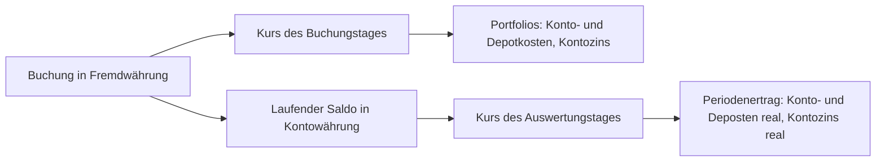

Der **Periodenertrag-Report** bietet eine detaillierte Analyse der Performance eines Portfolios oder Mandanten über einen definierten Zeitraum. Der Report ermöglicht es, die Wertentwicklung tages-, wochen- oder monatsweise zu verfolgen und die verschiedenen Einflussfaktoren auf die Gesamtperformance zu identifizieren.

## Aufruf des Reports

Der Periodenertrag-Report kann auf zwei Ebenen aufgerufen werden:

1. **Auf Mandantenebene**: Über das Hauptmenü → **Depots und Konten** → **Portfolios** → **Periodenertrag**
   - Analysiert die Performance aller Portfolios des Mandanten zusammen
   - Werte werden in der Mandantenwährung dargestellt

2. **Auf Portfolioebene**: Innerhalb eines einzelnen Portfolios → **Periodenertrag**
   - Analysiert nur das ausgewählte Portfolio
   - Werte werden in der Portfoliowährung dargestellt

## Eingabeparameter

Vor der Berechnung des Reports müssen folgende Parameter festgelegt werden:

### Datum von
Das Startdatum der Analyseperiode (inklusiv). Wichtig: Das Datum bezieht sich auf den Börsenschluss, d.h. der Ertrag des Starttages ist **nicht** in der Berechnung enthalten. Der Starttag dient somit als Vergleichsbasis, von der aus die Veränderung bis zum Enddatum gemessen wird.

Das Datum muss ein gültiger Handelstag sein, also weder ein Wochenende noch ein Feiertag oder ein Tag mit fehlenden Kursen. Zudem darf es nicht vor dem ältesten möglichen Datum liegen, das über dem Eingabeformular hinter dem Hinweis "Ältestes mögliche Datum:" angezeigt wird.

Dieses älteste mögliche Datum ist der letzte Handelstag **vor** dem ersten Wertpapierkauf. Diese Wahl ist bewusst so getroffen: An jenem Tag ist noch nichts investiert, weshalb eine Auswertung ab diesem Datum bei Gewinn, Wertpapieren, Saldo Kauf/Verkauf Wertpapiere, Dividenden, Gebühren und Kontozins bei null beginnt. Würde stattdessen der Tag des ersten Kaufs als Startdatum dienen, wäre dieser Kauf bereits in den Anfangswerten enthalten und sein Ergebnis ginge der Auswertung verloren, da der Ertrag des Starttages nicht mitgerechnet wird.

Das älteste mögliche Datum ist immer ein echter Handelstag. Fällt der Kalendertag vor dem ersten Wertpapierkauf auf ein Wochenende oder einen Feiertag, wird der davorliegende Handelstag angeboten, also beispielsweise der Freitag vor einem Kauf am Montag.

{}
Beginnen die Konten erst am Tag des ersten Wertpapierkaufs oder später, existiert kein früherer Handelstag mit Kontodaten. In diesem Fall ist das älteste mögliche Datum der Tag des ersten Wertpapierkaufs selbst und die Anfangswerte beginnen nicht bei null.
{}

### Datum bis
Das Enddatum der Analyseperiode (inklusiv). Das Datum bezieht sich auf den Börsenschluss.

**Einschränkungen:**
- Muss ein gültiger Handelstag sein
- Muss nach dem Startdatum liegen
- Darf nicht nach dem letzten verfügbaren Handelstag liegen

### Periodenaufteilung
Bestimmt, wie die Daten im Report aggregiert werden:

- **Woche**: Zeigt die Performance nach Wochentagen (Montag-Freitag) an
  - Nur verfügbar, wenn der Zeitraum maximal die konfigurierte Anzahl von Wochen umfasst
  - Ideal für detaillierte kurzfristige Analysen

- **Jahr/Monat**: Zeigt die Performance nach Monaten an
  - Nur verfügbar, wenn der Zeitraum mindestens die konfigurierte Anzahl von Monaten umfasst
  - Ideal für längerfristige Übersichten

Die Verfügbarkeit der Optionen wird dynamisch basierend auf dem gewählten Zeitraum angepasst.

## Berichtsinhalt

Der Periodenertrag-Report besteht aus mehreren Hauptbereichen:

### 1. Zusammenfassung (Periodenvergleich)

Dieser Bereich zeigt drei Spalten:

- **Erster Tag**: Alle Werte zum Startdatum der Periode
- **Letzter Tag**: Alle Werte zum Enddatum der Periode
- **Differenz**: Die Veränderung zwischen Start und Ende

**Dargestellte Metriken:**

Die ersten fünf Zeilen sind kumulierte Werte. Sie laufen seit der allerersten Transaktion auf und nicht erst seit dem gewählten Startdatum, weshalb allein die Spalte **Differenz** eine Aussage über den gewählten Zeitraum macht. Da der Starttag als Vergleichsbasis dient, ist eine Buchung, die auf den Starttag datiert ist, in dieser Differenz nicht enthalten.

| Zeile | Beschreibung |
|--------|-------------|
| **Zins/Dividende real** | Vereinnahmte Dividenden und Zinsen aus Wertpapieren, so wie sie dem Konto gutgeschrieben wurden. |
| **Konto- und Deposten real** | Separat verbuchte Gebühren des Kontos und des Depots. Handelskosten, die in einem Kauf oder Verkauf enthalten sind, gehören nicht hierher, sondern zu **Saldo Kauf/Verkauf Wertpapiere**; die Finanzierungskosten von Margin-Positionen ebenfalls nicht, sie gehören zum Ergebnis der Wertpapiere. Der Aufwand wird als positiver Betrag ausgewiesen. |
| **Kontozins real** | Zinsen, die einem Bargeldkonto gutgeschrieben oder belastet wurden. Erträge aus Wertpapieren gehören nicht dazu. |
| **Externe Bargeld Ein-/Auszahlung** | Einzahlungen, die von externen Konten kamen. Damit sind Kontoübertragungen ausgeschlossen. |
| **Saldo Kauf/Verkauf Wertpapiere** | Nettobetrag, der durch Käufe und Verkäufe von Wertpapieren vom Konto abgeflossen oder ihm zugeflossen ist, einschliesslich der in diesen Transaktionen enthaltenen Handels- und Steuerkosten. |
| **Wertpapiere + inkl. Gewinn Margin Pos.** | Wert der gehaltenen Wertpapiere am jeweiligen Tag, zuzüglich des Gewinns der offenen Margin-Positionen. |
| **Wertpapier Risiko** | Marktwert aller gehaltenen Positionen zum vollen Gegenwert, also einschliesslich der über Margin gehaltenen. |
| **Barsaldo** | Bestand aller Bargeldkonten am jeweiligen Tag. |
| **Wertpapiere + Saldo** | Barsaldo, Wertpapiere und Gewinn der offenen Margin-Positionen zusammen. |
| **Gewinn** | Barsaldo zuzüglich Wertpapiere, abzüglich der externen Ein- und Auszahlungen. Die Margin-Positionen sind hier nicht enthalten. |
| **Gewinn offene Margin Position** | Gewinn oder Verlust, der anfiele, wenn die offenen Margin-Positionen zum Kurs des jeweiligen Tages geschlossen würden. |
| **Total Gewinn** | **Gewinn** zuzüglich **Gewinn offene Margin Position**. |

Das Datum der jeweiligen Spalte steht in deren Titelzeile und ist keine eigene Zeile der Tabelle.

**Wichtig**: Alle Werte werden in der Hauptwährung dargestellt - entweder Mandanten- oder Portfoliowährung, je nach Aufrufkontext. Die Hauptwährung wird in der Bezeichnung der jeweiligen Zeile mit ausgegeben.

### 2. Detaillierte Periodenfenster (Tabellenansicht)

Dieser Bereich zeigt die täglichen Veränderungen strukturiert nach Perioden (Wochen oder Monate):

Bei wöchentlicher Aufteilung steht jede Zeile für eine Woche, die Spalten zeigen die Tage Montag bis Freitag. Bei monatlicher Aufteilung steht jede Zeile für ein Jahr und die Spalten zeigen die zwölf Monate. In beiden Fällen folgt am Ende die Spalte **Total** mit der Summe der Periode, und die Fusszeile **Gesamtsumme** fasst jede Spalte über alle Perioden zusammen.

Jede Periode lässt sich aufklappen und zeigt dann bis zu vier Zeilen, deren Bezeichnung in der ersten Spalte steht:

| Zeile | Beschreibung |
|------|-------------|
| Wochenbereich bzw. Jahr | **Total Gewinn**: Veränderung des Gesamtgewinns gegenüber dem Vortag. Nur diese Zeile führt in der Spalte **Total** den Wert der ganzen Periode. |
| **Barsaldo** | Veränderung des Kassenbestands gegenüber dem Vortag |
| **Wertpapier** | Veränderung des Wertpapierwerts gegenüber dem Vortag |
| **Gewinn offene Margin Position** | Veränderung des Gewinns aus Margin-Positionen gegenüber dem Vortag |

Ein Tooltip auf einer Zelle zeigt zusätzlich deren vollständigen Wert an.

**Farbcodierung in der Tabelle:**
- 🟩 **Grün**: Regulärer Handelstag mit Daten
- 🟨 **Gelb**: Feiertag (keine Handelsaktivität)
- 🟥 **Rot**: Handelstag mit fehlenden historischen Kursdaten
- ⬜ **Grau**: Wochenende oder nicht relevanter Tag

### 3. Spaltensummen

Am Ende jeder Spalte (Wochentag oder Monat) wird die Summe der Gewinne für alle entsprechenden Tage/Monate angezeigt. Dies ermöglicht es, Muster zu erkennen (z.B. "Ist Montag ein schlechter Tag für mein Portfolio?").

### 4. Grafische Darstellung

Der Report bietet die Möglichkeit, die Performance als Chart anzuzeigen:

**Aufruf**: Button "Grafik anzeigen" im Menü

**Dargestellte Linien:**
- **Externe Übertragung Diff**: Kumulierte Ein-/Auszahlungen
- **Gewinn Diff**: Kumulierte Gewinne/Verluste
- **Kassabestand Diff**: Veränderung des Kassenbestands
- **Wertpapiere Diff**: Veränderung des Wertpapierwerts
- **Gesamtbilanz**: Gesamtvermögensentwicklung

Der Chart verwendet Plotly und bietet interaktive Funktionen wie Zoom, Hover-Details und Range-Selektor.

## Vergleich mit der Auswertung Portfolios

Einige Grössen erscheinen sowohl im **Periodenertrag** als auch in der Auswertung [Portfolios und Portfolio](../portfolios/). Dass sich die Beträge unterscheiden können, hat System und bedeutet nicht, dass eine der beiden Auswertungen falsch rechnet. Dieser Abschnitt erklärt, woher die Unterschiede kommen, wie gross sie sein dürfen und wann die Werte exakt übereinstimmen müssen.

### Zwei verschiedene Konstruktionen

Die Auswertung **Portfolios** ist eine Momentaufnahme auf ein Stichdatum. Sie rechnet bei jedem Aufruf die gesamte Geschichte neu durch, von der allerersten Transaktion bis zum Stichdatum, und behält dabei nichts zurück.

Der **Periodenertrag** ist eine Zeitreihe über Handelstage. Er liest laufend nachgeführte Tagessalden, die bei jeder Buchung mitgeschrieben werden, und zeigt daraus den Verlauf sowie die Differenz zwischen zwei Tagen.

Die beiden Berichte rechnen also nicht denselben Weg zweimal nach. Es sind zwei verschiedene Konstruktionen, die einige Grössen gemeinsam haben.

### Welche Werte sich entsprechen

| Periodenertrag | Portfolios und Portfolio | Übereinstimmung |
|---|---|---|
| **Konto- und Deposten real** | **Konto- und Depotkosten** | Dieselben Buchungen. Bei einem Fremdwährungskonto verschieden umgerechnet, siehe unten. |
| **Kontozins real** | **Kontozins** | Dieselben Buchungen. Bei einem Fremdwährungskonto verschieden umgerechnet, siehe unten. |
| **Externe Bargeld Ein-/Auszahlung** | **Externe Bargeld Ein-/Auszahlung** | Gleiche Umrechnung, deshalb bis auf Rundungen gleich. |
| **Barsaldo** | **Barsaldo** | Beide auf den Stichtag bewertet, deshalb bis auf Rundungen gleich. |

### Der Wechselkurs: der wichtigste Grund für eine Abweichung

Die Auswertung **Portfolios** rechnet jede einzelne Buchung mit dem Wechselkurs ihres eigenen Buchungstages um. Der **Periodenertrag** führt den aufgelaufenen Betrag in der Währung des Kontos und rechnet ihn einmal um, mit dem Wechselkurs des Auswertungstages.

Ein Beispiel macht es anschaulich. Auf einem Euro-Konto wurden Ende 2008 EUR 218.01 Zins gutgeschrieben. Bei einem Kurs von 1.4655 waren das damals CHF 319.49, und mit diesem Betrag erscheint die Gutschrift in der Auswertung **Portfolios**. Der **Periodenertrag** rechnet dieselben EUR 218.01 mit dem Kurs des Auswertungstages um, und bei einem Kurs von 0.9386 sind das CHF 204.62.

Keiner der beiden Werte ist falsch. Der eine sagt, was der Zins zum Zeitpunkt der Gutschrift wert war, der andere, was derselbe Betrag am Auswertungstag wert ist. Der Unterschied wächst mit dem Alter der Buchungen und mit der Bewegung der Währung: Bei einem Konto, das seit Jahren in einer Währung geführt wird, die gegenüber der Hauptwährung deutlich verloren oder gewonnen hat, können die beiden Beträge um mehrere Prozent auseinanderliegen.

### Rundung

Die beiden Auswertungen runden an verschiedenen Stellen des Rechenwegs. Eine Abweichung von wenigen Rappen ist deshalb auch dort zu erwarten, wo sonst alles übereinstimmt, und sagt nichts über die Datenqualität aus.

### Fehlende Kurse wirken sich verschieden aus

Der **Periodenertrag** lässt einen ganzen Tag aus, sobald an diesem Tag der Kurs eines gehaltenen Wertpapiers oder ein benötigter Wechselkurs fehlt. Die Auswertung **Portfolios** kennt das nicht. Sie lässt stattdessen dasjenige Konto weg, das sie nicht umrechnen kann, und weist die betroffenen Währungen gesondert aus.

Eine Abweichung kann deshalb auch daher rühren, dass die beiden Berichte gar nicht auf demselben Datenbestand aufsetzen. Sind Kurse lückenhaft, lohnt es sich, diese zuerst zu ergänzen und die Auswertungen danach erneut zu vergleichen.

### Wann die Werte exakt übereinstimmen

Bei einem Konto, das in der Hauptwährung geführt wird, ist keine Umrechnung nötig, und beide Auswertungen liefern denselben Betrag. Dasselbe gilt für die Grössen, die auf beiden Seiten gleich umgerechnet werden: **Externe Bargeld Ein-/Auszahlung** und **Barsaldo**. Übrig bleiben in allen Fällen die Rundungsdifferenzen von wenigen Rappen.

{}
So lässt sich eine Abweichung einordnen: Wenige Rappen sind eine Rundung. Prozente bei einem Fremdwährungskonto sind der oben beschriebene Wechselkurseffekt und kein Fehler in den Daten. Ein unerwarteter Sprung, für den beides nicht in Frage kommt, deutet auf fehlende Kursdaten hin; siehe [Fehlende Tagesendkurse](#fehlende-tagesendkurse).
{}

### Finanzierungskosten von Margin-Positionen

Diese fallen bei Margin-Produkten wie Forex und CFD laufend an und werden dem Bargeldkonto belastet. Trotzdem erscheinen sie in **keiner** der beiden Kostenspalten: weder in **Konto- und Deposten real** noch in **Konto- und Depotkosten**. Sie sind Kosten der Position und nicht des Bankkontos und werden deshalb über das Ergebnis der Wertpapiere ausgewiesen.

Im Periodenertrag haben sie keine eigene Zeile. Sie mindern den **Barsaldo** und damit den **Gewinn**, werden aber nirgends gesondert ausgewiesen.

## Fehlende Tagesendkurse

Ein wichtiger Aspekt des Periodenertrag-Reports ist die Behandlung fehlender Kursdaten. Fehlende Kursdaten entstehen, wenn an einem Handelstag keine historischen Kurse für gehaltene Wertpapiere verfügbar sind. Dies kann verschiedene Ursachen haben: Der Kursanbieter hat keine Daten geliefert, es sind technische Probleme beim Datenabruf aufgetreten, oder das Wertpapier wurde an diesem Tag tatsächlich nicht gehandelt.

Die Auswirkungen auf den Report sind erheblich. Fehlende Tage werden im Periodenkalender rot markiert, und die Performance kann an diesen Tagen nicht berechnet werden. Genau gleich behandelt wird ein fehlender **Wechselkurs**: Kann ein Wertpapier oder ein Kontosaldo an einem Tag mangels Kurs des Währungspaars nicht in die Hauptwährung umgerechnet werden, so fällt dieser Tag ebenfalls aus dem Report. Das ist beabsichtigt, denn andernfalls würde ein Fremdwährungsbetrag unumgerechnet in die Auswertung einfliessen und einen Gewinn oder Verlust vortäuschen, den es nie gab. Zur Entstehung solcher Lücken siehe [Kurse für jeden Kalendertag]({}#kurse-für-jeden-kalendertag). Das System zählt die aufeinanderfolgenden fehlenden Tage und zeigt diese im Feld "Fehlende Tage" an. Bei der Datumsauswahl werden Tage mit fehlenden Kursen automatisch als ungültige Handelstage markiert, sodass diese nicht als Start- oder Enddatum gewählt werden können.

{}
Ohne vollständige historische Kursdaten ist eine genaue Performance-Berechnung nicht möglich. Es wird dringend empfohlen, fehlende Kurse vor der Analyse zu beheben, um aussagekräftige Ergebnisse zu erhalten.
{}

### Übersicht und Interaktion mit fehlenden Kursen

Der Report bietet eine separate Ansicht zur Analyse und Behebung fehlender Kursdaten. Diese kann über das Menü unter "Fehlende Tagesendkurse" aufgerufen werden und zeigt zwei miteinander verbundene Bereiche: Einen Jahreskalender im oberen Bereich und eine Wertpapier-Tabelle im unteren Bereich.

Der **Jahreskalender** zeigt alle Handelstage des ausgewählten Jahres in einer übersichtlichen Darstellung. Die Farbcodierung macht sofort ersichtlich, wo Probleme vorliegen: Grün markierte Tage signalisieren, dass alle Kurse verfügbar sind. Rot markierte Tage zeigen an, dass mindestens ein Wertpapier fehlende Kurse aufweist. Gelb markierte Tage sind Tage mit fehlenden Kursen, die vom Benutzer selektiert wurden. Wenn Sie auf einen rot markierten Tag klicken, reagiert die Wertpapier-Tabelle sofort und zeigt nur noch die Wertpapiere an, die an diesem spezifischen Tag fehlende Kurse aufweisen.

Die **Wertpapier-Tabelle** listet alle Wertpapiere auf, die im gewählten Zeitraum fehlende Kurse haben. Neben dem Namen des Wertpapiers wird auch die Anzahl der fehlenden Tage angezeigt. Auch hier funktioniert die Interaktion bidirektional: Wenn Sie in der Tabelle auf ein Wertpapier klicken, werden im Kalender automatisch alle Tage gelb markiert, an denen dieses spezifische Wertpapier fehlende Kurse hat. Diese bidirektionale Interaktion ermöglicht es, systematische Datenlücken schnell zu identifizieren und gezielt zu beheben.

In derselben Tabelle erscheinen auch die **Währungspaare**, deren Wechselkurs an einzelnen Tagen fehlt. Sie stehen dort unter ihrer Bezeichnung wie «USD/CHF», während ISIN sowie «Aktiv von» und «Aktiv bis oder Fälligkeitsdatum» bei ihnen leer bleiben, da ein Währungspaar diese Angaben nicht kennt. Im Kalender werden ihre Tage genauso rot markiert wie jene der Wertpapiere, und die Auswahl wirkt in beide Richtungen wie bei einem Wertpapier.

Fehlt einem benötigten Währungspaar der Kurs nicht nur an einzelnen Tagen, sondern gänzlich, so bleibt für den Periodenertrag kein einziger auswertbarer Tag übrig. In diesem Fall bricht der Report mit einer Meldung ab, welche die betroffenen Währungspaare nennt, damit Sie die Ursache nicht im Wertpapierbestand suchen. Wie es zu einem Währungspaar ganz ohne Kursgeschichte kommt, ist unter [Wenn ein Währungspaar ohne Kurse bleibt]({}#wenn-ein-währungspaar-ohne-kurse-bleibt) beschrieben.

{}
Die Kombination aus Kalender und Tabelle erlaubt zwei Analyseansätze: Sie können entweder von einem problematischen Tag ausgehen und sehen, welche Wertpapiere betroffen sind, oder Sie können ein problematisches Wertpapier auswählen und sehen, an welchen Tagen Kurse fehlen.
{}

### Lösung des Problems fehlender Kursdaten

Für die Behebung fehlender historischer Kursdaten stehen mehrere Möglichkeiten zur Verfügung. Die einfachste Methode ist das **manuelle Nachladen** der Kursdaten. Über die Wertpapier-Verwaltung können historische Kurse erneut vom Datenanbieter abgerufen werden. Wählen Sie das betroffene Wertpapier aus und triggern Sie eine Aktualisierung der historischen Daten.

Eine besonders elegante Lösung für einzelne fehlende Tage zwischen vorhandenen Kursen ist das **lineare Befüllen fehlender Kursdaten**. Das System kann Kurslücken durch lineare Interpolation füllen, wobei der fehlende Kurs aus den benachbarten vorhandenen Kursen berechnet wird. Diese Methode eignet sich besonders für einzelne fehlende Tage in ansonsten vollständigen Kursreihen, beispielsweise wenn der Datenanbieter an einem einzelnen Tag einen Ausfall hatte.

{}
Für eine detaillierte Anleitung zum linearen Befüllen fehlender Kursdaten siehe [Lineares Befüllen fehlender Kursdaten](/gt-user-manual/de/watchlistinstrument/externaldata/historyquote/pricedata/). Diese Funktion interpoliert fehlende Werte basierend auf den umgebenden Kursen und eignet sich ideal für einzelne Lücken in der Zeitreihe.
{}

Wenn ein Datenanbieter systematisch Lücken aufweist, kann es sinnvoll sein, zu einem **alternativen Datenanbieter** zu wechseln. GT unterstützt verschiedene Datenanbieter, und oft bietet ein anderer Anbieter eine bessere Abdeckung für bestimmte Märkte oder Wertpapiere. Die Umstellung des Datenanbieters erfolgt in den Einstellungen des jeweiligen Wertpapiers.

Für wenige fehlende Tage, insbesondere bei exotischen Wertpapieren mit schlechter Datenabdeckung, besteht auch die Möglichkeit der **manuellen Kurseingabe**. Diese Option ist zwar zeitaufwändig, kann aber in Einzelfällen die einzige Möglichkeit sein, eine vollständige Kurshistorie zu erreichen.

## Technische Details

### Handelstage und Feiertage

Das System berücksichtigt automatisch:
- **Globale Feiertage**: Weltweit gültige Nicht-Handelstage
- **Börsenspezifische Feiertage**: Feiertage der Börsen, an denen die gehaltenen Wertpapiere gehandelt werden
- **Wochenenden**: Samstag und Sonntag sind immer ausgeschlossen

### Währungskonvertierung

Alle Wertpapiere und Konten werden automatisch in die Hauptwährung umgerechnet, bei einer Mandantenauswertung in die Mandantenwährung und bei einer Portfolioauswertung in die Portfoliowährung.

Massgebend ist dabei der Wechselkurs des jeweils ausgewerteten Tages. Das gilt auch für die kumulierten Zeilen **Zins/Dividende real**, **Konto- und Deposten real**, **Kontozins real**, **Saldo Kauf/Verkauf Wertpapiere** und **Barsaldo**: Der über Jahre aufgelaufene Betrag wird in der Währung des Kontos geführt und erst zum Schluss mit dem Kurs des Auswertungstages umgerechnet. Eine Ausnahme bildet **Externe Bargeld Ein-/Auszahlung**, wo jede Ein- und Auszahlung mit dem Kurs ihres eigenen Buchungstages umgerechnet wird.

Für ein Konto in der Hauptwährung spielt das keine Rolle. Bei einem Fremdwährungskonto führt es dazu, dass sich diese Zeilen von den entsprechenden Spalten der Auswertung **Portfolios** unterscheiden können, siehe [Vergleich mit der Auswertung Portfolios](#vergleich-mit-der-auswertung-portfolios).

### Performance-Optimierung

- Das System verwendet einen Cache mit 2-minütiger Gültigkeit für Handelstag-Metadaten
- Ergebnisse werden für wiederholte Anfragen innerhalb der Cache-Periode wiederverwendet

## Typische Anwendungsfälle

1. **Performance-Analyse**: Wie hat sich mein Portfolio über das letzte Quartal entwickelt?
2. **Einflussanalyse**: Welche Faktoren (Gewinne, Einzahlungen, Kursentwicklung) haben die Performance beeinflusst?
3. **Muster-Erkennung**: Gibt es bestimmte Wochentage oder Monate mit besonders guter/schlechter Performance?
4. **Datenqualität**: Gibt es systematische Lücken in meinen historischen Kursdaten?
5. **Vergleich**: Wie unterscheidet sich die Performance verschiedener Portfolios?

## Einschränkungen und Hinweise

- Der Report erfordert mindestens einen Wertpapierbestand. Wurden bisher nur Konten geführt und nie ein Wertpapier gehalten, bleibt das Eingabeformular gesperrt.
- Für eine aussagekräftige Analyse sollte der Zeitraum mindestens einige Handelstage umfassen
- Fehlende Kursdaten können die Genauigkeit der Berechnungen beeinträchtigen
- Die Auswahl der Periodenaufteilung wird automatisch basierend auf dem Zeitraum eingeschränkt
- Bei sehr grossen Zeiträumen (mehrere Jahre) kann die Berechnung einige Sekunden dauern
