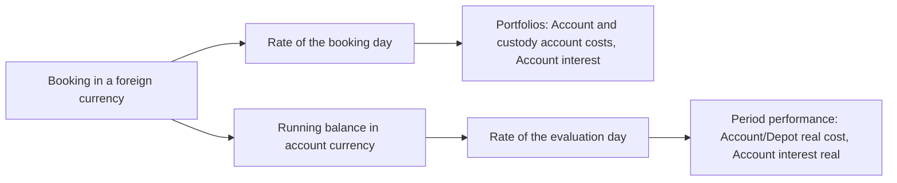

The **Period Performance Report** provides a detailed analysis of a portfolio's or tenant's performance over a defined time period. The report allows tracking value development on a daily, weekly, or monthly basis and identifying the various factors influencing overall performance.

## Accessing the Report
The Period Performance Report can be accessed at two levels:

1. **Tenant Level**: Via Main Menu → **Accounts & Portfolios** → **Portfolios** → **Period Performance**
   - Analyzes the combined performance of all tenant portfolios
   - Values are displayed in the tenant currency

2. **Portfolio Level**: Within a single portfolio → **Period Performance**
   - Analyzes only the selected portfolio
   - Values are displayed in the portfolio currency

## Input Parameters
Before calculating the report, the following parameters must be specified:

### Date From
The start date of the analysis period (inclusive). Important: The date refers to the close of trading, meaning the income of the start day is **not** included in the calculation. The start day therefore serves as the baseline against which the change up to the end date is measured.

The date must be a valid trading day, so neither a weekend nor a holiday nor a day with missing quotes. It also cannot be before the oldest possible date, which is shown above the input form after the remark "Oldest possible date:".

This oldest possible date is the last trading day **before** the first securities purchase. That choice is deliberate: nothing is invested yet on that day, so an analysis starting from it begins at zero for gain, securities, balance buy/sell securities, dividends, fees and account interest. If the day of the first purchase were used as the start date instead, that purchase would already be contained in the starting values and its result would be lost to the analysis, because the income of the start day is not counted.

The oldest possible date is always a real trading day. If the calendar day before the first securities purchase falls on a weekend or a holiday, the preceding trading day is offered instead, for example the Friday before a purchase on Monday.

{}
If the accounts only start on the day of the first securities purchase or later, no earlier trading day with account data exists. In that case the oldest possible date is the day of the first securities purchase itself and the starting values do not begin at zero.
{}

### Date To
The end date of the analysis period (inclusive). The date refers to the close of trading.

**Restrictions:**
- Must be a valid trading day
- Must be after the start date
- Cannot be after the last available trading day

### Period Splitting
Determines how data is aggregated in the report:

- **Week**: Displays performance by weekdays (Monday-Friday)
  - Only available if the period spans at most the configured number of weeks
  - Ideal for detailed short-term analysis

- **Year/Month**: Displays performance by months
  - Only available if the period spans at least the configured number of months
  - Ideal for longer-term overviews

The availability of options is dynamically adjusted based on the selected time period.

## Report Content
The Period Performance Report consists of several main sections:

### 1. Summary (Period Comparison)
This section displays three columns:

- **First Day**: All values at the period start date
- **Last Day**: All values at the period end date
- **Difference**: The change between start and end

**Displayed Metrics:**

The first five rows are cumulative values. They accumulate from the very first transaction onwards and not only from the chosen start date, which is why the **Difference** column alone says anything about the chosen period. Since the start day serves as the comparison base, a booking dated on the start day is not part of that difference.

| Row | Description |
|--------|-------------|
| **Interest/Dividends real** | Dividends and interest received from securities, as they were credited to the account. |
| **Account/Depot real cost** | Separately booked fees of the account and of the custody account. Trading costs contained in a purchase or sale do not belong here, they are part of **Balance buy/sell Securities**; neither do the financing costs of margin positions, which belong to the securities result. The expense is shown as a positive amount. |
| **Account interest real** | Interest credited to or charged on a cash account. Income from securities does not belong here. |
| **External cash inflows, outflows** | Deposits that came from external accounts. Transfers between own accounts are excluded. |
| **Balance buy/sell Securities** | Net amount that left or reached the account through purchases and sales of securities, including the trading and tax costs contained in those transactions. |
| **Securities incl. margin position gain** | Value of the securities held on the respective day, plus the gain of the open margin positions. |
| **Security risk** | Market value of all held positions at full exposure, that is including those held on margin. |
| **Cash balance** | Balance of all cash accounts on the respective day. |
| **Securities + Balance** | Cash balance, securities and the gain of the open margin positions together. |
| **Gain** | Cash balance plus securities, less the external inflows and outflows. Margin positions are not included here. |
| **Profit open margin position** | Gain or loss that would arise if the open margin positions were closed at the price of the respective day. |
| **Total Gain** | **Gain** plus **Profit open margin position**. |

The date of each column appears in its title line and is not a row of the table.

**Important**: All values are displayed in the main currency - either tenant or portfolio currency, depending on the access context. The main currency is appended to the label of each row.

### 2. Detailed Period Windows (Table View)
This section shows daily changes structured by periods (weeks or months):

With a weekly split each row represents one week and the columns show the days Monday through Friday. With a monthly split each row represents one year and the columns show the twelve months. In both cases the **Total** column with the sum of the period follows at the end, and the **Grand total** footer summarizes each column across all periods.

Every period can be expanded and then shows up to four rows, whose label appears in the first column:

| Row | Description |
|-------|-------------|
| Week range or year | **Total Gain**: change of the total gain compared to the previous day. Only this row carries the value of the whole period in the **Total** column. |
| **Cash balance** | Change in cash balance compared to the previous day |
| **Security** | Change in securities value compared to the previous day |
| **Profit open margin position** | Change of the gain from margin positions compared to the previous day |

A tooltip on a cell additionally shows its complete value.

**Color Coding in the Table:**
- 🟩 **Green**: Regular trading day with data
- 🟨 **Yellow**: Holiday (no trading activity)
- 🟥 **Red**: Trading day with missing historical quote data
- ⬜ **Gray**: Weekend or non-relevant day

### 3. Column Sums
At the end of each column (weekday or month), the sum of gains for all corresponding days/months is displayed. This allows pattern recognition (e.g., "Is Monday a bad day for my portfolio?").

### 4. Graphical Representation
The report offers the option to display performance as a chart:

**Access**: "Show Chart" button in the menu

**Displayed Lines:**
- **External Cash Transfer Diff**: Cumulative deposits/withdrawals
- **Gain Diff**: Cumulative gains/losses
- **Cash Balance Diff**: Change in cash balance
- **Securities Diff**: Change in securities value
- **Total Balance**: Total wealth development

The chart uses Plotly and offers interactive features such as zoom, hover details, and range selector.

## Comparison with the Portfolios evaluation

Some figures appear both in **Period performance** and in the [Portfolios and Portfolio](../portfolios/) evaluation. That the amounts can differ is by design and does not mean that one of the two evaluations is calculating incorrectly. This section explains where the differences come from, how large they may be, and when the values must agree exactly.

### Two different constructions

The **Portfolios** evaluation is a snapshot on a cut-off date. It recalculates the entire history on every call, from the very first transaction up to the cut-off date, and keeps nothing in between.

**Period performance** is a series over trading days. It reads continuously maintained daily balances, written along with every booking, and from them shows the development and the difference between two days.

So the two reports do not recompute the same route twice. They are two different constructions that happen to share a few figures.

### Which values correspond

| Period performance | Portfolios and Portfolio | Agreement |
|---|---|---|
| **Account/Depot real cost** | **Account and custody account costs** | The same bookings. Converted differently for a foreign-currency account, see below. |
| **Account interest real** | **Account interest** | The same bookings. Converted differently for a foreign-currency account, see below. |
| **External cash inflows, outflows** | **External cash deposit/withdrawal** | Same conversion, therefore equal apart from rounding. |
| **Cash balance** | **Cash balance** | Both valued on the cut-off date, therefore equal apart from rounding. |

### The exchange rate: the main reason for a deviation

The **Portfolios** evaluation converts every single booking with the exchange rate of its own booking day. **Period performance** keeps the accumulated amount in the currency of the account and converts it once, with the exchange rate of the evaluation day.

An example makes it tangible. EUR 218.01 of interest was credited to a euro account at the end of 2008. At a rate of 1.4655 that was CHF 319.49 at the time, and the credit appears with that amount in the **Portfolios** evaluation. **Period performance** converts the same EUR 218.01 with the rate of the evaluation day, and at a rate of 0.9386 that is CHF 204.62.

Neither value is wrong. One says what the interest was worth at the moment it was credited, the other what the same amount is worth on the evaluation day. The effect grows with the age of the bookings and with the movement of the currency: for an account that has been held for years in a currency that has clearly gained or lost against the main currency, the two amounts can be several percent apart.

### Rounding

The two evaluations round at different points of the calculation. A deviation of a few cents is therefore to be expected even where everything else matches, and says nothing about the quality of the data.

### Missing prices affect the two differently

**Period performance** leaves out an entire day as soon as the price of a held security or a required exchange rate is missing on that day. The **Portfolios** evaluation has no such concept. Instead it leaves out the cash account it cannot convert and reports the affected currencies separately.

A deviation can therefore also mean that the two reports are not working on the same set of data. If prices have gaps, it is worth filling them first and comparing the evaluations again afterwards.

### When the values agree exactly

For an account held in the main currency no conversion is needed and both evaluations deliver the same amount. The same applies to the figures that are converted on the same basis on both sides: **External cash inflows, outflows** and **Cash balance**. What remains in every case is the rounding difference of a few cents.

{}
This is how to classify a deviation. A few cents are rounding. Percent on a foreign-currency account is the exchange-rate effect described above and not an error in the data. An unexpected jump that neither explains points to missing price data; see [Missing End-of-Day Quotes](#missing-end-of-day-quotes).
{}

### Financing costs of margin positions

These arise continuously on margin products such as Forex and CFDs and are charged to the cash account. Nevertheless they appear in **neither** of the two cost columns: not in **Account/Depot real cost** and not in **Account and custody account costs**. They are a cost of the position and not of the bank account, and are therefore reported through the securities result.

In period performance they have no row of their own. They lower the **Cash balance** and thus the **Gain**, but are not shown separately anywhere.

## Missing End-of-Day Quotes
An important aspect of the Period Performance Report is the handling of missing quote data. Missing quote data occurs when no historical quotes are available for held securities on a trading day. This can have various causes: The quote provider did not deliver data, technical problems occurred during data retrieval, or the security was actually not traded on that day.

The impact on the report is significant. Missing days are marked red in the period calendar, and performance cannot be calculated on these days. A missing **exchange rate** is treated in exactly the same way: if a security or an account balance cannot be converted into the main currency on a day because the currency pair has no price, that day drops out of the report as well. This is intended, because otherwise a foreign currency amount would enter the evaluation unconverted and pretend a gain or a loss that never existed. On how such gaps arise see [Prices for every calendar day]({}#prices-for-every-calendar-day). The system counts consecutive missing days and displays them in the "Missing Days" field. During date selection, days with missing quotes are automatically marked as invalid trading days, so they cannot be selected as start or end dates.

{}
Without complete historical quote data, accurate performance calculation is not possible. It is strongly recommended to resolve missing quotes before analysis to obtain meaningful results.
{}

### Overview and Interaction with Missing Quotes
The report provides a separate view for analyzing and resolving missing quote data. This can be accessed via the menu under "Missing End-of-Day Quotes" and displays two interconnected areas: A year calendar in the upper area and a securities table in the lower area.

The **year calendar** displays all trading days of the selected year in a clear overview. The color coding immediately reveals where problems exist: Green-marked days indicate that all quotes are available. Red-marked days show that at least one security has missing quotes. Yellow-marked days are days with missing quotes that have been selected by the user. When you click on a red-marked day, the securities table reacts immediately and displays only the securities that have missing quotes on that specific day.

The **securities table** lists all securities that have missing quotes in the selected period. In addition to the security name, the number of missing days is also displayed. The interaction also works bidirectionally here: When you click on a security in the table, all days on which this specific security has missing quotes are automatically marked yellow in the calendar. This bidirectional interaction enables quick identification of systematic data gaps and targeted remediation.

The same table also lists the **currency pairs** whose exchange rate is missing on individual days. They appear there under their name such as «USD/CHF», while the ISIN and «Active from» and «Active to or maturity date» stay empty for them, because a currency pair does not have these properties. Their days are marked red in the calendar just like those of the securities, and the selection works in both directions as it does for a security.

If a required currency pair has no price at all instead of missing it on individual days, not a single usable day is left for the period performance. The report then stops with a message naming the affected currency pairs, so that you do not look for the cause among your securities. How a currency pair ends up without any price history is described under [When a currency pair remains without prices]({}#when-a-currency-pair-remains-without-prices).

{}
The combination of calendar and table allows two analysis approaches: You can either start from a problematic day and see which securities are affected, or you can select a problematic security and see on which days quotes are missing.
{}

### Resolving Missing Quote Data Issues
Several options are available for resolving missing historical quote data. The simplest method is **manually reloading** the quote data. Historical quotes can be retrieved again from the data provider via securities management. Select the affected security and trigger an update of the historical data.

A particularly elegant solution for individual missing days between available quotes is **linear filling of missing quote data**. The system can fill quote gaps through linear interpolation, whereby the missing quote is calculated from the adjacent available quotes. This method is particularly suitable for individual missing days in otherwise complete quote series, for example when the data provider had an outage on a single day.

{}
For detailed instructions on linear filling of missing quote data, see [Linear Filling of Missing Quote Data](/gt-user-manual/en/watchlistinstrument/externaldata/historyquote/pricedata/). This function interpolates missing values based on surrounding quotes and is ideal for individual gaps in the time series.
{}

If a data provider systematically has gaps, it may make sense to switch to an **alternative data provider**. GT supports various data providers, and often another provider offers better coverage for certain markets or securities. The data provider can be changed in the settings of the respective security.

For a few missing days, especially for exotic securities with poor data coverage, **manual quote entry** is also possible. While this option is time-consuming, it may be the only way to achieve a complete quote history in individual cases.

## Technical Details
### Trading Days and Holidays
The system automatically considers:
- **Global Holidays**: Worldwide non-trading days
- **Exchange-Specific Holidays**: Holidays of exchanges where held securities are traded
- **Weekends**: Saturday and Sunday are always excluded

### Currency Conversion

All securities and accounts are automatically converted into the main currency, into the tenant currency for a tenant evaluation and into the portfolio currency for a portfolio evaluation.

The decisive rate is the exchange rate of the day being evaluated. This also applies to the cumulative rows **Interest/Dividends real**, **Account/Depot real cost**, **Account interest real**, **Balance buy/sell Securities** and **Cash balance**: the amount accumulated over the years is kept in the currency of the account and converted only at the end, with the rate of the evaluation day. **External cash inflows, outflows** is the exception, where every deposit and withdrawal is converted with the rate of its own booking day.

For an account held in the main currency this makes no difference. For a foreign-currency account it means that these rows can deviate from the corresponding columns of the **Portfolios** evaluation, see [Comparison with the Portfolios evaluation](#comparison-with-the-portfolios-evaluation).

### Performance Optimization
- The system uses a cache with 2-minute validity for trading day metadata
- Results are reused for repeated requests within the cache period

## Typical Use Cases
1. **Performance Analysis**: How has my portfolio developed over the last quarter?
2. **Impact Analysis**: Which factors (gains, deposits, price development) influenced performance?
3. **Pattern Recognition**: Are there specific weekdays or months with particularly good/bad performance?
4. **Data Quality**: Are there systematic gaps in my historical quote data?
5. **Comparison**: How does the performance of different portfolios differ?

## Limitations and Notes
- The report requires at least one securities holding. If only accounts have been kept so far and no security was ever held, the input form stays disabled.
- For meaningful analysis, the period should span at least several trading days
- Missing quote data can affect calculation accuracy
- Period splitting selection is automatically restricted based on the time period
- For very large periods (multiple years), calculation may take several seconds
