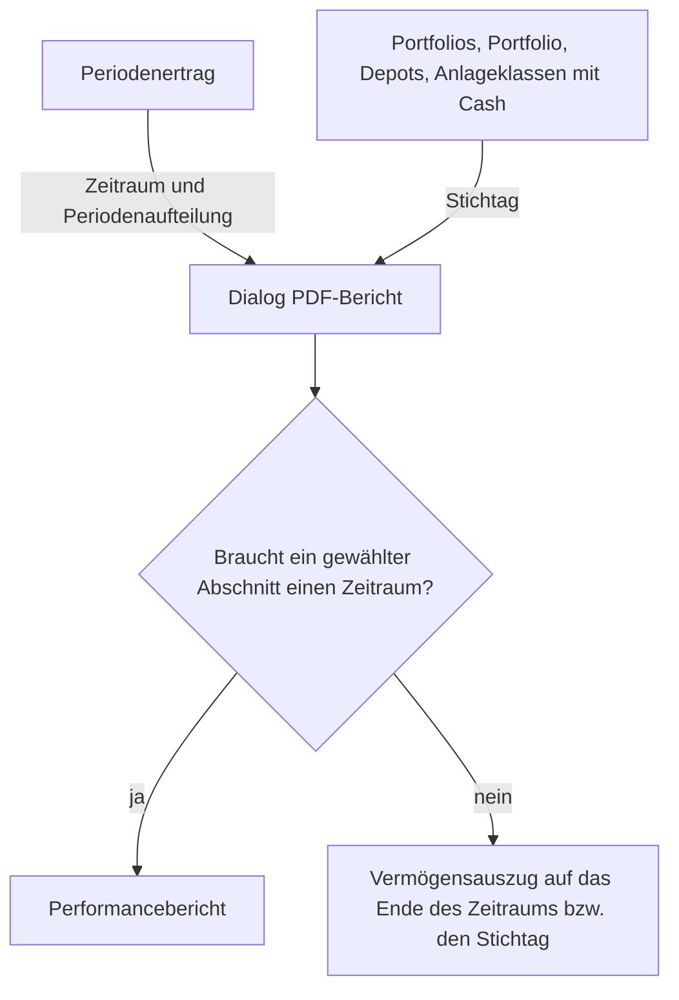

Der **PDF-Bericht** fasst die Auswertungen des [Periodenertrags](../) und den Vermögensstand zu einem Dokument zusammen, das sich ausdrucken, ablegen oder einem Klienten übergeben lässt. Er wird auf dem Server erzeugt und enthält nur Werte, die GT aus den erfassten Transaktionen und Kursen berechnet. Es gibt zwei Arten: den **Performancebericht** über einen Zeitraum und den **Vermögensauszug** auf einen Stichtag. Welche Art entsteht, bestimmen allein die gewählten Berichtsabschnitte.

## Aufruf

Im **Periodenertrag** steht der Menüpunkt **PDF-Bericht...** zur Verfügung, sobald eine Auswertung berechnet wurde. Der Bericht übernimmt Zeitraum, Periodenaufteilung und Portfolio der angezeigten Berechnung. Werden die Daten im Formular danach geändert, ohne neu zu rechnen, gilt weiterhin der angezeigte Zeitraum.

Einen Vermögensauszug auf einen Stichtag erzeugen die Auswertungen [Portfolios und Portfolio]({}), [Depots]({}) (für den Mandanten und für ein Portfolio) und [Anlageklassen mit Cash]({}) über den Eintrag **PDF-Bericht...** in ihrem Kontextmenü. Stichtag ist das Datum, auf das die Auswertung gerade eingestellt ist, und der Umfang ist der Mandant oder das Portfolio der Auswertung. Dieser Weg funktioniert auch für ein Portfolio, das nur Bargeldkonten führt.

Aus einer Stichtagsauswertung lassen sich nur Abschnitte wählen, die ohne Zeitraum auskommen. Wählt man im Periodenertrag nur solche Abschnitte, etwa mit der Vorlage **Vermögensauszug**, entsteht ebenfalls ein Vermögensauszug, und zwar auf das Ende des angezeigten Zeitraums.

## Der Dialog

Über dem Formular zeigt der Dialog Umfang und Hauptwährung sowie den Zeitraum bzw. den Stichtag. Beim Zeitraum sind zwei Angaben zu unterscheiden: Die **Ausgeschlossene Bewertungsbasis** ist das Startdatum des Periodenertrags. Sie dient als Vergleichsbasis, ihre eigenen Buchungen gehören nicht zum Bericht. Der **Buchungszeitraum** beginnt deshalb am Tag danach und endet mit dem Enddatum.

| Feld | Bedeutung |
|------|-----------|
| **Berichtsvorlage** | Eine vorbereitete Zusammenstellung von Abschnitten, siehe [Berichtsvorlagen](#berichtsvorlagen). |
| **Berichtsabschnitte** | Die Abschnitte des Dokuments. Wer hier etwas ändert, wechselt automatisch zur Vorlage **Eigene Auswahl**. Unter dem Formular beschreibt der Dialog jeden verfügbaren Abschnitt in einem Satz. |
| **Berichtssprache** | Deutsch oder Englisch, unabhängig von der Sprache der Benutzeroberfläche. |
| **Zahlen- und Datumsformat** | Schreibweise der Zahlen und Daten, zum Beispiel de-CH mit Apostroph als Tausendertrennzeichen oder de-DE mit Punkt. |
| **Kalenderjahre** | Nur beim Abschnitt **Jährlicher Ertrag**: Anzahl Kalenderjahre einschliesslich des letzten, 1 bis 20. |
| **Detailspalten** | Nur beim Abschnitt **Bestände**: zusätzliche Spalten mit dem Kurs- und dem Währungsergebnis seit Eröffnung der Position. |
| **Berichtstitel** | Eigener Titel mit bis zu 80 Zeichen. Leer bleibt der Standardtitel «Portfolio-Wertentwicklung» bzw. «Vermögensauszug». |
| **Empfänger** | Anschrift für ein Fensterkuvert, höchstens sechs Zeilen mit je 45 Zeichen. GT kennt keine Postadressen, der Text wird frei erfasst. |
| **Absender / Berater** | Absender oben rechts auf dem Deckblatt, ebenfalls höchstens sechs Zeilen mit je 45 Zeichen. Die erste Zeile erscheint zudem in der Fusszeile jeder Seite. |
| **Zusätzliche Hinweise** | Eigener Text, der nach den **Wichtigen Hinweisen** am Schluss des Dokuments steht. |
| **Kommentar** | Text nur für dieses eine Dokument. Er steht direkt nach den Berichtsgrundlagen und wird nie gemerkt. |
| **Einstellungen für diesen Mandanten merken** | Speichert die Einstellungen für den nächsten Aufruf, siehe [Einstellungen merken](#einstellungen-merken). |

Wird die vollständige Transaktionsliste gewählt, weist der Dialog darauf hin, dass sie das Dokument deutlich verlängern kann. Mit **PDF erstellen** wird der Bericht erzeugt und heruntergeladen. Der Dateiname lautet beim Performancebericht `performance_<Startdatum>_<Enddatum>.pdf`, beim Vermögensauszug `statement_<Stichtag>.pdf`, bei einem Portfolio jeweils ergänzt um dessen Namen.

## Berichtsvorlagen

| Vorlage | Abschnitte |
|---------|------------|
| **Kurzbericht** | Vermögensentwicklung, Grafiken zur Wertentwicklung, Erläuterungen. Der Kurzbericht umfasst höchstens zwei Seiten, deshalb zeigt er von den Grafiken nur die kumulierte zeitgewichtete Rendite. |
| **Ausführlicher Performancebericht** | Deckblatt, Vermögensentwicklung, Grafiken zur Wertentwicklung, Jährlicher Ertrag, Periodenübersicht, Rendite, Risiko und Kosten, Erläuterungen. |
| **Vermögensauszug** | Deckblatt, Bestände, Vermögensaufteilung, Erläuterungen. |
| **Ertrags- und Kostenbericht** | Deckblatt, Vermögensentwicklung, Erträge und Kosten, Erläuterungen. |
| **Eigene Auswahl** | Beliebige Abschnitte. Es muss mindestens ein Abschnitt mit Inhalt dabei sein, Deckblatt und Erläuterungen allein genügen nicht. |

Eine benannte Vorlage steht immer für genau ihre Abschnitte. Aus einer Stichtagsauswertung werden nur **Vermögensauszug** und **Eigene Auswahl** angeboten.

## Berichtsabschnitte

Die Abschnitte erscheinen immer in der Reihenfolge der folgenden Tabelle. Abschnitte mit breiten Tabellen stehen auf Seiten im Querformat, die vollständige Transaktionsliste beginnt immer auf einer neuen Seite.

| Abschnitt | Zeitraum nötig | Inhalt |
|-----------|----------------|--------|
| **Deckblatt** | nein | Empfänger im Adressfenster, Absender, Titel, Umfang, Zeitraum bzw. Stichtag, Erstellungsdatum und ein Inhaltsverzeichnis, dessen Einträge auf die Abschnitte verlinken. |
| **Vermögensentwicklung** | ja | Die Vermögensbrücke *Wert zur Bewertungsbasis + Externe Netto-Geldflüsse + Anlageergebnis = Wert am Periodenende*, die zeitgewichtete und die geldgewichtete Rendite, bei mindestens 360 Tagen auch p.a., sowie die zwölf Zeilen der Zusammenfassung des Periodenertrags mit erstem Tag, letztem Tag und Differenz. |
| **Grafiken zur Wertentwicklung** | ja | Die kumulierte zeitgewichtete Rendite, der Wert einschliesslich offenem Margenergebnis im Vergleich mit Startwert plus externen Netto-Geldflüssen sowie ein Balkendiagramm der zeitgewichteten Rendite je Woche bzw. Jahr, bei einem Zeitraum innerhalb eines einzigen Jahres je Monat. Gepunktete Linienabschnitte überbrücken Tage ohne vollständige Kurse. |
| **Jährlicher Ertrag** | ja | Zeitgewichtete Rendite und Anlageergebnis je Kalenderjahr sowie die Monatsrenditen des letzten Jahres, jeweils als Tabelle und Balkendiagramm. Ein Jahr mit Stern ist ein Teiljahr, weil der erste Bestand erst im Laufe des Jahres entstand oder der Zeitraum vor dem letzten Handelstag des Jahres endet. |
| **Periodenübersicht** | ja | Die Tabelle des Periodenertrags mit allen Wochen bzw. Jahren, darunter jeweils die zeitgewichtete Rendite der einzelnen Tage bzw. Monate. H kennzeichnet einen Feiertag, M einen Tag mit fehlendem Kurs. |
| **Rendite, Risiko und Kosten** | ja | Die vier Gruppen **Rendite**, **Risiko**, **Kosten** und **Datengrundlage**, wie sie unter [Rendite und Risiko](../#rendite-und-risiko) beschrieben sind. |
| **Bestände** | nein | Alle Wertpapiere, gruppiert nach Anlageklasse, mit Stück bzw. Nominal, Kurs und Kursdatum, Wert in Instrument- und Hauptwährung und Gewicht, danach alle Bargeldkonten mit Saldo und Wechselkurs, auch solche mit Saldo null. Bei Margin-Positionen zeigt eine zusätzliche Spalte das Exposure. Es folgen die Wechselkurse am Stichtag. |
| **Vermögensaufteilung** | nein | Die Aufteilung nach Anlageklasse und nach Instrument- bzw. Kontowährung mit Tabelle und Diagramm sowie eine Kreuztabelle Währung × Anlageklasse. |
| **Erträge und Kosten** | ja | Je Wertpapier Periodenertrag, Quellensteuer, Transaktionskosten, Transaktionssteuern, Finanzierung und Beitrag, danach Gebühren, Kontozins, die erfassten Gesamtkosten und die erfasste Kostenquote. |
| **Transaktionen** | ja | Alle Buchungen des Buchungszeitraums mit Betrag in Kontowährung, Wechselkurs und Wert in Hauptwährung. |
| **Erläuterungen** | nein | Die Begriffe und Markierungen, die in den gewählten Abschnitten vorkommen. |

### Bestände und Vermögensaufteilung

Jede Position wird mit ihrem letzten Kurs bis zum Stichtag bewertet. Ein Stern hinter dem Kurs zeigt, dass dieser Kurs älter als der Stichtag ist. Fehlt ein Kurs oder Wechselkurs ganz, steht **n/a**, und auch die Summen und Gewichte, in die dieser Wert einfliesst, erscheinen als **n/a** statt als zu tiefe Zahl. Margin-Positionen tragen mit ihrem offenen Ergebnis zum Vermögen bei; ihr Exposure ist nur eine Zusatzangabe. Die Detailspalten **Seit Eröffnung** enthalten auch realisierte Teilverkäufe und Dividenden seit Eröffnung der Position und sind keine Ergebnisse des Zeitraums.

Die Gewichte beziehen sich auf das Gesamtvermögen einschliesslich der Bargeldkonten. Ist dieses null oder negativ, sind Gewichte nicht anwendbar. Im Kreisdiagramm werden Gruppen unter 0,5 % zu **Übrige** zusammengefasst, die Tabelle führt aber jede Gruppe einzeln auf. Enthält eine Aufteilung negative Werte, zeigt der Bericht ein Balkendiagramm statt eines Kreisdiagramms.

In einem Performancebericht mit dem Abschnitt **Bestände** kann der Vermögensauszug vom Wert am Periodenende abweichen. Der Auszug bewertet jede Position mit ihrem letzten Kurs bis zum Stichtag, der Periodenertrag den Tag nach seinen eigenen Regeln. Eine solche Differenz wird unter den Beständen ausgewiesen.

### Erträge und Kosten

Dieser Abschnitt zeigt nur Buchungen des Zeitraums. Der **Beitrag** eines Wertpapiers ist sein Endwert abzüglich Anfangswert, zuzüglich der Geldbeträge aus Käufen und Verkäufen, der Erträge und der Finanzierung. Er ist ein Betrag und keine Rendite der Position. Ist beim Mandanten **Dividenden-Quellensteuer ausschliessen** gesetzt, sind Periodenertrag und Beitrag vor Abzug der Quellensteuer ausgewiesen.

Die Summe aller Beiträge und der Kontobuchungen wird mit dem Anlageergebnis des Periodenertrags abgestimmt. Bleibt eine Differenz, erscheint sie als **Nicht zugeordnete Differenz**. Mögliche Ursachen sind die Neubewertung von Fremdwährungsguthaben, Übertragungen über die Grenze des Portfolios, Stückzinsen und Rundungen. Die zurückgerechnete Quellensteuer ist keine solche Differenz, weil sie nie einem Konto gutgeschrieben wurde; die Abstimmung zieht sie wieder ab.

Die **Erfasste Kostenquote** setzt Transaktionskosten, Transaktionssteuern, Konto- und Depotgebühren und Finanzierung ins Verhältnis zum durchschnittlich eingesetzten Kapital. Sie ist nicht dasselbe wie die **Konto- und Depotgebührenquote** im Abschnitt **Rendite, Risiko und Kosten**, die nur die Gebühren enthält. Eine Wertpapierübertragung wird mit **[T]** gekennzeichnet.

## Berichtsgrundlagen und Datenstand

Jeder Bericht enthält unabhängig von der Auswahl den Block **Berichtsgrundlagen und Datenstand**. Er nennt Umfang, Hauptwährung, Zeitraum bzw. Stichtag, Periodenaufteilung, den Erstellungszeitpunkt und die beiden Mandanteneinstellungen **Dividenden-Quellensteuer ausschliessen** und **Gebühren und Zinsen zum Stichtagskurs**. Darunter führt er alles auf, was die Zahlen einschränkt: fehlende oder ältere Kurse einzelner Positionen, Tage mit fehlenden Kursen und Feiertage im Zeitraum, Renditen über Datenlücken, Gebühren und Buchungen ohne Wechselkurs sowie den Grund, wenn keine geldgewichtete Rendite ausgewiesen werden kann.

Im ganzen Bericht gilt: **n/a** bedeutet fehlende Daten, **–** bedeutet, dass eine Kennzahl nicht anwendbar oder nicht berechenbar ist. Eine Null ist immer ein berechneter Wert. Am Schluss stehen die **Wichtigen Hinweise**, die sich nicht abwählen lassen, und danach die **Zusätzlichen Hinweise** aus dem Dialog.

{}
Während die Bestände eines Mandanten neu aufgebaut werden oder dieser Neuaufbau noch aussteht, lehnt GT die Erzeugung mit einer Meldung ab. Nach Abschluss des Neuaufbaus kann der Bericht erstellt werden.
{}

## Einstellungen merken

Ist **Einstellungen für diesen Mandanten merken** gesetzt, speichert GT nach einer erfolgreichen Erzeugung Vorlage, Abschnitte, Berichtstitel, Empfänger, Absender, zusätzliche Hinweise, Sprache, Zahlen- und Datumsformat, Kalenderjahre und Detailspalten. Zeitraum, Stichtag und Kommentar gehören nie dazu. Die Einstellungen gelten für den ganzen Mandanten und damit für alle seine Portfolios. Schlägt die Erzeugung fehl, bleibt die gespeicherte Einstellung unverändert.

Ist ein gemerkter Abschnitt beim nächsten Aufruf nicht verfügbar, etwa ein Periodenabschnitt in einer Stichtagsauswertung, wird er weggelassen und der Dialog weist darauf hin.

Ein Klient mit reinem Lesezugriff kann PDF-Berichte erzeugen, aber keine Einstellungen merken; das Kontrollkästchen wird ihm nicht angezeigt.

## Einschränkungen

- GT speichert keine Postadressen. Empfänger und Absender sind freier Text des Dialogs.
- Aufgelaufene Zinsen von Anleihen sind in keinem Wert enthalten.
- Produktkosten innerhalb von Fonds (TER), Spreads und andere in den Kursen enthaltene Kosten werden weder erfasst noch ausgewiesen.
- Fonds werden nicht nach ihren Anlagen aufgeschlüsselt. Ein Fonds zählt vollständig zu seiner eigenen Anlageklasse und Währung.
- Die Vermögensaufteilung gruppiert nur nach der Art der Anlageklasse.
- Buchungen nach dem letzten Handelstag des Zeitraums, etwa am 31. Dezember, wenn dieser ein Samstag ist, gehören zum nächsten Zeitraum.
- Vermögensauszug und Performancezahlen bewerten nach unterschiedlichen Kursregeln: der Auszug mit dem letzten verfügbaren Kurs, die Performance nach Handelstagen. Ihre Summen können sich unterscheiden; der Bericht weist die Differenz aus.
- Die Zeilen mit Erträgen und Kosten in der Zusammenfassung der Vermögensentwicklung sind kumulierte Stände zum Wechselkurs des jeweiligen Tages. Die Erträge und Kosten des Zeitraums stehen im Abschnitt **Erträge und Kosten**.
- Die geldgewichtete Rendite wird nur für den ganzen Zeitraum ausgewiesen, nicht je Kalenderjahr.
- Der Bericht wird aus dem Datenstand im Moment der Erzeugung gerechnet. Nach einer Korrektur von Transaktionen oder Kursen kann derselbe Zeitraum andere Zahlen zeigen. GT bewahrt erzeugte Berichte nicht auf.
- Der Bericht ist eine Auswertung und kein wieder importierbarer Beleg. Sein Aufbau ist für einen Import nicht vorgesehen.
