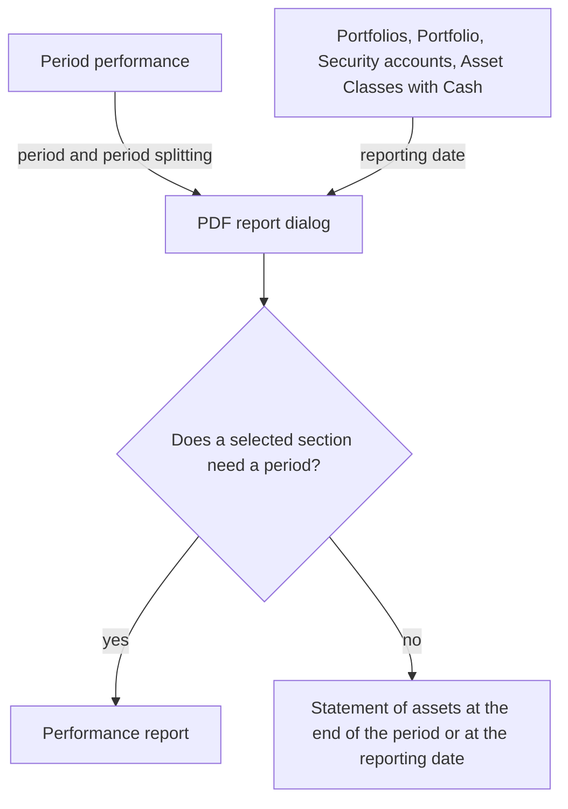

The **PDF report** combines the evaluations of the [Period performance](../) and the state of the assets into one document that can be printed, filed or handed to a client. It is generated on the server and contains only figures GT calculates from the recorded transactions and prices. There are two kinds: the **performance report** over a period and the **statement of assets** at a reporting date. Which kind is created depends solely on the selected report sections.

## Opening the report

In the **Period performance** the menu item **PDF report...** becomes available as soon as an evaluation has been calculated. The report takes the period, the period splitting and the portfolio of the displayed calculation. If the dates in the form are changed afterwards without recalculating, the displayed period still applies.

A statement of assets at a reporting date is created from the evaluations [Portfolios and Portfolio]({}), [Security accounts]({}) (for the tenant and for one portfolio) and [Asset Classes with Cash]({}) through the entry **PDF report...** in their context menu. The reporting date is the date the evaluation is currently set to, and the scope is the tenant or the portfolio of the evaluation. This also works for a portfolio that holds cash accounts only.

From an evaluation at a reporting date only sections that need no period can be selected. If only such sections are chosen in the Period performance, for example with the preset **Statement of assets**, a statement of assets is created as well, at the end of the displayed period.

## The dialog

Above the form the dialog shows the scope and main currency as well as the period or the reporting date. For a period two dates have to be told apart: the **Excluded valuation base** is the start date of the Period performance. It serves as the basis of comparison; its own bookings do not belong to the report. The **Booking range** therefore starts on the following day and ends with the end date.

| Field | Meaning |
|-------|---------|
| **Report preset** | A prepared combination of sections, see [Report presets](#report-presets). |
| **Report sections** | The sections of the document. Changing them switches the preset to **Custom selection** automatically. Below the form the dialog describes every available section in one sentence. |
| **Report language** | German or English, independent of the language of the user interface. |
| **Number and date format** | How numbers and dates are written, for example de-CH with an apostrophe as thousands separator or en-US with a comma. |
| **Calendar years** | Only with the section **Annual returns**: number of calendar years including the last one, 1 to 20. |
| **Detail columns** | Only with the section **Holdings**: additional columns with the price and the currency result since the position was opened. |
| **Report title** | Own title of up to 80 characters. Left empty, the default title "Portfolio performance" or "Statement of assets" is used. |
| **Recipient** | Address for a window envelope, at most six lines of 45 characters. GT stores no postal addresses; the text is entered freely. |
| **Sender / advisor** | Sender at the top right of the cover, also at most six lines of 45 characters. Its first line also appears in the footer of every page. |
| **Additional notes** | Own text printed after the **Important information** at the end of the document. |
| **Comment** | Text for this one document only. It follows the report facts and is never remembered. |
| **Remember settings for this tenant** | Stores the settings for the next time, see [Remembering settings](#remembering-settings). |

When the complete transaction list is selected, the dialog points out that it can make the document considerably longer. **Create PDF** generates and downloads the report. The file is named `performance_<start date>_<end date>.pdf` for a performance report and `statement_<reporting date>.pdf` for a statement of assets, each followed by the portfolio name for a portfolio.

## Report presets

| Preset | Sections |
|--------|----------|
| **Short report** | Development of assets, Performance charts, Glossary. The short report fits on at most two pages, so of the charts it shows the cumulative time-weighted return only. |
| **Detailed performance report** | Cover, Development of assets, Performance charts, Annual returns, Period breakdown, Return, risk and costs, Glossary. |
| **Statement of assets** | Cover, Holdings, Asset allocation, Glossary. |
| **Income and cost report** | Cover, Development of assets, Income and costs, Glossary. |
| **Custom selection** | Any sections. At least one section with content is required; cover and glossary alone are not enough. |

A named preset always stands for exactly its sections. From an evaluation at a reporting date only **Statement of assets** and **Custom selection** are offered.

## Report sections

The sections always appear in the order of the following table. Sections with wide tables are placed on landscape pages, and the complete transaction list always starts on a new page.

| Section | Needs a period | Content |
|---------|----------------|---------|
| **Cover** | no | Recipient in the address window, sender, title, scope, period or reporting date, creation date and a table of contents whose entries link to the sections. |
| **Development of assets** | yes | The asset bridge *Value at valuation base + Net external cash flows + Investment result = Value at period end*, the time-weighted and the money-weighted return, for at least 360 days also p.a., and the twelve rows of the Period performance summary with first day, last day and difference. |
| **Performance charts** | yes | The cumulative time-weighted return, the value including the open margin result compared with the start value plus net external flows, and a bar chart of the time-weighted return per week or year, per month for a period within a single year. Dotted line segments bridge days without complete prices. |
| **Annual returns** | yes | Time-weighted return and investment result per calendar year and the monthly returns of the last year, each as a table and a bar chart. A year marked with an asterisk is a partial year, because the first holding arose during the year or the period ends before the year's last trading day. |
| **Period breakdown** | yes | The table of the Period performance with all weeks or years, each followed by the time-weighted return of its individual days or months. H marks a holiday, M a day with a missing price. |
| **Return, risk and costs** | yes | The four groups **Return**, **Risk**, **Costs** and **Data basis** as described under [Return and risk](../#return-and-risk). |
| **Holdings** | no | All securities grouped by asset class, with units or nominal, price and price date, value in instrument and main currency and weight, followed by all cash accounts with balance and exchange rate, including those with a zero balance. For margin positions an additional column shows the exposure. The exchange rates at the reporting date follow. |
| **Asset allocation** | no | The allocation by asset class and by instrument or account currency with table and chart, and a cross table currency × asset class. |
| **Income and costs** | yes | Per security the period income, withholding tax, transaction costs, transaction taxes, financing and contribution, followed by fees, account interest, the total recorded costs and the recorded cost ratio. |
| **Transactions** | yes | All bookings of the booking range with amount in account currency, exchange rate and value in main currency. |
| **Glossary** | no | The terms and markers that occur in the selected sections. |

### Holdings and asset allocation

Each position is valued with its last price up to the reporting date. An asterisk after the price shows that this price is older than the reporting date. If a price or an exchange rate is missing altogether, **n/a** is shown, and the totals and weights this value enters also appear as **n/a** instead of as a figure that is too low. Margin positions contribute their open result to the assets; their exposure is supplementary information only. The **Since opening** detail columns also contain realised partial sales and dividends since the position was opened and are not results of the period.

The weights refer to the total assets including the cash accounts. If these are zero or negative, weights do not apply. In the donut chart, groups below 0.5 % are combined into **Other**, while the table still lists every group individually. If an allocation contains negative values, the report shows a bar chart instead of a donut chart.

In a performance report with the section **Holdings** the statement of assets can differ from the value at the period end. The statement values each position with its last price up to the reporting date, the Period performance values the day by its own rules. Such a difference is shown below the holdings.

### Income and costs

This section shows bookings of the period only. The **Contribution** of a security is its closing value minus its opening value, plus the cash amounts of purchases and sales, the income and the financing. It is an amount, not a return of the position. If the tenant has **Exclude dividend withholding tax** set, period income and contribution are shown before deduction of the withholding tax.

The sum of all contributions and the account bookings is reconciled with the investment result of the Period performance. A remaining difference appears as **Not attributed difference**. Possible causes are the revaluation of foreign currency balances, transfers across the portfolio boundary, accrued interest and rounding. The withholding tax added back is no such difference, because it was never credited to an account; the reconciliation removes it again.

The **Recorded cost ratio** relates transaction costs, transaction taxes, account and custody fees and financing to the average invested capital. It is not the same as the **Account and custody fee ratio** in the section **Return, risk and costs**, which contains the fees only. A security transfer is marked with **[T]**.

## Report facts and data status

Regardless of the selection, every report contains the block **Report facts and data status**. It names scope, main currency, period or reporting date, period splitting, the time of creation and the two tenant settings **Exclude dividend withholding tax** and **Fees and interest at cut-off exchange rate**. Below that it lists everything that limits the figures: missing or older prices of individual positions, days with missing prices and holidays in the period, returns across data gaps, fees and bookings without an exchange rate, and the reason when no money-weighted return can be shown.

Throughout the report, **n/a** means missing data and **–** means that a figure does not apply or cannot be calculated. A zero is always a calculated value. At the end follows the **Important information**, which cannot be deselected, and after it the **Additional notes** of the dialog.

{}
While the holdings of a tenant are being rebuilt or such a rebuild is still pending, GT refuses to generate the report with a message. Once the rebuild has finished, the report can be created.
{}

## Remembering settings

If **Remember settings for this tenant** is set, GT stores the preset, sections, report title, recipient, sender, additional notes, language, number and date format, calendar years and detail columns after a successful generation. Period, reporting date and comment are never part of it. The settings apply to the whole tenant and therefore to all its portfolios. If the generation fails, the stored settings remain unchanged.

If a remembered section is not available the next time, for example a period section in an evaluation at a reporting date, it is left out and the dialog says so.

A client with read-only access can generate PDF reports but cannot remember settings; the checkbox is not shown to them.

## Limitations

- GT stores no postal addresses. Recipient and sender are free text of the dialog.
- Accrued interest of bonds is not included in any value.
- Product costs inside funds (TER), spreads and other costs contained in prices are neither recorded nor shown.
- Funds are not looked through. A fund counts entirely towards its own asset class and currency.
- The asset allocation groups by the type of asset class only.
- Bookings after the last trading day of the period, for example on 31 December when that is a Saturday, belong to the next period.
- The statement of assets and the performance figures use different price rules: the statement the last available price, the performance the trading days. Their totals can differ; the report shows the difference.
- The income and cost rows in the summary of the development of assets are cumulative levels at each day's exchange rate. The income and costs of the period are in the section **Income and costs**.
- The money-weighted return is shown for the whole period only, not per calendar year.
- The report is calculated from the data at the moment of generation. After a correction of transactions or prices the same period can show other figures. GT does not keep generated reports.
- The report is an evaluation, not a re-importable receipt. Its layout is not intended for import.
