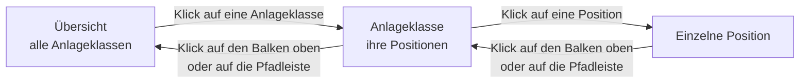

Der Report «Anlageklassen mit Cash» bietet eine umfassende Portfolio-Allokationsanalyse, die sowohl Wertpapiere als auch Barguthaben nach Anlageklassen gruppiert darstellt. Dieser Report ist das zentrale Werkzeug zur strategischen Vermögensaufteilung, da er zeigt, wie das Gesamtvermögen über verschiedene Anlageklassen wie Aktien, Anleihen, Rohstoffe und Barmittel verteilt ist. Barguthaben werden dabei als spezielle Anlageklassen behandelt, um eine vollständige Übersicht über die gesamte Asset-Allokation zu ermöglichen.

## Funktionsweise
Der Report gruppiert alle Wertpapiere und Barguthaben des Mandanten nach ihren Anlageklassen. Dabei werden Wertpapiere gemäss ihrer tatsächlichen Anlageklasse klassifiziert (z.B. Aktien, Anleihen, Immobilien, Rohstoffe), während Barguthaben als Pseudo-Wertpapiere in speziellen Anlageklassen dargestellt werden. Die Gruppierung erfolgt dabei wie folgt:
- **Wertpapiere**: Werden gemäss ihrer Anlageklasse gruppiert.
- **Barguthaben**: Werden als spezielle Anlageklassen behandelt:
  - **Hauptwährung**: Barguthaben in der Hauptwährung des Mandanten erscheinen als eigenständige Anlageklasse.
  - **Fremdwährungen**: Barguthaben in Fremdwährungen werden separat als weitere Anlageklasse dargestellt.

Jedes Bargeldkonto erscheint als eigene Zeile mit dem Namen des Kontos.

Alle Transaktionen bis zum gewählten Datum werden berücksichtigt, um eine zeitpunktgenaue Darstellung der Asset-Allokation zu gewährleisten. Die Berechnung erfolgt dabei über alle Portfolios und Depots des Mandanten hinweg, wobei alle Werte automatisch in die Hauptwährung umgerechnet werden.

## Gruppierung nach Anlageklassen
Die primäre Gruppierung erfolgt nach Anlageklassen, wobei jede Anlageklasse als separate Gruppe mit allen zugehörigen Wertpapieren und Positionen angezeigt wird. Für jede Gruppe werden folgende Informationen ausgewiesen:

- Eine **Gruppenkopfzeile** mit dem Namen der Anlageklasse
- Alle **Wertpapiere** dieser Anlageklasse mit ihren individuellen Positionen
- Eine **Gruppensumme** mit den aggregierten Werten über alle Wertpapiere dieser Anlageklasse

Am Ende des Reports erscheint die **Gesamtsumme** über alle Anlageklassen hinweg, die das gesamte Vermögen des Mandanten repräsentiert.

## Spalten im Report
Die Spalten entsprechen jenen des [Depotberichts](../securityaccountreport/#spalten-im-report). Bei einem Bargeldkonto steht in **Konto relevant** der Kontostand zum Stichtag, in **Konto relevant (Hauptwährung)** derselbe Betrag in der Hauptwährung. Ist die Schätzung der [Veräusserungskosten]({}) eingeschaltet, bleiben die Spalten **Veräusserungskosten** und **Wert nach Veräusserung** bei einem Bargeldkonto leer; der Aufschlag für die Umrechnung von Fremdwährungsguthaben erscheint nur im Report [Portfolios](../portfolios/).

### Anteil am Gesamtvermögen
Weil dieser Report auch die Barguthaben enthält, ist sein Total das gesamte Vermögen des Mandanten. Die Spalte **Anteil %** zeigt deshalb hier, welchen Teil des Gesamtvermögens ein Wertpapier, ein Bargeldkonto oder eine ganze Anlageklasse ausmacht. Die Anteile aller Zeilen ergeben zusammen 100%.

Bei CFD und Forex zählt nur der noch nicht realisierte Gewinn oder Verlust zum Vermögen, denn nur dieser Betrag würde beim Schliessen der Position dem Konto gutgeschrieben oder belastet. Eine Position im Verlust hat deshalb einen negativen Anteil, und die übrigen Positionen ergeben zusammen mehr als 100%. Ein Beispiel: Sie halten ein Wertpapier im Wert von 10'000 und einen CFD, der mit 5'000 im Minus steht, und kein Bargeld. Das Gesamtvermögen beträgt 5'000, das Wertpapier hat einen Anteil von 200% und der CFD einen von −100%. Ein Anteil über 100% zeigt also an, dass Sie mit mehr investiert sind, als Ihnen netto gehört. Auch ein überzogenes Bargeldkonto hat einen negativen Anteil.

Ist das Gesamtvermögen null oder negativ, bleibt die Spalte leer. Wie gross das Risiko einer Margin-Position ist, zeigt nicht **Anteil %**, sondern die Spalte **Wertpapier Risiko** und das Balkendiagramm der [Diagrammansicht](#diagrammansicht).

### Gruppensummen und Gesamtsummen
Für jede Anlageklasse werden Zwischensummen angezeigt. Diese Summenzeilen sind farblich hervorgehoben und zeigen die aggregierten Werte aller Wertpapiere und Barpositionen innerhalb der Anlageklasse. Die Gruppensumme umfasst:

- Die Summe aller Gewinne und Verluste der Anlageklasse
- Den Gesamtwert aller Positionen in dieser Anlageklasse
- Den Anteil der Anlageklasse am Gesamtvermögen in der Spalte **Anteil %**

Am Ende des Reports erscheint die Gesamtsumme über alle Anlageklassen hinweg, die das gesamte Vermögen des Mandanten (Wertpapiere plus Barguthaben) in der Hauptwährung ausweist.

## Filteroptionen
Hier verweisen wir auf die [Filteroptionen](../securityaccountreport/#filteroptionen) des Depotberichts.

## Vergleich mit einer regelbasierten Strategie
Oberhalb der Tabelle lässt sich unter **Mit Strategie vergleichen** eine Ihrer regelbasierten Strategien auswählen. Der Bericht zeigt dann nicht mehr, wie sich das Vermögen auf die Anlageklassen verteilt, sondern wie es sich auf die Gruppen dieser Strategie verteilt, und stellt der tatsächlichen Aufteilung die dort hinterlegten Ziele gegenüber. Mit der Auswahl **Kein Vergleich** kehren Sie zur gewöhnlichen Ansicht zurück; ohne Auswahl ist der Bericht unverändert. Eine Strategie, deren Vergleich sich nicht berechnen lässt, etwa weil ihre Gewichtungen nicht 100% ergeben oder weil sie keine Portfolio-Neugewichtung hat, steht in der Auswahl, lässt sich aber nicht wählen; fahren Sie mit der Maus darüber, nennt GT den Grund.

Die Gruppierung folgt dabei der Strategie und nicht mehr der Anlageklasse, weil die Ziele dort hinterlegt sind. Eine frei benannte Gruppe hat gar keine Anlageklasse, und dieselbe Anlageklasse kann auf mehrere Gruppen verteilt sein. Zwei zusätzliche Gruppen vervollständigen das Bild:

- **Liquidität** enthält die Barguthaben, die ausserhalb des Investitionsbudgets stehen. Ihr Ziel ist 100% minus der Wert **Maximal investiert** der Portfoliobasierten Strategie. Dieses Ziel ist eine Untergrenze: Eine negative Abweichung heisst, dass weniger Liquidität vorhanden ist, als die Investitionsgrenze übrig lässt.
- **Nicht in der Strategie** enthält jene Positionen, die Sie halten, die aber in der gewählten Strategie nicht vorkommen. Sie haben kein Ziel, sind aber sichtbar und können abgebaut werden.

### Zusätzliche Spalten
Je Wertpapier und je Gruppe kommen folgende Spalten hinzu:

| Spalte | Bedeutung |
|---|---|
| **Ziel %** | Der angestrebte Anteil am Gesamtvermögen in Prozentpunkten. |
| **Ist %** | Der tatsächliche Anteil am Nettovermögen in Prozentpunkten, gemessen am Marktengagement der Position. |
| **Abweichung %** | Ist minus Ziel. Ein positiver Wert erscheint grün, ein negativer rot; die Farbe zeigt nur die Richtung und sagt nichts darüber, ob die Toleranz verletzt ist. |
| **Aktion** | **Kauf**, **Verkauf**, **Halten** oder **Blockiert**. Es handelt sich um das Geschäft und nicht um die Richtung des Engagements: Eine zu grosse Short-Position wird mit **Kauf** verkleinert. |
| **Betrag** | Das Volumen des vorgeschlagenen Geschäfts in der Hauptwährung. |
| **Anzahl** | Dasselbe Volumen in Stück. Fehlt ein verwendbarer Kurs, bleibt die Spalte leer, statt eine Anzahl zu erfinden. |
| **Begründung** | Weshalb die Zeile so lautet, etwa weil sie innerhalb der Toleranz liegt oder weil die Investitionsgrenze überschritten ist. Diese Spalte ist standardmässig ausgeblendet und lässt sich über **Spalten anzeigen** einblenden. |
| **Abweichung im übergeordneten Budget (Prozentpunkte)** | Bei einem Wertpapier die Abweichung innerhalb seiner Gruppe: sein Anteil am Zielbetrag der Gruppe minus seine Gewichtung. Bei einer Gruppe die Abweichung vom Zielbetrag, gemessen am Investitionsbudget. Liegt die Abweichung eines Wertpapiers ausserhalb der Toleranz der Wertpapiergewichtung, wird die Zelle fett und gelb hinterlegt. Auf diese Hervorhebung sollten Sie achten. |
| **Verbleibende Anpassung der Anlageklasse** | Nur bei einer Gruppe. Der Teil der Anpassung, der sich keinem Wertpapier zuordnen liess, etwa weil die Toleranz der Wertpapiergewichtung oder die maximale Anzahl gehandelter Wertpapiere dies verhindert oder weil ein Kurs fehlt. |

Die Spalte **Anteil %** bleibt in dieser Ansicht erhalten und darf nicht mit **Ist %** verwechselt werden. **Ist %** misst das Marktengagement, bei einem CFD oder einer Short-Position also den vollen Marktwert ohne Vorzeichen, weil eine Strategie das Engagement steuert. **Anteil %** misst dagegen, was die Position zum Vermögen beiträgt, bei einem CFD also nur den Gewinn oder Verlust. Bei gewöhnlichen Wertpapieren ohne Hebel liegen beide Werte nahe beieinander; kleine Unterschiede entstehen, weil sich der Vergleich auf den letzten abgeschlossenen Handelstag bezieht.

Über **Spalten anzeigen** lassen sich weitere Spalten einblenden, die nur bei den Gruppen gefüllt sind. **Toleranz der Wertpapiergewichtung (Prozentpunkte)** und **Maximal gehandelte Wertpapiere je Anlageklasse** zeigen die für diese Gruppe geltenden Einstellungen. **Angeforderte Anpassung der Anlageklasse** nennt den Betrag, um den die Gruppe insgesamt verändert werden soll. Zieht man davon die **Verbleibende Anpassung der Anlageklasse** ab, erhält man den Betrag, den die vorgeschlagenen Geschäfte tatsächlich abdecken.

### Kennzahlen oberhalb der Tabelle
Über der Tabelle erscheinen das **Bewertungsdatum**, die Stichtage der Portfolio-Neugewichtung als **Letzter Stichtag** und **Nächster Stichtag**, die **Gesamte Allokationsabweichung (%)**, die **Investitionsgrenze (%)**, das **Bruttoengagement (%)** und die **Abweichung von der Investitionsgrenze (%)** sowie **Nettovermögen**, **Liquidität**, **Bruttoengagement**, **Investitionsbudget**, **Ungenutztes taktisches Budget** und die **Toleranz**. Diese Zahlen sind bewusst getrennt und nicht zu einer Summe zusammengefasst: Bei Short- oder Margin-Positionen liegen sie deutlich auseinander, weil eine solche Position mit ihrem vollen Marktengagement am Budget zehrt, dem Vermögen aber nur ihr Ergebnis zurechnet. Ist das Bruttoengagement grösser als das Investitionsbudget, erscheint zusätzlich der Hinweis **Investitionsgrenze überschritten**; es werden dann nur noch Empfehlungen ausgegeben, die das Engagement verringern.

Die Stichtage gelten nur für die Strategie, die der [Portfolioüberwachung](../../algoalert/algo/#portfolioüberwachung) zugewiesen ist, denn nur sie merkt sich, wann zuletzt verglichen wurde. Bei jeder anderen Strategie bleiben die beiden Angaben leer, und jeder Tag gilt als Stichtag. Die **Gesamte Allokationsabweichung (%)** fasst in einer Zahl zusammen, wie gut die tatsächliche Aufteilung auf die Wertpapiere zur Zielaufteilung passt: 0% bedeutet gleiche Anteile, 100% keine Übereinstimmung. Liquidität und die Höhe des insgesamt investierten Betrags fliessen nicht ein; sie werden über die übrigen Kennzahlen beurteilt.

Das Ziel der Portfoliobasierten Strategie selbst, also der Wert **Maximal investiert**, erscheint als **Investitionsgrenze (%)** neben dem **Bruttoengagement (%)**, beide in Prozent des Nettovermögens. Die **Abweichung von der Investitionsgrenze (%)** ist deren Differenz in Prozentpunkten; ein positiver Wert heisst, dass das Portfolio über seiner Grenze investiert ist. Ist das Nettovermögen null, bleiben Bruttoengagement, Abweichung und das Ziel der Liquidität leer.

Der Vergleich bezieht sich immer auf einen abgeschlossenen Handelstag. Wählen Sie als Bis-Datum den heutigen Tag, wird der letzte abgeschlossene Tag verwendet und als Bewertungsdatum ausgewiesen.

Wie die Ziele zustande kommen und wann eine Umschichtung fällig wird, ist unter [Portfolio-Neugewichtung](../../algoalert/strategy/rebalancing/) beschrieben. GT bucht dabei niemals selbst eine Transaktion. Die Karte **Rebalancing-Überwachung** auf dem [Dashboard]({}) öffnet diesen Bericht über **Rebalancing-Bericht öffnen** direkt mit der überwachten Strategie.

## Kontextmenü und Interaktionen
Durch Rechtsklick auf eine beliebige Stelle in der Tabelle oder über das Menü-Icon öffnet sich das Kontextmenü mit folgenden Funktionen:

### Spalten anzeigen
Diese Funktion öffnet einen Dialog zur Spaltenkonfiguration, der es ermöglicht, einzelne Spalten ein- oder auszublenden. Dies ist besonders nützlich, um die Ansicht auf die relevanten Informationen zu fokussieren oder um bei begrenztem Bildschirmplatz eine übersichtlichere Darstellung zu erreichen.

Die Spaltenkonfiguration wird gespeichert und bleibt auch nach dem Schliessen und erneuten Öffnen des Reports erhalten. So kann jeder Benutzer seine individuelle Ansicht konfigurieren.

Typische Anwendungsfälle für die Spaltenkonfiguration:
- Ausblenden von Detailspalten für eine kompakte Übersicht
- Fokus auf Gewinne und Gesamtwerte
- Anzeige nur der wichtigsten Kennzahlen für eine Schnellübersicht
- Anpassung an verschiedene Bildschirmgrössen oder Auflösungen

### Zeige Diagramm
Diese Funktion zeigt die Aufteilung des Vermögens als Diagramm im [Zusatzbereich]({}) an, entweder pro Anlageklasse oder als Treemap aller Positionen, siehe [Diagrammansicht](#diagrammansicht).

### Zeige geschlossene Positionen
Mit dieser Option können auch Wertpapiere angezeigt werden, die zwischenzeitlich vollständig verkauft wurden. Die Option wird mit einem Häkchen markiert, wenn sie aktiv ist. Dies ist besonders nützlich für:
- Analyse der realisierten Gewinne und Verluste
- Steuerliche Auswertungen
- Historische Performance-Analysen
- Vollständige Transaktionsübersicht

## Expandierbare Zeilen
Jede Position kann durch Klick auf das Expander-Symbol expandiert werden. Die expandierte Ansicht zeigt unterschiedliche Informationen, je nachdem ob es sich um ein Wertpapier oder ein Barguthaben handelt:

### Expandierung bei Wertpapieren
In der expandierten Ansicht werden alle **Transaktionen** für dieses Wertpapier angezeigt. Dies ermöglicht eine detaillierte Nachverfolgung aller Käufe, Verkäufe, Dividenden und anderen Transaktionen, die zu der aktuellen Position geführt haben. Die Liste zeigt unter anderem **Datum**, **Transaktionstyp**, **Anzahl**, **Kurs/Div/usw.**, **Steuer (jede Art)**, **Bereinigter Bestand**, **Transaktionskosten**, **Kontobuchung** sowie den **Gewinn** und **Gewinn %** der einzelnen Transaktion. Bei CFD und Forex erscheinen die Transaktionen als Baum: Unter jeder Eröffnung stehen die Transaktionen, mit denen sie ganz oder teilweise geschlossen wurde.

### Expandierung bei Barguthaben
Bei den als Pseudo-Wertpapier dargestellten Barguthaben zeigt die expandierte Ansicht alle **Kontotransaktionen**, die zu diesem Barguthaben geführt haben. Dies umfasst:
- Einzahlungen und Auszahlungen
- Interne Überweisungen zwischen Konten
- Kontogebühren
- Zinseinnahmen
- Wertpapiertransaktionen, die das Barguthaben beeinflusst haben

Dies ermöglicht eine lückenlose Nachverfolgung aller Geldbewegungen und zeigt transparent, wie sich das aktuelle Barguthaben zusammensetzt.

### Kontextmenü auf Transaktionen
Bei expandierten Zeilen können die einzelnen Transaktionen bearbeitet werden. Ein Rechtsklick auf eine Transaktion öffnet das Kontextmenü mit entsprechenden Bearbeitungsmöglichkeiten. Weiterführende Informationen unter [Wertpapiertransaktionen](../../../transaction/security/) bzw. [Kontotransaktionen](../../../transaction/cashaccount/).

## Diagrammansicht
Die Diagrammansicht stellt die Aufteilung des Vermögens grafisch dar. Sie wird über **Zeige Diagramm** im Menü **Ansicht** oder im Kontextmenü geöffnet und erscheint im [Zusatzbereich]({}). Oberhalb des Diagramms bietet die Auswahl **Diagrammtyp** zwei Diagramme an: **Nettorisiko und Anteil pro Anlageklasse** sowie **Positionen als Treemap**. GT merkt sich die Wahl pro Mandant und zeigt beim nächsten Öffnen der Ansicht wieder dasselbe Diagramm.

### Nettorisiko und Anteil pro Anlageklasse
Dieses Diagramm besteht aus zwei Teilen nebeneinander. Links zeigt ein horizontales Balkendiagramm je Anlageklasse das **Wertpapier Risiko**, bei den beiden Anlageklassen der Barguthaben den Kontostand. Hier erscheinen CFD und Forex mit ihrem vollen Marktengagement. Rechts zeigt ein Kreisdiagramm den Anteil jeder Anlageklasse am Gesamtvermögen; die Grösse jedes Segments entspricht der Spalte **Anteil %** der Gruppensumme. Zusammen zeigen die beiden Teile, wie das Vermögen verteilt ist und wo das Risiko liegt.

{}
Ein Kreisdiagramm kann keine negativen Anteile darstellen. Eine Anlageklasse mit negativem Wert, etwa CFD im Verlust oder überzogene Fremdwährungskonten, fehlt deshalb im Kreis, und die Prozentangaben im Kreis beziehen sich nur auf die Anlageklassen mit positivem Wert. Massgebend sind dann die Werte der Spalte **Anteil %**.
{}

Beim Überfahren eines Segments im Kreisdiagramm mit der Maus erscheinen die Anlageklasse und ihr prozentualer Anteil. Im Balkendiagramm vergrössern Sie einen Ausschnitt, indem Sie mit gedrückter Maustaste ein Rechteck aufziehen; ein Doppelklick stellt die ursprüngliche Ansicht wieder her. Ein Klick auf einen Eintrag der Legende blendet die betreffende Anlageklasse im Kreisdiagramm aus oder wieder ein.

### Positionen als Treemap
Die Treemap zeigt die Zusammensetzung des Gesamtvermögens bis hinunter zur einzelnen Position. Jedes Rechteck steht für einen Teil des Vermögens, und seine Fläche ist proportional zu dessen Wert. Die äussere Ebene bilden die Anlageklassen; innerhalb jeder Anlageklasse liegen ihre Wertpapiere, nach Wert absteigend geordnet. Die Barguthaben erscheinen pro Währung: Die Kontostände aller Konten derselben Währung bilden ein Rechteck, unter **Hauptwährung** für die Hauptwährung des Mandanten und unter **Fremdwährungen** für alle übrigen. Anders als das Kreisdiagramm zeigt die Treemap damit auf einen Blick, welche einzelnen Positionen das Vermögen dominieren, auch bei sehr vielen Positionen.

Der Wert eines Rechtecks ist der Wert am Stichtag in der Hauptwährung, als würde an diesem Tag alles verkauft; er entspricht der Spalte **Konto relevant (Hauptwährung)**. Jedes Rechteck ist mit seinem Namen und seinem Anteil am Gesamtvermögen beschriftet, derselben Zahl wie in der Spalte **Anteil %**.

CFD- und Forex-Positionen erhalten kein eigenes Rechteck. Beim Schliessen einer solchen Position wird nur ihr unrealisierter Gewinn oder Verlust dem Konto gutgeschrieben oder belastet, über das sie abgerechnet wird. Deshalb wird dieser Betrag dem Barguthaben in der Währung dieses Kontos zugeschlagen. Fährt man mit der Maus über ein solches Rechteck, nennt die Zeile **davon unrealisiert aus CFD/Forex** den enthaltenen Betrag und die Positionen, aus denen er stammt.

{}
Eine Treemap kann keine negative Fläche zeichnen, und ein Wert ohne Kurs ist nicht verlässlich. Ein Wertpapier oder eine Währung mit negativem Wert, etwa ein überzogenes Konto, sowie eine Position, deren Kurs oder Wechselkurs fehlt, wird deshalb im Diagramm weggelassen. Damit nichts unbemerkt verschwindet, werden solche Werte unterhalb des Diagramms nach **Nicht dargestellt** aufgeführt, jeweils mit Betrag und dem Grund **negativer Wert** oder **Kurs oder Wechselkurs fehlt**. Die Rechtecke ergeben zusammen mit diesen Werten das Total des Reports.
{}

Die Treemap ist nicht verfügbar, solange unter **Vergleich mit Strategie** eine Strategie gewählt ist; die Diagrammansicht zeigt dann den Hinweis **Die Treemap ist bei gewählter Strategie nicht verfügbar.** Geschlossene Positionen, die über **Zeige geschlossene Positionen** eingeblendet sind, haben keinen Wert und damit auch kein Rechteck.

#### Hineinzoomen und zurück
Ein Klick auf die einzelnen Bereiche beginnt, in diese hineinzuzoomen (Drilldown). Ein Klick auf eine Anlageklasse vergrössert diese auf die volle Grösse des Diagramms, sodass ihre Positionen gut lesbar werden, auch wenn sie in der Übersicht winzig sind. Ein Klick auf eine einzelne Position vergrössert diese auf dieselbe Weise.

Der umgekehrte Mausklick führt zurück. Am oberen Rand der vergrösserten Ansicht bleibt der eben geöffnete Bereich als schmaler Balken mit seinem Namen sichtbar; ein Klick auf diesen Balken kehrt zur nächsthöheren Ebene zurück, von einer Position zu ihrer Anlageklasse und von der Anlageklasse zur Übersicht des ganzen Vermögens. Zusätzlich zeigt eine Pfadleiste oberhalb der Rechtecke, wo man sich befindet, beispielsweise den Titel des Reports gefolgt von der Anlageklasse. Ein Klick auf einen Eintrag der Pfadleiste springt direkt auf diese Ebene zurück.

Beim Überfahren eines Rechtecks mit der Maus erscheinen sein Name, sein Wert in der Hauptwährung, sein Anteil am Gesamtvermögen und sein Anteil an der nächsthöheren Ebene, beispielsweise an seiner Anlageklasse. Bei einem Wertpapier kommt der **Kursgewinn** in Prozent hinzu.

### Interpretation des Diagramms
Das Diagramm ermöglicht verschiedene Analysen:

**Asset-Allokation**: Die relative Grösse der Segmente zeigt sofort, wie das Vermögen über die verschiedenen Anlageklassen verteilt ist. Eine ausgewogene Verteilung deutet auf eine diversifizierte Anlagestrategie hin.

**Liquiditätsgrad**: Der Anteil der Barguthaben (Hauptwährung und Fremdwährungen) zeigt, wie viel liquide Mittel verfügbar sind. Ein sehr niedriger Anteil kann auf einen hohen Investitionsgrad hinweisen, während ein sehr hoher Anteil auf ungenutztes Kapital hindeutet.

**Diversifikation**: Eine gleichmässige Verteilung über mehrere Anlageklassen deutet auf eine gut diversifizierte Strategie hin, während eine starke Konzentration auf eine oder zwei Anlageklassen ein höheres Klumpenrisiko signalisiert.

**Rebalancing-Bedarf**: Grosse Abweichungen von der angestrebten Asset-Allokation werden sofort sichtbar und können als Signal für ein notwendiges Rebalancing dienen.

### Aktualisierung
Ein geöffnetes Diagramm passt sich automatisch an, sobald die Tabelle neu geladen wird, etwa wenn das Bis-Datum geändert oder die Option **Zeige geschlossene Positionen** umgeschaltet wird. Eine Treemap, in die hineingezoomt wurde, beginnt dann wieder mit der Übersicht aller Anlageklassen.

## Typische Anwendungsfälle
Der Report «Anlageklassen mit Cash» unterstützt verschiedene Analyseansätze für die Verwaltung und Optimierung der Asset-Allokation:

### Strategische Asset-Allokation
Der wichtigste Anwendungsfall ist die Überprüfung und Steuerung der strategischen Asset-Allokation. Investoren definieren oft Zielquoten für verschiedene Anlageklassen (z.B. 60% Aktien, 30% Anleihen, 10% Bargeld). Dieser Report zeigt sofort, ob die tatsächliche Allokation von diesen Zielen abweicht und ermöglicht fundierte Rebalancing-Entscheidungen.

### Risikomanagement
Verschiedene Anlageklassen weisen unterschiedliche Risikoprofile auf. Der Report ermöglicht eine schnelle Einschätzung des Gesamtrisikos des Portfolios durch die Verteilung über die Anlageklassen. Eine hohe Konzentration in risikoreichen Anlageklassen (z.B. Aktien, Rohstoffe) deutet auf ein aggressives Profil hin, während eine Betonung von Anleihen und Bargeld ein konservatives Profil signalisiert.

### Liquiditätsmanagement
Die separate Ausweisung von Barguthaben in Hauptwährung und Fremdwährungen ermöglicht eine präzise Liquiditätsplanung. Es ist sofort ersichtlich, wie viel liquide Mittel verfügbar sind und ob diese ausreichend sind für geplante Investitionen oder ob überschüssige Liquidität investiert werden sollte.

### Performance-Attribution
Durch die Gruppierung nach Anlageklassen wird sichtbar, welche Anlageklassen zur Gesamtperformance beitragen und welche Performance-Treiber sind. Dies unterstützt die Analyse, ob die Anlagestrategie erfolgreich ist oder ob Anpassungen notwendig sind.

### Währungsdiversifikation
Bei internationalen Portfolios zeigt der Report nicht nur die Diversifikation über Anlageklassen, sondern auch über Währungen hinweg. Die separate Ausweisung von Fremdwährungsguthaben ermöglicht die Einschätzung des Währungsrisikos.

### Rebalancing-Planung
Grosse Abweichungen von der Ziel-Allokation werden sofort sichtbar. Der Report zeigt, in welchen Anlageklassen Kapital abgezogen und in welchen es investiert werden sollte, um die gewünschte Asset-Allokation wiederherzustellen.

## Besonderheiten
- **Vollständige Vermögensübersicht**: Im Gegensatz zu reinen Wertpapier-Reports, die nur investierte Gelder zeigen, gibt dieser Report ein vollständiges Bild durch die Einbeziehung aller Barguthaben als spezielle Anlageklassen. Dies ermöglicht eine realistische Einschätzung der gesamten Asset-Allokation
- **Behandlung von Barguthaben**: Barguthaben werden als Pseudo-Wertpapiere in speziellen Anlageklassen dargestellt. Dies ermöglicht eine konsistente Darstellung und Berechnung der Asset-Allokation über alle Vermögenswerte hinweg
- **Hauptwährung vs. Fremdwährungen**: Barguthaben in der Hauptwährung des Mandanten werden separat von Fremdwährungsguthaben ausgewiesen. Dies ermöglicht eine differenzierte Betrachtung der Liquidität und des Währungsrisikos
- **Mehrwährungsunterstützung**: Alle Werte werden automatisch in die Hauptwährung des Mandanten umgerechnet, wobei die aktuellen Wechselkurse zum gewählten Stichtag verwendet werden
- **Umfassende Anlageklassen**: Der Report unterstützt alle gängigen Anlageklassen, von traditionellen Aktien und Anleihen über Immobilien und Rohstoffe bis hin zu speziellen Kategorien wie Wandelanleihen und Kreditderivaten
- **Historische Analyse**: Durch die Möglichkeit, ein Bis-Datum zu setzen, können historische Asset-Allokationen analysiert werden. Dies ist wertvoll für die Analyse der Strategieentwicklung über die Zeit oder für steuerliche Auswertungen zu bestimmten Stichtagen
- **Geschlossene Positionen**: Die Option zur Anzeige geschlossener Positionen ermöglicht eine vollständige Übersicht über alle Transaktionen und realisierte Gewinne/Verluste innerhalb eines Zeitraums
- **Transaktionsdetails**: Durch Expandieren der Zeilen können alle zugrundeliegenden Transaktionen sowohl für Wertpapiere als auch für Barguthaben eingesehen werden, was eine lückenlose Nachverfolgung ermöglicht

## PDF-Bericht

Über den Eintrag **PDF-Bericht...** im Kontextmenü entsteht ein Vermögensauszug des Mandanten auf das eingestellte Datum, mit den Beständen und der Vermögensaufteilung nach Anlageklasse und Währung. Siehe [PDF-Bericht]({}).
