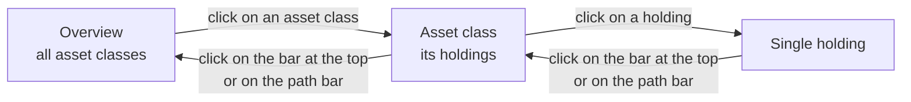

The "Asset Classes with Cash" report provides a comprehensive portfolio allocation analysis that displays both securities and cash holdings grouped by asset classes. This report is the central tool for strategic asset allocation, as it shows how total assets are distributed across different asset classes such as equities, bonds, commodities, and cash. Cash holdings are treated as special asset classes to enable a complete overview of the entire asset allocation.

## Functionality
The report groups all securities and cash holdings of the tenant by their asset classes. Securities are classified according to their actual asset class (e.g., equities, bonds, real estate, commodities), while cash holdings are represented as pseudo-securities in special asset classes. The grouping is structured as follows:

- **Securities**: Are grouped according to their asset class, for example:
  - Equities
  - Fixed Income
  - Money Market
  - Commodities
  - Real Estate
  - Multi-Asset
  - Convertible Bonds
  - Credit Derivatives
  - Currency Pairs

- **Cash holdings**: Are treated as special asset classes:
  - **Main currency**: Cash holdings in the tenant's main currency appear as a standalone asset class
  - **Foreign currencies**: Cash holdings in foreign currencies are displayed separately as another asset class

Each cash account appears as a row of its own with the name of the account.

All transactions up to the selected date are considered to ensure a point-in-time accurate presentation of asset allocation. The calculation is performed across all portfolios and securities accounts of the tenant, with all values automatically converted to the main currency.

## Grouping by Asset Classes
The primary grouping is by asset classes, with each asset class displayed as a separate group with all associated securities and positions. For each group, the following information is shown:

- A **group header** with the name of the asset class
- All **securities** of this asset class with their individual positions
- A **group total** with the aggregated values across all securities of this asset class

At the end of the report, the **grand total** appears across all asset classes, representing the tenant's total assets.

## Columns in the Report
The columns are the same as in the [security accounts report](../securityaccountreport/#columns-in-the-report). For a cash account, **Account relevant** shows the balance at the reporting date and **Account relevant (main currency)** the same amount in the main currency. When the [disposal cost]({}) estimate is switched on, the columns **Disposal costs** and **Value after disposal** stay empty for a cash account; the markup of converting foreign currency balances only appears in the [Portfolios](../portfolios/) report.

### Share of Total Assets
Because this report also contains the cash holdings, its total is the entire assets of the tenant. The column **Share %** therefore shows here which part of the total assets a security, a cash account or a whole asset class represents. The shares of all rows add up to 100%.

For CFD and Forex only the unrealized gain or loss counts towards the assets, because only this amount would be credited or debited to the account when the position is closed. A position at a loss therefore has a negative share, and the remaining positions add up to more than 100%. An example: you hold a security worth 10,000 and a CFD that is 5,000 in the red, and no cash. The total assets are 5,000, the security has a share of 200% and the CFD one of −100%. A share above 100% therefore indicates that you are invested with more than you own net. An overdrawn cash account also has a negative share.

If the total assets are zero or negative, the column stays empty. How large the risk of a margin position is, is shown not by **Share %** but by the column **Security risk** and the bar chart of the [chart view](#chart-view).

### Group Totals and Grand Totals
Subtotals are displayed for each asset class. These summary rows are highlighted in color and show the aggregated values of all securities and cash positions within the asset class. The group total includes:

- The sum of all gains and losses of the asset class
- The total value of all positions in this asset class
- The share of the asset class in the total assets in the column **Share %**

At the end of the report, the grand total appears across all asset classes, showing the tenant's total assets (securities plus cash holdings) in the main currency.

## Filter Options
The report offers the following filter options to customize the view, as described under [filter options](../securityaccountreport/#filter-options) of the security accounts report:

- **To date**: The report can be set to a specific date, showing holdings and values at a historical point in time. This is particularly useful for year-end closings, tax evaluations, or comparisons between different time points. Clicking the replay icon next to the date field resets the date to today
- **Show closed positions**: This option can be activated via the context menu to also display securities that have been completely sold in the meantime. This is useful for analyzing historical performance or for tax purposes

## Comparison with a Rule-Based Strategy
Above the table, one of your rule-based strategies can be selected under **Compare with strategy**. The report then no longer shows how the assets are distributed across asset classes, but how they are distributed across the groups of that strategy, and contrasts the actual distribution with the targets entered there. The entry **No comparison** returns you to the ordinary view; without a selection the report is unchanged. A strategy whose comparison cannot be computed, for instance because its weightings do not add up to 100% or because it has no portfolio rebalance, is listed but cannot be chosen; move the mouse over it and GT names the reason.

The grouping follows the strategy and no longer the asset class, because that is where the targets live. A freely named group has no asset class at all, and the same asset class can be split across several groups. Two additional groups complete the picture:

- **Cash** holds the cash balances, which sit outside the investment budget. Its target is 100% minus the value **Maximum investment** of the portfolio based strategy. This target is a lower bound: a negative deviation means there is less cash than the investment ceiling leaves over.
- **Not in the strategy** holds those positions you own but which do not appear in the selected strategy. They have no target, but they are visible and can be reduced.

### Additional Columns
The following columns are added per security and per group:

| Column | Meaning |
|---|---|
| **Target %** | The intended share of total assets in percentage points. |
| **Actual %** | The actual share of net equity in percentage points, measured by the market exposure of the position. |
| **Deviation %** | Actual minus target. A positive value appears green, a negative one red; the colour shows only the direction and says nothing about whether the tolerance is breached. |
| **Action** | **Buy**, **Sell**, **Hold** or **Blocked**. This is the trade and not the direction of the exposure: a short position that has grown too large is reduced with **Buy**. |
| **Amount** | The volume of the proposed trade in the main currency. |
| **Units** | The same volume in units. When no usable price is available the column stays empty rather than inventing a quantity. |
| **Reason** | Why the row reads as it does, for instance because it is within the tolerance or because the investment ceiling is exceeded. This column is hidden by default and can be shown via **Turn on/off columns**. |
| **Deviation within parent budget (pp)** | For a security, the deviation within its group: its share of the group's target amount minus its weighting. For a group, the deviation from its target amount, measured against the investment budget. When the deviation of a security lies outside the security allocation band, the cell is shown in bold on a yellow background. This is the highlight to watch for. |
| **Remaining class adjustment** | Groups only. The part of the adjustment that could not be placed on any security, for instance because the security allocation band or the maximum number of traded securities prevents it, or because a price is missing. |

The column **Share %** remains in this view and must not be confused with **Actual %**. **Actual %** measures the market exposure, so for a CFD or a short position the full market value without sign, because a strategy controls the exposure. **Share %** instead measures what the position contributes to the assets, so for a CFD only the gain or loss. For ordinary securities without leverage both values are close to each other; small differences arise because the comparison refers to the last completed trading day.

**Turn on/off columns** shows further columns that are filled for groups only. **Security allocation band (percentage points)** and **Maximum traded securities per asset class** show the settings that apply to that group. **Requested class adjustment** states the amount by which the group as a whole should change. Subtracting the **Remaining class adjustment** from it gives the amount the proposed trades actually cover.

### Key Figures Above the Table
Above the table the **Valuation date**, the **Last checkpoint** and the **Next checkpoint** of the portfolio rebalance the **Overall allocation mismatch (%)**, the **Investment ceiling (%)**, the **Gross exposure (%)** and the **Deviation from ceiling (%)** appear together with **Net equity**, **Cash**, **Gross exposure**, **Investment budget**, **Unused tactical budget** and the **Tolerance**. These figures are deliberately kept apart and not combined into one total: with short or margin positions they differ considerably, because such a position consumes the budget with its full market exposure while contributing only its result to the assets. If gross exposure is larger than the investment budget, the note **Investment ceiling exceeded** appears as well; only recommendations that reduce the exposure are then issued.

The checkpoints apply only to the strategy assigned to [portfolio monitoring](../../algoalert/algo/#portfolio-monitoring), because only that strategy remembers when it was last compared. For any other strategy both fields stay empty and every day counts as a checkpoint. The **Overall allocation mismatch (%)** sums up in one figure how well the actual distribution across the securities matches the target distribution: 0% means matching proportions, 100% no overlap. Cash and the size of the total invested amount are left out; they are judged by the other key figures.

The target of the portfolio based strategy itself, the value **Maximum investment**, appears as **Investment ceiling (%)** next to the **Gross exposure (%)**, both in percent of net equity. The **Deviation from ceiling (%)** is their difference in percentage points; a positive value means the portfolio is invested above its ceiling. If net equity is zero, gross exposure, deviation and the target of the cash group stay empty.

The comparison always refers to a completed trading day. If you choose today as the until date, the last completed day is used and reported as the valuation date.

How the targets come about and when a rebalancing falls due is described under [Portfolio Rebalancing](../../algoalert/strategy/rebalancing/). GT never books a transaction itself. The **Rebalancing monitoring** card on the [Dashboard]({}) opens this report through **Open rebalancing report**, with the monitored strategy already selected.

## Context Menu and Interactions
By right-clicking anywhere in the table or via the menu icon, the context menu opens with the following functions:

### Turn on/off columns
This function opens a dialog for column configuration that allows showing or hiding individual columns. This is particularly useful for focusing the view on relevant information or achieving a clearer presentation with limited screen space.

The column configuration is saved and persists even after closing and reopening the report. This allows each user to configure their individual view.

Typical use cases for column configuration:
- Hiding detail columns for a compact overview
- Focus on gains and total values
- Display only the most important metrics for a quick overview
- Adaptation to different screen sizes or resolutions

### Show Chart
This function shows the distribution of the assets as a chart in the [Additional Area]({}), either per asset class or as a treemap of all holdings, see [Chart View](#chart-view).

### Show closed positions
With this option, securities that have been completely sold in the meantime can also be displayed. The option is marked with a checkmark when active. This is particularly useful for:
- Analysis of realized gains and losses
- Tax evaluations
- Historical performance analyses
- Complete transaction overview

## Expandable Rows
Each position can be expanded by clicking the expander icon. The expanded view displays different information depending on whether it is a security or a cash holding:

### Expansion for Securities
The expanded view displays all **transactions** for this security. This enables detailed tracking of all purchases, sales, dividends, and other transactions that led to the current position. Among others, the list shows **Date**, **Transaction type**, **Quantity**, **Price/Div/etc.**, **Tax (every kind)**, **Adjusted Holdings**, **Transaction cost**, **Account posting** as well as the **Gain** and **Gain %** of the individual transaction. For CFD and Forex the transactions appear as a tree: below each opening stand the transactions with which it was fully or partly closed.

### Expansion for Cash Holdings
For cash holdings represented as pseudo-securities, the expanded view shows all **account transactions** that led to this cash holding. This includes:
- Deposits and withdrawals
- Internal transfers between accounts
- Account fees
- Interest income
- Security transactions that affected the cash holding

This enables seamless tracking of all cash movements and transparently shows how the current cash holding is composed.

### Context Menu on Transactions
For expanded rows, individual transactions can be edited. Right-clicking on a transaction opens the context menu with corresponding editing options. For more information, see [Security Transactions](../../../transaction/security/) or [Cash Account Transactions](../../../transaction/cashaccount/).

## Chart View
The chart view presents the distribution of the assets graphically. It is opened via **Show Chart** in the **View** menu or in the context menu and appears in the [Additional Area]({}). Above the chart, the selection **Chart type** offers two charts: **Net risk and share per asset class** and **Holdings as treemap**. GT remembers the choice per tenant and shows the same chart the next time the view is opened.

### Net Risk and Share per Asset Class
This chart consists of two parts side by side. On the left, a horizontal bar chart shows the **Security risk** per asset class, and the balance for the two asset classes of the cash holdings. Here CFD and Forex appear with their full market exposure. On the right, a pie chart shows the share of each asset class in the total assets; the size of each segment corresponds to the column **Share %** of the group total. Together the two parts show how the assets are distributed and where the risk lies.

{}
A pie chart cannot display negative shares. An asset class with a negative value, such as CFDs at a loss or overdrawn foreign currency accounts, is therefore missing from the pie, and the percentages in the pie refer only to the asset classes with a positive value. In that case the values of the column **Share %** are authoritative.
{}

Hovering over a segment of the pie chart with the mouse shows the asset class and its percentage share. In the bar chart you enlarge a section by dragging a rectangle with the mouse button held down; a double-click restores the original view. Clicking an entry of the legend hides or shows the asset class concerned in the pie chart.

### Holdings as Treemap
The treemap shows the composition of the total assets down to the single holding. Every rectangle stands for a part of the assets, and its area is proportional to its value. The outer level is formed by the asset classes; within each asset class lie its securities, ordered by value from largest to smallest. The cash holdings appear per currency: the balances of all cash accounts in the same currency form one rectangle, below **Main currency** for the main currency of the tenant and below **Foreign currencies** for all others. Unlike the pie chart, the treemap thus shows at a glance which single positions dominate the assets, even with many holdings.

The value of a rectangle is the value at the reporting date in the main currency as if everything were sold on that day; it corresponds to the column **Account relevant (main currency)**. Each rectangle is labelled with its name and its share of the total assets, the same figure as in the column **Share %**.

CFD and Forex positions get no rectangle of their own. When such a position is closed, only its unrealized gain or loss is credited or debited to the account it settles into. That is why this amount is added to the cash of the currency of that account. When you hover over such a cash rectangle, the line **of which unrealized from CFD/Forex** shows the amount included and the positions it stems from.

{}
A treemap cannot draw a negative area, and a value without a price is not reliable. A security or currency with a negative value, for example an overdrawn cash account, as well as a position whose price or exchange rate is missing, is therefore left out of the chart. So that nothing disappears unnoticed, such values are listed below the chart after **Not shown**, each with its amount and the reason **negative value** or **price or exchange rate missing**. The rectangles plus these values add up to the total of the report.
{}

The treemap is not available while a strategy is selected under **Compare with strategy**; the chart view then shows the note **The treemap is not available while a strategy is selected.** Closed positions shown via **Show closed positions** have no value and therefore no rectangle.

#### Drilldown and Back
Clicking on the individual sections will begin to drilldown into them. A click on an asset class enlarges it to the full size of the chart, so that its holdings become large enough to read even when they are tiny in the overview. A click on a single holding enlarges it in the same way.

The reverse click leads back. At the top of the enlarged view the section just opened remains visible as a narrow bar with its name; a click on this bar returns to the next higher level, from a holding to its asset class and from the asset class to the overview of all assets. Additionally, a path bar above the rectangles shows where you are, for example the report title followed by the asset class. A click on an entry of the path bar jumps directly back to that level.

Hovering over a rectangle shows its name, its value in the main currency, its share of the total assets and its share of the next higher level, for example of its asset class. For a security, the **Price gain** in percent is added.

### Chart Interpretation
The chart enables various analyses:

**Asset Allocation**: The relative size of the segments immediately shows how assets are distributed across different asset classes. A balanced distribution indicates a diversified investment strategy.

**Liquidity Level**: The proportion of cash holdings (main currency and foreign currencies) shows how much liquid funds are available. A very low proportion may indicate a high investment level, while a very high proportion suggests unused capital.

**Diversification**: An even distribution across multiple asset classes indicates a well-diversified strategy, while a strong concentration on one or two asset classes signals higher concentration risk.

**Rebalancing Needs**: Large deviations from the target asset allocation become immediately visible and can serve as a signal for necessary rebalancing.

### Updates
An open chart adapts automatically as soon as the table is reloaded, for example when the until date is changed or the option **Show closed positions** is toggled. A treemap that was drilled down then starts again with the overview of all asset classes.

## Typical Use Cases
The "Asset Classes with Cash" report supports various analytical approaches for managing and optimizing asset allocation:

### Strategic Asset Allocation
The most important use case is reviewing and controlling strategic asset allocation. Investors often define target quotas for different asset classes (e.g., 60% equities, 30% bonds, 10% cash). This report immediately shows whether the actual allocation deviates from these targets and enables informed rebalancing decisions.

### Risk Management
Different asset classes have different risk profiles. The report enables a quick assessment of the portfolio's overall risk through the distribution across asset classes. A high concentration in risky asset classes (e.g., equities, commodities) indicates an aggressive profile, while an emphasis on bonds and cash signals a conservative profile.

### Liquidity Management
The separate reporting of cash holdings in main currency and foreign currencies enables precise liquidity planning. It is immediately apparent how much liquid funds are available and whether these are sufficient for planned investments or whether excess liquidity should be invested.

### Performance Attribution
Through grouping by asset classes, it becomes visible which asset classes contribute to overall performance and which are performance drivers. This supports the analysis of whether the investment strategy is successful or whether adjustments are necessary.

### Currency Diversification
For international portfolios, the report shows not only diversification across asset classes but also across currencies. The separate reporting of foreign currency holdings enables assessment of currency risk.

### Rebalancing Planning
Large deviations from the target allocation become immediately visible. The report shows in which asset classes capital should be withdrawn and in which it should be invested to restore the desired asset allocation.

## Special Features
- **Complete asset overview**: Unlike pure securities reports that only show invested funds, this report provides a complete picture through the inclusion of all cash holdings as special asset classes. This enables a realistic assessment of the entire asset allocation
- **Treatment of cash holdings**: Cash holdings are represented as pseudo-securities in special asset classes. This enables consistent presentation and calculation of asset allocation across all assets
- **Main currency vs. foreign currencies**: Cash holdings in the tenant's main currency are reported separately from foreign currency holdings. This enables a differentiated view of liquidity and currency risk
- **Multi-currency support**: All values are automatically converted to the tenant's main currency using the current exchange rates at the selected date
- **Comprehensive asset classes**: The report supports all common asset classes, from traditional equities and bonds through real estate and commodities to special categories like convertible bonds and credit derivatives
- **Historical analysis**: Through the ability to set an until date, historical asset allocations can be analyzed. This is valuable for analyzing strategy development over time or for tax evaluations at specific dates
- **Closed positions**: The option to display closed positions enables a complete overview of all transactions and realized gains/losses within a period
- **Transaction details**: By expanding rows, all underlying transactions for both securities and cash holdings can be viewed, enabling complete tracking

## PDF report

The entry **PDF report...** in the context menu creates a statement of assets of the tenant at the date that is set, with the holdings and the allocation by asset class and currency. See [PDF report]({}).
