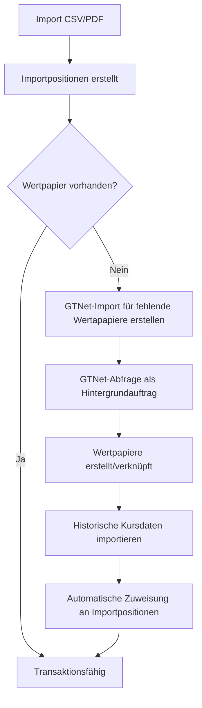

{}
Die Implementierung von GTNet ist noch nicht vollständig abgeschlossen. Diese Dokumentation beschreibt die geplante und teilweise bereits umgesetzte Funktionalität.
{}
Beim Import von Transaktionen fehlt manchmal das zugehörige Wertpapier in der lokalen Instanz. Ohne ein verknüpftes Wertpapier kann die Importposition nicht in eine Transaktion umgewandelt werden. Der **GTNet Wertpapier-Import** bietet eine effiziente Lösung: Fehlende Wertpapiere werden automatisch bei anderen GTNet-Instanzen abgefragt und mit allen Metadaten, Datenkonnektoren und Anlageklassen erstellt.

## Arbeitsablauf
Der folgende Ablauf zeigt, wie fehlende Wertpapiere während des Transaktionsimports über GTNet ergänzt werden:

## Voraussetzungen
Damit die Funktion genutzt werden kann, müssen folgende Bedingungen erfüllt sein:
- Mindestens eine **Importposition** mit fehlendem Wertpapier ist vorhanden.
- Die Importposition enthält eine **ISIN** oder einen **Ticker/Symbol** zur Identifikation.
- Eine **Währung** ist in der Importposition angegeben.
- Der Benutzer hat Zugriff auf das **GTNet-Netzwerk** (mindestens eine erreichbare Peer-Instanz).

## Funktion aufrufen
Die Funktion wird über das Kontextmenü der Importposition aufgerufen:
1. Wechseln Sie zur **Ansicht Transaktionsimport** im betroffenen Depot.
2. Selektieren Sie eine oder mehrere Importpositionen ohne zugewiesenes Wertpapier.
3. Öffnen Sie das Kontextmenü und wählen Sie **GTNet-Import für fehlende Wertapapiere erstellen**.
4. Im erscheinenden Dialog können Sie entweder ein bestehendes **Import-Set** auswählen oder ein neues erstellen.
5. Nach Bestätigung wird ein **Hintergrundauftrag** gestartet, der die GTNet-Peers abfragt.

## Nach der GTNet-Abfrage
Sobald der Hintergrundauftrag abgeschlossen ist:
- Die gefundenen Wertpapiere werden automatisch erstellt oder mit bestehenden verknüpft.
- Die ursprünglichen Importpositionen werden automatisch mit den neuen Wertpapieren verknüpft.
- Die Ansicht muss manuell aktualisiert werden, um die Änderungen zu sehen.

{}
Die GTNet-Abfrage wird als Hintergrundauftrag ausgeführt. Die aktuelle Ansicht wird **nicht automatisch aktualisiert**. Um den Status zu prüfen, verwenden Sie die **Hintergrund-Jobs** im Systemmenü.
{}

## GTNet Wertpapier-Import Tab
Nach dem Auslösen der GTNet-Abfrage können Sie zum **GTNet Wertpapier-Import** Tab wechseln, um den Fortschritt und die Details des Imports zu verfolgen. Dort sehen Sie:
- Das erstellte **Import-Set** mit allen Positionen
- Den **Verknüpfungsstatus** jeder Position
- Eventuelle **Import-Lücken**, falls bestimmte Konfigurationen nicht übertragen werden konnten

Ausführliche Informationen zur Verwaltung von Import-Sets und zur Interpretation von Import-Lücken finden Sie in der [GTNet Wertpapierimport Dokumentation](../../../../basedata/gtnetsecurityimport/).
