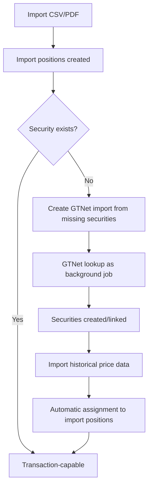

{}
The implementation of GTNet is not yet complete. This documentation describes the planned and partially implemented functionality.
{}
When importing transactions, the associated security may sometimes be missing from the local instance. Without a linked security, the import position cannot be converted into a transaction. The **GTNet Security Import** provides an efficient solution: Missing securities are automatically queried from other GTNet instances and created with all metadata, data connectors, and asset classes.

## Workflow
The following diagram shows how missing securities are supplemented via GTNet during transaction import:

## Prerequisites
The following conditions must be met to use this feature:
- At least one **import position** with a missing security exists.
- The import position contains an **ISIN** or **ticker/symbol** for identification.
- A **currency** is specified in the import position.
- The user has access to the **GTNet network** (at least one reachable peer instance).

## Invoking the Function
The function is accessed via the context menu of the import position:
1. Navigate to the **Transaction import view** in the relevant securities account.
2. Select one or more import positions without an assigned security.
3. Open the context menu and select **Create GTNet import from missing securities**.
4. In the appearing dialog, you can either select an existing **import set** or create a new one.
5. After confirmation, a **background job** is started that queries the GTNet peers.

## After the GTNet Lookup
Once the background job is complete:
- The found securities are automatically created or linked to existing ones.
- The original import positions are automatically linked to the new securities.
- The view must be manually refreshed to see the changes.

{}
The GTNet lookup runs as a background job. The current view is **not automatically updated**. To check the status, use the **Background Jobs** in the system menu.
{}

## GTNet Security Import Tab
After triggering the GTNet lookup, you can switch to the **GTNet Security Import** tab to track the progress and details of the import. There you will see:
- The created **import set** with all positions
- The **linking status** of each position
- Any **import gaps** if certain configurations could not be transferred

For detailed information on managing import sets and interpreting import gaps, see the [GTNet Security Import Documentation](../../../../basedata/gtnetsecurityimport/).
