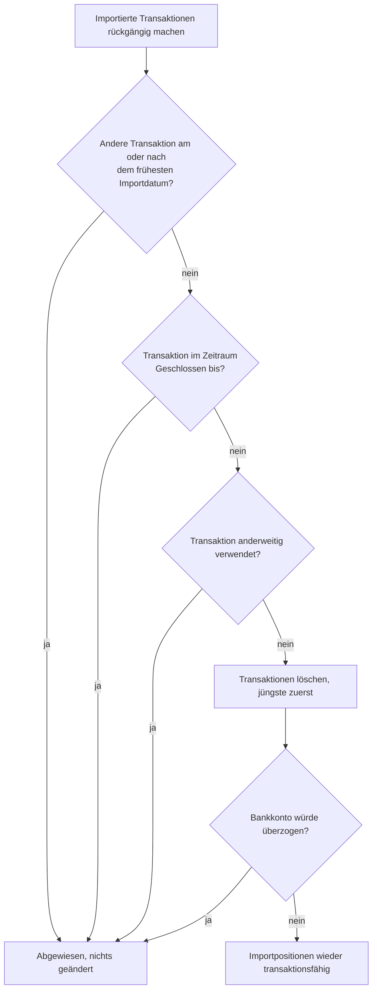

**Transaktionsimport** ist eine **Zwischenstufe** nach dem Import und bevor der Import zur Transaktion wird. Nur der vollständig erfolgreiche Import mit **Drag & Drop** benötigt die **Ansicht Transaktionsimport** nicht. Alle anderen Arten des Importes werden über diese **Ansicht** erledigt. Diese Ansicht gibt Aufschluss über den **Status** jeder **Importposition**, erlaubt gewisse Korrekturen daran und verarbeitet sie letztendlich zu einer **realen Transaktion**. Jedes Hochladen erzeugt neue Importpositionen, auch wenn dasselbe Dokument schon einmal importiert wurde. Ob zu einer Importposition bereits eine Transaktion besteht, zeigt die Eigenschaft **Hat vielleicht Transaktion**.

### Erstellen und bearbeiten Importgruppe
Es kann mehrere **Importgruppen** pro **Depot** geben. Diese werden vom Benutzer oder beim fehlgeschlagenen **Drag & Drop** von **PDF** durch das System erzeugt.
- **Erstellen Importgruppe**: Erstellen Sie eine neue Importgruppe. Der **Name Importgruppe** umfasst höchstens 40 Zeichen und muss innerhalb eines **Depots** einzigartig sein. Zusätzlich kann eine **Notiz** angebracht werden. Sind die Grafioschtrader-Importvorlagen eingerichtet, erscheint auch das Auswahlkästchen «**Grafioschtrader-Importvorlagen verwenden**», siehe [Grafioschtrader-Import]({}).
- **Bearbeiten Importgruppe**: Name, Notiz und das allfällige Auswahlkästchen können geändert werden.
- **Löschen Importgruppe**: Eine Importgruppe kann erst gelöscht werden, wenn sie keine **Importpositionen** mehr enthält.

### Voraussetzung für die Transaktionsfähigkeit
Das System führt Zuordnungen und Berechnungen aufgrund der importierten Werte durch. Eine **Importposition** wird **Transaktionsfähig**, falls folgende Schritte erfolgreich durchgeführt werden können.
- **Wertpapier Zuordnung**: Aufgrund der **ISIN** oder des **Symbol/Ticker** geschieht die Zuordnung eines bestehenden Wertpapieres.
- **Bankkonto Zuordnung**: Mit der Angabe des Wertes von **Feld "cac"**, siehe [Importvorlage]({}), geschieht die Zuordnung eines existierenden Bankkontos dieses Portfolios.
- **Gesamtsumme Überprüfung**: Aus den Angaben der importierten Transaktion wird die **Gesamtsumme** errechnet, diese muss mit dem entsprechenden Wert des **Feld "ta"** übereinstimmen. Eine in der [Importvorlage]({}) festgelegte Rundungstoleranz (**calcRounding**) wird dabei akzeptiert.

Ein Teil der angebotenen Funktionen auf der **Importposition** hilft, diese Bedingungen zu erfüllen. Eine Anpassung nimmt das System selbständig vor: Offensichtlich können Dividenden auch am Wochenende ausgezahlt werden, was GT nicht unterstützt. Daher wird eine Dividende mit Zahltag an einem Samstag auf den vorhergehenden Freitag und eine an einem Sonntag auf den folgenden Montag verschoben. Transaktionsfähig bedeutet allerdings nur, dass diese Voraussetzungen erfüllt sind. Beim Erstellen wird jede Transaktion gleich geprüft wie bei der manuellen Erfassung und kann trotzdem abgewiesen werden, beispielsweise weil ein Bankkonto ohne erlaubte Überziehung ins Minus fallen würde oder weil das Depot gemäss seinen Handelsperioden diese Art von Instrument nicht zulässt, siehe **Erstelle Transaktionen**.

### Eigenschaften und Tabellenspalten
Bestimmte Tabellenspalten können ein- und ausgeblendet werden, siehe dazu [Bedienelemente]({}). Die Spalten **Zweck der Vorlage** und **Gültig ab** der verwendeten Importvorlage sind anfänglich ausgeblendet. Die Spalte ohne Überschrift nach der **Datei ID** zeigt mit einem Symbol, ob die Importposition aus einem PDF-Dokument, einer CSV-Datei oder einer Datei von GT-PDF-Transform stammt.
- **Differenz Gesamtsumme**: Die Abweichung zwischen der errechneten und der im Dokument ausgewiesenen Gesamtsumme.
- **Transaktionsfähig**: Die Importposition erfüllt die oben genannten Voraussetzungen und kann zur Erstellung einer Transaktion ausgewählt werden.
- **Hat Transaktion**: Ein Häkchen bedeutet, dass die Importposition schon zu einer Transaktion verarbeitet wurde. Ein Fehlersymbol bedeutet, dass die Erstellung der Transaktion abgewiesen wurde. Den Grund zeigt die expandierende Tabellenzeile unter **Transaktionsfehler**.
- **Hat vielleicht Transaktion**: Das System hat eine bestehende Transaktion gefunden, die der Importposition entspricht. So wird verhindert, dass dieselbe Transaktion zweimal importiert wird. Bei einer Wertpapiertransaktion müssen im aktuellen Depot Wertpapier, Transaktionstyp, Datum und Anzahl sowie der Kurs oder die Gesamtsumme übereinstimmen. Bei einer Transaktion ohne Wertpapier, beispielsweise einer **Einzahlung**, **Auszahlung**, **Konto- und Depotkosten** oder einem **Kontozins**, müssen Bankkonto, Transaktionstyp, Datum und Gesamtsumme übereinstimmen. Ein Häkchen bedeutet, dass für eine solche Importposition keine Transaktion erstellt wird. Ein durchgestrichenes Häkchen bedeutet, dass diese Erkennung mit **Übergehe die vielleicht Transaktion** ausgeschaltet wurde.

### Funktionen der Importgruppe
Diese Funktionen beziehen sich auf die gewählte **Importgruppe** und sind unabhängig von einer in der Tabelle ausgewählten Zeile. Dazu gehören die oben beschriebenen Funktionen zum Erstellen, Bearbeiten und Löschen der **Importgruppe** sowie die folgenden:
- **Hochladen CSV-Datei**, **Hochladen PDF Dateien** und **Hochladen von GT Transform**: Das Hochladen der Dokumente in die gewählte Importgruppe ist unter [Transaktionsimport]({}) beschrieben.
- **Importierte Transaktionen rückgängig machen**: Löscht alle Transaktionen, die aus den Importpositionen dieser Importgruppe erstellt wurden, siehe unten. Dieser Menüpunkt ist nur aktiv, wenn mindestens eine Importposition eine Transaktion hat.
- **GTNet-Import für fehlende Wertapapiere erstellen**: Falls Importpositionen ein fehlendes Wertpapier mit ISIN oder Symbol haben, können diese über das GTNet-Peer-Netzwerk abgefragt und automatisch erstellt werden. Siehe [Wertpapierimport für Transaktionen]({}) für Details.

### Funktionen auf selektierte Importposition/en
Diese Ansicht unterstützt die Mehrfachauswahl, daher muss jede selektierte Importposition die Voraussetzung der gewählten Funktion erfüllen, andernfalls ist der Menüpunkt nicht aktiv. Die Korrekturfunktionen und **Erstelle Transaktionen** sind für Importpositionen gesperrt, die bereits eine Transaktion oder vielleicht eine Transaktion haben.

#### Korrekturfunktionen
Die folgenden Funktionen dienen der Korrektur an **Importposition**, damit diese **Transaktionsfähig** werden:
- **Differenz Gesamtsumme akzeptieren**: Dabei wird die kleine Abweichung zwischen der errechneten und der im Dokument ausgewiesenen Gesamtsumme akzeptiert und die entsprechende Importposition wird **Transaktionsfähig**. Bei der Erstellung der Transaktion wird die im Dokument ausgewiesene Gesamtsumme dem Bankkonto gutgeschrieben, sodass der Saldo mit dem Beleg übereinstimmt, und die Abweichung als **Rundungsdifferenz** auf der Transaktion festgehalten. Diese Funktion sollte nur angewendet werden, falls die Abweichung sehr gering ist. Ist in der [Importvorlage]({}) die Konfiguration **calcRounding** gesetzt, akzeptiert das System solche Abweichungen innerhalb der festgelegten Toleranz bereits automatisch, sodass dieser Schritt entfällt.
- **Korrigiere Multiplikation auf Gesamtsumme**: Diese Funktion kann möglicherweise das Problem **Transaktionsfähigkeit** der Importposition bezüglich der gescheiterten **Gesamtsumme Überprüfung** beheben. Sie steht nur zur Verfügung, wenn für jede selektierte Importposition eine Gesamtsumme errechnet werden konnte.
   + Manchmal ist der Wechselkurs im importierten Dokument nicht exakt angegeben, diese Funktion korrigiert den Wechselkurs entsprechend.
   + In GT ist der **Zins in Prozenten** massgebend für die Berechnung der **Gesamtsumme** des Zinses, dieser wird möglicherweise als Jahreszins ausgewiesen, obwohl der massgebende Zins eine kürzere Zeitdauer abdeckt. Daher kann diese Funktion den **Zins in Prozenten** entsprechend der **Gesamtsumme** anpassen.
- **Instrument zuweisen**: Einer Wertpapiertransaktion können Sie ein Instrument zuweisen. Dazu öffnet sich der [Suchdialog für Instrumente]({}).
- **Bankkonto zuweisen**: Hiermit können Sie der Importposition ein Bankkonto zuweisen.

{}
Grundsätzlich erwartet GT eine Transaktion in der Währung des Instruments. Insbesondere ETFs können in verschiedenen Währungen gehandelt werden, obwohl sie nur eine Fondswährung haben. Die Auszahlung von Zinsen oder Dividenden erfolgt in der Fondswährung. In solchen Fällen kann es sein, dass die Handelsplattform keine Währungsumrechnung vornimmt. Beim Import einer solchen Transaktion ergänzt GT die Transaktion mit einem Währungskurs, der anhand des Handelsdatums ermittelt wird. Selbstverständlich werden der Zins- oder Dividendenbetrag und eventuelle Steuern automatisch angepasst. Diese Ergänzung erfolgt bei der Erstellung der Transaktion und ist daher nur bei der erstellten Transaktion sichtbar.
{}

#### Transaktionsfunktionen
Die folgenden Funktionen beziehen sich auf das Erstellen einer Transaktion.
- **Erstelle Transaktionen**: Die selektierten Importpositionen werden in der Reihenfolge ihres Datums zu Transaktionen verarbeitet. Dies ist nur möglich, falls jede Importposition **Transaktionsfähig** ist und noch **keine Transaktion** und keine "**vielleicht Transaktion**" hat. Jede Transaktion wird dabei gleich geprüft wie bei der manuellen Erfassung. Wird eine Importposition abgewiesen, beispielsweise weil das Instrument gemäss den [Handelsperioden]({}) im Depot an diesem Datum nicht gehandelt werden darf, weil das Bankkonto überzogen würde oder weil das Datum nach dem **Aktiv bis oder Fälligkeitstag** des Kontos liegt (siehe [Stilllegung eines Kontos]({})), erhält diese Position einen **Transaktionsfehler**. Die übrigen Positionen werden weiterhin verarbeitet. Unmittelbar vor dem Erstellen prüft das System jede Importposition nochmals auf eine bestehende Transaktion. Sind beispielsweise zwei gleiche Importpositionen selektiert, wird nur aus der ersten eine Transaktion erstellt; die zweite bleibt als Importposition bestehen und erhält die Eigenschaft **Hat vielleicht Transaktion**. Ein Kontoübertrag besteht aus zwei Importpositionen, die beide selektiert sein müssen, andernfalls wird der Vorgang mit dem Hinweis auf die fehlende Gegenbuchung abgebrochen. Wird eine der beiden Seiten als mögliche bestehende Transaktion erkannt, wird der ganze Kontoübertrag nicht erstellt. Würde der Import die maximale Anzahl Transaktionen des Mandanten überschreiten, wird keine einzige Transaktion erstellt.
- **Übergehe die vielleicht Transaktion**: Das System erkannte die Importposition als mögliche Transaktion und hat diese entsprechend so ausgezeichnet, siehe Eigenschaft **Hat vielleicht Transaktion**. Mit dieser Funktion kann diese Erkennung durch das System für die selektierte/n Importpositionen ausgeschaltet werden. Danach lässt sich die Importposition trotzdem zu einer Transaktion verarbeiten. Wenden Sie diese Funktion nur an, wenn Sie sicher sind, dass es sich um eine weitere, eigenständige Transaktion handelt, beispielsweise um zwei gleiche Käufe am selben Tag.
- **Prüfe auf bestehende Transaktion**: Falls die Funktion "**Übergehe die vielleicht Transaktion**" zur Anwendung kam, aktiviert diese Funktion die Prüfung der Importposition auf bestehende mögliche Transaktion.

#### Weitere Funktionen
- **Löschen mehrer Importposition**: Löscht die selektierten Importpositionen nach einer Rückfrage. Bereits daraus erstellte Transaktionen bleiben bestehen, sie sind danach aber nicht mehr mit einer Importposition verbunden und können somit auch nicht mehr über **Importierte Transaktionen rückgängig machen** entfernt werden.
- **Kopiere Dateiname ins Zwischenablage**: Kopiert den Namen der Datei, aus der die einzelne selektierte Importposition stammt, in die Zwischenablage. So lässt sich das ursprüngliche Dokument leicht wiederfinden.

### Importierte Transaktionen rückgängig machen
Wurde eine Importgruppe nur teilweise zu Transaktionen verarbeitet, beispielsweise weil die Handelsperioden des Depots noch nicht richtig eingerichtet waren, lässt sich der Import mit dieser Funktion zurücksetzen. Danach können Sie die Ursache beheben und alle Importpositionen erneut und in der richtigen zeitlichen Reihenfolge zu Transaktionen verarbeiten. Dies ist oft einfacher, als nur die abgewiesenen Positionen nachzutragen: Werden beispielsweise frühere Käufe nachträglich erfasst, kann die Überziehungsprüfung eines Bankkontos scheitern, weil spätere Verkäufe und Dividenden, die dieses Geld wieder einbringen, noch fehlen.

GT löscht alle Transaktionen, die aus den Importpositionen dieser Importgruppe erstellt wurden, und zwar genau in umgekehrter Reihenfolge ihrer Erstellung, also die jüngste zuerst. Ein Kontoübertrag wird mit beiden Seiten gelöscht. Die Importpositionen bleiben erhalten und sind danach wieder **Transaktionsfähig**, wobei die beiden Positionen eines Kontoübertrags miteinander verbunden bleiben. Das Rückgängigmachen geschieht vollständig oder gar nicht: Wird eine einzige Transaktion abgewiesen, bleibt alles unverändert.

Damit dabei keine anderen Daten Schaden nehmen, wird das Rückgängigmachen in den folgenden Fällen abgewiesen:
- Der Mandant hat eine andere Transaktion, die nicht aus dieser Importgruppe stammt und am oder nach dem Tag der frühesten importierten Transaktion datiert ist. Eine solche Transaktion könnte auf den importierten aufbauen, beispielsweise ein Verkauf auf einem importierten Kauf.
- Eine importierte Transaktion liegt an oder vor dem Datum **Geschlossen bis** ihres [Portfolios]({}) beziehungsweise des [Mandanten]({}).
- Eine importierte Transaktion wurde inzwischen von einer Wertpapieraktion wie einer ISIN-Änderung, einem Wertpapierübertrag, einem Dauerauftrag oder als Eröffnungstransaktion einer Simulation verwendet.
- Das Löschen einer Transaktion würde ein Bankkonto ohne erlaubte Überziehung ins Minus bringen.

{}
Wurde eine importierte Transaktion nach dem Import bearbeitet, beispielsweise mit einer Notiz, gehen diese Änderungen beim Rückgängigmachen verloren. Beim erneuten Erstellen entsteht die Transaktion wieder aus der Importposition.
{}

### Expandierende Tabellenzeile
Die **expandierende Tabellenzeile** hat zwei unterschiedliche Ansichten:
- **Importposition erkannt**: Angezeigt werden die **Importierten Werte**, die **Zugeordneten Werte** wie Bankkonto, Wertpapier und die errechnete Gesamtsumme, die verwendete **Importvorlage** mit dem Dateinamen sowie der **Importstatus**. Wurde die Erstellung der Transaktion abgewiesen, steht der Grund unter **Transaktionsfehler**.
- **Dokument nicht erkannt**: Es gibt eine tabellarische Ansicht mit allen **Importvorlagen** der **Vorlagengruppe**. Dabei erfolgt die Anzeige mit dem letzten erfolgreich erkannten **Feld** pro **Importvorlage**.

### Transaktionsimport in der Praxis

