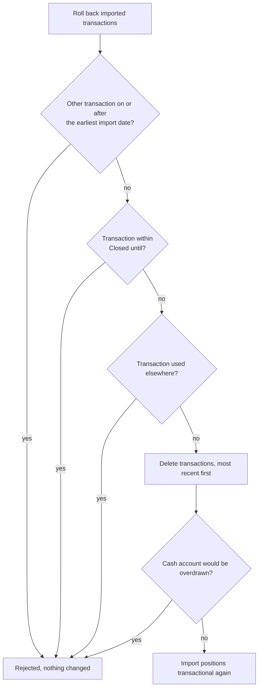

**Transaction import** is an **intermediate stage** after the import and before the import becomes a transaction. Only a fully successful import with **drag & drop** does not require the **Transaction import view**. All other types of import are completed via this **view**. It shows the **status** of every **import position**, allows certain corrections to it and finally processes it into a **real transaction**. Every upload creates new import positions, even if the same document has already been imported. Whether a transaction already exists for an import position is shown by the property **Has maybe transaction**.

### Create and edit import set
There can be several **import sets** per **securities account**. They are created by the user, or by the system when the **drag & drop** of a **PDF** fails.
- **Create Import set**: Create a new import set. The **Name transaction import** has at most 40 characters and must be unique within a **securities account**. A **note** can be added as well. If the Grafioschtrader import templates are set up, the check box «**Use Grafioschtrader import templates**» appears too, see [Grafioschtrader import]({}).
- **Edit Import set**: The name, the note and the check box, if shown, can be changed.
- **Delete Import set**: An import set can only be deleted once it no longer contains any **import positions**.

### Prerequisite for transaction capability
The system carries out allocations and calculations based on the imported values. An **import position** becomes **transactional** if the following steps can be carried out successfully.
- **Security allocation**: An existing security is allocated on the basis of the **ISIN** or **symbol/ticker**.
- **Cash account assignment**: By specifying the value of **field "cac"**, see [import template]({}), an existing cash account of this portfolio is assigned.
- **Total amount check**: The **total amount** is calculated from the details of the imported transaction; this must match the corresponding value of the **"ta" field**. A rounding tolerance configured in the [import template]({}) (**calcRounding**) is accepted here.

Some of the functions offered on the **import position** help to meet these conditions. One adjustment is made by the system itself: dividends can apparently also be paid out at the weekend, which GT does not support. A dividend with a payment date on a Saturday is therefore moved to the preceding Friday, and one on a Sunday to the following Monday. However, transactional only means that these prerequisites are met. When it is created, each transaction is checked in the same way as when it is entered manually and can still be rejected, for example because a cash account without permitted overdraft would become negative or because the trading periods of the securities account do not allow this kind of instrument, see **Create transactions**.

### Properties and table columns
Certain table columns can be shown or hidden, see [Control elements]({}). The columns **Purpose of template** and **Valid since** of the import template used are hidden initially. The column without a heading after the **File ID** shows with an icon whether the import position comes from a PDF document, a CSV file or a file from GT-PDF-Transform.
- **Difference Total**: The deviation between the calculated total and the total shown in the document.
- **transactional**: The import position meets the prerequisites above and can be selected for creating a transaction.
- **Has transaction**: A tick means that the import position has already been processed into a transaction. An error icon means that the creation of the transaction was rejected. The expanding table row shows the reason under **Transaction error**.
- **Has maybe transaction**: The system found an existing transaction that corresponds to the import position. This prevents the same transaction from being imported twice. For a security transaction, the security, transaction type, date and quantity, and either the price or the total amount must match in the current securities account. For a transaction without a security, for example a **Deposit**, **Withdrawal**, **Account/Depot cost** or **Account interest**, the cash account, transaction type, date and total amount must match. A tick means that no transaction is created for such an import position. A crossed-out tick means that this detection was switched off with **Skip the maybe transaction**.

### Functions of the import set
These functions relate to the selected **import set** and work independently of a row selected in the table. They include the functions for creating, editing and deleting the **import set** described above, as well as the following:
- **Upload CSV file**, **Upload PDF files** and **Upload from GT Transform**: Uploading documents into the selected import set is described under [Transaction import]({}).
- **Roll back imported transactions**: Deletes all transactions that were created from the import positions of this import set, see below. This menu item is only active if at least one import position has a transaction.
- **Create GTNet import from missing securities**: If import positions have a missing security with an ISIN or symbol, these can be queried via the GTNet peer network and created automatically. See [Security import for transactions]({}) for details.

### Functions on selected import position(s)
This view supports multiple selection, so each selected import position must meet the prerequisite of the chosen function, otherwise the menu item is not active. The correction functions and **Create transactions** are blocked for import positions that already have a transaction or a maybe transaction.

#### Correction functions
The following functions are used to correct **import positions** so that they become **transactional**:
- **Accept difference total**: The small deviation between the calculated total and the total shown in the document is accepted and the corresponding import position becomes **transactional**. When the transaction is created, the total shown in the document is credited to the cash account so that the balance matches the statement, and the deviation is recorded as a **rounding difference** on the transaction. This function should only be used if the deviation is very small. If the **calcRounding** configuration is set in the [import template]({}), the system already accepts such deviations within the defined tolerance automatically, so this step is no longer necessary.
- **Correct multiplication to total sum**: This function can possibly solve the **transaction capability** problem of the import position regarding the failed **total amount check**. It is only available if a total could be calculated for every selected import position.
  - Sometimes the exchange rate is not exactly specified in the imported document, this function corrects the exchange rate accordingly.
  - In GT, the **interest in percent** is decisive for the calculation of the **total amount** of interest. It may be shown as annual interest, although the decisive interest covers a shorter period of time. This function can therefore adjust the **interest in percent** according to the **total amount**.
- **Set security**: You can assign an instrument to a securities transaction. This opens the [search dialog for instruments]({}).
- **Set cash account**: Allows you to assign a cash account to the import position.

{}
In principle, GT expects a transaction in the currency of the instrument. ETFs in particular can be traded in different currencies, although they only have one fund currency. The payment of interest or dividends is made in the fund currency. In such cases, the trading platform may not perform a currency conversion. When importing such a transaction, GT supplements the transaction with a currency rate that is determined on the basis of the trade date. Of course, the interest or dividend amount and any taxes are automatically adjusted. This addition is made when the transaction is created and is therefore only visible in the created transaction.
{}

#### Transaction functions
The following functions relate to the creation of a transaction.
- **Create transactions**: The selected import positions are processed into transactions in the order of their dates. This is only possible if every import position is **transactional** and has **no transaction** yet and no "**maybe transaction**". Each transaction is checked in the same way as when it is entered manually. If an import position is rejected, for example because the [trading periods]({}) do not allow the instrument in the securities account on that date, because the cash account would be overdrawn, or because the date is after the **Active until or maturity date** of the account (see [Deactivating an account]({})), that position receives a **transaction error**. The remaining positions are still processed. Immediately before creating, the system checks every import position once more for an existing transaction. If, for example, two identical import positions are selected, a transaction is created only from the first one; the second remains an import position and receives the property **Has maybe transaction**. An account transfer consists of two import positions that must both be selected; otherwise the operation is cancelled with a message about the missing offsetting entry. If one of the two sides is recognized as a possible existing transaction, the whole account transfer is not created. If the import would exceed the maximum number of transactions of the client, not a single transaction is created.
- **Skip the maybe transaction**: The system recognized the import position as a possible transaction and marked it accordingly, see property **Has maybe transaction**. This function switches off this recognition by the system for the selected import position(s). Afterwards the import position can still be processed into a transaction. Only use this function if you are sure that it is a further, independent transaction, for example two identical purchases on the same day.
- **Check for existing transaction**: If the "**Skip the maybe transaction**" function was used, this function reactivates the check of the import position for an existing possible transaction.

#### Other functions
- **Delete multiple Import position**: Deletes the selected import positions after a confirmation. Transactions already created from them remain; however, they are then no longer linked to an import position and can therefore no longer be removed with **Roll back imported transactions**.
- **Copy file name to clipboard**: Copies the name of the file that the single selected import position comes from to the clipboard. This makes it easy to find the original document.

### Roll back imported transactions
If an import set was only partly processed into transactions, for example because the trading periods of the securities account were not yet set up correctly, this function resets the import. You can then remove the cause and process all import positions into transactions again, in the correct chronological order. This is often easier than adding only the rejected positions afterwards: when earlier purchases are added later, the overdraft check of a cash account can fail because later sales and dividends, which bring that money back, are still missing.

GT deletes all transactions that were created from the import positions of this import set, exactly in the reverse order of their creation, that is, the most recent first. An account transfer is deleted with both sides. The import positions are kept and become **transactional** again, and the two positions of an account transfer stay linked to each other. The rollback happens completely or not at all: if a single transaction is rejected, nothing is changed.

To make sure no other data is damaged, the rollback is rejected in the following cases:
- The client has another transaction that does not come from this import set and is dated on or after the day of the earliest imported transaction. Such a transaction could build on the imported ones, for example a sale on an imported purchase.
- An imported transaction lies on or before the **Closed until** date of its [portfolio]({}) or of the [client]({}).
- An imported transaction has since been used by a security action such as an ISIN change, by a security transfer, by a standing order or as an opening transaction of a simulation.
- Deleting a transaction would take a cash account that does not allow an overdraft below zero.

{}
If an imported transaction was edited after the import, for example with a note, these changes are lost by the rollback. When the transaction is created again, it is built from the import position once more.
{}

### Expanding table row
The **expanding table row** has two different views:
- **Import position recognized**: It shows the **Import values**, the **Assigned values** such as cash account, security and the calculated total, the **Import template** used together with the file name, and the **Import state**. If the creation of the transaction was rejected, the reason is shown under **Transaction error**.
- **Document not recognized**: There is a tabular view with all **import templates** of the **template group**. The last successfully recognized **field** per **import template** is displayed.

### Transaction import in practice
Unfortunately only in German:

