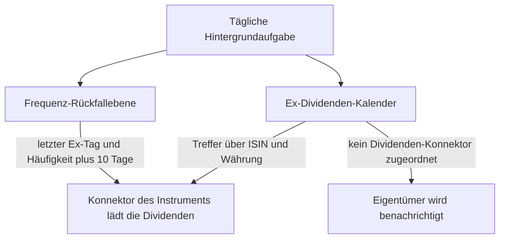

In GT werden **Historische Kursdaten** und **Splits** aus externen Datenquellen bezogen.

## Historische Kursdaten (Tagesendkurse)
Tagesendkurse sind für GT sehr wichtig, aus diesem Grund gibt es für deren Bearbeitung die Ansicht **Historische Kurse** im **Zusatzbereich**. Standardmässig werden diese Kursdaten **täglich** über eine oder mehrere **Hintergrundaufgabe/n** aktualisiert.

## Splits
Splits können manuell mit dem Wertpapier erfasst werden, andererseits überwacht GT **täglich** die Splits in den Kalendern von [Invesing.com](https://www.investing.com/stock-split-calendar/) und [Yahoo](https://finance.yahoo.com/calendar/splits). Die Überwachung führt dazu, dass über den Konnektor des Wertpapieres der vermutliche Split übernommen wird. Hierbei ist das Problem die korrekte Erkennung des Wertpapiers über den Namen des Unternehmens oder des Symbols. Mit dem indirekten Weg über den Konnektor des Wertpapieres wird sicher gestellt, dass keine "falschen" Splits dem Wertpapier zugeordnet werden.
### Die Wahl der Datenquelle
Zurzeit gibt es nur eine kostenlose **Datenquelle** für die **Splits**:
- [Yahoo USA Finance](https://finance.yahoo.com/): Die Ermittlung der **URL-Erweiterung** ist entsprechend der Kursdaten.

## Dividende
Dividenden werden für die **annualisierte Rendite** und zukünftig in der noch nicht implementierten historischen Simulation der Wertentwicklung eines oder mehrere Portfolio genutzt. Es wird keine automatische Übernahme von Dividenden in die realen Portfolios geben. Zurzeit können manuel keine Dividenden erfasst werden.

### Die Wahl der Datenquelle
Wir haben zwei kostenlose **Datenquellen** für **Dividenden**:
- [DivvyDiary](https://divvydiary.com/): Diese Datenquelle muss sicherlich manuel überprüft werden: 
  + Manchmal ist die Historie nicht vollständig und nur die letzten Jahre sind vorhanden.
  + Die Währung der Dividende entspricht nicht immer der Währung des Instruments. Diese abweichende Währung muss angegeben werden.
  + Der Betrag ist nicht Aktiensplit bereinigt.
- [Yahoo USA Finance](https://finance.yahoo.com/): Die Ermittlung der **URL-Erweiterung** ist entsprechend der Kursdaten. 
  + Der Betrag ist gemäss Aktiensplits bereinigt.

DivvyDiary stellt zudem einen **Ex-Dividenden-Kalender** bereit, über den GT erkennt, *wann* eine Ausschüttung stattgefunden hat. Dies ist von der Rolle als Datenquelle für die einzelne Dividendenhistorie zu unterscheiden.

### Wie die Dividenden in System kommen
Eine **Hintergrundaufgabe**, die standardmässig **täglich ausgeführt** wird, ermittelt auf zwei Wegen, für welche Instrumente neue Dividenden abgefragt werden sollen.

Der **erste Weg** ist der **Ex-Dividenden-Kalender**. Die Aufgabe durchläuft Tag für Tag den Zeitraum seit ihrer letzten Ausführung und prüft die im Kalender angekündigten Ausschüttungen. Eine angekündigte Dividende wird über die **ISIN und die Währung** einem in GT geführten Instrument zugeordnet. Bei einer Übereinstimmung wird die Dividendenhistorie – wie bereits bei den Splits beschrieben – über den **Konnektor des Instruments** neu geladen; der Kalender liefert also nur den Hinweis auf den Ex-Tag, die eigentlichen Beträge stammen vom Konnektor des Instruments. Wird ein Instrument im Kalender gefunden, dem **kein Dividenden-Konnektor** zugeordnet ist, so wird der Eigentümer des Instruments benachrichtigt, damit ein Konnektor hinterlegt werden kann.

Der **zweite Weg** dient als Rückfallebene für Instrumente, die von keinem Kalender abgedeckt werden. Die Selektion basiert auf dem berechneten Datum des letzten **Ex-Tags** und der **Ausschüttungshäufigkeit** plus 10 Tage. Dieses berechnete Datum muss jünger als das Datum von "**Dividenden Check**" sein, damit über einen bestimmten Zeitraum nicht dasselbe Instrument täglich auf neue Dividenden überprüft wird.

Zusätzlich kann auch die Eintragung einer Transaktion mit Dividende ein Auslöser für die Abfrage einer Datenquelle sein. Falls in den Transaktionen eine neuere Dividende für das Instrument vorliegt als bei den Dividenden des Instruments, wird die entsprechende Datenquelle mit einer Verzögerung von 10 Tagen abgefragt.
