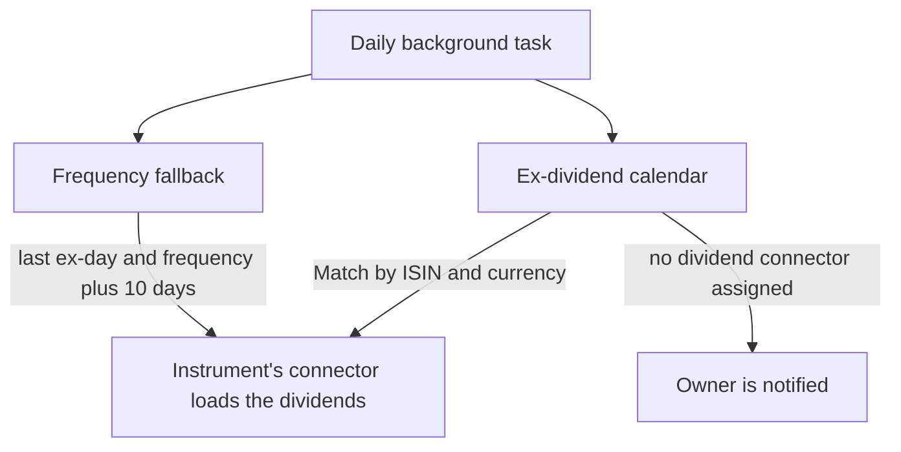

In GT, **historical price data** and **splits** are obtained from external data sources.

## Historical price data (end-of-day prices)
End-of-day prices are very important for GT, which is why the **Historical prices** view is available in the **additional area**. By default, this price data is updated **daily** via one or more **background tasks**.

## Splits
Splits can be entered manually with the security, but GT also monitors the splits in the [Invesing.com](https://www.investing.com/stock-split-calendar/) and [Yahoo](https://finance.yahoo.com/calendar/splits) calendars **on a daily basis**. The monitoring leads to the presumed split being transferred via the security's connector. The problem here is the correct recognition of the security via the name of the company or the symbol. The indirect route via the security's connector ensures that no "incorrect" splits are assigned to the security.

### The choice of data source
There is currently only one free **data source** for the **splits**:
+ [Yahoo USA Finance](https://finance.yahoo.com/): The **URL extension** is determined according to the price data.

## Dividend
Dividends are used for the **annualized return** and in future in the not yet implemented historical simulation of the performance of one or more portfolios. There will be no automatic transfer of dividends to the real portfolios. Currently no dividends can be entered manually.

### The choice of data source
We have two free **data sources** for **dividends**:
+ [DivvyDiary](https://divvydiary.com/): This data source must certainly be checked manually:
  + Sometimes the history is not complete and only the most recent years are available.
  + The currency of the dividend does not always correspond to the currency of the instrument. This different currency must be specified.
  + The amount is not stock split adjusted.
+ [Yahoo USA Finance](https://finance.yahoo.com/): The **URL extension** is determined according to the share price data.
  + The amount is adjusted according to stock splits.

DivvyDiary additionally provides an **ex-dividend calendar** through which GT detects *when* a distribution has taken place. This is distinct from its role as a data source for an individual instrument's dividend history.

### How dividends enter the system
A **background task** that is **executed daily** by default determines, in two ways, the instruments for which new dividends should be queried.

The **first way** is the **ex-dividend calendar**. The task steps through the period since its last run day by day and examines the distributions announced in the calendar. An announced dividend is matched to an instrument held in GT by its **ISIN and currency**. On a match, the dividend history is reloaded – as already described for splits – via the **instrument's connector**; the calendar therefore only provides the hint about the ex-day, while the actual amounts come from the instrument's connector. If an instrument is found in the calendar that has **no dividend connector** assigned, the instrument's owner is notified so that a connector can be added.

The **second way** serves as a fallback for instruments that are not covered by any calendar. The selection is based on the calculated date of the last **ex-day** and the **distribution frequency** plus 10 days. This calculated date must be more recent than the "**Dividend Check**" date to avoid the same instrument being checked daily for new dividends over a certain period of time.

In addition, the entry of a transaction with a dividend can also be a trigger for querying a data source. If there is a more recent dividend for the instrument in the transactions than in the instrument's dividends, the corresponding data source is queried with a delay of 10 days.
