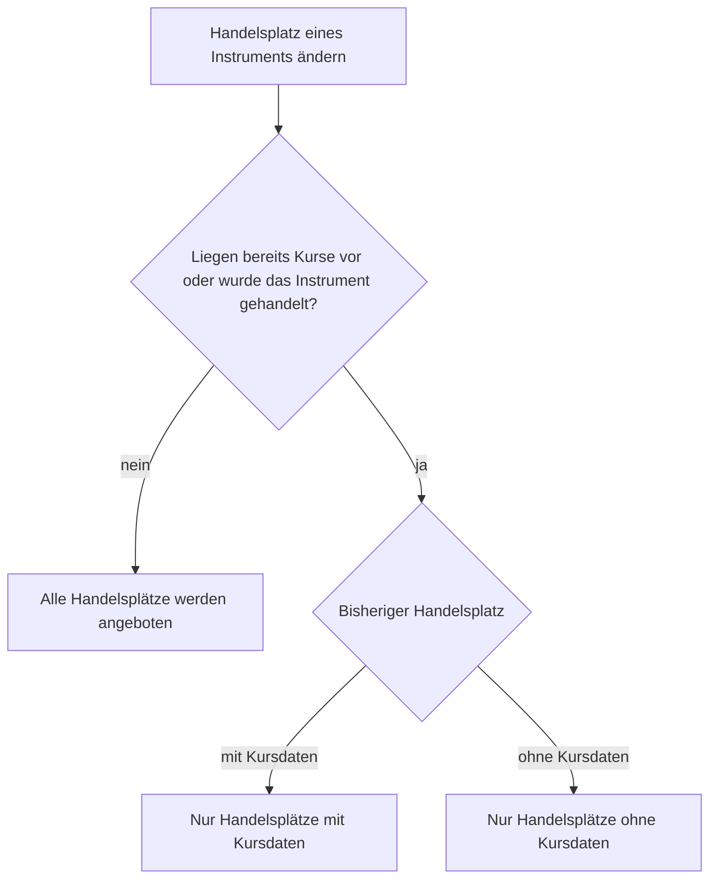

Ein **Wertpapier** und ein **abgeleitetes Wertpapier** haben viele Gemeinsamkeiten, daher werden diese hier zusammen dokumentiert.

## Wertpapier-Split
Wird ein Wertpapiersplit erfasst, dessen Datum vor dem Datum des "Volle Datenladung" liegt, so werden die historischen Daten dieses Wertpapiers neu eingelesen. Der Ablauf entspricht dem unter [Konnektorwechsel und erneutes Einlesen der Kursdaten](#konnektorwechsel-und-erneutes-einlesen-der-kursdaten) beschriebenen.

## Konnektorwechsel und erneutes Einlesen der Kursdaten
GT liest die historischen Kursdaten eines Wertpapiers nicht nur nach einem Split neu ein, sondern immer dann, wenn sich die Grundlage dieser Daten geändert hat. Beim Speichern des Bearbeitungsdialogs löst jede der folgenden Änderungen ein vollständiges erneutes Einlesen aus.

- Der **Konnektor für die historischen Kursdaten** oder dessen **URL-Erweiterung** wurde geändert.
- Das Datum **Handel ab** wurde auf einen früheren Zeitpunkt gesetzt, sodass ein zusätzlicher Zeitraum abgedeckt werden muss.
- Bei einem **abgeleiteten Instrument** wurde die **Formel** oder das zugrunde liegende Instrument geändert.

Voraussetzung ist, dass das Wertpapier noch aktiv ist. Liegt **Aktiv bis Datum** in der Vergangenheit, unterbleibt das erneute Einlesen, damit die bereits vorhandene Geschichte eines nicht mehr gehandelten Instruments nicht verworfen wird.

Vor dem Verwerfen der bisherigen Kurse übernimmt GT diese in das [Archiv der historischen Kursdaten](../../externaldata/historyquote/pricedata/archive/). Deckt die neue Datenquelle einen älteren Teil der Geschichte nicht ab, wird dieser anschliessend aus dem Archiv ergänzt. Das eigentliche Einlesen erfolgt als **Hintergrundaufgabe 35**, die im [Aufgabenmonitor](../../../admindata/taskdatachangemonitor/) verfolgt werden kann; die Beschreibung findet sich unter [Hintergrundaufgaben](../../../admindata/taskdatachangemonitor/taskdescription/). Der Bearbeitungsdialog schliesst sofort, die neuen Kurse erscheinen erst nach dem Durchlauf dieser Aufgabe.

Die Konnektoren für **Dividenden** und **Splits** werden getrennt behandelt. Wird einer von ihnen geändert, reiht GT dafür jeweils eine eigene Aufgabe mit einigen Minuten Verzögerung ein, ohne die historischen Kursdaten anzutasten.

{}
Ein **Währungspaar** nimmt diesen Weg nicht. Dort werden die Kurse nach einem Konnektorwechsel unmittelbar und ohne Eintrag im Aufgabenmonitor neu geladen, und es wird nichts archiviert. Siehe [Währungspaar und Kryptowährungen](../currencypair/#laden-der-kursdaten).
{}

## Erstellen und bearbeiten Wertpapier oder abgeleitetes Instrument
Ein Wertpapier bzw. Instrument wird im Hauptbereich in einer der **Wachlisten-Ansichten** erstellt, bearbeitet und gelöscht. Diese Ansichten können in Navigationsbereich über den Namen der **Watchlist** erreicht werden..
+ Erstellen eines Wertpapiers über das Kontextmenü mit der Wahl "**Hinzufügen neues Wertpapier**".
+ Erstellen eines abgeleitetes Instrument mit der Wahl "**Hinzufügen neues abgeleitetes Instrument**".
+ Bearbeiten eines Wertpapiers bzw. Instrument über das Kontextmenü mit Menüpunkt "**Bearbeiten Instrument**" bei selektierten Instrument bzw. Wertpapier.
+ Löschen eines Wertpapiers bzw. Instrument über das Kontextmenü mit Menüpunkt "**Instrument entfernen und löschen**" auf dem selektierten Instrument.

## Eigenschaften
Die meisten gemeinsamen Eigenschaften von **Wertpapier** und **abgeleitetes Wertpapier** sind selbsterklärend und werden nicht weiter dokumentiert.
- **ISIN** und **Ticker/Symbol**: Die Eigenschaft **ISIN** kann nur beim Erstellen eines Instrumentes gesetzt werden. Wenn die **ISIN** angezeigt wird, muss ein Wert angegeben werden. Zusammen mit der Währung wird ein Wertpapier in GT identifiziert. Der **Ticker/Symbol** sollte wenn möglich erfasst werden, diese werden ggf. in den **benutzerdefinierten Zusatzfeldern** zur **Identifikation** bei einem **Datenlieferanten** verwendet.
- **Privates Wertpapier**: Ein Instrument kann als private definiert werden. Damit ist dieses für andere Benutzer nicht sichtbar. Ein **privates Wertpapier** kann keine **ISIN** und **Ticker/Symbol** aufweisen. 
- **Währung**: Die Währung des Instruments kann nach dem erstmaligen Speichern nicht mehr geändert werden.
- **Handel ab**: Wird für ein bestehendes **aktives** Wertpapier dieses Datum auf einen früheren Zeitpunkt gesetzt, werden die historischen Kursdaten neu eingelesen, siehe [Konnektorwechsel und erneutes Einlesen der Kursdaten](#konnektorwechsel-und-erneutes-einlesen-der-kursdaten).
- **Hyperlink Handelsplatz**: Dieser Hyperlink ist für den Aufruf eines Haupthandelsplatzes des Instruments gedacht. Diese Funktionalität wird in unterschiedlichen Ansichten über das Kontextmenü angeboten.
- **Produkt Hyperlink**: Hiermit kann ein Hyperlink für das Produkt eingetragen werden. Dieser Hyperlink wird in unterschiedlichen Ansichten über das Kontextmenü angeboten. Dabei wird dieser Hyperlink je nach Finanzinstrument unterschiedliche Ausprägungen haben. Bei einem ETF oder Anlagefonds wird meistens der Link auf das Produkt des entsprechenden Anbieters eingetragen. Bei einer Aktie könnte der Link auf die **Investor Relations** der entsprechenden Firma verweisen.

### Handelsplatz
In der Auswahlliste des **Handelsplatzes** steht vor jedem Eintrag die Flagge des Landes, in dem der Handelsplatz beheimatet ist. Die Liste besitzt zudem ein Suchfeld, mit dem sich bei vielen erfassten Handelsplätzen der gesuchte rasch einschränken lässt.

Ein Handelsplatz liefert entweder Kursdaten oder er tut es nicht. Bei einem Handelsplatz ohne Kursdaten werden die Kurse als [Historische Kurse für Periode](./security/securitywithoutpricedata/) von Hand erfasst, bei allen übrigen stammen sie von einem Konnektor. Weil GT diese beiden Arten von Kursen getrennt führt, darf ein Instrument nicht mehr von der einen Art auf die andere wechseln, sobald für es Kurse vorliegen oder es gehandelt wurde; sonst besässe dasselbe Instrument gleichzeitig Kurse beider Arten und GT läse die falschen. Ein gehandeltes Instrument zählt auch ohne erfassten Kurs dazu, denn seine Positionen werden aus derjenigen Kursart bewertet, die seine Art von Handelsplatz vorgibt. Die Auswahlliste bietet ab diesem Zeitpunkt deshalb nur noch Handelsplätze derselben Art an.

Solange weder Kurse vorliegen noch eine Transaktion erfasst wurde, werden alle Handelsplätze angeboten. Ein neu erfasstes Instrument und ein bestehendes, für das noch nichts eingelesen, erfasst und gehandelt wurde, lassen sich also weiterhin ohne Einschränkung umstellen. Als erfasster Kurs zählt dabei jeder historische Kurs sowie jede von Ihnen selbst erfasste Periode. Die Periode, die ein Instrument auf einem Handelsplatz ohne Kursdaten von Anfang an automatisch mitbringt, zählt nicht dazu — ein irrtümlich gewählter Handelsplatz bleibt so korrigierbar, solange das Instrument noch nicht gehandelt wurde.

{}
Die Einschränkung wird auch beim Speichern geprüft. Wird sie umgangen, so weist GT die Speicherung mit einer Meldung beim Feld **Handelsplatz** ab.
{}

## GTNet Wertpapiersuche
{}
Die Implementierung der GTNet Wertpapiersuche ist noch nicht vollständig abgeschlossen. Diese Dokumentation beschreibt die geplante und teilweise bereits umgesetzte Funktionalität.
{}

Beim Erstellen eines neuen Wertpapiers kann die **GTNet Wertpapiersuche** verwendet werden, um Wertpapierdaten von anderen GTNet-Instanzen zu übernehmen. Dies erleichtert die Erfassung neuer Wertpapiere erheblich, da Metadaten und Konnektoreinstellungen automatisch vorausgefüllt werden.

### Funktionsweise
Im Dialog zur Erstellung eines neuen Wertpapiers steht die Schaltfläche **GTNet-Suche** zur Verfügung. Nach Eingabe eines Suchbegriffs (z.B. Name, ISIN oder Tickersymbol) wird eine Anfrage an alle verbundenen GTNet-Instanzen gesendet.

### Suchergebnisse
Die Suchergebnisse werden in einer Tabelle mit folgenden Informationen angezeigt:
- **Name**: Name des Wertpapiers
- **ISIN**: Internationale Wertpapierkennnummer
- **Währung**: Handelswährung
- **Ticker/Symbol**: Börsenkürzel
- **Handelsplatz**: Name und MIC-Code der Börse
- **Anlageklasse**: Kategorie des Wertpapiers (z.B. Aktie, ETF)
- **Finanzinstrument**: Art des Instruments
- **Quelldomäne**: GTNet-Instanz, von der die Daten stammen

### Konnektor-Abgleich
Jede Tabellenzeile kann aufgeklappt werden, um die übereinstimmenden Konnektoreinstellungen anzuzeigen. Dabei werden vier Kategorien unterschieden:
- **Historische Kurse**: Konnektor und URL-Erweiterung für historische Preisdaten
- **Intraday-Kurse**: Konnektor und URL-Erweiterung für Tageskurse
- **Dividenden**: Konnektor und URL-Erweiterung für Dividendendaten
- **Splits**: Konnektor und URL-Erweiterung für Splitdaten

Die Konnektoren werden nur angezeigt, wenn ein passender Konnektor in der lokalen GT-Instanz verfügbar ist. Dies ermöglicht eine automatische Übernahme der Einstellungen. Die Abgleichregeln unterscheiden sich zwischen eingebauten und generischen Konnektoren.

#### Eingebaute Konnektoren
Eingebaute Konnektoren (z.B. Yahoo, Finnhub) sind über alle GT-Installationen hinweg identisch. Ein Treffer wird gefunden, wenn die lokale Instanz den **gleichen Konnektor installiert** hat. Ein weiterer Konfigurationsvergleich ist nicht erforderlich.

#### Generische Konnektoren
Generische (benutzerdefinierte) Konnektoren werden pro GT-Instanz individuell konfiguriert. Zwei Instanzen können einen generischen Konnektor mit derselben Kurz-ID, aber völlig unterschiedlicher API-Konfiguration haben. Deshalb ist der Abgleich strenger. Ein generischer Konnektor einer entfernten Instanz wird nur dann zugeordnet, wenn **alle** folgenden Bedingungen erfüllt sind:
1. Ein lokaler generischer Konnektor mit der **gleichen Kurz-ID** existiert.
2. Die **Domain-URL** des lokalen Konnektors ist identisch mit der von der entfernten Instanz gemeldeten.
3. Das **Regex-URL-Muster** ist identisch (oder beide sind leer).
4. Der lokale Konnektor verfügt über **Endpunkte** für die benötigten Feed-Typen (z.B. historisch und/oder intraday).

Wenn eine dieser Bedingungen nicht erfüllt ist, wird der generische Konnektor in den aufgeklappten Zeilendetails **nicht** angezeigt und seine Einstellungen werden nicht übernommen.

{}
Wenn Sie möchten, dass generische Konnektoreinstellungen zwischen zwei GT-Instanzen übertragen werden, stellen Sie sicher, dass beide Instanzen den generischen Konnektor mit identischer **Kurz-ID**, **Domain-URL** und **Regex-URL-Muster** definieren. Am einfachsten erreichen Sie dies, indem Sie dasselbe SQL-Skript verwenden, um die generische Konnektordefinition auf beiden Instanzen zu erstellen.
{}

### Übernahme der Daten
Nach Auswahl eines Suchergebnisses und Klick auf **Ausgewähltes anwenden** werden die Wertpapierdaten in das Erstellungsformular übernommen. Der Benutzer kann die Daten vor dem Speichern noch anpassen.

Folgende Daten werden bei der Übernahme berücksichtigt:
- **Stammdaten**: ISIN, Name, Währung, Ticker/Symbol
- **Klassifikation**: Anlageklasse und Finanzinstrument
- **Börseninformationen**: Name, MIC-Code und Hyperlink des Handelsplatzes
- **Zeitraum**: Handel ab und Handel bis (falls vorhanden)
- **Spezifische Eigenschaften**: Denominierung, Verteilungsfrequenz und Hebelfaktor (je nach Instrumenttyp)
- **Hyperlinks**: Produkt Hyperlink (falls vorhanden)
- **Konnektoren**: Datenquellen für historische Kurse, Intraday-Kurse, Dividenden und Splits
