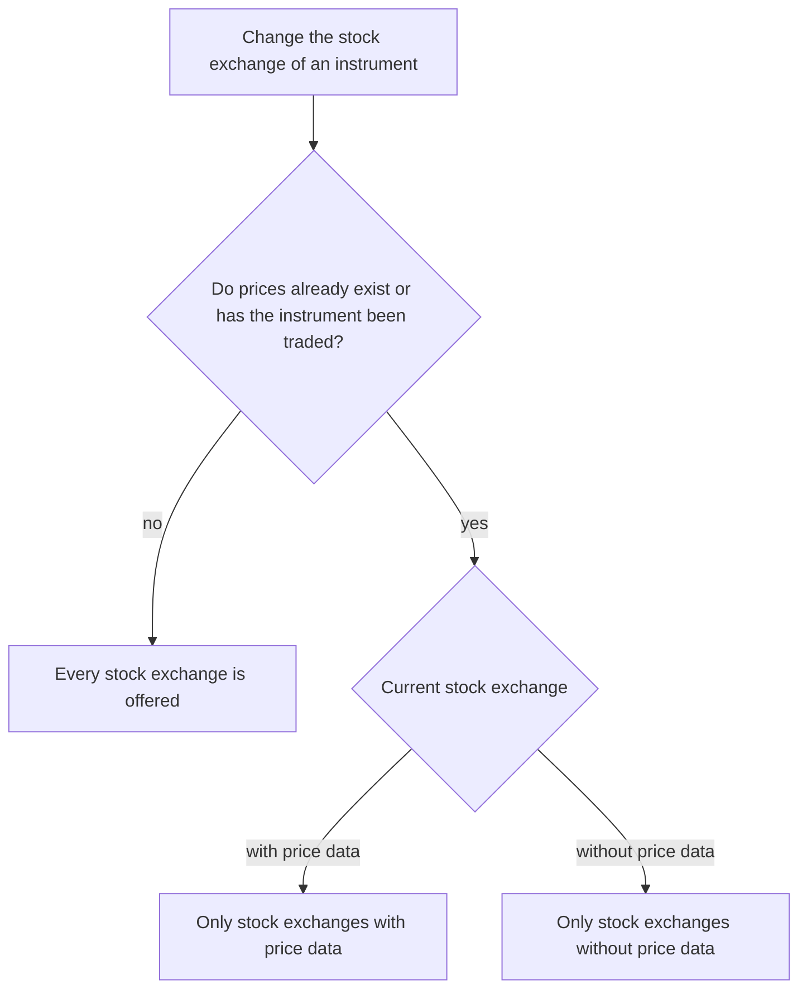

A **security** and a **derived security** have many things in common, which is why they are documented together here.

## Security split
If a security split is entered whose date is before the "Full data load" date, the historical data for this security is read in again. The sequence corresponds to the one described under [Changing the connector and reloading the price data](#changing-the-connector-and-reloading-the-price-data).

## Changing the connector and reloading the price data
GT reads the historical price data of a security in again not only after a split, but whenever the basis of this data has changed. When the editing dialog is saved, each of the following changes triggers a complete reload.

- The **connector for the historical price data** or its **URL extension** was changed.
- The **Trading from** date was set to an earlier point in time, so that an additional period has to be covered.
- For a **derived instrument**, the **formula** or the underlying instrument was changed.

The prerequisite is that the security is still active. If **Active until date** lies in the past, the reload is omitted so that the existing history of an instrument that is no longer traded is not discarded.

Before the previous prices are discarded, GT transfers them into the [archive of historical price data](../../externaldata/historyquote/pricedata/archive/). If the new data source does not cover an older part of the history, that part is subsequently supplemented from the archive. The actual reading in happens as **background task 35**, which can be followed in the [batch processing monitor](../../../admindata/taskdatachangemonitor/); the description can be found under [background tasks](../../../admindata/taskdatachangemonitor/taskdescription/). The editing dialog closes immediately, the new prices only appear after this task has run.

The connectors for **dividends** and **splits** are handled separately. If one of them is changed, GT queues its own task for it with a delay of a few minutes, without touching the historical price data.

{}
A **currency pair** does not take this route. There the prices are reloaded immediately after a connector change, without an entry in the batch processing monitor, and nothing is archived. See [Currency pair](../currencypair/#loading-the-price-data).
{}

## Create and edit security or derived instrument
A security or instrument is created, edited and deleted in the main area in one of the **watchlist views**. These views can be accessed in the navigation area via the name of the **watchlist**.
- Create a security via the context menu by selecting "**Add new security**".
- Create a derived instrument by selecting "**Add new derived instrument**".
- Edit a security or instrument via the context menu with the menu item "**Edit instrument**" for the selected instrument or security.
- Delete a security or instrument via the context menu with the menu item "**Remove and delete instrument**" on the selected instrument.

## Properties
Most of the common properties of **securities** and **derived securities** are self-explanatory and are not documented further.
- **ISIN** and **ticker/symbol**: The **ISIN** property can only be set when creating an instrument. If the **ISIN** is displayed, a value must be entered. Together with the currency, a security is identified in GT. The **ticker/symbol** should be entered if possible; these may be used in the **user-defined additional fields** for **identification** with a **data provider**.
- **Private security**: An instrument can be defined as private. This means that it is not visible to other users. A **private security** cannot have **an ISIN** and **ticker/symbol**.
- **Currency**: The currency of the instrument can no longer be changed after it has been saved for the first time.
- **Trading from**: If this date is set to an earlier time for an existing **active** security, the historical price data is reloaded, see [Changing the connector and reloading the price data](#changing-the-connector-and-reloading-the-price-data).
- **Stock exchange hyperlink**: This hyperlink is intended for calling up a main trading center for the instrument. This functionality is offered in different views via the context menu.
- **Product hyperlink**: This can be used to enter a hyperlink for the product. This hyperlink is offered in different views via the context menu. This hyperlink will have different characteristics depending on the financial instrument. In the case of an ETF or investment fund, the link to the product of the corresponding provider is usually entered. In the case of a share, the link could refer to the **investor relations** of the corresponding company.

### Stock exchange
In the **stock exchange** selection list every entry is preceded by the flag of the country the stock exchange is based in. The list also has a search field, which quickly narrows down the wanted one when many stock exchanges are recorded.

A stock exchange either supplies price data or it does not. For a stock exchange without price data the prices are entered by hand as [Historical prices for period](./security/securitywithoutpricedata/), for all others they come from a connector. Because GT keeps these two kinds of prices apart, an instrument may no longer switch from one kind to the other as soon as prices exist for it or it has been traded; otherwise the same instrument would hold prices of both kinds at once and GT would read the wrong ones. A traded instrument counts even without a recorded price, because its positions are valued from the kind of price its kind of stock exchange implies. From that moment on the selection list therefore only offers stock exchanges of the same kind.

As long as neither prices exist nor a transaction has been entered, every stock exchange is offered. A newly created instrument, and an existing one for which nothing has been loaded, entered or traded yet, can therefore still be switched without restriction. Every historical price counts as a recorded price, as does every period you entered yourself. The period an instrument on a stock exchange without price data automatically carries from the outset does not count — a stock exchange chosen by mistake thus remains correctable as long as the instrument has not been traded.

{}
The restriction is also checked when saving. If it is circumvented, GT rejects the save with a message on the **Stock exchange** field.
{}

## GTNet Security Search
{}
The implementation of GTNet security search is not yet complete. This documentation describes the planned and partially implemented functionality.
{}

When creating a new security, the **GTNet security search** can be used to import security data from other GTNet instances. This significantly simplifies the creation of new securities, as metadata and connector settings are automatically pre-filled.

### How it Works
In the dialog for creating a new security, the **GTNet Search** button is available. After entering a search term (e.g., name, ISIN, or ticker symbol), a request is sent to all connected GTNet instances.

### Search Results
The search results are displayed in a table with the following information:
- **Name**: Name of the security
- **ISIN**: International Securities Identification Number
- **Currency**: Trading currency
- **Ticker/Symbol**: Stock exchange symbol
- **Stock Exchange**: Name and MIC code of the exchange
- **Asset Class**: Category of the security (e.g., Stock, ETF)
- **Financial Instrument**: Type of instrument
- **Source Domain**: GTNet instance from which the data originates

### Connector Matching
Each table row can be expanded to display the matching connector settings. Four categories are distinguished:
- **Historical Prices**: Connector and URL extension for historical price data
- **Intraday Prices**: Connector and URL extension for daily prices
- **Dividends**: Connector and URL extension for dividend data
- **Splits**: Connector and URL extension for split data

The connectors are only displayed if a matching connector is available in the local GT instance. This enables automatic adoption of the settings. The matching rules differ between built-in and generic connectors.

#### Built-in Connectors
Built-in connectors (e.g., Yahoo, Finnhub) are identical across all GT installations. A match is found when the local instance has the **same connector installed**. No further configuration comparison is needed.

#### Generic Connectors
Generic (user-defined) connectors are configured individually per GT instance. Two instances may have a generic connector with the same short ID but completely different API configurations. For this reason, the matching is stricter. A generic connector from a remote instance is only matched if **all** of the following conditions are met:
1. A local generic connector with the **same short ID** exists.
2. The **domain URL** of the local connector is identical to the one reported by the remote instance.
3. The **regex URL pattern** is identical (or both are empty).
4. The local connector has **endpoints** for the required feed types (e.g., historical and/or intraday).

If any of these conditions is not met, the generic connector will **not** be shown in the expanded row details and its settings will not be transferred.

{}
If you want generic connector settings to transfer between two GT instances, make sure that both instances define the generic connector with identical **short ID**, **domain URL**, and **regex URL pattern**. The easiest way to achieve this is to use the same SQL script to create the generic connector definition on both instances.
{}

### Data Import
After selecting a search result and clicking **Apply Selected**, the security data is transferred to the creation form. The user can still adjust the data before saving.

The following data is considered during import:
- **Master data**: ISIN, name, currency, ticker/symbol
- **Classification**: Asset class and financial instrument
- **Exchange information**: Name, MIC code and hyperlink of the stock exchange
- **Time period**: Trade from and trade to (if available)
- **Specific properties**: Denomination, distribution frequency and leverage factor (depending on instrument type)
- **Hyperlinks**: Product hyperlink (if available)
- **Connectors**: Data sources for historical prices, intraday prices, dividends and splits
