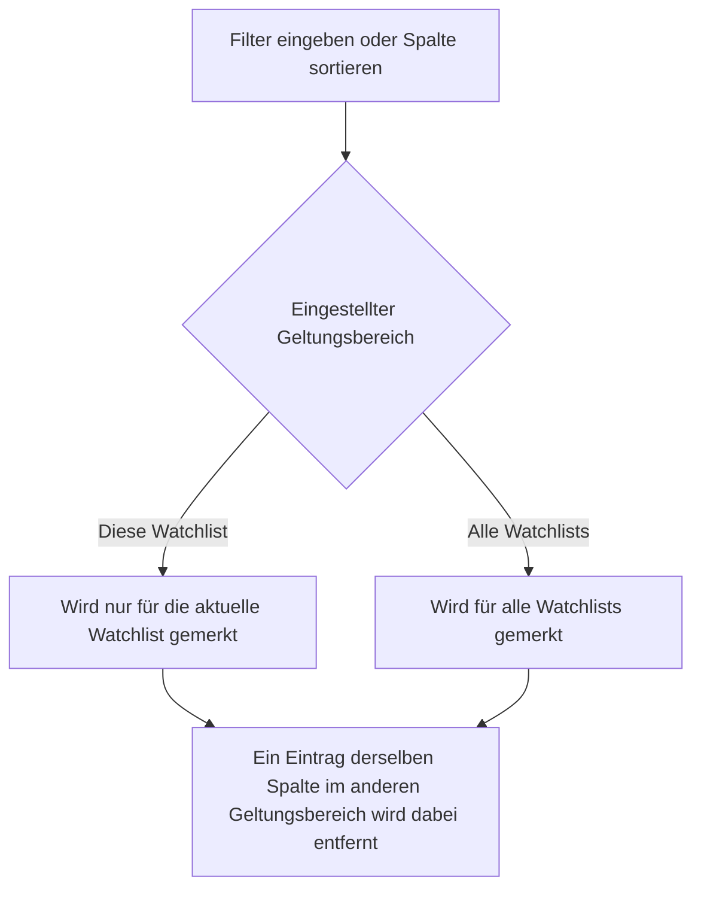
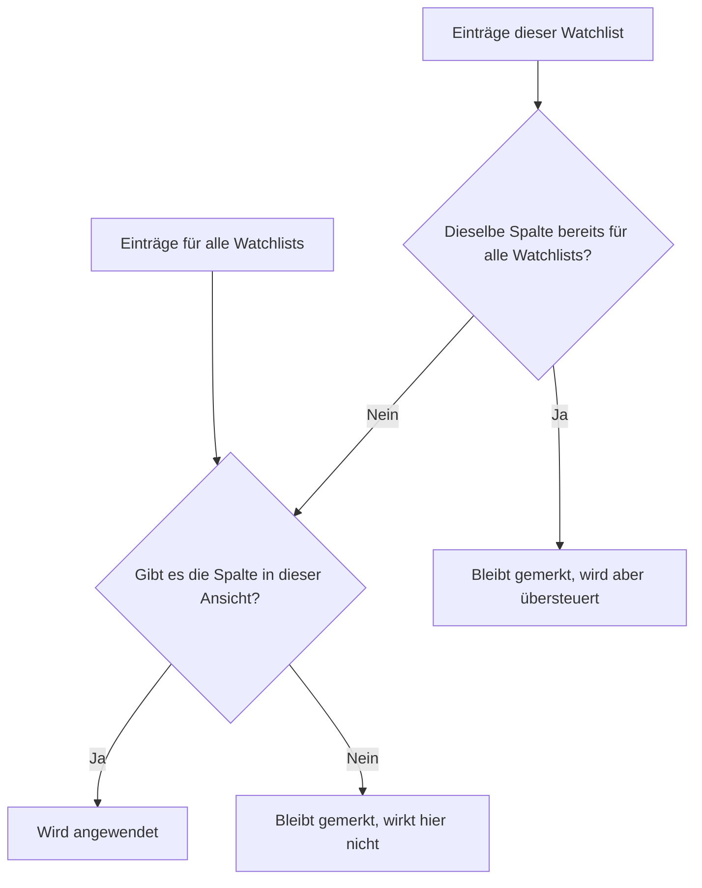

Alle vier **Watchlist-Ansichten** zeigen dieselben Instrumente, jedoch mit unterschiedlichen Spalten. Das Filtern und das Sortieren funktionieren in allen Ansichten gleich und werden gemerkt. Wechseln Sie die Registerkarte oder die Watchlist, so bleiben Ihre Einstellungen erhalten. Zusätzlich bestimmen Sie selbst, ob ein Filter oder eine Sortierung nur für die aktuelle Watchlist oder für alle Watchlisten gelten soll.

## Filterzeile ein- und ausblenden
Die Filterzeile befindet sich unterhalb der Spaltenüberschriften und ist standardmässig ausgeblendet, denn eine Watchlist kann viele Instrumente enthalten und die Zeile beansprucht Platz. Über das Menü **Ansicht** der Menüleiste blenden Sie diese mit **Filterzeile ein-/ausblenden** ein oder aus.

Das Ausblenden setzt Ihre Filter nicht zurück, sondern hebt deren Wirkung nur auf. Alle Instrumente werden wieder angezeigt und beim erneuten Einblenden sind dieselben Filter sofort wieder aktiv. Gelöscht werden Filter ausschliesslich über den weiter unten beschriebenen Dialog.

## Welche Spalten gefiltert werden können
Nicht jede Spalte ist filterbar, denn bei manchen Spalten ist eine Einschränkung wenig sinnvoll. Eine Spalte mit Filter erkennen Sie am Bedienelement in der Filterzeile.

In **allen Ansichten** filtern Sie über die Spalten **Name**, **ISIN** und **Ticker/Symbol** mit einer Texteingabe sowie über die Spalte **Währung** mit einer Auswahlliste.

In der **Performanz Ansicht** stehen Zahlenfilter für **Differenz Vortag**, **Seit Jahresbeginn**, **Zeitrahmen**, **Jährliche Rendite**, **Bestand**, **Kursgewinn** und **Total Position** zur Verfügung. Damit beantworten Sie Fragen wie "welche Instrumente haben heute mehr als zwei Prozent verloren".

In der **Kurs Datenfeed Ansicht** filtern Sie die beiden Datenquellen **Innertag Datenquelle** und **Historische Datenquelle** über eine Auswahlliste, die **Wiederholungszähler Innertag** und **Wiederholungszähler historisch** über einen Zahlenfilter sowie **Jüngstes EOD** und **Volle Datenladung** über einen Datumsfilter. So sehen Sie beispielsweise alle Instrumente einer bestimmten Datenquelle oder jene, deren Wiederholungszähler grösser als null ist.

In der **Dividende/Split Feed Ansicht** filtern Sie **Ausschüttungshäufigkeit**, **Dividenden Konnektor** und **Split Konnektor** über eine Auswahlliste, die beiden Wiederholungszähler über einen Zahlenfilter und **Dividenden Check** über einen Datumsfilter.

In der **Zusatzfeld Ansicht** hängt es von Ihren eigenen Feldern ab. Textfelder erhalten eine Texteingabe und Zahlenfelder einen Zahlenfilter, während Ja/Nein-Felder, Verweise und Zeitangaben keinen Filter anbieten.

## Die Filtereingabe
Das Bedienelement in der Filterzeile richtet sich nach der Art der Spalte.

Bei einer **Texteingabe** öffnen Sie über das Symbol ein kleines Menü und wählen dort die Bedingung **Startet mit**, **Enthält**, **Enthält nicht**, **Endet mit**, **Gleich** oder **Ungleich**. Mit **Regel hinzufügen** ergänzen Sie eine zweite Bedingung und verknüpfen beide über **UND Bedingung** oder **ODER Bedingung**. **Anwenden** übernimmt die Eingabe, **Löschen** entfernt sie wieder.

Bei einem **Zahlenfilter** stehen die Bedingungen **Gleich**, **Ungleich**, **Kleiner als**, **Kleiner oder gleich**, **Grösser als** und **Grösser oder gleich** zur Verfügung. Gerade bei den Prozentspalten der Performanz Ansicht ist der Vergleich mit **Kleiner als** oder **Grösser als** hilfreicher als die Suche nach einem exakten Wert.

Bei einem **Datumsfilter** wählen Sie zuerst die Bedingung **Kein Filter**, **Gleich**, **Früher gleich als** oder **Später gleich als** und danach im Kalender das Datum. Solange **Kein Filter** eingestellt ist, bleibt die Spalte ungefiltert.

Bei einer **Auswahlliste** enthält die Liste genau jene Werte, die in der aktuellen Watchlist tatsächlich vorkommen. Der leere Eintrag am Anfang der Liste hebt den Filter für diese Spalte wieder auf.

Setzen Sie in mehreren Spalten gleichzeitig einen Filter, so müssen alle Bedingungen erfüllt sein, damit ein Instrument angezeigt wird.

## Sortieren
Ein Klick auf eine Spaltenüberschrift sortiert die Tabelle nach dieser Spalte, ein weiterer Klick kehrt die Richtung um. Halten Sie beim Klicken die Taste **Ctrl** gedrückt, unter macOS die Befehlstaste, so wird die Spalte der bestehenden Sortierung hinzugefügt. Auf diese Weise sortieren Sie über mehrere Stufen, beispielsweise zuerst nach **Währung** und innerhalb einer Währung nach **Kursgewinn**. Ohne eigene Sortierung werden die Instrumente nach **Name** aufsteigend sortiert; diese Grundsortierung wird nicht als Ihre Einstellung gemerkt.

Auch die Sortierung wird gemerkt und kennt denselben Geltungsbereich wie die Filter.

## Geltungsbereich: diese Watchlist oder alle Watchlisten
Jeder Filter und jede Sortierung wird in einem von zwei Geltungsbereichen abgelegt. **Diese Watchlist** bedeutet, dass die Einstellung nur in der aktuellen Watchlist wirkt. **Alle Watchlists** bedeutet, dass sie in jeder Watchlist wirkt.

Welchen Geltungsbereich eine neue Eingabe erhält, bestimmen Sie im Dialog **Einstellungen für Filter und Sortierung...**, getrennt für Filter und für Sortierung. Die Einstellung wirkt nur auf neue oder geänderte Eingaben; bereits gemerkte Einträge behalten ihren Geltungsbereich.

Angewendet wird immer die **Summe beider Geltungsbereiche**. Ist dieselbe Spalte in beiden vorhanden, so gewinnt der Eintrag für alle Watchlisten. Da sich die Ansichten in ihren Spalten unterscheiden, kommt zusätzlich zum Tragen, ob es die Spalte in der aktuellen Ansicht überhaupt gibt. Ein Eintrag zu einer fehlenden Spalte geht nicht verloren, er wirkt in dieser Ansicht lediglich nicht und wird angewendet, sobald Sie in eine Ansicht mit dieser Spalte wechseln.

Ändern Sie einen Filter, der für alle Watchlisten gilt, während der Geltungsbereich auf **Diese Watchlist** eingestellt ist, so wechselt dieser Filter in den kleineren Geltungsbereich. Andernfalls würde Ihre Änderung wirkungslos bleiben, weil der Eintrag für alle Watchlisten sie sofort wieder übersteuern würde.
{}
Ein Filter mit dem Geltungsbereich **Alle Watchlists** wirkt auch in einer Ansicht, welche die betroffene Spalte gar nicht anzeigt. Es können dort also Instrumente fehlen, ohne dass Sie den Grund sehen. Der nachfolgend beschriebene Dialog listet aus diesem Grund sämtliche gesetzten Filter mit ihrem Geltungsbereich auf, auch jene zu Spalten der übrigen Ansichten.
{}

## Der Dialog "Einstellungen für Filter und Sortierung"
Sie öffnen den Dialog über das Menü **Ansicht** der Menüleiste. Er ist der zentrale Ort für alles, was mit Filtern und Sortieren zu tun hat.

Zuoberst stellen Sie mit **Geltungsbereich neuer Filter** und **Geltungsbereich neuer Sortierung** ein, wohin neue Eingaben abgelegt werden. Zur Auswahl stehen **Diese Watchlist** und **Alle Watchlists**.

Darunter zeigen die Listen **Aktive Filter** und **Aktive Sortierung**, was gegenwärtig gesetzt ist. Jede Zeile nennt den Geltungsbereich, die Spalte und den gefilterten Wert beziehungsweise die Richtung **Aufsteigend** oder **Absteigend**. Über das Kreuz am Ende einer Zeile entfernen Sie genau diesen einen Eintrag. Ist nichts gesetzt, erscheint **Kein Eintrag**.

Zum Aufräumen dienen vier Schaltflächen. **Filter dieser Watchlist löschen** und **Sortierung dieser Watchlist löschen** entfernen die Einträge der aktuellen Watchlist; Einträge für alle Watchlisten bleiben bestehen und sind weiterhin in der Liste sichtbar. **Filter aller Watchlists löschen** und **Sortierung aller Watchlists löschen** räumen dagegen vollständig auf, also sowohl die Einträge für alle Watchlisten als auch jene sämtlicher einzelner Watchlisten.

Jede Änderung im Dialog wirkt sofort auf die Tabelle im Hintergrund, ein Bestätigen ist nicht nötig.

## Was gespeichert wird
Filter, Sortierung und die beiden Geltungsbereiche werden lokal in Ihrem Webbrowser gespeichert. Sie bleiben deshalb auch nach dem Schliessen von GT erhalten. Die Einstellungen gelten pro Webbrowser und werden nicht auf ein anderes Gerät übertragen. Dasselbe gilt für das Ein- und Ausblenden der Filterzeile sowie für die ein- und ausgeblendeten Spalten.
