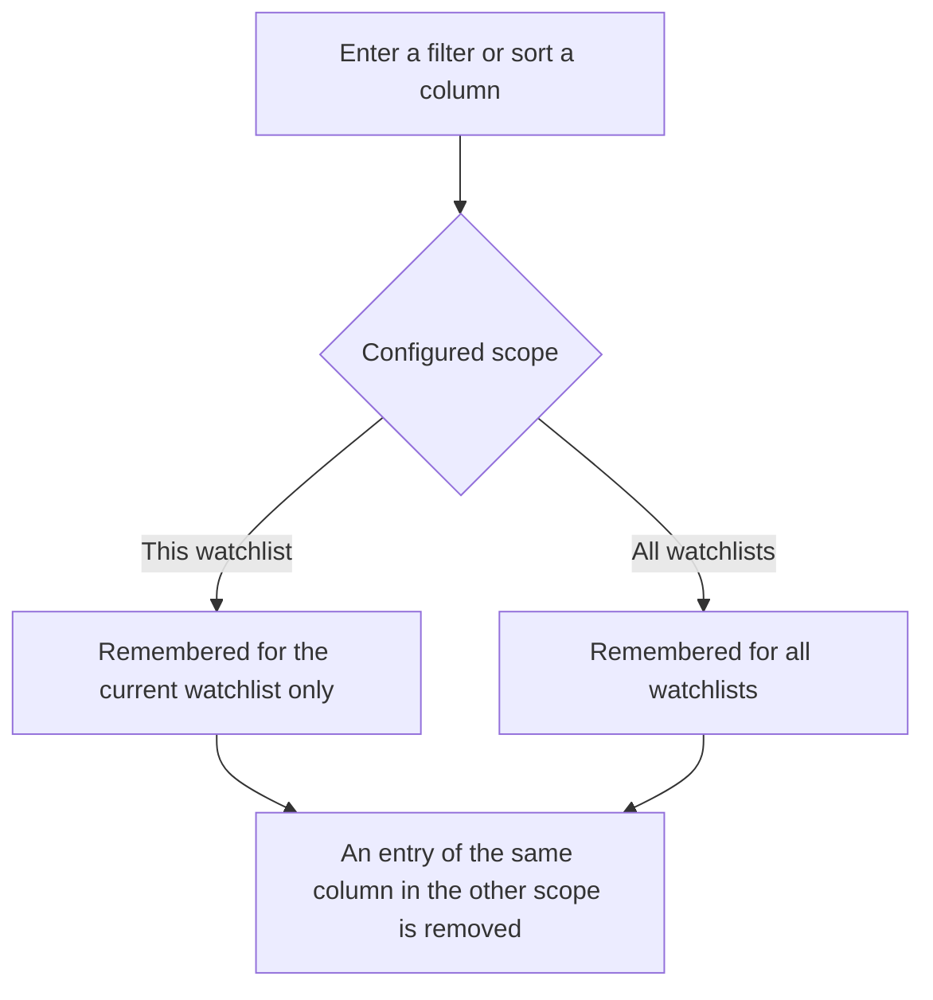
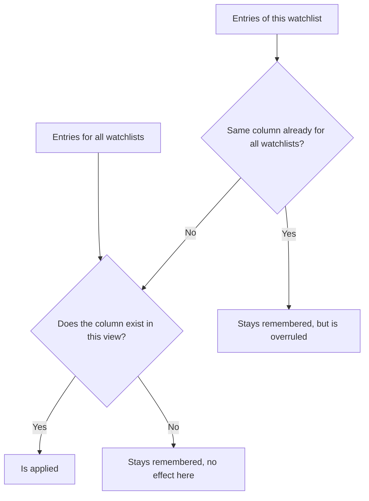

All four **watchlist views** show the same instruments, but with different columns. Filtering and sorting work the same way in every view and are remembered. If you change the tab or the watchlist, your settings are retained. In addition, you decide yourself whether a filter or a sort order applies only to the current watchlist or to all watchlists.

## Showing and hiding the filter row
The filter row is located below the column headers and is hidden by default, because a watchlist can contain many instruments and the row takes up space. You show or hide it with **Turn on/off filter row** in the **View** menu of the menu bar.

Hiding does not reset your filters, it only suspends their effect. All instruments are shown again and when you show the row once more the same filters are immediately active again. Filters are deleted exclusively through the dialog described further below.

## Which columns can be filtered
Not every column can be filtered, because for some columns a restriction makes little sense. You recognise a column with a filter by the control in the filter row.

In **all views** you filter the columns **Name**, **ISIN** and **Ticker/symbol** with a text entry, and the column **Currency** with a selection list.

In the **Performance view** number filters are available for **Daily change**, **YTD**, **Time frame**, **Annual time frame**, **Holding**, **Price gain** and **Total Position**. This answers questions such as "which instruments lost more than two per cent today".

In the **Quote data feed view** you filter the two data sources **Intraday data source** and **Historical data source** with a selection list, the **Intraday retries counter** and the **Historical retries counter** with a number filter, and **Youngest EOD** as well as **Full data load** with a date filter. In this way you see, for example, all instruments of a certain data source or those whose retries counter is greater than zero.

In the **Dividend/Split Feed view** you filter **Distribution Frequency**, **Dividend connector** and **Split connector** with a selection list, both retries counters with a number filter and **Dividend Check** with a date filter.

In the **Custom Field view** it depends on your own fields. Text fields get a text entry and number fields get a number filter, whereas yes/no fields, links and time stamps offer no filter.

## Entering a filter
The control in the filter row depends on the kind of column.

With a **text entry** you open a small menu through the symbol and choose the condition **Starts with**, **Contains**, **Not contains**, **Ends with**, **Equals** or **Not equals**. With **Add Rule** you add a second condition and combine both with **Match All** or **Match Any**. **Apply** accepts the entry, **Clear** removes it again.

With a **number filter** the conditions **Equals**, **Not equals**, **Less than**, **Less than or equal to**, **Greater than** and **Great then or equals** are available. Especially for the percentage columns of the Performance view, the comparison with **Less than** or **Greater than** is more helpful than the search for an exact value.

With a **date filter** you first choose the condition **No Filter**, **Equals**, **Same or Before** or **Same or After** and then the date in the calendar. As long as **No Filter** is set, the column remains unfiltered.

With a **selection list** the list contains exactly those values which actually occur in the current watchlist. The empty entry at the beginning of the list cancels the filter for this column again.

If you set a filter in several columns at the same time, all conditions must be fulfilled for an instrument to be shown.

## Sorting
A click on a column header sorts the table by this column, a further click reverses the direction. If you hold down the **Ctrl** key while clicking, on macOS the command key, the column is added to the existing sort order. In this way you sort over several levels, for example first by **Currency** and within a currency by **Price gain**. Without your own sort order the instruments are sorted by **Name** in ascending order; this basic sort order is not remembered as your setting.

The sort order is remembered as well and knows the same scope as the filters.

## Scope: this watchlist or all watchlists
Every filter and every sort order is stored in one of two scopes. **This watchlist** means that the setting only takes effect in the current watchlist. **All watchlists** means that it takes effect in every watchlist.

Which scope a new entry gets is decided by you in the dialog **Filter and sorting settings...**, separately for filters and for sorting. The setting only affects new or changed entries; entries which are already remembered keep their scope.

What is applied is always the **sum of both scopes**. If the same column is present in both, the entry for all watchlists wins. Because the views differ in their columns, it additionally matters whether the column exists in the current view at all. An entry for a missing column is not lost, it merely has no effect in this view and is applied as soon as you change to a view with that column.

If you change a filter which applies to all watchlists while the scope is set to **This watchlist**, this filter moves to the smaller scope. Otherwise your change would remain without effect, because the entry for all watchlists would immediately overrule it again.
{}
A filter with the scope **All watchlists** also takes effect in a view which does not show the affected column at all. Instruments may therefore be missing there without you seeing the reason. For this reason the dialog described below lists all filters that are set together with their scope, including those for columns of the other views.
{}

## The "Filter and sorting settings" dialog
You open the dialog through the **View** menu of the menu bar. It is the central place for everything that has to do with filtering and sorting.

At the top you set with **Scope of new filters** and **Scope of new sorting** where new entries are stored. **This watchlist** and **All watchlists** are available.

Below that the lists **Active filters** and **Active sorting** show what is currently set. Each row names the scope, the column and the filtered value, or the direction **Ascending** or **Descending**. With the cross at the end of a row you remove exactly this one entry. If nothing is set, **No entry** appears.

Four buttons are available for tidying up. **Clear filters of this watchlist** and **Clear sorting of this watchlist** remove the entries of the current watchlist; entries for all watchlists remain and are still visible in the list. **Clear filters of all watchlists** and **Clear sorting of all watchlists** on the other hand tidy up completely, that is both the entries for all watchlists and those of every single watchlist.

Every change in the dialog takes effect on the table in the background immediately, a confirmation is not necessary.

## What is stored
Filters, sort order and the two scopes are stored locally in your web browser. They are therefore retained even after closing GT. The settings apply per web browser and are not transferred to another device. The same applies to showing and hiding the filter row as well as to the columns that are shown or hidden.
